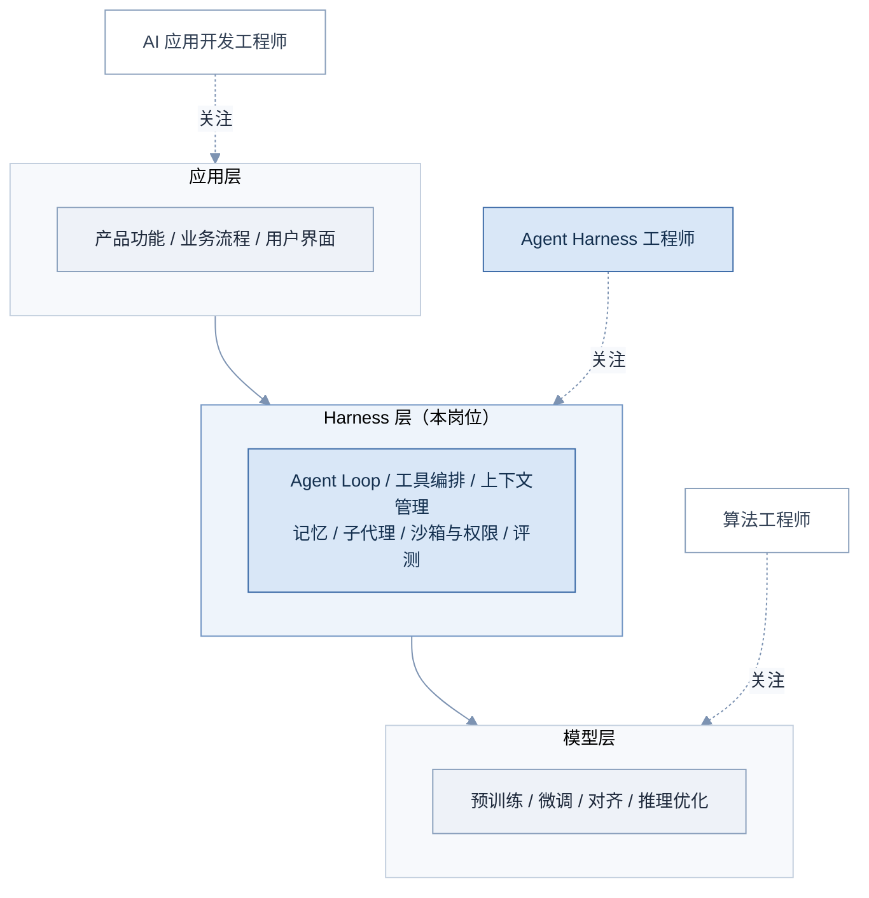
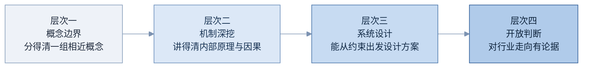

# 00 导读与岗位画像

> 一句话：这一篇回答三个问题——这份文档怎么读、Agent Harness 岗位到底在招什么人、面试官会从哪几个角度考你。

## 0.1 怎么用这份文档

**从动机读起，不要跳过「为什么需要它」。** 这份文档假设你完全不懂 agent。零基础学习最大的陷阱不是概念太难，而是背了定义却不知道它在解决什么问题——面试官一追问「为什么要这么设计」就露馅。所以每个概念都从「没有它会出什么问题」讲起，这一段恰恰是最不能跳的。

**先看图，再读字。** 每个技术章节的「核心原理」都以图开头，文字只是图的讲解。正确的用法是：先盯着图自己看懂一遍，看不懂再读文字，读完文字回头再看一遍图。最后合上文档，**自己在白板或纸上重画**。能重画，才算真的懂了；而且面试的白板环节考的就是这个动作本身。

**练习题真的动笔。** 每章末尾有 2–3 道题，答案是折叠的。先写下自己的答案再展开对照。「看了一眼觉得会」和「能写出来」之间的差距，就是面试里卡壳的那几十秒。

**「面试怎么答」留到复习阶段。** 第一遍学习时可以略读这一段；面试前冲刺时，它和 07 题库、附录速记卡一起构成你的复习主线（→ 见 README 阅读路径）。

**术语的英文名都要认识。** 正文里每个术语首次出现都带英文原名。面试官大概率中英混说——听到「compaction」「harness」「tool use」时你不能愣住。

## 0.2 Agent Harness 岗位在招什么人

先看一段典型的 Agent Harness 岗位 JD（综合多份公开招聘信息归纳）：

> 熟悉 LLM 以及 Agent 基本机制及其技术原理，包括 LLM API、KV Cache、Agent Loop、Tool Use、Reasoning、Planning、Skills、MCP、Memory、Subagent、Multi-Agent 等相关知识。对 Prompt Engineering、Context Engineering、Loop Engineering、Harness Engineering 等课题有深入的理解。

这段话信息密度很高，逐段拆开，每个关键词都对应本文档的一个部分：

| JD 关键词 | 它实际在问什么 | 对应部分 |
|---|---|---|
| LLM API、KV Cache | 你懂不懂「调用一个模型」背后的物理现实：无状态、token 计费、缓存与成本结构 | Part 01 |
| Agent Loop、Tool Use、Reasoning、Planning | 你能不能把一个只会生成文本的模型，变成一个会自己干活的循环系统 | Part 01–02 |
| Memory、Subagent、Multi-Agent | 单个循环不够用时，你知不知道怎么扩展：跨会话记忆、任务委派、多体协作 | Part 02 |
| Skills、MCP | 你了解不了解给 agent 接入外部能力的标准化机制 | Part 03 |
| Prompt / Context / Loop / Harness Engineering | 你有没有把上面这些零件装配成可靠系统的**工程方法论** | Part 04 |

注意 JD 的结构：前半段是「零件清单」，后半段是「装配能力」。这正是这个岗位的本质——

**关键：这个行业有一个正在成为共识的公式：Agent = Model + Harness。** 模型（Model）是引擎，负责智能；Harness 是引擎之外的一切——把用户请求组织成上下文、驱动循环、执行工具、管理记忆、控制成本与安全的那一层「装具」（harness 原意是马具/安全带，即「套在模型身上让它能拉车的那套装备」）。模型能力再强，没有 harness 也只是一个聊天框；同一个模型，换一个更好的 harness，端到端表现可以差出一个档次（→ 见 4.5 Harness Engineering、5.1 三层栈）。

所以这个岗位在招的人，一句话画像：**能把「不可靠的概率引擎」装配成「可靠的生产系统」的工程师。** 日常工作大致是：设计和调优 agent 循环、写工具和工具描述、管理上下文预算与缓存命中率、设计终止/重试/验证策略、搭评测流水线、跟进生态里的新机制（MCP、Skills 等）并决定要不要引入。

## 0.3 与相邻岗位的区别

「做 AI 的工程师」至少有三种，面试自我介绍时必须能说清自己站在哪一层。先看图：

**图 00-1 三层技术栈与三种岗位**

图中三层从下往上：模型层生产智能，harness 层把智能变成可靠的工作能力，应用层把工作能力变成用户价值。三种岗位各守一层：

| 岗位 | 核心对象 | 典型日常 |
|---|---|---|
| 算法工程师 | 模型本身 | 训练、微调、数据、显卡、损失曲线 |
| Agent Harness 工程师 | 模型之外的系统层 | 循环设计、工具协议、上下文与成本、评测与可靠性 |
| AI 应用开发工程师 | 用户价值 | 产品功能、业务集成、界面与体验 |

一句话区分：**算法工程师让模型更聪明，harness 工程师让模型的聪明变成可靠的工作，应用工程师让工作变成产品。**

两个面试中值得主动说清的细节：

- Harness 工程师**不训练模型**，但必须懂模型的行为特性（无状态、上下文敏感、概率输出、会幻觉），因为 harness 的每个设计决策都是在补偿或利用这些特性。Part 01 讲的正是这些「必须懂但不必会造」的模型知识。
- 现实中小团队的岗位边界会糊：harness 工程师常常也写应用层代码。但面试的考察重心不会糊——问的就是中间那层。自我定位建议一句话：「系统工程师的功底，加上对 LLM 行为的直觉。」

## 0.4 面试通常考察的四个层次

Agent Harness 岗位的技术面试，题目千变万化，但考察的能力可以归为四个层次，逐层加深：

**图 00-2 面试考察的四个层次**

图中四层从左到右、颜色由浅到深，前一层是后一层的地基：概念不清就谈不上机制，机制不懂则设计只能靠背，没有设计经验的「行业判断」只是复述新闻。逐层看：

| 层次 | 典型问题 | 主要靠哪部分支撑 |
|---|---|---|
| 概念边界 | 「MCP 和 Skill 有什么区别？」「Agent Memory 和 RAG 是一回事吗？」 | Part 01–03、附录术语表 |
| 机制深挖 | 「为什么 KV Cache 只缓存 K/V 不缓存 Q？」「上下文压缩时什么必须保住？」 | Part 01–04 |
| 系统设计 | 「设计一个能连续跑 8 小时的代码迁移 agent，讲讲终止、重试和成本控制」 | Part 04、06 |
| 开放判断 | 「harness 会不会随着模型变强而消失？」「向量库还有必要吗？」 | Part 05 |

> 注意：零基础背景的候选人，最容易在**层次二**露馅——层次一可以靠短期记忆撑住，层次二需要的因果链（「因为 A 所以 B，所以才有了 C 这个设计」）只能靠真正理解。这份文档每章的「为什么需要它」和「核心原理」就是在给层次二打地基，这也是它们不能跳读的原因。

这四个层次同时是 07 题库的组织方式：四轮模拟面试各对应一层（→ 见 07 题库）。学完 Part 01–06 后，用 07 做一次全量自测，就知道自己卡在哪一层。
