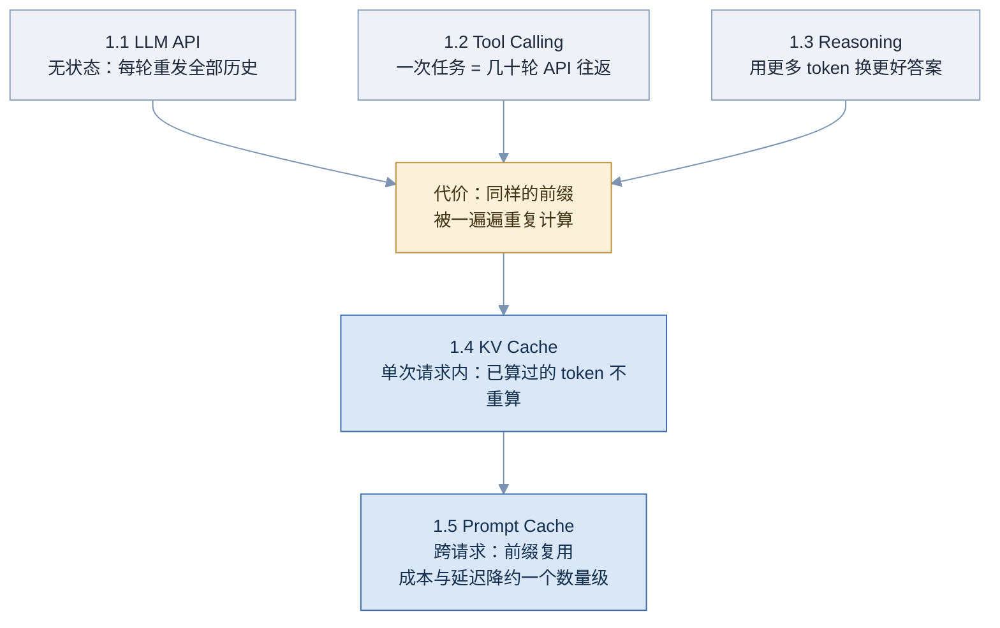
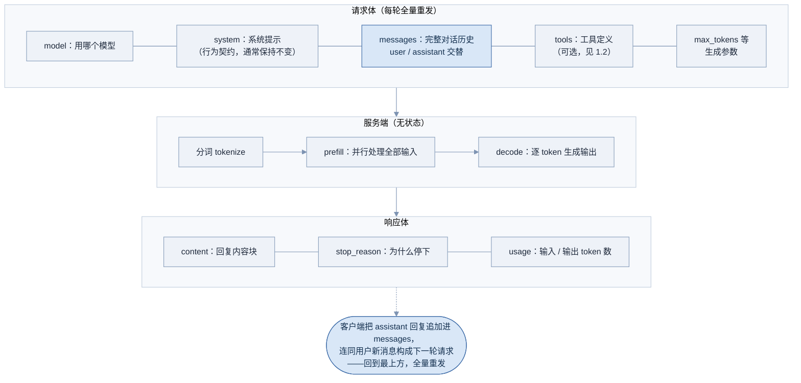
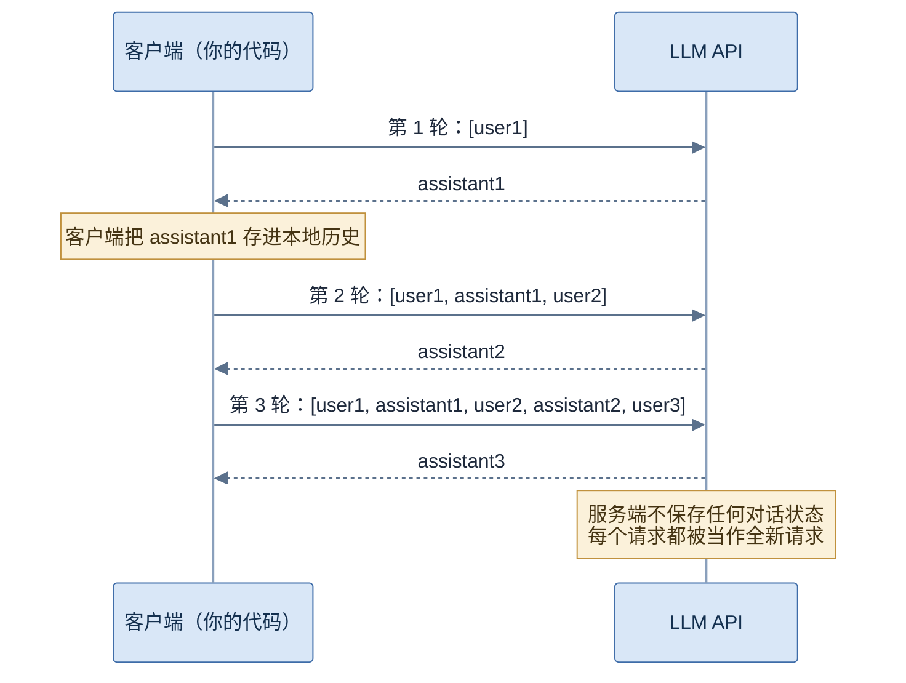
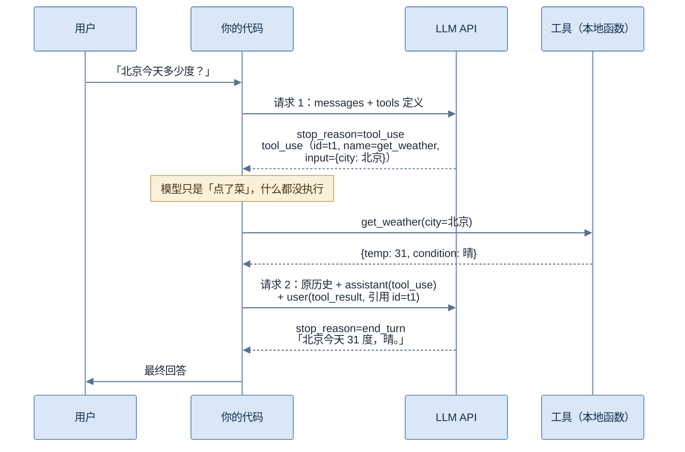
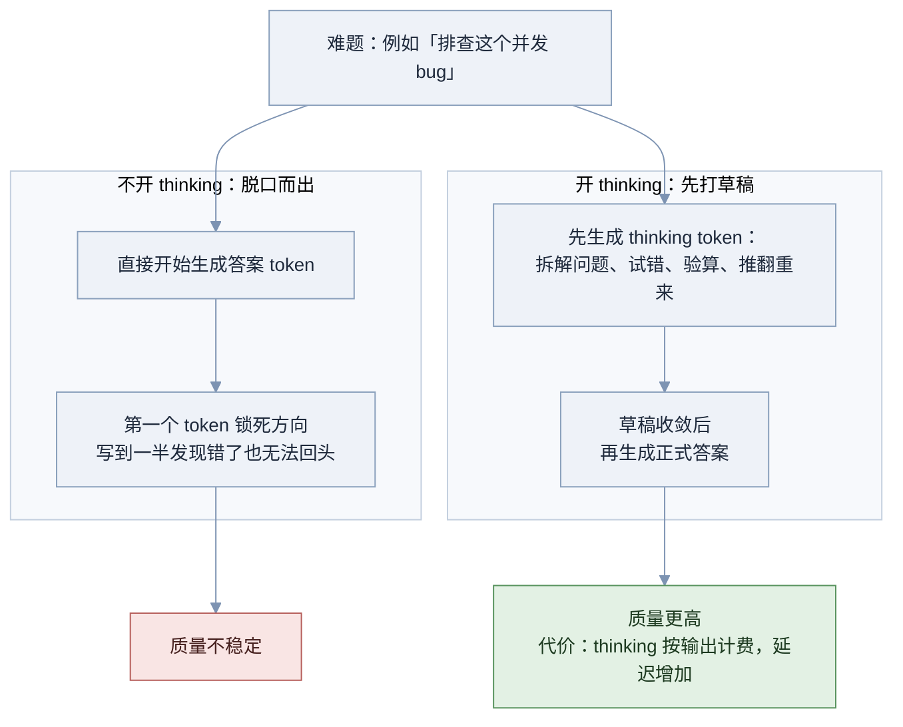
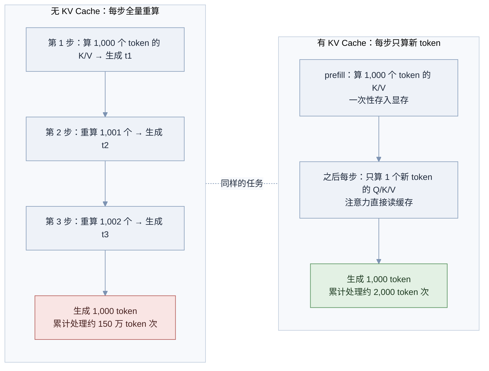
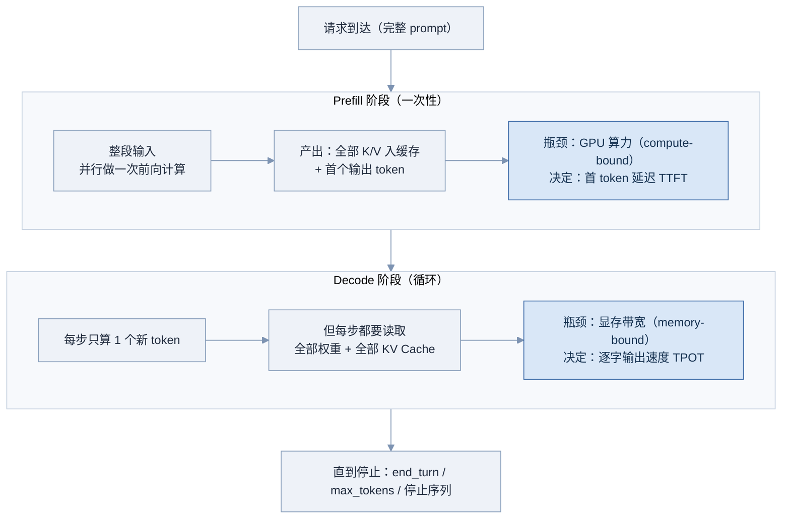
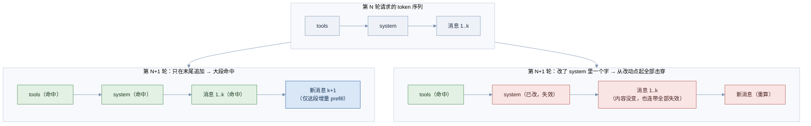

# 01 LLM 基础

本部分回答一个问题：**当你的代码和一个 LLM 说话时，物理上到底发生了什么。**

后面所有内容——循环、上下文、harness——都建立在这五个地基上。先看它们如何互相引出：

**图 01-1 Part 01 知识脉络**



图中的逻辑链是：1.1 揭示「历史要反复重发」这个残酷现实，1.2 和 1.3 说明 agent 会把这个现实放大几十倍（更多轮次、更多 token），于是「重复计算」成为核心矛盾；1.4 讲推理引擎在单次请求内怎么消除重复计算，1.5 讲厂商如何把这个机制延伸到跨请求——那是 harness 工程师每天要守护的东西。

---

## 1.1 LLM API 基础 🟢

> 一句话：LLM API 是你与大模型交互的唯一入口——把一段「对话历史」整体发过去，模型算出「接下来该说什么」发回来，除此之外它什么都不记得。

### 为什么需要它

模型本体是几百 GB 的权重，跑在 GPU 集群上，你不可能把它塞进自己的服务器。厂商把它包装成一个 HTTP API，这是你能触碰模型的唯一方式。

但真正的问题不是「怎么调 API」，而是一个大多数初学者都会踩中的认知陷阱：**你以为服务端记得你们聊过什么，实际上它什么都不记得。** LLM API 是无状态的（Stateless）——服务端不保存任何会话，每个请求都被当作全新请求处理。「对话」是一种假象，由客户端（你的代码）自己维护历史、每轮把**全部历史**重新发一遍来营造。

不理解这一点，后面的一切都无法理解：为什么多轮对话越聊越贵、为什么会有 KV Cache 和 Prompt Cache、为什么「上下文工程」会成为一个岗位级别的课题——全部源于「每轮重发全部历史」这一个事实。

### 核心原理

先看一次请求-响应的完整结构：

**图 01-2 LLM API 请求-响应结构**



**看左边的请求体。** 三个角色（role）各司其职：`system` 是行为契约——模型的身份、规则、边界，单独一个字段，因为它地位特殊（模型被训练得更服从它）而且通常整个会话保持不变（这一点对缓存至关重要，→ 见 1.5）；`user` 是用户输入；`assistant` 是模型自己以前的回复。注意：**模型的历史回复也要由你放进 messages 里重发**，否则模型不知道自己说过什么。

**看最下方那个深色圆角节点。** 它就是「对话」的真相：响应回来后，你的代码把 assistant 回复追加进本地的 messages 数组，下一轮把整个数组重发。用时序图看得更清楚：

**图 01-3 无状态的多轮对话：历史由客户端维护**



注意每一轮请求的方括号在变长：第 n 轮要重发前 n-1 轮的全部内容。由此直接推出成本结论：**n 轮对话的累计输入量是 O(n²)**——每轮多付一整段历史的钱。这是 1.5 Prompt Cache 存在的全部理由。

**响应体的三个字段**里，`stop_reason`（模型为什么停下）最容易被忽视，但它是后面 agent 循环的分支依据（→ 见 2.1）：

| stop_reason | 含义 |
|---|---|
| end_turn | 模型认为说完了，正常结束 |
| tool_use | 模型想调用工具，等你执行（→ 见 1.2） |
| max_tokens | 撞到输出上限被截断——输出可能不完整，不能当完整结果解析 |
| stop_sequence | 命中你预设的停止字符串 |

其余几个必须建立的概念：

- **Token 与计费**。模型按 token（词元，约等于 0.75 个英文单词或 0.5–1 个汉字）处理文本，输入和输出分开计价，**输出单价通常是输入的 5 倍左右**（例如 Claude Sonnet 5：输入 $2 / 百万 token，输出 $10 / 百万 token；数据截至 2026 年 8 月，面试前建议复核）。为什么输出贵？答案在 1.4 的 prefill / decode 差异里。上下文窗口（context window）是输入加输出的总 token 上限，主流模型在 20 万–100 万 token 量级（数据截至 2026 年 8 月，面试前建议复核）。`max_tokens` 是本次输出的硬上限，不是目标长度。
- **流式输出（Streaming）**。decode 本来就是逐 token 生成的（→ 见 1.4），流式只是把「生成一个就推一个」暴露给你（通常走 SSE 协议）。它不改变总耗时，改变的是**首 token 延迟（TTFT, Time to First Token）的体验**。工程取舍：面向用户的最终回答要流式（不让用户盯着空屏），agent 中间轮次的工具调用往往不需要（没有人在看）。
- **结构化输出（Structured Output）**。下游代码要解析模型输出时，让模型「自觉输出 JSON」再用正则去抠是脆弱的（会带 markdown 围栏、前后闲聊、转义错误）。可靠做法有两条：一是厂商的 schema 约束输出（按 JSON Schema 约束解码，保证合法）；二是用 tool calling 兜结构——定义一个「提交结果」工具，参数 schema 就是你要的结构（→ 见 1.2）。

### 工程实现

最小可运行的多轮对话，关键行都有注释——这段代码值得亲手跑一遍，观察 usage 数字随轮数增长：

```python
import anthropic

client = anthropic.Anthropic()  # 从环境变量 ANTHROPIC_API_KEY 读密钥

history = []  # 关键：对话历史由客户端维护，服务端什么都不记

while True:
    user_input = input("你: ")
    if user_input in ("q", "quit"):
        break
    history.append({"role": "user", "content": user_input})

    resp = client.messages.create(
        model="claude-sonnet-5",      # 模型名以官方文档为准
        max_tokens=1024,               # 本次输出的硬上限
        system="你是一个简洁的中文助手。",  # 每轮原样重发：前缀稳定（→ 见 1.5）
        messages=history,              # 每轮全量重发完整历史
    )

    reply = resp.content[0].text
    history.append({"role": "assistant", "content": reply})
    # 上面这行忘了写，模型就永远看不到自己说过的话

    print(f"助手: {reply}")
    print(f"  [usage] input={resp.usage.input_tokens} output={resp.usage.output_tokens}")
    # 观察：input_tokens 每轮都在变大——你在为全部历史反复付费
```

### 常见坑

- 以为服务端记得上下文，每轮只发最新一条消息——模型完全失忆
- 忘了把 assistant 回复追加回历史——模型看不到自己说过的话，重复作答、自相矛盾
- `max_tokens` 设太小，`stop_reason` 是 max_tokens 却没检查，把截断的半个 JSON 当完整输出去解析
- 每轮微调 system prompt（加时间戳、改措辞）——行为漂移，还把缓存全部击穿（→ 见 1.5）
- 让模型在输出里复述长文档——输出单价约为输入的 5 倍，能引用就不要复述
- 用正则从自然语言里抠 JSON，而不用结构化输出
- 流式场景只处理了文本增量，漏了 tool_use 增量和最终的 stop_reason 事件

### 面试怎么答

**高频问题**：

- 「LLM API 是有状态还是无状态的？这对上层系统意味着什么？」
- 「为什么多轮对话越聊越贵？成本怎么随轮数增长？」
- 「流式输出解决了什么问题？它会让生成变快吗？」
- 「怎么保证模型输出能被下游代码可靠解析？」

**好答案要点**：

- 一句话钉死本质：服务端无状态，历史由客户端每轮全量重发
- 主动推出 O(n²) 成本结论，并顺势引出缓存（→ 1.5）与上下文压缩（→ 4.3）——展示知识是连通的，这是最强的信号
- 流式：总耗时不变，改变的是 TTFT 体验；能说出 agent 中间轮次不需要流式这个工程细节
- 结构化输出：说出 schema 约束和 tool calling 兜结构两条路，并说明为什么正则不可靠

**减分点**：

- 说「模型会记住我们的对话」
- 不知道 stop_reason 的存在，或说不出 max_tokens 截断要专门处理
- 认为流式让模型「生成得更快」
- 不知道输入输出分开计价、单价差数倍

### 练习题

**1. 写出请求内容。** 一段对话已经进行了两轮：用户问「推荐一部科幻电影」，助手答「《银翼杀手 2049》」；用户又问「导演是谁？」，助手答「丹尼斯·维伦纽瓦」。现在用户发来第三条消息「他还有什么作品？」。写出此时发给 API 的完整 messages 数组。

<details>
<summary>参考答案</summary>

```json
[
  {"role": "user", "content": "推荐一部科幻电影"},
  {"role": "assistant", "content": "《银翼杀手 2049》"},
  {"role": "user", "content": "导演是谁？"},
  {"role": "assistant", "content": "丹尼斯·维伦纽瓦"},
  {"role": "user", "content": "他还有什么作品？"}
]
```

五条消息一条不能少：少了任何一条 assistant 消息，模型就不知道「他」指谁。system 提示不在 messages 里，作为独立字段随请求原样重发（OpenAI 风格的 API 则把它放在 messages 首条，结构等价）。

</details>

**2. 为什么同样 100 个 token，作为输出比作为输入贵好几倍？**

<details>
<summary>参考答案</summary>

输入是**并行**处理的：整段 prompt 一次前向计算（prefill），GPU 算力被充分利用，摊到每个 token 的成本低。输出是**串行**生成的：每个 token 都要做一次完整的前向计算（decode），而且每步都要把全部权重和 KV Cache 从显存搬运一遍，硬件利用率低。厂商定价反映的就是这个真实成本差（→ 见 1.4）。

</details>

**3. 找 bug。** 某同事的代码每轮只 `append` 用户消息，从不 `append` 助手回复。运行现象会是什么？

<details>
<summary>参考答案</summary>

历史里只剩连续的 user 消息。轻则：模型看不到自己说过的话，每轮都像第一次回答——重复自我介绍、重新解释、和之前的回答矛盾。重则：部分 API（如 Anthropic）要求 user / assistant 严格交替，连续多条 user 消息直接报 400 错误。这个 bug 的本质是忘了「对话是客户端拼出来的假象」。

</details>

### 延伸阅读

- [Anthropic Messages API 文档](https://platform.claude.com/docs/en/api/messages) —— 请求 / 响应结构的权威定义
- [OpenAI API Reference](https://platform.openai.com/docs/api-reference) —— 对照另一家的消息格式，看清哪些是行业共性
- [Anthropic Streaming 文档](https://platform.claude.com/docs/en/build-with-claude/streaming) —— 流式事件类型的完整清单

---

## 1.2 Tool Calling 协议 🟢

> 一句话：Tool calling 让模型能「点菜」——它用结构化 JSON 说出想调用哪个工具、参数是什么，你替它执行并把结果喂回去；模型只负责决定，执行永远发生在你的代码里。

### 为什么需要它

LLM 只会一件事：生成文本。它不知道现在几点，查不了你的数据库，发不了邮件，连 38473 × 2847 都算不准。没有 tool calling 的世界里，你只有两个烂选择：要么放任模型对它不知道的事**编一个答案**（幻觉），要么让模型输出「我想搜索天气」这样的自然语言、再用正则去猜它的意图——脆弱、有歧义、加一个工具就要改一套解析。

Tool calling 把「模型想做什么」变成一个**结构化协议**：工具用 JSON Schema 定义，模型的调用请求是可校验的 JSON，结果按固定格式回传。同时要建立本岗位最重要的一条安全认知：**模型从不执行任何东西。** 它只输出「我想调用 X，参数是 Y」这句话，真正执行的是你的代码。执行前你可以校验、拦截、要求人工确认——agent 的一切权限与安全设计（→ 见 6.3）都建立在这个「决策与执行分离」的缝隙上。

### 核心原理

一次带工具的问答，最少需要**两轮** API 往返。这张时序图是本章的核心，面试时要能默画：

**图 01-4 Tool calling 的一次完整往返**



按图走一遍：请求 1 带上 `tools`（工具定义清单），模型判断需要外部信息，于是**不回答**，而是返回一个 `tool_use` 块（含唯一 id、工具名、参数），并以 `stop_reason=tool_use` 停下等你。你的代码在本地执行工具，然后发请求 2——注意它的 messages 里有两个新增：先把模型那条**含 tool_use 的 assistant 消息原样放回**（少了它，API 会因为找不到配对而报错），再放一条 user 消息装着 `tool_result`，用 id 与请求配对。模型拿到结果，生成最终回答。

工具定义本身长这样——注意 `description` 不是给人看的注释，而是**给模型看的说明书**，模型完全依赖它决定何时调用、怎么填参：

```json
{
  "name": "get_weather",
  "description": "查询指定城市的当前天气。只支持中国大陆城市；需要历史天气或未来预报时不要使用本工具。",
  "input_schema": {
    "type": "object",
    "properties": {
      "city": {"type": "string", "description": "城市中文名，如「北京」"}
    },
    "required": ["city"]
  }
}
```

描述里那句「什么时候**不要**用我」价值极高——工具描述的质量直接决定调用的质量，这是 harness 工程师日常打磨的重点（展开 → 见 2.2）。

三个协议细节：

- **并行调用（Parallel Tool Use）**：模型可以在一条回复里同时给出多个 tool_use 块（比如同时查三个城市的天气）。你把它们都执行完，把多个 tool_result 装进**同一条** user 消息一次性回传，一个都不能少。相互独立的信息采集适合并行；有依赖关系（第二步要用第一步的结果）只能串行（工程取舍 → 见 4.4）。
- **tool_choice**：控制模型用不用工具——`auto`（自己决定，默认）、`any`（必须用某个工具）、指定某个工具（强制，可用来兜结构化输出，→ 见 1.1）、`none`（禁用）。
- **错误也是数据**：工具执行失败时，不要抛异常中断流程，而是把错误文本作为 tool_result 回传（可带 `is_error` 标记）。模型看到错误会自己重试、换参数、换工具——这是 agent 自愈能力的来源（→ 见 4.4 错误处理策略）。

各家 API 的字段名不同，但协议结构完全一致——面试时能指出这一点说明你看的是机制不是文档：

| 概念 | Anthropic | OpenAI |
|---|---|---|
| 模型发起调用 | content 里的 tool_use 块 | assistant 消息的 tool_calls 字段 |
| 结果回传 | user 消息里的 tool_result 块 | role 为 tool 的独立消息 |
| 停止原因 | stop_reason = tool_use | finish_reason = tool_calls |

### 工程实现

完整可运行的两轮往返。把「两轮」改成 `while` 循环，就是最小的 agent（→ 见 2.1）——这段代码是整个 Part 02 的种子：

```python
import json
import anthropic

client = anthropic.Anthropic()

TOOLS = [{
    "name": "get_weather",
    "description": "查询指定城市的当前天气。只支持中国大陆城市；"
                   "需要历史天气或未来预报时不要使用本工具。",
    "input_schema": {
        "type": "object",
        "properties": {
            "city": {"type": "string", "description": "城市中文名，如「北京」"}
        },
        "required": ["city"],
    },
}]

def get_weather(city: str) -> dict:
    fake_db = {"北京": {"temp": 31, "condition": "晴"}}
    return fake_db.get(city, {"error": f"未收录的城市: {city}"})

DISPATCH = {"get_weather": get_weather}  # 工具名 → 本地函数

messages = [{"role": "user", "content": "北京现在多少度？"}]

# ---- 请求 1：模型决定调用工具 ----
resp = client.messages.create(
    model="claude-sonnet-5", max_tokens=1024,
    tools=TOOLS, messages=messages,
)
assert resp.stop_reason == "tool_use"

# 把模型的回合（含 tool_use 块）原样放回历史——少了这步，请求 2 会报错
messages.append({"role": "assistant", "content": resp.content})

# ---- 执行工具：发生在你的进程里，模型只是「点了菜」 ----
results = []
for block in resp.content:
    if block.type == "tool_use":
        fn = DISPATCH[block.name]
        try:
            out = json.dumps(fn(**block.input), ensure_ascii=False)
            results.append({"type": "tool_result",
                            "tool_use_id": block.id, "content": out})
        except Exception as e:
            results.append({"type": "tool_result", "tool_use_id": block.id,
                            "content": f"工具执行失败: {e}", "is_error": True})
            # 错误回灌给模型，让它自己决定重试还是换路（→ 见 4.4）

messages.append({"role": "user", "content": results})

# ---- 请求 2：模型拿到结果，生成最终回答 ----
resp2 = client.messages.create(
    model="claude-sonnet-5", max_tokens=1024,
    tools=TOOLS, messages=messages,
)
print(resp2.content[0].text)
```

### 常见坑

- description 写得敷衍（「查询数据」）——模型不知道何时该用、怎么填参，乱调或不调；工具描述是 prompt 的一部分
- 忘了把含 tool_use 的 assistant 消息放回历史就发 tool_result——API 直接报错（配对 id 找不到）
- 并行调用只回传了一个结果，漏了其他 id——报错或模型困惑
- 工具结果无脑全量塞回（比如整个网页的 HTML）——上下文瞬间爆炸（截断策略 → 见 2.2、4.3）
- 工具报错时抛异常中断整个流程，而不是把错误作为 tool_result 回灌——放弃了模型的自愈能力
- 不校验参数直接执行——模型会产出枚举外的值、缺字段的 JSON，执行层必须再验一遍（pydantic 一类）
- 工具越挂越多、描述越写越长，常驻上下文被工具定义挤满（→ 见 3.1 MCP 的上下文占用问题、3.2 Skills 的解法）

### 面试怎么答

**高频问题**：

- 「讲一下 tool calling 的完整时序，模型、API、你的代码各干什么？」
- 「模型真的会执行工具吗？」
- 「工具执行失败了怎么办？」
- 「什么时候用并行调用？它的限制是什么？」

**好答案要点**：

- 白板默画图 01-4 的两轮往返，讲清 tool_use / tool_result 的 id 配对
- 强调「模型只决策、不执行」，并延伸到权限与安全设计的意义
- 错误处理答「错误也是数据，回灌让模型自愈」，并补充要设重试上限防死循环（→ 4.4）
- 主动提到工具描述质量决定调用质量——这是有实操经验的人才会说的话

**减分点**：

- 以为模型端执行工具
- 讲不清为什么要把 assistant(tool_use) 原样放回历史
- 不知道并行调用的存在，或不知道结果要一次性全部回传
- 认为「工具越多能力越强」，没有上下文成本意识

### 练习题

**1. 描述设计题。** 你有两个工具：`read_file`（读单个文件内容）和 `list_files`(列目录）。写出两者的 description，要求模型面对「帮我看看项目里有哪些配置文件，然后读一下主配置」这类任务时，能正确地先 list 后 read，而不是拿目录名去调 read_file。

<details>
<summary>参考答案</summary>

要点是在描述里写清各自的边界和依赖关系：

- `list_files`：「列出指定目录下的文件和子目录名。当你不确定文件的确切路径时，先用本工具探索目录结构。参数 path 必须是目录，不是文件。」
- `read_file`：「读取单个文件的完整内容。参数 path 必须是**确切的文件路径**，不能是目录；路径不确定时先用 list_files 找到确切路径再调用本工具。」

两条通用技巧：写「什么时候不该用我」；写「本工具与相邻工具的先后关系」。模型对工具的一切认知都来自这几行字。

</details>

**2. 排序题。** 把以下四个消息片段按一次「带工具问答」的时间顺序排列：A. user 消息（内含 tool_result）；B. user 消息「查一下汇率」；C. assistant 消息（内含 tool_use）；D. assistant 消息（纯文本回答）。

<details>
<summary>参考答案</summary>

B → C → A → D。请求 1 发出 B（连同 tools 定义），模型回 C；你执行工具后，请求 2 发出 B + C + A（历史加新结果），模型回 D。记忆锚点：tool_use 永远在 assistant 消息里，tool_result 永远在 user 消息里——「模型点菜，你上菜」。

</details>

**3. 权衡题。** 天气工具因为对方服务宕机而超时。方案甲：捕获异常后直接向用户返回「服务暂不可用」；方案乙：把「get_weather 超时（10s 无响应）」作为 tool_result 回灌给模型。两种方案各会发生什么？各适合什么场景？

<details>
<summary>参考答案</summary>

方案甲：流程立即终止，确定性强、省 token，但放弃了一切补救——模型本可以换个数据源、稍后重试、或如实告知用户并继续处理任务的其他部分。方案乙：模型看到错误后自主决定下一步，agent 表现更「聪明」，但必须配合重试上限与退避策略，否则模型可能反复重试同一个死工具，烧钱又死循环（→ 见 4.4）。经验法则：可恢复的错误（超时、限流、参数错）回灌；不可恢复的错误（权限拒绝、资源不存在且无替代）快速失败。

</details>

### 延伸阅读

- [Anthropic Tool Use 文档](https://platform.claude.com/docs/en/agents-and-tools/tool-use/overview) —— 协议细节与并行调用的权威说明
- [OpenAI Function Calling 指南](https://platform.openai.com/docs/guides/function-calling) —— 对照字段命名差异
- [JSON Schema 官方入门](https://json-schema.org/learn/getting-started-step-by-step) —— input_schema 的语法基础

---

## 1.3 Reasoning 与 thinking token 🟡

> 一句话：Reasoning 让模型在给出答案前先「打草稿」——生成一段不属于正式回答的思考文本，用更多的计算量换更高的答案质量。

### 为什么需要它

LLM 是逐 token 生成的，而且**每个 token 消耗的计算量是固定的**——不管这个 token 是在抄一句话，还是在决定一个复杂 bug 的修复方案。这就出了问题：难题（多步数学、代码调试、任务规划）需要的「思考量」，超过了生成几个 token 所能承载的计算量。

没有 reasoning 的模型等于被迫「脱口而出」：答案的第一个 token 一旦生成，方向就锁死了，错了没法回头。思维链（Chain-of-Thought, CoT）的发现正是突破口：只要让模型**先写出推理过程再给答案**，准确率就大幅提升——本质是把计算摊到更多 token 上，行话叫**测试时计算（test-time compute）**：不改模型，靠推理阶段多花算力换质量。

这条路线后来经历了三级跳：提示词技巧（在 prompt 里写「一步步思考」）→ 训练出原生推理模型（用强化学习教会模型自发长链思考）→ **API 一级特性**：思考内容放进专门的 thinking 块、与正式回答分离、预算可控。今天说的 thinking token，指的就是第三级。

### 核心原理

**图 01-5 直接作答 vs 先思考再作答**



图中左右两条路径的差别不是「模型变聪明了」，而是**计算预算不同**：右路在给出答案前，允许模型用成百上千个 token 做探索——列出可能性、逐个验证、发现矛盾后推翻重来。草稿里的回头路，正是左路做不到的。

工程上必须掌握的机制细节（以 Anthropic API 为例，各家概念对应）：

- **怎么开**：请求里加 `thinking` 参数。经典方式是手动预算：`{"type": "enabled", "budget_tokens": 8000}`，模型最多用 8000 token 思考；预算必须小于 `max_tokens`，因为思考和正式回答共享这个输出上限。较新的模型转向自适应模式（`{"type": "adaptive"}` 配合 effort 档位），由模型自己决定该不该思考、思考多深（机制截至 2026 年 8 月，面试前建议复核）。
- **怎么计费**：**thinking token 按输出价计费**——这是最容易被忽略的成本项。开着高预算跑 agent，每一轮都可能多花几千个输出 token。usage 里有专门字段（如 `output_tokens_details.thinking_tokens`）供你监控。
- **响应长什么样**：content 里先是 thinking 块，后是 text 块，分离清晰，UI 可以折叠草稿只展示答案。
- **多轮怎么处理历史草稿**：两种策略并存。多数早期模型**自动剥离**历史轮次的 thinking 块（草稿信息密度低、极占上下文，丢掉是一种内建的上下文管理）；最新一代模型转向**保留并按输入计费**（长 agent 任务中，草稿里的决策依据有延续价值，丢了会导致重复探索）。面试能讲出这对权衡即可，具体行为按模型代际查文档（数据截至 2026 年 8 月，面试前建议复核）。
- **工具调用链里的草稿**：当前轮次里 thinking 块与 tool_use 块相邻时，回传历史必须**原样保留** thinking 块（带签名校验，篡改或丢弃会报错）——模型需要靠草稿记得「我为什么要调这个工具」。
- **与缓存的交互**：开关 thinking、调整预算都属于配置变化，会使消息部分的缓存断点失效（→ 见 1.5）。工程结论：**选定一个预算就整个会话保持稳定**，别逐轮调。
- **交错思考（Interleaved Thinking）**：允许模型在多次工具调用**之间**思考——「拿到结果 A，说明方向错了，下一步改查 B」。对 agent 循环价值极大（→ 见 2.1、4.4）。

何时该开，判断标准就一条：**任务需要的推理深度是否超过「顺手就能答」**。多步推理、代码调试、规划类任务开，且难度越高预算给越足；抽取、改写、格式化、简单问答不开——延迟和成本不值得，甚至可能「过度思考」（overthinking：简单问题想出花来，质量反降）。

### 工程实现

```python
import anthropic
client = anthropic.Anthropic()

resp = client.messages.create(
    model="claude-sonnet-5",
    max_tokens=16000,          # 思考与正式回答共享这个上限
    thinking={"type": "enabled", "budget_tokens": 8000},  # 预算必须 < max_tokens
    messages=[{"role": "user", "content": "这段代码在高并发下偶发数据错乱，帮我定位：..."}],
)

for block in resp.content:
    if block.type == "thinking":
        print("[草稿]", block.thinking[:200], "...")   # 给人看可以截断
    elif block.type == "text":
        print("[回答]", block.text)

print(resp.usage)  # 关注 thinking 消耗了多少输出 token
```

按任务难度分级开启的门控伪代码——这是 harness 里真实存在的一层逻辑：

```text
若任务 ∈ {多步推理, 代码调试, 架构规划, 数学证明}:
    开 thinking，预算按难度分级（如 4k / 8k / 16k）
若任务 ∈ {抽取, 改写, 格式化, 简单问答}:
    不开
不确定时:
    用评测集对比开/关的质量差与成本差，再定默认值（→ 见 6.1）
选定预算后整个会话保持不变（缓存友好，→ 见 1.5）
```

### 常见坑

- 所有请求无脑开最大预算——延迟和成本爆炸，简单任务还可能过度思考、质量反降
- 把 thinking 当免费——它按**输出价**计费，且挤占 max_tokens 预算
- 工具调用链中丢弃或篡改当前轮的 thinking 块——签名校验直接报错
- 逐轮调整 budget_tokens——每调一次，消息缓存失效一次（→ 见 1.5）
- 把 thinking 全文原样展示给终端用户——体验混乱；折叠或摘要展示
- 解析 thinking 内容做业务逻辑——草稿没有格式保证，别 parse 它
- 对已训练过 reasoning 的模型再叠加「think step by step」提示——收益趋近于零，还可能干扰其原生思考格式

### 面试怎么答

**高频问题**：

- 「CoT 为什么有效？」
- 「extended thinking 和在 prompt 里写『一步步思考』有什么区别？」
- 「什么任务该开 thinking？预算怎么定？成本怎么算？」
- 「thinking 和 prompt cache 怎么交互？」

**好答案要点**：

- 用 test-time compute 一句话解释原理：计算摊到更多 token，换来可以回头的探索空间
- 讲出三级跳演进：提示词技巧 → RL 训练的原生推理 → API 原语（预算、分离、可控）
- 成本意识：按输出计费、挤占 max_tokens、按任务难度分级门控
- 说出「预算保持稳定」的缓存工程结论——这是区分「用过」和「上过生产」的细节

**减分点**：

- 说 thinking 免费或不知道怎么计费
- 解释有效性只会说「模型更聪明了」
- 不知道预算机制，或不知道历史草稿的剥离/保留策略
- 完全没意识到它和缓存有交互

### 练习题

**1. 分类题。** 三个任务：a) 修正一段文本的错别字；b) 排查一个偶发的并发 bug；c) 调用天气工具查北京气温。哪些该开 thinking？

<details>
<summary>参考答案</summary>

只有 b 开，且预算给足——它需要多步假设与验证。a 是模式匹配任务，顺手就能答；c 的难点在工具而不在推理，开 thinking 纯属浪费延迟和钱。追问预设：如果 c 变成「对比三个城市未来一周天气并给出出行建议」，采集仍不需要 thinking，但最后的权衡分析环节可以考虑开低预算。

</details>

**2. 算账题。** 一次请求：输入 2,000 token，thinking 用了 10,000 token，正式回答 500 token。按输入 $2 / 百万、输出 $10 / 百万计算本次成本。

<details>
<summary>参考答案</summary>

输入：2,000 × $2/M = $0.004。输出 = thinking + 正式回答 = 10,500 × $10/M = $0.105。合计约 $0.109，其中 **thinking 占了 95% 的输出成本**。这道题的目的就是让你对「草稿比答案贵得多」有体感——agent 每轮都开高预算时，成本大头往往是没人看见的草稿。

</details>

**3. 权衡题。** 为什么有的模型在多轮对话中自动剥离历史 thinking 块，有的却选择保留并计费？两边各有什么道理？

<details>
<summary>参考答案</summary>

剥离方的道理：草稿的信息密度低、体量常是正式回答的几倍到几十倍，保留会迅速挤爆上下文窗口并稀释注意力——剥离等于厂商内建的一层上下文管理（→ 见 4.2、4.3）。保留方的道理：在长 agent 任务里，草稿记录着「我为什么这么决定」，丢了它，模型可能在后续轮次重复同样的探索、甚至推翻自己已验证过的结论。本质是**上下文成本 vs 推理连续性**的权衡，行业没有统一答案，所以两种策略并存。

</details>

### 延伸阅读

- [Anthropic Extended Thinking 文档](https://platform.claude.com/docs/en/build-with-claude/extended-thinking) —— 预算、计费、缓存交互的权威细节
- [Chain-of-Thought Prompting（Wei et al., 2022）](https://arxiv.org/abs/2201.11903) —— CoT 的原始论文
- [DeepSeek-R1 论文](https://arxiv.org/abs/2501.12948) —— 用 RL 训练原生推理能力的代表作

---

## 1.4 KV Cache 原理 🟢

> 一句话：KV Cache 是推理引擎的「草稿纸」——把已处理 token 的中间计算结果（K 和 V）存在显存里，让每个新 token 的生成不必重算整段历史。

### 为什么需要它

先补一句「够用版」注意力（Attention）原理，不需要更多：模型生成每个新 token 时，会拿当前 token 的查询向量 **Q**（Query），去和**历史上每个 token** 的键向量 **K**（Key）算相关度，再按相关度加权历史上每个 token 的值向量 **V**（Value），得到「回顾了全部上文」的结果。每层都这么做一遍。

问题来了：K 和 V 是从每个 token 算出来的中间结果。如果不存下来，那么**每生成一个新 token，都要把前面所有 token 的 K/V 从头再算一遍**。看数字：假设 prompt 有 1,000 个 token，要生成 1,000 个 token 的回答——第 1 步算 1,000 个 token，第 2 步重算 1,001 个，第 3 步 1,002 个……总计算量随长度平方增长。这样的推理引擎根本不可用。

KV Cache 的思路简单到朴素：**算过的 K/V 存进显存，下次直接读。** 代价是显存占用，收益是每步只需计算一个新 token。现代所有推理引擎都内建这个机制——它不是可选优化，而是 LLM 能以可接受速度运行的前提。

### 核心原理

**图 01-6 无 KV Cache vs 有 KV Cache 的计算量**



图中左右两栏做同一件事，看两栏末尾的总账格（红色对绿色）：计算量差了近三个数量级，且序列越长差距越大——这就是「草稿纸」的价值。

把图里的账写成公式：设 prompt 长 p 个 token、要生成 n 个 token，每一步的处理量等于它当时面对的序列长度。

**无缓存**（第 t 步要重算 p+t−1 个 token）：

$$
\sum_{t=1}^{n} (p+t-1) = np + \frac{n(n-1)}{2} = O(np + n^{2})
$$

**有缓存**（prefill 一次算 p 个，之后每步只算 1 个）：

$$
\underbrace{p}_{\text{prefill}} + \underbrace{n}_{\text{decode}} = O(p+n)
$$

代入图中的 p = n = 1000：无缓存约 150 万，有缓存 2000——图里两个总账格的数字就是这么来的。真正致命的是平方项：任务越长，无缓存路线浪费的占比越高。

**为什么只缓存 K/V，不缓存 Q？** 这是本章的必考题。把注意力写成公式，答案会自己浮出来。每个 token 的隐向量 x_i 先投影出三份：

$$
q_i = x_i W_Q, \qquad k_i = x_i W_K, \qquad v_i = x_i W_V
$$

生成第 t 步时，注意力输出为：

$$
o_t = \sum_{i=1}^{t} \alpha_{t,i}\, v_i, \qquad
\alpha_{t,i} = \operatorname{softmax}_i\!\left( \frac{q_t \cdot k_i}{\sqrt{d_{\text{head}}}} \right)
$$

盯住下标：式子里出现的是**当前步的 q_t**，配上**全部历史的 k_i 与 v_i**（i 从 1 到 t）；而历史的 q_1 … q_{t-1} 根本不在式子里——每个 q 只在自己那一步登场一次，之后任何未来计算都不会再用它。所以 k、v 值得存（未来每一步都要读），q 用完即弃。一句话：**Q 只服务当下，K/V 服务未来。**

**显存公式**（面试要能现场推）。每个 token 在每一层、每个 KV 头上都存一份 k 和一份 v，所以一条序列的 KV Cache 显存是：

$$
M_{KV} = 2 \times L \times H_{\text{kv}} \times d_{\text{head}} \times n \times b
$$

符号含义：开头的 2 是 K 和 V 各一份（最常见的漏乘点）；L 是层数，H_kv 是 KV 头数，d_head 是每头维度，n 是序列长度，b 是每参数字节数（fp16 / bf16 为 2）。白板口述版：**「2 × 层数 × KV 头数 × 头维 × 序列长 × 字节数」**。

代入 Llama-2-7B（L=32、H_kv=32、d_head=128、b=2，架构参数为公开定值，不过期），4k 上下文：

$$
M_{KV} = 2 \times 32 \times 32 \times 128 \times 4096 \times 2\ \text{B} \approx 2\ \text{GB}
$$

即**每 token 约 0.5 MB**——KV Cache 比多数人的直觉大得多。

再看 Llama-3-70B（L=80、d_head=128），它用了**分组查询注意力（GQA, Grouped-Query Attention）**：64 个 Q 头共享 8 组 KV 头，H_kv 从 64 砍到 8，代入公式，显存直接除以 8。128k 上下文时：

$$
\text{GQA}:\ 2 \times 80 \times 8 \times 128 \times 131072 \times 2\ \text{B} \approx 40\ \text{GB}
$$

$$
\text{MHA}:\ 2 \times 80 \times 64 \times 128 \times 131072 \times 2\ \text{B} \approx 320\ \text{GB}
$$

40 GB 已经很痛，320 GB 则连一台 8 卡机的总显存都装不下——单条序列就击穿整机。

这组数字解释了为什么 GQA 成为现代模型标配：**KV Cache 显存是长上下文与高并发的第一瓶颈**，KV 头数每砍一倍，同样的显存就能多服务一倍的并发或一倍的长度。更激进的还有 MQA（所有 Q 头共享 1 组 KV）和 DeepSeek 的 MLA（把 KV 投影到低秩空间再缓存），方向都是同一个：压 KV。

**Prefill 与 Decode：一次请求的两个阶段。** KV Cache 把推理天然切成两段，两段的瓶颈完全不同：

**图 01-7 Prefill 与 Decode 两阶段**



看图中两个阶段各自的最后一格（深色标出）：prefill 是几千个 token 并行算大矩阵乘法，GPU 算力被打满，属于**计算密集**；decode 每步只产出 1 个 token 的计算量，却要把几十 GB 的权重和 KV Cache 从显存搬进计算单元，算力大量闲置，属于**访存密集**。两个用户可感知指标由此分家：prompt 越长 prefill 越久，**TTFT**（首 token 延迟）越高；上下文越长 KV 越大，每步搬运越多，**TPOT**（每 token 生成时间）越慢——所以长上下文不只是首字慢，是**每个字都慢**。

这一切与 harness 工程师的关系，三条推论：

1. 输出单价为什么是输入的数倍？decode 的访存瓶颈就是物理原因（→ 见 1.1 的计费差）。
2. KV Cache 的生命周期只在**单次请求内**——请求结束显存即回收。于是多轮对话里同样的历史下一轮还要重新 prefill 一遍。「能不能跨请求留住 KV？」——这个问题的答案就是 1.5。
3. 你塞进上下文的每一个 token，都同时在付三种代价：prefill 计算、KV 显存、decode 每步的搬运——「上下文是稀缺资源」（→ 见 4.2）从这里获得物理含义。

### 工程实现

Harness 工程师不实现 KV Cache（那是 vLLM 这类推理引擎的事），但要会算账。可运行的显存计算器：

```python
def kv_cache_bytes(n_layers: int, n_kv_heads: int, head_dim: int,
                   seq_len: int, bytes_per: int = 2) -> int:
    """一条序列的 KV Cache 显存占用（字节）。bytes_per=2 即 fp16/bf16。"""
    return 2 * n_layers * n_kv_heads * head_dim * seq_len * bytes_per
    #      ^ K 和 V 各一份

GB = 1024 ** 3

# Llama-2-7B：32 层，MHA 32 个 KV 头，头维 128，4k 上下文
print(f"{kv_cache_bytes(32, 32, 128, 4096) / GB:.1f} GB")      # 2.0 GB

# Llama-3-70B：80 层，GQA 8 个 KV 头，128k 上下文
print(f"{kv_cache_bytes(80, 8, 128, 131072) / GB:.1f} GB")     # 40.0 GB

# 同样的 70B 若不用 GQA（64 个 KV 头）：
print(f"{kv_cache_bytes(80, 64, 128, 131072) / GB:.1f} GB")    # 320.0 GB
```

带缓存的 decode 循环骨架（伪代码，理解机制用）：

```text
prefill:
    对 prompt 全部 token 并行前向 → 每层的 K/V 存入 cache
    采样得到首个输出 token t

decode 循环:
    当未命中停止条件:
        对单个新 token t 前向 → 算出它的 Q/K/V
        它的 K/V 追加进 cache
        用它的 Q 对 cache 里全部 K/V 做注意力 → 采样出下一个 token
```

### 常见坑

- 把 KV Cache 和 Prompt Cache 混为一谈——前者是**单次请求内**推理引擎的显存机制，后者是**跨请求**的商业化复用（建立在前者之上，→ 见 1.5）
- 以为缓存的是文本或 token id——缓存的是每层算出的 K/V 张量
- 以为 Q 也要缓存，或答不出「为什么不缓存 Q」
- 公式漏乘 2（K 和 V 各一份）或漏乘层数——现场推导最常见的翻车点
- 把 decode 慢归因于「算力不够」——是访存带宽瓶颈，堆算力没用
- 忽略 KV 显存与并发的关系——长上下文高并发时显存被 KV 吃光，吞吐断崖式下跌
- 不知道 GQA 是砍 KV 显存的手段，把它当成提升「智力」的技术

### 面试怎么答

**高频问题**：

- 「为什么只缓存 K/V 不缓存 Q？」（必考经典）
- 「prefill 和 decode 有什么不同？瓶颈各是什么？」
- 「某某模型 32k 上下文时 KV Cache 占多少显存？」（现场推公式）
- 「GQA 解决什么问题？」

**好答案要点**：

- 「Q 只服务当下，K/V 服务未来」一句话拿下必考题；能写出逐步注意力公式、指着下标讲论证则更稳
- 公式脱口而出并代入数字，主动给出 GQA 前后的数量级对比
- compute-bound vs memory-bound 说清，并推论到 TTFT / TPOT 两个指标
- 向上连接：用本章解释输入输出价差、解释 prompt cache 的由来——面试官问一层你答三层

**减分点**：

- KV Cache 与 Prompt Cache 混淆（高频翻车点）
- 公式推不出或漏项
- 说不出 decode 是访存瓶颈，或说反
- 不知道 GQA/MQA 存在

### 练习题

**1. 现场推导。** 某模型 48 层、GQA 8 个 KV 头、头维 128、bf16。一条 32k token 的序列，KV Cache 占多少显存？

<details>
<summary>参考答案</summary>

$$
M_{KV} = 2 \times 48 \times 8 \times 128 \times 32768 \times 2\ \text{B} \approx 6.4 \times 10^{9}\ \text{B} \approx 6\ \text{GB}
$$

检查自己有没有漏乘 2（K 和 V）。追问方向：若并发 20 条这样的序列就是 120 GB——这就是为什么长上下文服务要按并发规划显存。

</details>

**2. 承上启下题。** 既然 KV Cache 已经保证「算过的不重算」，为什么多轮对话中，同样的历史在下一轮请求还是要重新 prefill 一遍？

<details>
<summary>参考答案</summary>

因为 KV Cache 的生命周期只覆盖**单次请求**：显存是最稀缺的资源，请求结束缓存即被回收，腾给别的请求。下一轮请求到达时，尽管前缀完全相同，引擎的显存里已经没有它的 K/V 了，只能重新 prefill。「把 K/V 跨请求留住、按前缀哈希复用」正是 Prompt Cache 做的事（→ 见 1.5）——这道题就是 1.4 到 1.5 的桥。

</details>

**3. 现象解释题。** 用户反馈：上下文塞得越满，模型不仅「开始回答变慢」（首字等很久），连「打字速度」都变慢了。分别解释两个现象。

<details>
<summary>参考答案</summary>

首字慢：prefill 要对整段输入做一次前向，输入越长计算量越大，TTFT 线性上升。打字慢：decode 每生成一个 token 都要读取全部 KV Cache，上下文越长 KV 越大，每步的显存搬运量越大，TPOT 随之上升。一句话：**长上下文在两个阶段各收一次税**。

</details>

### 延伸阅读

- [Transformer Inference Arithmetic（kipply）](https://kipp.ly/transformer-inference-arithmetic/) —— 推理成本的第一性原理拆解，KV Cache 计算的经典参考
- [vLLM: Easy, Fast, and Cheap LLM Serving with PagedAttention](https://blog.vllm.ai/2023/06/20/vllm.html) —— 把 KV Cache 当「虚拟内存」管理的工程里程碑
- [GQA 论文（Ainslie et al., 2023）](https://arxiv.org/abs/2305.13245) —— 分组查询注意力的出处

---

## 1.5 Prompt Cache 工程 🟢

> 一句话：Prompt cache 让「上次请求算过的前缀」在下次请求直接复用，不再重新 prefill——agent 每轮重发全部历史，命中与否，输入成本和首字延迟差约一个数量级。

### 为什么需要它

把前两章的结论并排放在一起，矛盾自己浮出来：

- 1.1 说：API 无状态，每轮要**全量重发**历史，n 轮累计输入 O(n²)；
- 1.4 说：KV Cache 只活在单次请求内，请求结束就回收——于是**同样的前缀，每轮都要重新 prefill 一遍**。

一个真实的 coding agent 会话跑 50 轮，系统提示加工具定义上万 token，等于同一段内容被完整计算了 50 遍，49 遍是纯浪费。浪费的是三样东西：你的钱、用户等 TTFT 的时间、厂商的 GPU。

Prompt cache（提示词缓存）就是三方共赢的解法：**厂商把 KV Cache 跨请求持久化**（按前缀索引，保留几分钟到几十分钟），下次请求带着相同前缀来，命中部分直接复用、只对新增部分做增量 prefill。命中的读价通常是正常输入价的 **0.1 倍左右**——这就是「一个数量级」的由来。对 harness 工程师，它不是锦上添花的优化项，而是**设计约束**：整个 harness 的上下文组织方式，都要围绕「让缓存命中」来安排。

### 核心原理

**为什么缓存按「前缀」组织？** 这是理解一切击穿现象的钥匙，答案来自 1.4：位置 i 的 K/V 是从「token i 及它之前的全部内容」算出来的。第 100 个 token 只要变了，第 100 个之后**每个位置**的 K/V 都不再成立。所以复用只可能发生在「从头开始、完全一致」的那段上——**最长公共前缀**。缓存对字节级差异敏感，不是厂商小气，是数学。

**图 01-8 前缀命中与击穿**



看图中第三行（绿色为命中，红色为失效）：消息 1..k 一个字都没改，却因为排在改动点**之后**而全部失效——击穿是级联的。序列化顺序普遍是 **tools → system → messages**，所以越靠前的部分越动不得：改一个工具定义，整条缓存报废。

由此得出**前缀稳定三原则**——本章真正要背下来的东西：

1. **静态 system prompt**：时间戳、随机数、用户状态等动态信息，绝不放 system；要注入就放到消息序列**末尾**（如最新一条 user 消息里）或工具结果里。
2. **只追加、不修改**：历史消息 append-only。删除、改写、重排中段消息都会击穿（压缩历史时怎么兼顾 → 见 4.3 缓存友好压缩）。
3. **确定性序列化**：同样的数据每次序列化出同样的字节流——JSON key 顺序固定、无随机 id、无不稳定的浮点格式。跨语言服务尤其要检查。

以及一个高频真实事故，值得单独记住：**动态增删工具是大忌**。按轮次「按需挂工具」看似省上下文，实际一箭双雕地坏：tools 在序列化最前面，每变一次全缓存击穿；同时模型面对「上一轮还在、这一轮消失」的工具会困惑（引用不存在的工具、怀疑自己记错）。工具列表要稳定，「按需」的正确实现是渐进式披露（→ 见 3.2 Skills）。

**各家机制速览**（数据截至 2026 年 8 月，面试前建议复核）：

| 厂商 | 触发方式 | 关键数字 |
|---|---|---|
| Anthropic | 显式：请求里打 cache_control 断点（最多 4 个） | 读 0.1 倍；写 1.25 倍（5 分钟 TTL）或 2 倍（1 小时 TTL）；命中免费续期；门槛 512–4096 token 按模型 |
| OpenAI | 自动：前缀达门槛即缓存 | 新旗舰读 0.1 倍、写 1.25 倍、TTL 30 分钟滑动；较早模型写免费、读折扣因模型而异 |
| DeepSeek | 全自动 | 命中价约为未命中的 1/30（v4 系列），幅度业内最大 |
| Gemini | 隐式缓存默认开（2.5 起），另有显式缓存 API | 门槛 2048–4096 token 按模型，命中自动折扣 |

两个共性值得在面试里点出：**读价普遍收敛到 0.1 倍上下**（「一个数量级」的行业锚点）；**写缓存可能比正常输入更贵**（如 1.25 倍）——只用一次的长 prompt 开缓存反而亏，缓存的前提是「会被再次用到」。

**成本有多敏感，看一笔账**：10k token 的稳定前缀（系统提示 + 工具定义），50 轮对话，Sonnet 5 输入价 $2 / 百万 token：

```text
仅前缀部分的累计输入成本（50 轮）

无缓存   ████████████████████████████████  $1.000（10k × 50 轮全价）
有缓存   ████                              $0.123（写 1 次 × 1.25 + 读 49 次 × 0.1）
```

约 8 倍差距——而且这只算了固定前缀；真实会话的历史逐轮变长，命中部分越来越大，实际差距向 10 倍靠拢。TTFT 同理：命中意味着上万 token 跳过 prefill，首字延迟从秒级降到亚秒级。

### 工程实现

可运行示例：给长前缀打断点，跑两次，观察 usage 里缓存字段的变化——**验证命中永远看字段，不靠感觉**：

```python
import anthropic
client = anthropic.Anthropic()

LONG_SYSTEM = "你是代码审查助手。审查规范如下：\n" + "...（此处省略几千 token 的规范）..."
TOOLS = [...]  # 工具定义序列化在最前，是最不该动的部分

def ask(messages):
    return client.messages.create(
        model="claude-sonnet-5", max_tokens=1024, tools=TOOLS,
        system=[{
            "type": "text", "text": LONG_SYSTEM,
            "cache_control": {"type": "ephemeral"},  # 断点：缓存到此为止的前缀
        }],
        messages=messages,
    )

m = [{"role": "user", "content": "审查这段代码：..."}]
r1 = ask(m)
print(r1.usage)  # 首次：cache_creation_input_tokens > 0（写缓存，1.25 倍价）

m += [{"role": "assistant", "content": r1.content},
      {"role": "user", "content": "第 3 条建议展开讲讲"}]
r2 = ask(m)
print(r2.usage)  # 第二次：cache_read_input_tokens > 0（读缓存，0.1 倍价）
```

上线前的前缀稳定性自查（每条对应三原则或高频事故）：

```text
[ ] system 里没有时间戳 / 随机数 / 每轮变化的状态
[ ] 工具列表整个会话不增不删不改
[ ] 历史只追加；压缩采用缓存友好策略（→ 见 4.3）
[ ] 序列化确定性：key 有序、无随机成分，跨服务字节一致
[ ] 监控里有命中率指标：cache_read / (cache_read + cache_creation + input)
[ ] 请求稳定路由到同一提供商 / 账号（缓存不跨账号共享）
```

### 常见坑

- system prompt 里嵌当前时间 / 日期——每轮击穿，动态信息放消息末尾
- 按轮次动态增删工具——tools 在最前，全缓存报废，模型还会困惑
- 前缀没到最小门槛（如 1024 token）以为命中了，其实字段全是 0
- 只用一次的长 prompt 也开缓存写——1.25 倍写价，纯亏
- 低频调用场景（间隔超过 TTL）开缓存——每次都过期重写，零收益
- TTL 从请求**开始**计时：一个流式跑了 4 分钟的响应，5 分钟 TTL 只给下一轮留 1 分钟
- 多账号 / 多提供商负载均衡——缓存不共享，命中率随路由随机波动
- 压缩历史时从中段删消息——前缀改变全失效（→ 见 4.3）
- 从不看 usage 里的缓存字段——命中率崩了都不知道（监控 → 见 6.2）
- 把 prompt cache 理解成「语义相似就能复用」——它是字节级前缀匹配，不是语义缓存

### 面试怎么答

**高频问题**：

- 「agent 场景怎么控制 API 成本和延迟？」
- 「prompt cache 的命中条件是什么？什么操作会击穿？」
- 「Anthropic 和 OpenAI 的缓存机制有什么差异？」
- 「为什么说动态改工具列表是大忌？」

**好答案要点**：

- 从机制推出来，不是背出来：无状态重发 + KV 只活在单请求 → 跨请求持久化 KV → 按前缀索引 → 字节级敏感 → 三原则
- 数字张口就来：读约 0.1 倍、写约 1.25 倍、TTL 分钟级、命中与否约一个数量级
- 把缓存说成 harness 的**设计约束**（append-only 历史、静态前缀、压缩策略都为它让路），而不是事后调优
- 提到用 usage 字段监控命中率——生产视角的信号

**减分点**：

- 和 KV Cache 混为一谈（本场景的第一翻车点）
- 不知道写缓存更贵、不知道最小门槛、不知道 TTL 量级
- 说「缓存了语义相似的内容」——暴露完全没用过
- 答不出一个具体的击穿案例

### 练习题

**1. 找茬题。** 某 harness 每轮请求都这样构造 system：`f"你是助手。当前时间：{now()}。当前轮数：{turn}"`。指出问题并给出修复方案。

<details>
<summary>参考答案</summary>

两个动态值让 system 每轮的字节都不同，而 system 位于序列化前部——除 tools 外的全部缓存每轮击穿，等于没开缓存。修复：system 只留静态部分「你是助手」；时间放进最新一条 user 消息（如「[当前时间 14:32] 用户说：…」）或由工具按需查询；轮数大概率根本不需要告诉模型，若确实需要，同样放消息末尾。核心记忆点：**动态信息永远追加在尾部，不修改头部**。

</details>

**2. 算账题。** 前缀 10k token 保持稳定，对话 50 轮，输入价 $2 / 百万 token，缓存写 1.25 倍、读 0.1 倍。算出仅前缀部分「无缓存 vs 有缓存」的累计成本与倍数。

<details>
<summary>参考答案</summary>

无缓存：10,000 × 50 × $2/M = **$1.00**。有缓存：写 1 次 = 10,000 × 1.25 = 12,500 等效 token；读 49 次 = 10,000 × 0.1 × 49 = 49,000 等效 token；合计 61,500 × $2/M ≈ **$0.123**。约 **8 倍**。补充加分：真实会话历史逐轮增长且增量部分也会滚入缓存，实际收益更接近一个数量级；同时 TTFT 因跳过 prefill 大幅下降——省的不只是钱。

</details>

**3. 概念区分题。** 「语义缓存」（embedding 相似的问题直接返回上次的答案）和 prompt cache 是一回事吗？

<details>
<summary>参考答案</summary>

完全两回事，层次不同。语义缓存在**应用层**：判断新问题与历史问题「意思相近」，直接复用**最终答案**，连模型都不调——省得最多，但有语义误判风险（「北京天气」和「北京明天天气」相似却不同答案）。Prompt cache 在**推理层**：字节级前缀匹配，复用的是**中间计算结果（K/V）**，答案仍然重新生成——没有语义风险，省的是 prefill。两者可以叠加使用，面试里能说清「复用答案 vs 复用计算」这条分界线即可。

</details>

### 延伸阅读

- [Anthropic Prompt Caching 文档](https://platform.claude.com/docs/en/build-with-claude/prompt-caching) —— 断点、TTL、失效规则的权威说明
- [OpenAI Prompt Caching 指南](https://developers.openai.com/api/docs/guides/prompt-caching) —— 自动缓存的触发与折扣规则
- [DeepSeek API 定价页](https://api-docs.deepseek.com/quick_start/pricing) —— 命中 / 未命中价差的直观参照
