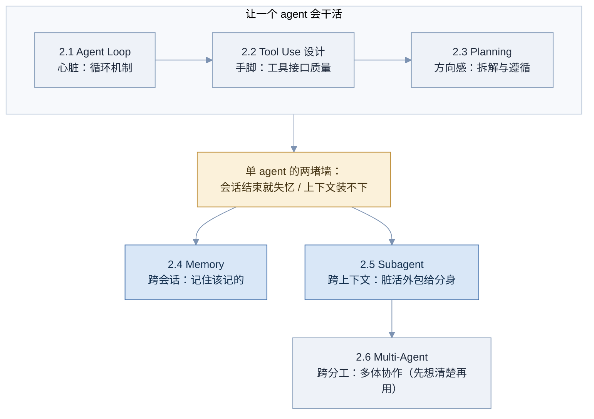
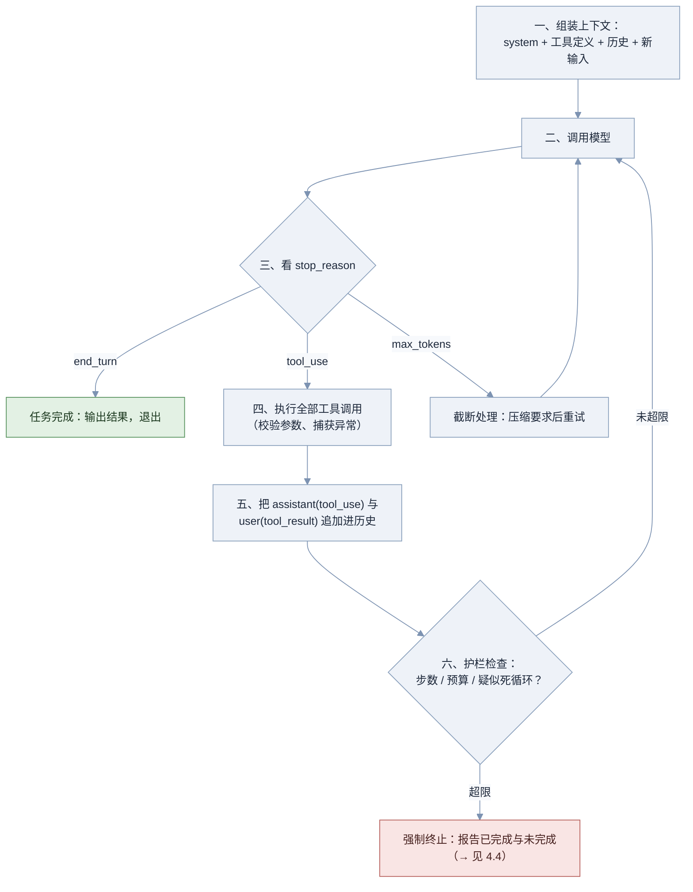
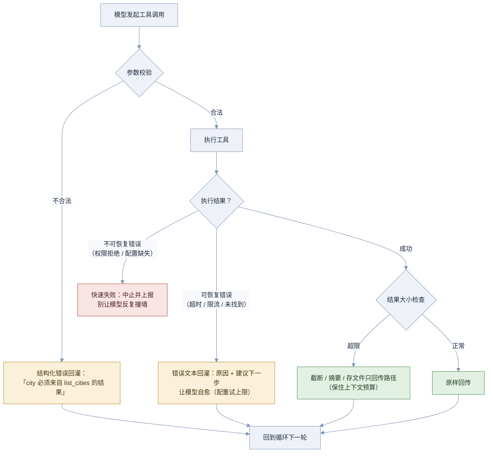
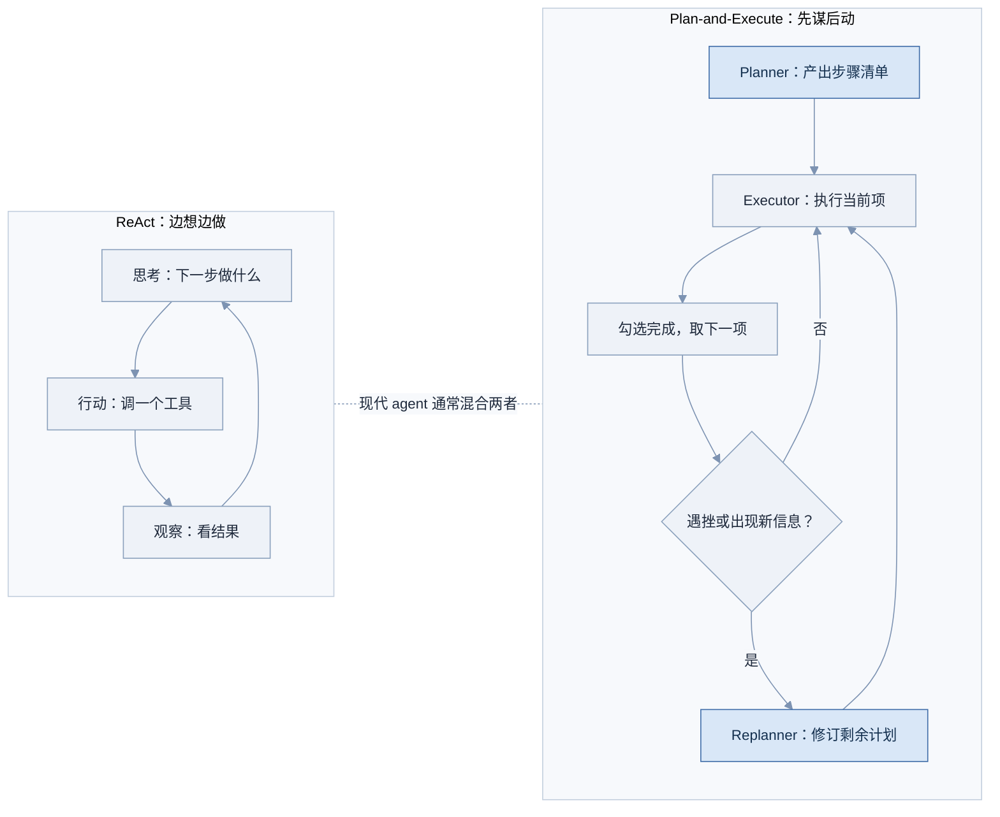
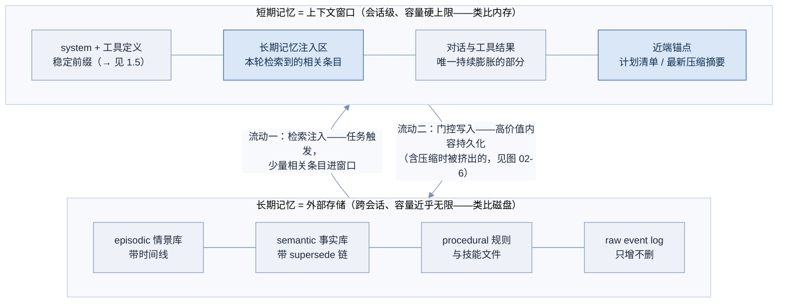
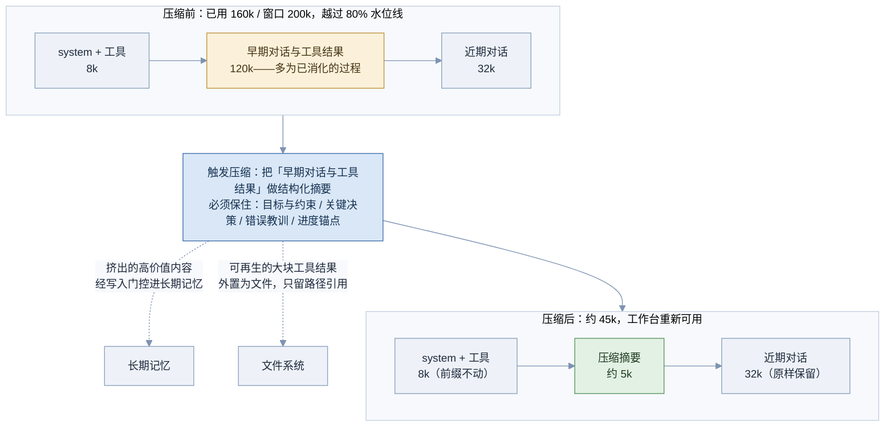
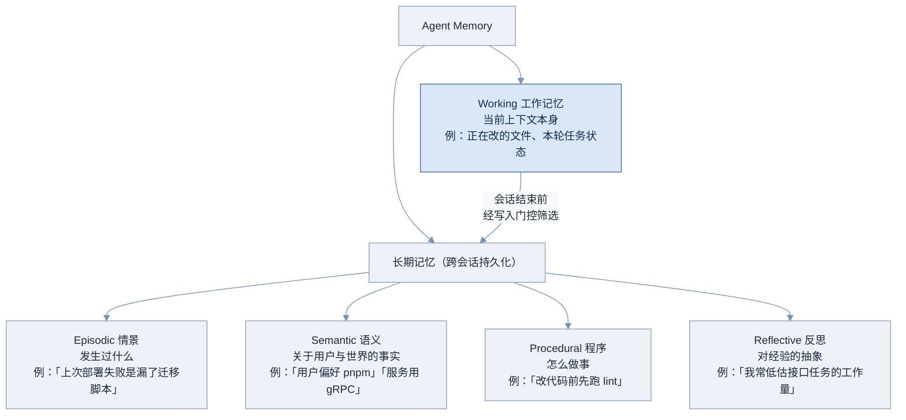
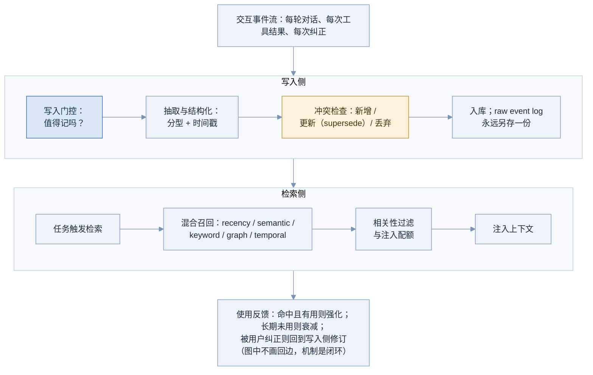
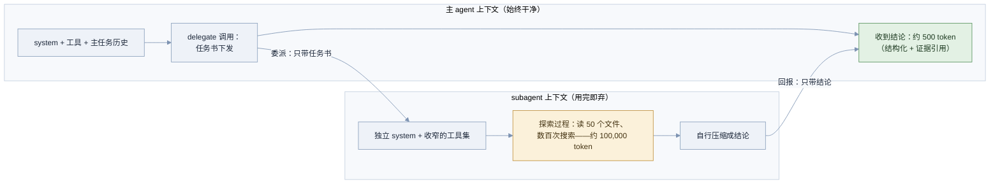
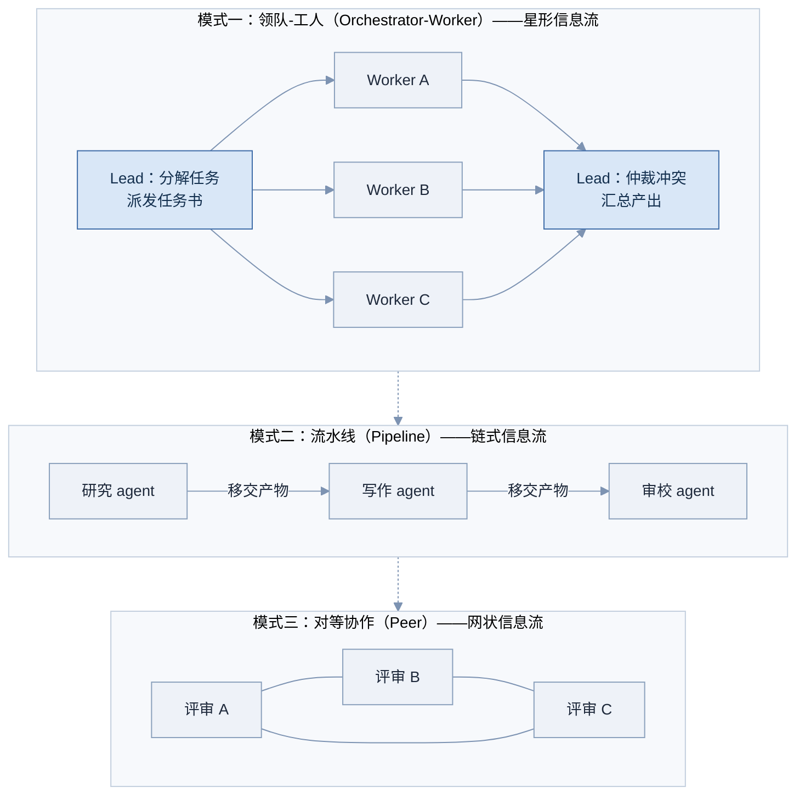

# 02 Agent 核心机制

Part 01 讲完了「一次 API 调用」的物理现实，本部分把它变成「一个会自己干活的系统」。六章分成两组：前三章是**单个 agent 的地基**——循环（心脏）、工具（手脚）、计划（方向感）；后三章回应单个 agent 撞上的两堵墙——**会话结束就失忆**（记忆）、**上下文装不下**（子代理），以及最后的规模手段**多体协作**（慎用）。

**图 02-1 Part 02 知识脉络**



图中的顺序就是学习顺序：2.1 到 2.3 自下而上把一个 agent 立起来；碰到黄色那堵墙之后，2.4 和 2.5 分别从时间和空间两个方向突围；2.6 是最后的手段，它的第一课恰恰是「什么时候不要用它」。

---

## 2.1 Agent Loop 🟢

> 一句话：Agent Loop 是把 LLM 变成 agent 的那个 while 循环——模型决定下一步做什么，循环负责执行并把结果喂回去，如此往复，直到模型宣布任务完成。

### 为什么需要它

1.2 的 tool calling 是一次性的：问天气、查一次、答完收工。真实任务不长这样。「修复这个 bug」需要读文件、跑测试、改代码、再跑测试、也许再改——**下一步做什么，取决于上一步的结果**，流程根本无法预先写死。

没有循环，你只有两个烂选择：一是**人肉当循环**——每次手动把工具结果贴回去再问模型「然后呢」；二是**写死流程图**——用 if-else 把步骤编排好，结果面对第一个预料之外的分支就崩了。

Agent Loop 做的事说穿了只有一个：**把控制流交给模型**。代码不再决定「先做 A 再做 B」，只负责三件事——执行模型点的菜、把结果喂回去、检查该不该停。这也是行业对 agent 的最简定义：**在循环里使用工具的模型**（models using tools in a loop）。

> 注意：本章与 4.4 的分工——这里讲循环**是什么**（机制与最小实现）；循环**怎么设计调优**（终止条件、预算、重试、验证回路）是工程课题，→ 见 4.4 Loop Engineering。

### 核心原理

**图 02-2 Agent Loop 主循环（六步）**



沿着图走一遍。第一步组装上下文——注意 system 和工具定义每轮**原样不动**（前缀稳定，→ 见 1.5）。第二步调用模型。第三步是整个循环的分支枢纽：1.1 埋下的伏笔 `stop_reason` 在这里回收——`end_turn` 走绿色出口，任务完成；`tool_use` 进入第四、五步，执行工具并把两条消息追加回历史（1.2 的协议原封不动地在循环里复用）；`max_tokens` 是最容易被漏掉的分支，输出被截断却当成正常结果处理，是新手 harness 的经典事故。

第六步护栏值得单独说：**模型不保证会停**。它可能反复调用同一个失败的工具、在两个方案之间来回横跳、或者干脆认为任务永远差最后一步。所以任何生产循环都必须有模型意志之外的终止手段——步数上限是最粗的一道，红色出口触发时要报告「做了什么、还差什么」而不是静默失败。精细的终止与预算设计 → 见 4.4。

两个必须建立的观念：

- **ReAct 是这个循环的思想源头。** 2022 年的 ReAct 论文（Reason + Act）让模型显式交替输出「思考 → 行动 → 观察」，当年要靠提示词模板加文本解析来实现；今天的 tool calling API 加 thinking 块（→ 见 1.3）就是 ReAct 的原生化——协议替代了模板。它留下的核心遗产是节奏：**行动之间要有观察和思考的间隔**，而不是盲目连发动作。
- **循环的全部状态就是 messages 数组。** 没有隐藏状态：agent 走到哪一步、知道什么、犯过什么错，全部在这个数组里。「agent 的状态 = 它的上下文」这个事实，意味着持久化 messages 就能恢复中断的 agent，也意味着管理这个数组的学问（塞什么、删什么、压什么）值得一整个工程课题——那就是 Part 04。

### 工程实现

最小可运行的 agent loop，复用 1.2 定义的 `client`、`TOOLS`、`DISPATCH`。这 30 行是所有 agent 产品的心脏，框架在此之上加的是护栏、缓存、观测——不是魔法：

```python
import json

def run_agent(user_task: str, max_steps: int = 20) -> str:
    messages = [{"role": "user", "content": user_task}]

    for step in range(max_steps):                      # 护栏：步数上限
        resp = client.messages.create(
            model="claude-sonnet-5", max_tokens=4096,
            tools=TOOLS, messages=messages,            # 工具列表全程不变（→ 见 1.5）
        )

        if resp.stop_reason == "end_turn":             # 模型宣布做完了
            return "".join(b.text for b in resp.content if b.type == "text")

        if resp.stop_reason == "max_tokens":           # 最容易被漏掉的分支
            messages.append({"role": "assistant", "content": resp.content})
            messages.append({"role": "user",
                             "content": "输出被截断了，请更简洁地继续。"})
            continue

        # stop_reason == "tool_use"：执行模型点的每一道菜
        messages.append({"role": "assistant", "content": resp.content})
        results = []
        for block in resp.content:
            if block.type == "tool_use":
                try:
                    out = json.dumps(DISPATCH[block.name](**block.input),
                                     ensure_ascii=False)
                    results.append({"type": "tool_result",
                                    "tool_use_id": block.id, "content": out})
                except Exception as e:                 # 错误回灌，不中断循环
                    results.append({"type": "tool_result",
                                    "tool_use_id": block.id,
                                    "content": f"工具执行失败: {e}",
                                    "is_error": True})
        messages.append({"role": "user", "content": results})

    return "达到步数上限，任务未完成（预算与终止设计 → 见 4.4）"
```

### 常见坑

- 没有步数上限——模型陷入循环时无限烧钱
- 只处理 end_turn 和 tool_use，漏了 max_tokens 分支——截断输出被当成完整结果
- 忘了把 assistant(tool_use) 放回历史——1.2 讲过的坑，在循环里每步都可能踩
- 每步重建系统提示或按需增删工具——缓存每步击穿（→ 见 1.5）
- 循环状态存在 messages 之外的自定义变量里——状态分裂，中断后无法恢复
- 工具异常直接 raise 中断整个循环——放弃自愈，也丢掉了已有进度
- 从不打印每步的 stop_reason 和 usage——出问题时完全无从排查（→ 见 6.2）

### 面试怎么答

**高频问题**：

- 「白板写一个最小的 agent loop。」
- 「agent 和 chatbot 的本质区别是什么？」
- 「ReAct 是什么？现在还有人用吗？」
- 「agent 的状态存在哪里？中断了怎么恢复？」

**好答案要点**：

- 白板默画图 02-2 的六步，重点标出 stop_reason 三分支和护栏
- 区别一句话：chatbot 每轮听人指挥，agent 在循环里自主决定下一步——控制流在模型手里
- ReAct 讲演进：提示词模板时代 → tool calling + thinking 的原生化，思想还在，实现方式变了
- 「状态 = messages 数组」，持久化它即可恢复——顺势引出上下文工程（→ 4.2）

**减分点**：

- 写不出循环骨架，或骨架里没有终止条件
- 认为框架里有超出「循环 + 工具 + 护栏」的魔法
- ReAct 只会展开缩写，讲不出它与现代 API 的关系
- 没意识到 max_tokens 分支的存在

### 练习题

**1. 动手题。** 把 1.2 的「固定两轮」代码改成循环版，用伪代码写出改动点。

<details>
<summary>参考答案</summary>

改动只有三处：把「请求 1 → 执行 → 请求 2」包进 `while True`；每轮先检查 `stop_reason`，`end_turn` 时 break 并输出文本；加 `max_steps` 护栏防止不终止。核心认知：从「一次往返」到「agent」，只差一个带终止检查的循环。

</details>

**2. 排障题。** 你的 agent 反复调用同一个一直失败的工具，直到撞上步数上限。列出至少三种打断机制。

<details>
<summary>参考答案</summary>

一，连续错误计数：同一工具连续失败 N 次（如 3 次）后，在 tool_result 里明确告知「该工具已连续失败 3 次，请换一种方法或说明无法完成」；二，重复检测：对「工具名 + 参数」做哈希，检测到与近期完全相同的调用时拦截并提示；三，错误预算：整个任务的失败次数总额度，超了强制终止并报告。更完整的退避与熔断设计 → 见 4.4。

</details>

**3. 概念题。** 为什么说「agent 的状态就是它的上下文」？要让一个跑了 15 步的 agent 在进程重启后无缝续跑，最少需要持久化什么？

<details>
<summary>参考答案</summary>

因为循环的每次决策只依赖一个输入：发给模型的 messages。模型本身无状态（→ 见 1.1），所以 agent「知道」的一切都在这个数组里。最少持久化：messages 数组本身，外加尚未回填结果的工具调用（如果崩在执行中，需要记录哪些 tool_use 还没有配对的 tool_result，重启后补执行或标记失败）。这正是 durable execution 的最小形态 → 见 4.4。

</details>

### 延伸阅读

- [Anthropic: Building Effective Agents](https://www.anthropic.com/engineering/building-effective-agents) —— 「循环优先于编排」的经典论述
- [ReAct 论文（Yao et al., 2022）](https://arxiv.org/abs/2210.03629) —— 思考-行动-观察范式的出处
- [12-Factor Agents](https://github.com/humanlayer/12-factor-agents) —— 从工程视角总结的 agent 构建原则，与本章互补

---

## 2.2 Tool Use 设计 🟢

> 一句话：工具是 agent 的手脚，而工具的「说明书」——名字、描述、参数 schema、结果格式——是模型唯一能看到的部分；工具设计的本质是给模型写文档。

### 为什么需要它

1.2 讲了协议——怎么把工具**接上**。但接上不等于用好。真实系统里常见这样的 agent：手握二十个工具却频频犯傻——该搜索的时候去读文件、参数瞎填、一次 read 拖回十万 token 塞爆上下文、看到「Error: 500」就直接放弃任务。

这些多数不是模型太笨，而是**工具设计问题**。模型看不到你的代码，它对工具的全部认知只有那几行名字、描述和 schema；结果回来后，它看到的也只是你决定回传的那段文本。换句话说：**工具的输入输出界面，就是 agent 能力的上限之一。** 同一个模型，把工具说明书从敷衍改到清晰，任务成功率的提升常常超过换一个更贵的模型——这也是 harness 工程师日常投入产出比最高的工作之一。

### 核心原理

一次工具调用从发起至回填，每个环节都有设计决策。先看错误与结果处理的完整分支——这张图是 2.1 循环里「第四步」的放大：

**图 02-3 工具执行的错误处理与结果处理分支**



图中有三类出口：绿色是成功路径——注意成功也要过「大小检查」这一关，结果处理不是透传；黄色是回灌路径——校验失败和可恢复错误都变成**给模型看的、可行动的**错误文本，这是 agent 自愈能力的来源（→ 见 1.2、4.4）；红色是快速失败——权限拒绝这类模型无法自行解决的问题，回灌只会让它反复撞墙浪费预算。区分黄与红，是错误处理设计的第一决策。

围绕这张图，四个设计维度：

**一、描述质量。** 好的工具描述有四要素：**干什么、何时用、何时不用、参数含义与示例**。对比一下：

```text
差：  search(q) —— 搜索。
好：  search_code(query) —— 在当前仓库内做正则代码搜索。
      适用：找符号定义、函数引用。不适用：语义性问题
      （用 ask_codebase）、仓库外内容（用 web_search）。
      query 为正则表达式，如 "def run_agent"。
```

差的版本让模型在三个搜索类工具之间抛硬币；好的版本把边界、相邻工具的分工、参数格式一次说清。记住两点：描述是 prompt 的一部分（也随前缀被缓存，→ 见 1.5）；「何时不用我」的价值常常高于「我能干什么」。

**二、参数 schema。** 原则是**少而强**：参数尽量少；能用 enum 就不用自由字符串；参数名本身就是提示（`query` 优于 `q`）；给默认值降低填写负担；坚决避免 `options: dict` 这种黑洞参数——模型面对它只能瞎编。schema 挡不住一切，执行前必须再过一层程序校验（pydantic 一类），校验失败按图中黄色路径回灌。

**三、结果设计。** 一个常被忽略的事实：**工具结果也是 prompt**——它会进入上下文、被缓存、被模型逐字阅读。所以结果要格式稳定、信息密度高、大小有上限。超限的三级处理：截断（保头尾，标注省略了多少）、摘要（用小模型压缩）、外置（存成文件只回传路径，让模型按需再读——这是 coding agent 的标准做法）。错误消息同理，必须**可行动**：「文件不存在」不如「文件不存在，请先用 list_files 确认路径」。

**四、工具集组织与选择偏差。** 工具不是越多越好：每个工具的定义常驻上下文（→ 见 3.1 的对照方案），而且**工具越多、越相似，模型选错的概率越高**。模型的选择存在系统性偏差——偏向描述更详细的、名字更常见的、训练中见得多的。对策：相似工具合并（一个 `search` 带 `mode` 参数，优于三个 `search_*`）；同域工具加命名空间前缀；读与写分开、破坏性操作独立成工具并加确认门槛（→ 见 6.3）。选错工具的排查顺序永远是：先查描述和工具集设计，最后才怀疑模型。

### 工程实现

带校验、异常分类、大小控制的工具执行包装器——可直接替换 2.1 循环里的裸执行：

```python
from pydantic import BaseModel, ValidationError

MAX_RESULT_CHARS = 8000

class ReadFileArgs(BaseModel):
    path: str
    max_bytes: int = 50_000

def safe_execute(fn, args_model, raw_input: dict) -> tuple[str, bool]:
    """返回 (回传文本, is_error)。所有失败都变成模型可行动的文本，而非异常。"""
    try:
        args = args_model(**raw_input)                       # 一、程序级校验
    except ValidationError as e:
        return f"参数校验失败，请修正后重试：\n{e}", True

    try:
        out = fn(**args.model_dump())                        # 二、真正执行
    except FileNotFoundError as e:
        return f"文件不存在：{e}。请先用 list_files 确认路径。", True   # 可恢复：回灌
    except PermissionError as e:
        raise RuntimeError(f"权限拒绝，需人工处理：{e}")               # 不可恢复：快速失败
    except TimeoutError:
        return "执行超时（10 秒）。可重试一次；再失败请换方法。", True

    if len(out) > MAX_RESULT_CHARS:                          # 三、大小控制
        out = (out[: MAX_RESULT_CHARS // 2]
               + f"\n……[中间截断，原文共 {len(out)} 字符，需要完整内容请分段读取]……\n"
               + out[-1000:])
    return out, False
```

### 常见坑

- 描述写给程序员而不是模型——「调用内部 XX 服务」，模型不知道那是什么、何时该用
- 把现有 REST API 原样包一层就当工具——参数十几个、结果全量 JSON，模型驾驭不了
- 工具结果不设上限——一次 read 拖回十万 token，上下文预算瞬间清空（→ 见 4.3）
- 错误消息只有「Error: 500」——模型无从自愈，只能放弃或瞎猜
- 可恢复与不可恢复错误不区分——要么全中断（丢自愈），要么全回灌（撞墙烧钱）
- 相似工具越堆越多不合并——选择错误率随工具数上升
- 破坏性操作和查询操作混在同一个工具里——权限没法分级（→ 见 6.3）
- 用 enum 能锁死的参数放开成自由字符串——枚举外的值源源不断

### 面试怎么答

**高频问题**：

- 「怎么写一份好的工具描述？」
- 「工具结果太大怎么办？」
- 「模型总是选错工具，你怎么排查？」
- 「工具报错时回灌还是中断？」

**好答案要点**：

- 描述四要素，重点强调「何时不用」和相邻工具分工
- 「结果也是 prompt」的意识，三级处理：截断 / 摘要 / 外置文件
- 选错工具的排查顺序：描述质量 → 工具集组织（数量、相似度、命名）→ 最后才是模型
- 错误二分法：可恢复回灌（配上限）、不可恢复快速失败——并能各举两例

**减分点**：

- 认为工具设计就是「写个函数再写行注释」
- 没有结果大小意识，或不知道外置文件这一招
- 排查选错工具只会说「换个更强的模型」
- 所有错误一律回灌或一律中断，说不出区分标准

### 练习题

**1. 改造题。** 现有工具 `search(q: str, type: str, flag: bool, opts: dict)`，描述为「通用搜索」。列出它的问题并重新设计。

<details>
<summary>参考答案</summary>

问题：描述无信息量；`type` 自由字符串（模型不知道有哪些取值）；`flag` 语义不明；`opts` 是黑洞参数。重设计示例：拆成明确场景或收敛参数——`search(query: str, scope: enum["code", "docs", "web"], max_results: int = 10)`，描述写清三种 scope 各适用什么、不适用什么，query 给格式示例。要点：enum 锁死取值、删掉模型无法正确填写的参数、描述覆盖四要素。

</details>

**2. 设计题。** `read_file` 读到一个 50 万字符的日志文件。给出三种递进的处理策略，并说明各自适用场景。

<details>
<summary>参考答案</summary>

一，截断回传：保头 4000 字符 + 尾 1000 字符，标注省略量——适合模型只需要开头的结构或结尾的报错。二，条件过滤：让工具支持 `grep_pattern` 参数，只回传匹配行加上下文——适合找特定错误。三，外置引用：存为临时文件，回传路径加行数统计，模型用带 offset/limit 的读取工具按需翻页——适合需要多次往返分析的场景。共同原则：把「回传多少」的决定权做进工具接口，而不是事后截。

</details>

**3. 排障题。** agent 有 `read_file`、`write_file`、`edit_file` 三个工具，但它总用 write_file 全量重写文件而不是用 edit_file 小改，经常写丢内容。给出两种修复思路。

<details>
<summary>参考答案</summary>

思路一，修说明书：在两个工具的描述里写清分工——edit_file 描述加「修改已有文件的局部时必须优先使用本工具」，write_file 描述加「仅用于创建新文件或确需整体重写时；改动已有文件请用 edit_file」。思路二，降低 edit_file 的使用门槛：检查它的参数设计是否太难用（比如要求行号会迫使模型放弃），改成「旧文本 → 新文本」的替换式参数。若仍无效，可加程序级护栏：write_file 目标文件已存在时返回提示性错误，引导改用 edit_file。

</details>

### 延伸阅读

- [Anthropic: Writing Effective Tools for Agents](https://www.anthropic.com/engineering/writing-tools-for-agents) —— 官方工具设计方法论，含评测驱动的迭代流程
- [Anthropic Tool Use 最佳实践](https://platform.claude.com/docs/en/agents-and-tools/tool-use/overview) —— 描述写法与 schema 细节
- [Model Context Protocol 服务器实现集](https://github.com/modelcontextprotocol/servers) —— 大量真实工具定义可作范例（协议本身 → 见 3.1）

---

## 2.3 Planning 🟡

> 一句话：Planning 让 agent 在动手前把任务拆成可勾选的步骤清单，并在执行中持续维护这份清单——它解决的是长任务里「走一步看一步会迷路」的问题。

### 为什么需要它

查天气不需要计划。但把任务换成「把整个仓库的配置系统从 YAML 迁到 TOML」——这需要几十步。没有计划的 agent 在长任务里的死法非常固定：干到第 20 步忘了最初目标（全局目标淹没在长上下文的中段，→ 见 4.2 Context Rot）；重复做已经做过的事；漏掉整块子任务；或者在某个细节上钻牛角尖，把预算烧光在支线上。

人类工程师面对大项目也要拆 ticket、列清单——不是因为流程爱好，而是因为工作记忆装不下整个任务。agent 的处境一模一样，甚至更糟：它的「工作记忆」还会随上下文变长而变得不可靠。Planning 的本质就是**把全局目标从模型的「脑内」外置成显式结构**，不再依赖模型在几万 token 的上下文里自己记住自己要干什么。

### 核心原理

业界有两种经典的组织方式，先看结构对比：

**图 02-4 ReAct（边想边做）vs Plan-and-Execute（先谋后动）**



左边 ReAct（→ 见 2.1）：计划只存在于模型「脑中」，每一步现想现做——灵活、对意外反应快，但长任务容易迷路，因为没有任何外置结构提醒它全局目标。右边 Plan-and-Execute：深色的 Planner 先产出显式清单，Executor 逐项执行，遇挫时 Replanner 修订——方向稳、进度可见，代价是计划可能赶不上变化。注意图中间那条虚线：**现代 coding agent 基本都是混合形态**——主体仍是 ReAct 式循环（每步自主决策），但叠加一个显式的计划清单作为「外置方向感」。这个混合形态的代表实现，就是下面的 TodoWrite 机制。

**TodoWrite 机制**（Claude Code 的做法，也是面试最值得讲的实现）：计划本身做成一个**工具**。agent 调用 `TodoWrite` 创建和更新任务清单（每项含内容与状态：pending / in_progress / completed），清单渲染给用户看进度，同时写回上下文。它有效的原因比表面深一层：

- **对抗中段失忆**：每次更新清单，全局目标和当前进度就被重新写到上下文**末端**——模型注意力对近端内容最敏感（→ 见 4.2），这等于持续把「我在干什么」拉回视野中央。Manus 团队把这个手法叫**复述（recitation）**：他们的 agent 反复重写 todo.md，本质相同。
- **强制进度显式化**：「完成一项立即勾选、同一时刻只有一项 in_progress」的约定，让跑偏行为变得可检测——连续多步没有任何勾选动作，就是跑偏信号。
- **给了重规划一个落点**：修订计划=更新清单里未完成的项，已完成的进度天然保留。

**重规划（Replanning）**的触发条件要显式设计，常见四种：某步连续失败 N 次；工具结果推翻了计划的前提假设；用户中途改需求；执行中发现计划外的必要工作。重规划的原则是**修订而非重来**——保留已完成项和有效结论，只重排未完成部分，否则前面的预算全部作废。

最后一对重要概念：**计划质量（plan quality）与遵循度（plan adherence）是两个独立的失败轴**。计划烂（漏步骤、顺序错、粒度失当）和不守计划（清单写了从来不看、执行时自由发挥）是不同的病，要分开评测（→ 见 6.1 轨迹评测）、分开治疗：前者治 Planner 的提示词和示例，后者治循环侧的遵循机制（近端复述、勾选约定、跑偏检测）。

> 关键：计划不是越多越好。简单任务强制走计划流程是纯开销——先产出清单再执行「查个天气」，多花一轮调用毫无收益。生产 harness 都会做任务复杂度门控：单步能完成的任务直接做。

### 工程实现

计划机制的核心是「工具 + 系统提示约定 + 循环侧配合」三件套（属于设计问题而非算法问题，伪代码表达）：

```text
工具定义：
  update_plan(items: [{id, content, status: pending | in_progress | completed}])
  描述里写明：复杂任务开始前先产出计划；每项动词开头、结果可验证；
  开始一项前置 in_progress，完成立即置 completed；同一时刻仅一项 in_progress。

系统提示约定：
  「需要 3 步以上的任务，先用 update_plan 列出计划再动手；
    单步任务直接执行，不要走计划流程。」          ← 复杂度门控

循环侧配合：
  每轮把当前清单渲染进上下文末端（近端锚点，对抗中段失忆）
  若连续 K 步（如 5 步）清单无任何状态变化：
      注入提醒「请对照计划检查当前工作是否在既定项内」   ← 跑偏检测
  若某项失败计数 >= N：
      注入指令「修订计划中未完成的部分，保留已完成项」   ← 重规划触发
  全部 completed 且模型宣布完成：
      进入验证回路复核产出（→ 见 4.4）
```

### 常见坑

- 计划粒度失当——三步小任务列出十项（纯开销），二十步大任务只写一项（等于没有）
- 计划写完就沉底——躺在上下文远端从不复述，模型早忘了它的存在
- 步骤失败后原地无限重试，从不触发重规划
- 重规划推倒重来——已完成的进度和结论全部作废
- 反向的病：过度遵循——新信息明明推翻了计划前提，模型还在硬走旧清单
- 计划项写得不可验证——「优化代码」没法勾选，「让 test_config 全部通过」才可以
- 简单任务也强制走计划流程——延迟与成本白白多一截

### 面试怎么答

**高频问题**：

- 「agent 怎么处理需要几十步的长任务？」
- 「ReAct 和 Plan-and-Execute 怎么选？」
- 「计划执行到一半发现方向错了怎么办？」
- 「TodoWrite 这类机制为什么有效？」

**好答案要点**：

- 两种模式的取舍讲清后，落在「现代实践是混合形态」——ReAct 循环 + 显式清单工具
- TodoWrite 讲到上下文层面：近端复述对抗中段失忆，这是把 planning 和 context engineering 连起来的信号（→ 4.2）
- 重规划答出显式触发条件 + 「修订而非重来」原则
- 主动区分计划质量与遵循度两个失败轴，并说出各自的治疗手段

**减分点**：

- 只会背 ReAct 缩写，讲不出它与计划外置的关系
- 认为计划是一次性生成、不可变更的
- 讲不出 todo 清单和上下文注意力的关系（只答「方便用户看进度」）
- 不知道复杂度门控，暗示所有任务都要先列计划

### 练习题

**1. 设计题。** 任务：「把仓库里所有 print 调用改成 logging」。写出你期望 agent 产出的计划清单（考粒度与可验证性）。

<details>
<summary>参考答案</summary>

参考清单（4–6 项、动词开头、每项可验证）：一，搜索全部 print 调用并按文件汇总清单；二，确认 logging 的初始化方式（找到或创建 logger 配置）；三，逐文件替换并保持原输出语义（f-string、多参数等情况逐一处理）；四，全量搜索确认 0 个 print 残留；五，跑测试套件确认无回归。要点：每项完成与否可以客观判断（「搜索结果为 0」「测试通过」），而不是「改好代码」这种无法勾选的表述；粒度按「一项 = 一段连续工作」而不是每个文件一项。

</details>

**2. 决策题。** 计划第 3 项「跑通集成测试」连续失败两次。写出 agent 接下来应有的决策序列。

<details>
<summary>参考答案</summary>

合理序列：第一次失败 → 读错误信息，换方法重试（这是正常的 ReAct 自愈，还不动计划）；第二次失败 → 触发重规划：判断失败原因是否推翻了计划前提（比如发现测试依赖一个未启动的服务），若是，在计划中插入新的前置项（「启动依赖服务」），原第 3 项后移；若原因不明 → 不再盲试，把「诊断失败原因」本身立为计划项；若达到失败预算上限 → 停止并上报人类，附已完成进度与失败详情（→ 见 4.4 human-in-the-loop）。要点：重试有上限、重规划有依据、放弃有交代。

</details>

**3. 评测题。** 怎么量化「计划遵循度」？设计至少一个可计算的指标。

<details>
<summary>参考答案</summary>

思路是对齐「计划」与「轨迹」（→ 见 6.1）。可计算指标举例：一，偏离步数占比——轨迹中无法归属到任何计划项的工具调用步数 / 总步数；二，顺序一致性——实际完成顺序与计划顺序的逆序对数量（允许合理并行时放宽）；三，勾选及时性——每项从实际完成到状态更新之间隔了几步（从不勾选 = 遵循机制失效）。配套要求：执行时让 agent 为每步标注所属计划项，否则归属只能靠 LLM 判定，成本高且不稳。

</details>

### 延伸阅读

- [Anthropic: Building Effective Agents](https://www.anthropic.com/engineering/building-effective-agents) —— 后半部分的 workflow 模式（含 planner-executor）与「何时不要上编排」
- [Manus: Context Engineering for AI Agents](https://manus.im/blog/Context-Engineering-for-AI-Agents-Lessons-from-Building-Manus) —— 复述（recitation）手法的一手经验
- [Plan-and-Solve Prompting 论文（Wang et al., 2023）](https://arxiv.org/abs/2305.04091) —— 先谋后动范式的学术源头之一

---

## 2.4 Memory 🟡

> 一句话：Agent Memory 让 agent 在会话结束后仍记得该记的事——它不是一个数据库，而是一整套「什么值得记、怎么存、何时取、过期怎么办」的管理系统。

### 为什么需要它

上下文是会话级的：窗口再大，会话结束即清零。没有记忆的 agent 每天都在气用户：「我说过三次我们用 pnpm 了」「上周你自己踩过这个坑，今天又踩」「这个项目的部署流程我都给你讲了五遍」。跨会话失忆还意味着 agent 永远无法**从经验中变好**——每次都是出厂状态。

朴素解法是把全部历史对话塞进每次请求，三秒内破产：窗口装不下、成本平方增长（→ 见 1.1）、而且塞得越满模型越糊涂（→ 见 4.2 Context Rot）。所以记忆的本质从一开始就不是「存储」——存储便宜得很——而是**选择**：从海量交互里选出千分之一值得留的，在未来某个恰当时刻取出来，并且在它过期时敢于扔掉。

### 核心原理

先划清边界。三个经常被混为一谈的东西，面试第一问往往就是它们的区别：

| 机制 | 记的是什么 | 关键特征 |
|---|---|---|
| Long Context 长上下文 | 当前会话的全部原文 | 会话内全量在场，会话结束清零 |
| RAG 检索增强 | 外部知识库（文档、语料） | 知识是静态的，不随你们的交互增长 |
| Agent Memory | 与你交互的**经验** | 随使用增长，目的是改变未来行为 |

一句话锚点：**RAG 记世界，memory 记你们的历史。**「公司的技术文档」进 RAG，「这个用户上次纠正过我」进 memory，当前正在改的文件在长上下文里。三者互补，不互相替代。

**短期记忆：会话内唯一的工作台。** 短期记忆（工作记忆）就是上下文窗口本身——先建立这个等号，再拆开看里面装了什么、按什么规则流动：

**图 02-5 短期记忆与长期记忆的总架构**



先看两条横排。上排短期记忆分四段：稳定前缀（system 与工具，全程一字不动）、**长期记忆注入区**（每轮检索来的相关条目，深色标出）、对话与工具结果（唯一持续膨胀的部分）、**近端锚点**（计划清单与最新摘要，同为深色）——之所以放在最末端，是因为模型注意力对近端内容最敏感（→ 见 4.2）。下排长期记忆按分型组织（下文展开），外加一份只增不删的 raw event log。短期记忆的三条性质决定了全部设计：**容量有硬上限**（窗口就这么大）、**位置影响权重**（信息埋在中段容易被忽略，→ 见 4.2 Context Rot）、**会话结束即蒸发**（不写入长期就永久丢失）。

再看两条竖直流动。流动一**检索注入**：任务开始或进行中，从长期记忆选出少量相关条目放进注入区——注意是「少量、相关」，配额与打分在生命周期一节展开。流动二**门控写入**：交互中的高价值内容经筛选持久化。这个双层结构正是 MemGPT 的核心洞察：**上下文当内存、外部存储当磁盘，agent 像操作系统一样做换页**——检索是换入，写入与压缩是换出。

**上下文压缩（Context Compaction）：短期记忆的溢出管理。** 图 02-5 里「对话与工具结果」那格只进不出（append-only，→ 见 1.5），几十步的任务必然把窗口顶满。顶满的下场是硬截断——中段历史被砍、agent 当场断片。压缩机制就是在这之前主动介入：

**图 02-6 一次压缩的前后对比**



沿图走一遍：占用越过**水位线**（图中示例为 80%）时触发；把黄色的「早期对话与工具结果」——其中大部分是已消化的过程——交给模型做**结构化摘要**，得到绿色的压缩摘要，近期对话原样保留，稳定前缀一字不动。摘要**必须保住四样**：目标与约束、关键决策、错误教训、进度锚点——尤其是错误教训，摘掉它，下半场会把上半场犯过的错全部重犯一遍。右侧两条虚线是压缩的旁路：被挤出的高价值内容正好走一遍**门控写入**转入长期记忆（压缩时刻是长期记忆最重要的上游供给时机之一）；可再生的大块工具结果外置成文件、只留路径，需要时再读回。压缩产物写回图 02-5 的近端锚点区——它本质上是一份「会话级情景记忆」。Claude Code 的 auto-compact 就是这套机制的产品化。

> 注意：本节讲的是压缩在记忆体系中的**机制位置**。它与缓存的张力（改写历史必然击穿部分前缀）、五层压缩策略的完整阶梯、水位线取值与缓存友好实现，是专门的工程课题 → 见 4.3 上下文压缩。

**长期记忆的四种分型。** 长期记忆内部不是一锅炖。**分型记忆（typed memory）**借了认知科学的框架，工程上真实存在于主流系统中：

**图 02-7 Memory 类型层次（长期记忆的内部分型）**



看图中那条从 Working 到长期记忆的边——**分型的价值就在这条边上**：不同类型的记忆有不同的写入标准、存储形态和检索方式。逐型看细节：

| 类型 | 记什么（例） | 写入与检索特点 |
|---|---|---|
| Episodic 情景 | 发生过的具体事件：「上次部署失败是漏了迁移脚本」 | 写入近乎自动（事件流加时间戳，成本低）；检索靠 temporal + keyword；是提炼其他类型的原料 |
| Semantic 语义 | 关于用户与世界的稳定事实：「用户偏好 pnpm」「服务用 gRPC」 | 写入必须过门控与冲突检查（supersede）；检索靠 semantic + keyword 混合；最大风险是过期 |
| Procedural 程序 | 怎么做事的规则：「提 PR 前先跑 lint 再跑单测」 | 从重复模式或用户纠正中提炼；通常不走检索——直接注入 system 或落成技能文件（→ 见 3.2） |
| Reflective 反思 | 对多次经验的归纳：「我常低估接口任务的工作量」 | 由离线批任务回顾多条情景记忆生成；低频、在任务开始时注入 |

一个立刻能用的推论：**分型决定存储与索引**——情景库天然是带时间线的日志，语义库是带版本链的条目集，程序记忆最好的归宿常常不是数据库而是提示词或技能文件。不分型的记忆系统只能用一套向量检索硬扛所有场景，写入和检索都没有抓手。

流动一与流动二的内部细节，由这条完整生命周期串起来：

**图 02-8 Memory 写入与检索生命周期**



沿图讲四个关键决策，每个都是面试深挖点：

**一、写入门控（深色格）比选存储重要。** 交互里绝大多数 token 不值得记：一次性查询、闲聊、随时能从代码里查到的东西。没有门控的记忆系统会变成垃圾场——检索时命中垃圾，垃圾进上下文，agent 行为被自己的「记忆」污染。高价值的写入信号很具体：用户显式声明（「记住」「我们的规范是」）、重复出现的模式、**用户的纠正行为**（改了你的输出 = 最高价值信号）、明确的决策与约束。门控要便宜（小模型或规则），因为它跑在每轮交互上。

**二、raw event log 永远保留（图中 g4）。** 抽取是有损且会出错的。原始事件流是唯一的 ground truth：抽取错了可以从 raw log 重算，索引方案换了可以重建，出争议可以审计。**抽取层可再生，原始层不可再生**——删错顺序的系统没有后悔药。

**三、检索必须混合（图中 s2）。** 只靠向量相似度是新手系统的标配错误：「上周说的那个库叫什么」考 temporal + keyword，向量帮不上；「和这个 bug 相关的历史」考 semantic；「用户最新的偏好」考 recency；「这个服务依赖谁」考 graph。一个够用的混合打分骨架：

$$
\text{score}(m) = w_s \cdot \text{sim}(q, m) + w_r \cdot e^{-\lambda \Delta t} + w_k \cdot \text{bm25}(q, m)
$$

三项依次是语义相似度、时间衰减（Δt 为距今时长，λ 控制衰减速度）、关键词精确匹配得分，权重按记忆类型调（情景记忆加重时间项，语义事实加重相似项）。检索完还有**注入配额**：再相关也只注入前 K 条、总量封顶——记忆挤占上下文同样是污染（→ 见 4.2）。

**四、冲突与时效（黄色格）。** 「用户用 MySQL」（去年）和「已迁移到 PostgreSQL」（上月）并存时，检索大概率同时命中。**最危险的不是忘记，而是自信地记住过期信息**——错误记忆比没有记忆更糟，因为它带着确定性的口吻进入上下文。对策成体系：一切条目带时间戳；新事实入库时显式 **supersede** 旧事实（旧条目标记「已被取代」而不是并存）；检索打分带时间衰减；无法自动判定的矛盾，把两条连同时间戳都给模型，让它带着「信息可能过期」的意识去用。

**主流系统与三条工程路线**（数据截至 2026 年 8 月，面试前建议复核；深入选型 → 见 5.5）：

| 路线 | 代表系统 | 一句话定位与取舍 |
|---|---|---|
| memory-as-runtime：记忆管理内建为 agent 运行时的核心能力 | Letta（MemGPT 学术血统） | agent 自己编辑自己的记忆（受操作系统内存分层启发）；能力最完整，但要整体采用它的框架，难以外挂到现有系统 |
| memory-as-layer：独立记忆服务，外挂到任意 agent | Mem0；Zep（底层为开源时序知识图谱 Graphiti）；Cognee | Mem0 上手最快但对「事实随时间变化」处理弱；Zep 以时间维度见长（事实带生效/失效区间），托管为主；Cognee 自建知识图谱管道，数据自持但运维自担 |
| memory-as-framework-primitive：框架或 harness 的内置原语 | LangMem（LangGraph 生态）；Claude Code 的 CLAUDE.md 与 memory tool | 与框架深度集成、上手成本最低；出了那个生态优势即消失 |

值得单独一说的是最朴素的方案：**文件级记忆**——一个 agent 可读写的 markdown 文件（CLAUDE.md 模式）。可审计、可版本控制、用户可直接编辑、天然支持「模型自己维护」。中小规模下它经常胜过引入一整套记忆服务，是被低估的起点；上量之后（条目上万、需要复杂检索）再演进到专门系统。

### 工程实现

写入门控与冲突处理的可运行骨架（方案里要求给真代码的核心机制之一）：

```python
import json, time

GATE_PROMPT = """判断下面的对话片段是否包含值得长期记住的信息。
值得记：用户身份/偏好/约束、明确决策、用户纠正、长期项目事实、可复用的教训。
不值得记：一次性查询、闲聊、随时可从代码或文档查到的内容、很快过期的临时状态。
输出 JSON：{"worth": bool,
            "memories": [{"type": "semantic|episodic|procedural",
                          "content": "一句话事实",
                          "replaces": "若更新了某个旧事实，描述该旧事实，否则 null"}]}"""

def memory_gate(fragment: str) -> list[dict]:
    raw_ref = raw_log_append(fragment)             # 原则二：raw log 先落盘，永远保留
    resp = small_model_json(GATE_PROMPT, fragment) # 门控用小模型：它跑在每一轮上，必须便宜
    if not resp["worth"]:
        return []

    stored = []
    for m in resp["memories"]:
        m["ts"] = time.time()
        m["source"] = raw_ref                      # 每条记忆可回溯到原始事件
        if m.get("replaces"):                      # 原则四：更新而非并存
            for old in search_similar(m["replaces"], top_k=3):
                if is_same_fact(old, m):
                    mark_superseded(old, by=m)     # 旧条目标记取代，不物理删除
        store(m)                                   # 分型入库，类型决定索引方式
        stored.append(m)
    return stored
```

检索侧按上面的混合打分公式实现即可；关键的工程参数不是权重的精确值，而是**注入配额**（top-K 与 token 上限）和**衰减速度 λ**——都应该由评测调出来（→ 见 6.1），不是拍脑袋。

### 常见坑

- 无门控全量写入——记忆库三天变垃圾场，检索质量崩塌
- 窗口顶满才硬截断，而不是水位线触发压缩——中段历史被砍，agent 当场断片
- 压缩只顾省 token——目标、约束、错误教训被摘掉，下半场重犯上半场的错（→ 见 4.3）
- 只存抽取结果不留 raw log——抽错一次，错误永久固化且无法修复
- 只有向量检索——「上周说的那个库名」这类 keyword / temporal 查询全部落空
- 新旧事实并存不做 supersede——过期信息以同等权重被检索，还常常更「资深」
- 检索结果无条件注入——不相关的记忆既占预算又误导模型（→ 见 4.2）
- 把项目文档、API 手册塞进 memory——那是 RAG 的领地，边界一混两边都做不好
- 没有衰减与遗忘——三个月前的临时决定永远阴魂不散
- 设计从「选哪个向量库」开始——门控、生命周期、冲突策略全没想，本末倒置

### 面试怎么答

**高频问题**：

- 「Agent Memory 和 RAG 是一回事吗？」
- 「让你从零设计一个跨会话记忆系统，从哪里开始？」
- 「上下文快满了怎么办？压缩和长期记忆是什么关系？」
- 「记忆冲突和过期怎么处理？」
- 「一定要用向量数据库吗？」

**好答案要点**：

- 边界表脱口而出：「RAG 记世界，memory 记你们的历史」，再补 working context 的位置
- 设计题从写入门控和生命周期讲起，明确说「选存储是最后一个决策」——这一句就把你和背向量库参数的候选人分开
- 压缩题答三件套：水位线触发、摘要必保四样（目标约束 / 决策 / 教训 / 进度）、挤出的高价值内容经门控转入长期记忆；再主动点出与缓存的张力（→ 4.3）
- 冲突答全套：时间戳、supersede、检索时间衰减、暴露矛盾给模型
- 向量库问题答「不一定」：文件级方案的适用区间 + 混合检索里向量只是一路信号

**减分点**：

- 把 memory 讲成「向量库 + 相似度检索」（最常见的浅答案）
- 不知道 raw event log 的价值
- 讲不出任何冲突 / 时效处理机制
- RAG 与 memory 边界含糊，或认为长上下文会淘汰记忆系统

### 练习题

**1. 分型题。** 给下面五条信息各标注记忆类型：a）「我们公司统一用 Java 8」；b）「上次部署失败是因为漏跑了数据库迁移」；c）「提 PR 前先跑 lint 再跑单测」；d）当前编辑器里打开的这个文件；e）「回顾最近十次任务，我在预估接口改动范围时经常偏小」。

<details>
<summary>参考答案</summary>

a）semantic（关于用户世界的事实）；b）episodic（发生过的具体事件——若进一步提炼成「部署前必须检查迁移脚本」则转化为 procedural）；c）procedural（做事流程）；d）working（当前上下文，不该进长期记忆）；e）reflective（对多次经验的抽象归纳）。加分点：指出 b 到 c 的提炼正是反思任务的价值——情景记忆是原料，程序与反思记忆是产品。

</details>

**2. 事故分析题。** 用户去年说项目用 MySQL，上月项目迁到了 PostgreSQL（迁移讨论也经过这个 agent），今天 agent 生成了 MySQL 方言的 SQL。沿生命周期找出所有可能的失败点。

<details>
<summary>参考答案</summary>

写入侧：迁移讨论没过门控（被判为「不值得记」）；或写入了但没触发冲突检查，新旧两条并存。检索侧：无时间衰减，旧条目因语义更贴 SQL 关键词而胜出；或两条都命中但注入时没带时间戳，模型无从分辨。使用侧：模型看到矛盾信息选择了更早、被引用更多次的那条。修复按同样顺序：迁移类决策进高价值写入信号清单；同实体事实强制 supersede；注入必带时间戳；矛盾时提示模型「以较新者为准并向用户确认」。

</details>

**3. 设计观题。** 为什么说「先选向量库」是本末倒置？写出你在选任何存储之前必须先回答的三个设计问题。

<details>
<summary>参考答案</summary>

因为存储只决定「怎么放」，而记忆系统的成败取决于「放什么、何时取、过期怎么办」——这三件事和用哪个库几乎无关，文件加 grep 都能承载一个设计良好的记忆系统（→ 见 5.6 的去向量化讨论）。三个先行问题：一，写入门控标准是什么——哪些信号触发写入，谁来判（规则还是小模型），成本预算多少；二，检索混合哪几路信号、注入配额多大；三，冲突与时效策略——supersede 规则、衰减函数、矛盾暴露方式。这三问答完，存储选型往往自然浮现。

</details>

### 延伸阅读

- [MemGPT 论文（Packer et al., 2023）](https://arxiv.org/abs/2310.08560) —— 把操作系统内存分层思想引入 agent 记忆的开山之作
- [Zep: A Temporal Knowledge Graph Architecture for Agent Memory（2025）](https://arxiv.org/abs/2501.13956) —— 时间维度记忆的系统化处理
- [Anthropic: Managing Context on the Claude Developer Platform](https://www.anthropic.com/news/context-management) —— 官方 memory tool 与上下文管理的设计思路

---

## 2.5 Subagent 🟡

> 一句话：Subagent 是主 agent 派出去干活的一次性分身——带着独立的干净上下文完成一个子任务，只把结论带回来，过程中的垃圾全部留在自己那里销毁。

### 为什么需要它

单 agent 有一个结构性死穴：**上下文是它唯一的工作台**，而这张台子既要放蓝图（任务与计划），又要堆满施工垃圾（搜索结果、读过的文件、试错记录）。跑一个「在这个大仓库里找出所有还在用废弃 API 的地方」：探索过程要读几十个文件、几百次搜索，产生十万 token 的中间内容——但主任务真正需要的只是最后那张两百行的清单。

没有隔离手段时，这十万 token 的垃圾会永久占据主上下文：挤掉后续任务的预算、稀释模型注意力（→ 见 4.2 Context Rot）、还让每一轮的重发和缓存都背着它。你无法「用完就删」——删中段消息会击穿缓存（→ 见 1.5），而且历史是模型推理的依据，乱删会造成断片。

Subagent 就是为此而生的**上下文隔离**（isolation，→ 见 4.2 的第四象限）手段：把脏活委派给一个全新上下文的分身，它在自己的窗口里折腾十万 token，最后只把五百 token 的结论交回来。主上下文始终干净。副产品同样重要：多个分身可以**并行**探索不同方向，这是研究型任务提速的主要来源。

### 核心原理

**图 02-9 Subagent 上下文隔离**



看图中两条跨界箭头——**信息只在这两个瞬间流动**：下行只带任务书，上行只带结论。黄色的十万 token 探索过程从头到尾没有接触过主上下文，分身销毁时一起蒸发。这就是隔离的全部经济学：主 agent 付出的是一次委派调用加五百 token 结论，省下的是十万 token 的永久占用，以及这十万 token 对注意力和缓存的持续伤害。

四个设计要点：

**一、委派协议（delegation protocol）。** 图中「任务书」那条边是成败所在。必须刻进脑子的事实：**分身是冷启动的——它对主对话一无所知**，不知道用户是谁、之前聊了什么、任务背景是什么。它的全部世界就是你写的任务书。一份合格任务书五要素：

```text
目标：    要产出什么，怎样算完成（可验证的定义）
边界：    做什么、明确不做什么（防止范围蔓延）
上下文包： 它需要知道的背景——主 agent 替它从主对话里挑出来
产出格式： 结构化模板（便于主 agent 机器式汇总）
预算：    步数 / token / 时间上限
```

委派质量差，回来的就是驴唇不对马嘴的结论——垃圾进垃圾出。心智模型：**给外包团队写需求文档**，对方看不到你的聊天记录。

**二、结果汇总。** 结论要求结构化并**附证据引用**（文件路径:行号、消息出处），让主 agent 能抽查复核而不必重做全部工作。多个并行分身的结论可能互相矛盾——汇总环节要有仲裁：对比证据、抽查存疑项、必要时追加一个复核任务。

**三、权限收窄（permission narrowing）。** 分身的权限永远是主 agent 的**子集**：探索型任务只给只读工具，绝不给写文件、执行命令的能力。这是最小权限原则在 agent 内部的体现（→ 见 6.3），也是实践中防事故的关键一道闸——分身在十万 token 的长探索里「脑子发热」的概率不低。

**四、什么时候不用。** 隔离不是免费的：每个分身要重付一遍 system + 工具定义的 prefill（启动税），委派与汇总本身也消耗轮次。三种不该用的场景：子任务太小（一两次工具调用能完成的，启动税比省下的还多）；需要频繁双向沟通的任务（委派协议是单程票，来回问等于灾难）；强顺序依赖的工作（并行分身会互相踩）。

最后划一条边界，防止和下一章混淆：**subagent 是同一个大脑派出的临时分身**——层级关系、单向委派、用完即弃；**multi-agent 是多个持续存在的对等实体协作**——那是组织问题，复杂一个量级（→ 见 2.6）。

### 工程实现

Subagent 的实现朴素得惊人：**它就是把 2.1 的循环再跑一遍**——独立 messages、收窄的工具、独立预算，包装成主 agent 的一个工具：

```python
def spawn_subagent(task_brief: str, allowed_tools: list[str],
                   max_steps: int = 15) -> str:
    """分身 = 一次全新的 run_agent：独立上下文、收窄权限、独立预算。"""
    sub_tools = [t for t in TOOLS if t["name"] in allowed_tools]   # 权限收窄
    sub_system = ("你是子任务执行者。只完成任务书内的工作。"
                  "最后输出不超过 500 字的结论，按任务书给定的格式，"
                  "关键论断必须附证据（文件路径:行号）。不要输出探索过程。")
    return run_agent_loop(system=sub_system, tools=sub_tools,
                          user_task=task_brief, max_steps=max_steps)
    # 注意：主 agent 的 messages 从头到尾未被触碰；返回值只有结论字符串

DELEGATE_TOOL = {
    "name": "delegate",
    "description": (
        "把一个可独立完成的探索/检索类子任务委派给子代理，在隔离上下文中执行。"
        "适用：需要大量读取和搜索、但主任务只需要结论的工作。"
        "不适用：一两步就能完成的小事；需要来回沟通的任务；写操作。"
        "task_brief 必须包含：目标、边界、必要背景、产出格式、预算——"
        "子代理看不到本对话的任何内容。"),
    "input_schema": {
        "type": "object",
        "properties": {
            "task_brief": {"type": "string"},
            "allowed_tools": {"type": "array", "items": {"type": "string"},
                              "description": "只读工具子集，如 read_file, search_code"},
        },
        "required": ["task_brief", "allowed_tools"],
    },
}
```

注意 `delegate` 的 description 把 2.2 的功课全做了：何时用、何时不用、任务书要素——**教模型写好任务书，本身就是工具描述的职责**。

### 常见坑

- 任务书只丢一句话，不给上下文包——分身瞎猜背景，结论驴唇不对马嘴
- 假设分身知道主对话内容——它什么都不知道，这是最高频的认知错误
- 产出不定格式——回来五段自由散文，主 agent 还要花一轮去理解和抽取
- 权限不收窄——探索型分身顺手「修复」了它以为有问题的文件
- 强依赖的顺序任务硬拆给并行分身——互相踩，汇总时全是冲突
- 一两步的小事也开分身——prefill 启动税比省下的还多
- 不设递归深度上限——分身又开分身，预算指数失控
- 汇总时全盘采信结论不抽查——一个分身的幻觉污染主任务

### 面试怎么答

**高频问题**：

- 「什么时候该用 subagent？收益到底是什么？」
- 「委派 prompt 里必须写什么？」
- 「subagent 和 multi-agent 有什么区别？」
- 「分身的权限怎么管？」

**好答案要点**：

- 用 token 账讲隔离经济学：十万 token 过程换五百 token 结论，省的是空间、注意力、缓存三样
- 任务书五要素背下来，配一句「分身冷启动、对主对话一无所知」
- 主动提权限收窄和递归深度上限——安全意识是加分信号
- 边界句：分身是同一大脑的临时投影，multi-agent 是多个持续实体的组织问题

**减分点**：

- 把 subagent 唯一价值说成「并行加速」（漏了隔离这个主价值）
- 认为分身共享主上下文（致命误解，直接暴露没用过）
- 委派协议说不出要素
- 不知道启动税，暗示「什么任务都值得开分身」

### 练习题

**1. 写任务书。** 主任务是「审计这个仓库的 SQL 注入风险」，你决定委派给一个只读分身。写出完整任务书（五要素齐全）。

<details>
<summary>参考答案</summary>

示例：目标——找出所有存在 SQL 注入风险的代码位置，产出风险清单，每项含文件路径:行号、风险等级（高/中/低）、一句话原因；无风险也需明确说「未发现」。边界——只审计应用代码（src/ 目录），不看测试与第三方依赖；只报告，不修改任何文件。上下文包——项目用 Python + SQLAlchemy，历史上出过一次拼接 SQL 的事故（在报表模块），重点关注 raw SQL 的使用。产出格式——markdown 表格：路径 | 行号 | 等级 | 原因。预算——最多 15 步，超时则输出已完成部分并注明未覆盖的目录。

</details>

**2. 仲裁题。** 三个并行分身审计同一系统的不同模块，A 的结论说「服务间通信用 gRPC」，B 说「用 REST」。主 agent 该怎么办？

<details>
<summary>参考答案</summary>

先看证据引用：A 和 B 各自的结论指向哪些文件——很可能两者都对（不同模块用了不同协议），矛盾只是任务书的「范围」没写清导致的过度概括。若证据不足以判断：抽查——主 agent 自己读两个关键文件复核；或追加一个小的仲裁任务书（「确认 X 与 Y 模块间实际使用的协议，证据到配置或调用代码」）。原则：矛盾不是灾难，无证据的结论才是——这也反过来解释了为什么任务书必须强制要求证据引用。

</details>

**3. 算账题。** system + 工具定义共 8k token；某子任务的探索过程约 60k token，结论 1k。对比「主 agent 自己做」和「委派分身」两种做法下主上下文的增长量，并给出委派不划算的临界条件。

<details>
<summary>参考答案</summary>

自己做：主上下文增长约 61k（过程 + 结论），且这 61k 会在后续每一轮被重发（缓存命中时按 0.1 倍计费，但仍占窗口与注意力）。委派：主上下文只增长约 1k 出头（delegate 调用 + 结论）；代价是分身侧新付 8k prefill 启动税加 60k 过程的一次性成本——但这些发生在隔离上下文里，用完即弃，不产生持续占用。临界条件：当「子任务过程量」接近或低于「启动税 + 委派与汇总开销」（这里约 8k 加零头）时，委派不划算；过程量远大于启动税、且主任务后续还有很多轮（占用的持续成本高）时，委派收益最大。

</details>

### 延伸阅读

- [Anthropic: How We Built Our Multi-Agent Research System](https://www.anthropic.com/engineering/built-multi-agent-research-system) —— orchestrator-worker 实践的一手经验，任务书要素的真实教训
- [Claude Agent SDK: Subagents](https://platform.claude.com/docs/en/agent-sdk/subagents) —— 生产级 subagent 的配置形态
- [Anthropic: Building Effective Agents](https://www.anthropic.com/engineering/building-effective-agents) —— 其中 orchestrator-workers 模式一节

---

## 2.6 Multi-Agent 🔴

> 一句话：Multi-agent 是让多个各有分工的 agent 协作完成一个任务——它解决单 agent 装不下的规模问题，同时引入分布式系统的全部麻烦；所以第一原则是：能单体就别多体。

### 为什么需要它

先诚实地说：**大多数号称需要 multi-agent 的场景，其实只需要一个设计得好的循环加几个 subagent。** 这一章从「为什么需要」和「为什么常常不需要」两面讲起，因为面试官问 multi-agent，一半是在考架构知识，另一半是在考你有没有克制的判断力。

真正站得住的动机只有三类：**规模**——任务所需的信息量超过单个上下文窗口，再怎么压缩隔离都装不下（如同时深挖两百家公司的调研）；**并行广度**——大量互相独立的探索可以同时展开（read-heavy 任务的加速主力）；**硬性隔离**——安全或职责边界要求不同实体分开（写代码的 agent 和审批上线的 agent 必须权限隔离）。

而失败的根源也很固定：agent 之间**没有共享内存**——每个 agent 只看到自己的上下文，信息天然不对称；一个 agent 的错误会被下游放大成**级联失败**；成本随 agent 数量倍增——Anthropic 披露其多 agent 研究系统的 token 消耗约为普通对话的 **15 倍**（数据截至 2026 年 8 月，面试前建议复核）。Cognition 团队甚至专门写过《Don't Build Multi-Agents》：长链条协作里上下文不共享导致决策冲突，现阶段可靠性撑不起复杂协作。这两家的立场并不矛盾，后面会调和。

### 核心原理

**图 02-10 Multi-Agent 三种编排模式**



三种模式的本质差异是**信息流的形状**，形状决定了各自的强项与病灶：

**模式一：领队-工人（星形）。** 深色的 lead 是唯一的决策中心：分解任务、给每个 worker 写任务书、仲裁矛盾、汇总产出——worker 之间不直接通信，一切经过 lead。这是**生产验证最充分**的模式（Anthropic 研究系统即此形态），因为它把 multi-agent 退化成了「2.5 的 subagent + 一个组织者」：委派协议、结果汇总、权限收窄全部直接复用。经验教训也来自实战：任务书必须明确规定每个 worker 的产出规格和预算，否则 worker 会过度工作、互相重叠——lead 写任务书的质量就是系统的质量。病灶：lead 是单点，它的分解错误全局买单。

**模式二：流水线（链式）。** 每个 agent 负责一段，接力棒是**移交产物**（研究报告 → 草稿 → 终稿）。信息流最简单、职责最清晰，适合天然分阶段的任务。病灶：上游错误无声地流向下游，越晚发现改动成本越高——所以每个交接点都该有验收检查（→ 见 4.4 验证回路）。

**模式三：对等协作（网状）。** 多个 agent 围绕共享工件互评、辩论、投票。理论上能提升质量（多视角互查），实践中**收敛困难**——谁也说服不了谁、轮次烧穿预算是常态。定位要摆正：它是**提质**手段（评审、红队）而不是提速手段，且必须配硬性的轮次上限和收敛判据。

两个贯穿所有模式的底层事实：

- **通信 = 上下文写入。** agent 之间没有心灵感应，所谓「A 告诉 B」，物理上就是把一段文本写进 B 的上下文（直接消息，或写进共享黑板/文件让 B 读）。这意味着 2.2 的功课全部适用：消息要结构化、有格式、控制大小。工程上最省心的共享状态往往是**文件系统**——多个 coding agent 各开 git 分支干活，冲突交给几十年成熟的合并工具去解决，而不是自研「agent 通信协议」。
- **调和 Anthropic 与 Cognition 的分歧，是这一章的高光答案。** Cognition 反对的是 **write-heavy 强耦合**任务的多体化（多个 agent 同时改一份代码，上下文不共享必然打架）；Anthropic 的成功案例是 **read-heavy 可并行**任务（研究检索，worker 之间零耦合）。结论不是「谁对谁错」，而是一条判定法则：**任务能否被切成低耦合的只读分片，决定了 multi-agent 的生死。**

**什么时候不该用**——这是 🔴 难度真正的考点，判定清单：

| 问题 | 若答「是」 |
|---|---|
| 一个 40 步以内的单循环能完成吗？ | 别用，加 subagent 就够 |
| 每一步都需要全局视野、信息强耦合？ | 别用（Cognition 场景） |
| 是 write-heavy（多方改同一产物）？ | 别用，或用 git 类工具做硬隔离 |
| 预算敏感、调用频次高？ | 别用（十几倍成本撑不住） |

只有「规模超限 / 只读并行 / 硬性权限隔离」三个理由同时站得住其一，且上表全部答「否」，才进入模式选型。面试金句：**multi-agent 是规模工具，不是智力工具——它不让系统更聪明，只让系统装得下更多。**

### 工程实现

领队-工人模式的骨架（组织逻辑，伪代码）——注意它完全构建在前几章的积木上：

```text
lead_loop(user_task):
    plan = decompose(user_task)            # 切成低耦合子任务，每个带任务书与预算（2.3 + 2.5）
    while not all_done(plan):
        batch  = ready_tasks(plan)                       # 无未满足依赖的任务
        briefs = [t.task_brief for t in batch]
        results = parallel(spawn_subagent(b, readonly_tools, t.budget)
                           for b, t in zip(briefs, batch))   # 2.5 的分身，只是并行化
        for t, r in zip(batch, results):
            verdict = lead_review(r)       # 查证据、抽查复核——不盲信（防级联）
            plan.update(t, verdict)        # 通过 / 带反馈返工（最多 1 次）/ 放弃该分片
        if has_conflicts(plan):
            plan = arbitrate(plan)         # 对比证据；必要时派仲裁任务
        if over_budget(plan):
            plan = trim(plan)              # 砍范围保核心，而不是超支硬跑
    return synthesize(plan.results)        # 汇总成最终产出
```

要读出来的设计点：worker 全部只读（写操作收口到 lead 统一执行或走审批）；返工有上限（防止 lead 和 worker 互相甩锅循环）；预算超限的响应是**砍范围**而不是超支。

### 常见坑

- 为了架构时髦上多体——单循环能做的事拆成五个 agent 开会，成本翻十倍质量还降
- 假设 agent 间共享记忆或上下文——通信必须显式写入，没有例外
- 任务书不写产出规格和预算——worker 过度工作、产出互相重叠（Anthropic 的实战教训）
- write-heavy 任务并行化——冲突与返工吃掉全部加速，还引入合并事故
- lead 对 worker 结论全盘采信——一个 worker 的幻觉级联污染全局
- 对等模式不设轮次上限——「再讨论一轮」烧穿预算，永不收敛
- 不核算成本——没意识到 token 消耗是单体的十几倍，ROI 从没算过
- 评测只看最终结果——跨 agent 的失败定位没有 trace 支撑，出了错无从归因（→ 见 6.2）

### 面试怎么答

**高频问题**：

- 「什么任务适合 multi-agent？什么不适合？」
- 「领队-工人架构里 lead 的职责有哪些？」
- 「agent 之间怎么通信？」
- 「怎么看『不要建 multi-agent』这种观点？」

**好答案要点**：

- 先立「默认单体」的立场再谈例外——三个正当动机（规模 / 只读并行 / 硬隔离）+ 判定清单
- 三种模式按信息流形状讲（星形 / 链式 / 网状），各配一个适用场景和一个病灶
- 引用两个真实数据点并调和：Anthropic 研究系统（成功，read-heavy，约 15 倍 token）与 Cognition 反方（write-heavy 场景成立）——「低耦合只读分片」判定法则
- 通信本质：上下文写入 + 文件系统当共享状态的工程直觉

**减分点**：

- 把 multi-agent 当「更高级 = 更聪明」，说不出任何反对理由
- 三种模式讲不出信息流差异，只会报菜名
- 不知道成本量级（十几倍）
- 认为 agent 间有共享内存

### 练习题

**1. 判定题。** 四个任务，各判断该用单体（含 subagent）还是 multi-agent，说明理由：a）审计大仓库里所有废弃 API 的使用点；b）重构一个高耦合的核心模块；c）对 200 家上市公司做同构的年报要点提取；d）修一个偶发失败的 flaky test。

<details>
<summary>参考答案</summary>

a）单体 + 并行 subagent 即可：read-heavy 可分片，但一个主 agent 领着几个只读分身就够，不需要持续存在的多实体。b）单体：强耦合、write-heavy，正是 Cognition 反对的场景，多体必然打架。c）multi-agent 合理：200 份独立同构任务，规模超单上下文、零耦合、可并行——领队-工人模式的教科书场景。d）单体：诊断类任务每步依赖全局线索，拆了反而信息不对称。总结规律：只有「规模 × 低耦合 × 只读」三者同时在场才值得上多体。

</details>

**2. 仲裁设计题。** lead 收到两个 worker 的矛盾结论（A：「服务间用 gRPC」；B：「用 REST」）。设计 lead 的仲裁流程。

<details>
<summary>参考答案</summary>

第一步查任务书：两人的范围是否重叠——大概率 A、B 审的是不同模块，两个结论都对，「矛盾」是汇总时的过度概括；此时修正汇总粒度（按模块标注协议）即可。第二步查证据：结论各自引用了哪些文件，证据是否直接支撑论断。第三步若仍无法判定：派一个小额仲裁任务（明确到「查清 X、Y 模块间调用的实际协议，证据到配置或调用代码」），或 lead 亲自抽查两个关键文件。设计原则：仲裁靠证据不靠投票；仲裁任务要比原任务更窄、更便宜。

</details>

**3. ROI 题。** 你的多体系统总成本是单体版的 12 倍，质量高 20%。什么业务场景下值得？什么场景下不值得？

<details>
<summary>参考答案</summary>

值得：单次产出价值高、错误代价大、调用频次低的场景——投资尽调报告、并购前技术审计、一次性的大型迁移评估；这类场景里 20% 的质量差可能意味着百万级的决策差异，12 倍的几十美元成本可忽略。不值得：高频低价值调用——客服问答、日常代码补全；单次收益撑不起 12 倍成本，且高频场景下质量提升通常有更便宜的路径（更好的工具与提示、缓存、评测驱动的单体调优）。答题框架：**成本倍数 × 调用频次 vs 质量增益 × 单次价值**，把它说成一道算术题就赢了。

</details>

### 延伸阅读

- [Anthropic: How We Built Our Multi-Agent Research System](https://www.anthropic.com/engineering/built-multi-agent-research-system) —— 正方一手实践：架构、任务书教训、15 倍成本数据
- [Cognition: Don't Build Multi-Agents](https://cognition.ai/blog/dont-build-multi-agents) —— 反方檄文：上下文不共享的根本困难
- [MetaGPT 论文（Hong et al., 2023）](https://arxiv.org/abs/2308.00352) —— 流水线模式（软件公司角色分工）的代表性学术工作
