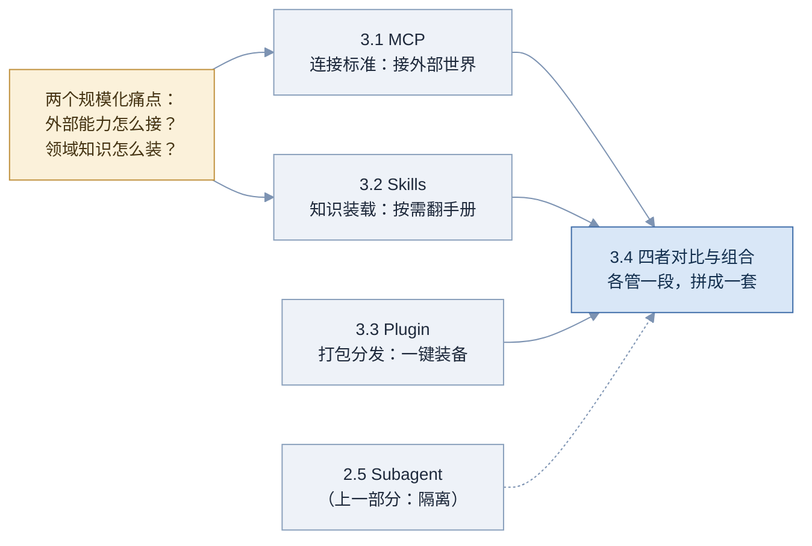
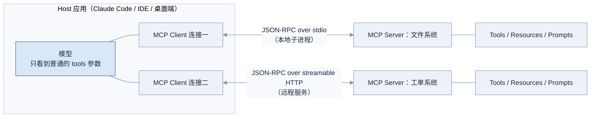
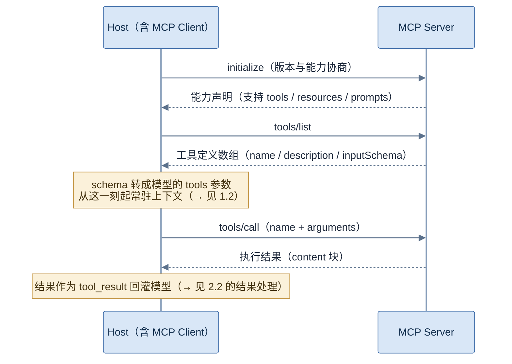
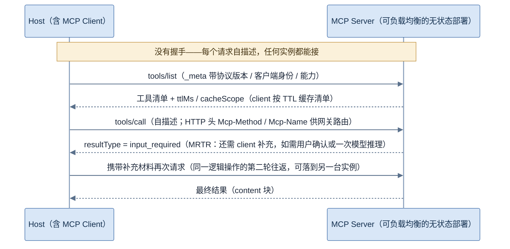
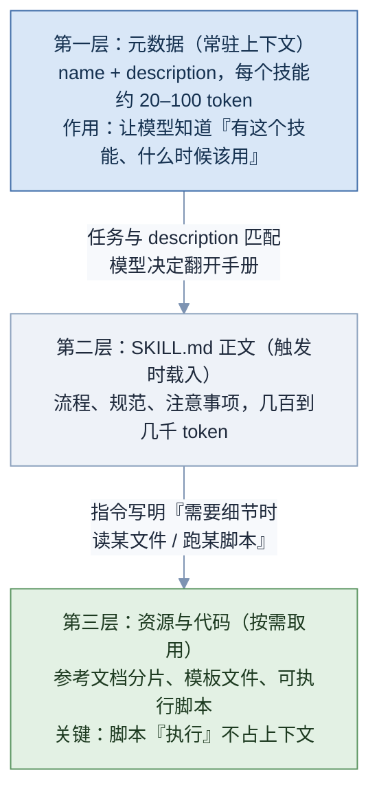
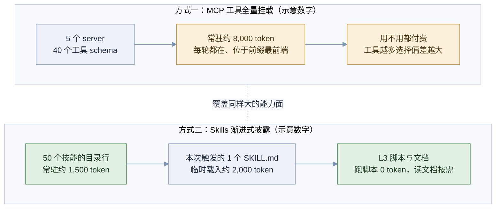
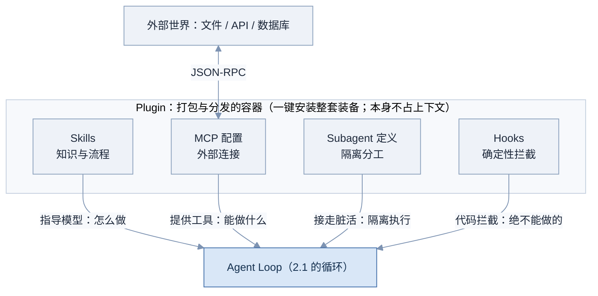

# 03 扩展机制

Part 02 结尾的 agent 已经会干活了，但它的能力都是**硬编码**进去的：工具写死在代码里，领域知识塞在系统提示里。本部分回答的是规模化问题：**能力怎么标准化地接进来，知识怎么不挤爆上下文地装进来，整套装备怎么打包分发**。四章各管一段，最后一章把它们拼成一张图。

**图 03-1 Part 03 知识脉络**



---

## 3.1 MCP 🟢

> 一句话：MCP（Model Context Protocol，模型上下文协议）是给 agent 接工具的「USB-C」——把「应用如何发现和调用外部能力」标准化成一个开放协议，工具做一次，任何支持 MCP 的 agent 都能即插即用。

### 为什么需要它

没有标准之前，接工具是一场 **M × N 灾难**：M 个 agent 应用（Claude、IDE、各家客服机器人）想接 N 个外部能力（GitHub、数据库、工单系统），每一对都要单独写一次集成——格式各异、鉴权各异、维护各异。工具作者要为每个客户端重写适配器，应用作者要为每个数据源写连接器，生态被积木接口不统一活活拖住。

MCP 把这个乘法变成加法：工具方实现一次 **MCP Server**，应用方实现一次 **MCP Client**，两边按同一协议对话，M × N 变成 **M + N**。它由 Anthropic 于 2024 年 11 月开源，此后被 OpenAI、Google、Microsoft、AWS、Cloudflare 等主要厂商陆续采纳，已成为工具接入的事实标准（→ 见 5.7；数据截至 2026 年 8 月，面试前建议复核）。

必须先钉死一个边界，这是最高频的概念混淆：**MCP 不替代 tool calling，而是站在它上面。** Tool calling（→ 见 1.2）是「模型 与 API」之间的协议——模型怎么表达「我要调工具」；MCP 是「应用 与 工具生态」之间的协议——应用怎么发现、连接、调用别人写的工具。MCP 工具最终仍然被转换成普通的 tools 参数喂给模型，模型甚至不知道 MCP 的存在。

### 核心原理

**图 03-2 MCP 架构：Host / Client / Server / Transport**



图中三个角色：**Host** 是用户面对的应用，内部为每个要连接的 server 维护一个 **Client**（一对一连接）；**Server** 是能力提供方，可能是本地子进程（通过 stdio 传输，适合文件系统这类本地能力）或远程服务（通过 streamable HTTP，适合 SaaS）。消息层统一用 **JSON-RPC 2.0**。注意深色的模型节点：它不参与协议——Host 把各 server 的工具汇总翻译成 1.2 里那种 tools 数组，模型照常点菜。

两种传输不是随便选的，各对应一类部署形态：

| 传输 | 适用 | 特点与代价 |
|---|---|---|
| stdio | 本地能力：文件系统、本机命令、开发工具 | Host 把 server 当子进程拉起，消息走标准输入输出；天然单用户、零网络暴露，权限即本机权限，调试也最简单 |
| Streamable HTTP | 远程服务：SaaS、团队共享的内部系统 | server 独立部署、可横向扩展、多客户端共享；代价是鉴权（OAuth 一套）、多租户、网络攻击面全部进场（→ 见 6.3） |

经验法则：**开发机上的能力走 stdio，跨网络的能力走 HTTP**；把本该 stdio 的东西做成远程服务，是给自己白加一整层运维与安全负担。

Server 能暴露的东西，经典表述是**四类原语**：

| 原语 | 方向 | 是什么 |
|---|---|---|
| Tools | 服务端提供 | 模型可调用的操作（查数据、发消息）——最常用的一类 |
| Resources | 服务端提供 | 可读的数据与内容（文件、表、文档），由应用决定怎么用 |
| Prompts | 服务端提供 | 预置的提示模板，通常由用户主动选用（如斜杠命令） |
| Sampling | 客户端提供 | 反向通道：server 请求 host 帮它调一次模型（让工具自己也能用 LLM） |

四类原语的分工，用一个「工单系统」server 一次看全：**Tools** 提供 create_ticket、search_tickets——模型在任务中自主决定调用；**Resources** 提供 `ticket://12345` 这样的可读数据——什么时候取给模型看由**应用**决定（比如用户在界面上点开了这张工单）；**Prompts** 提供「生成本周工单周报」模板——由**用户**从菜单主动选用，展开成预置的提示。注意隐藏考点：**三类原语的触发方各不相同——工具归模型、资源归应用、提示归用户**；把三者都说成「给模型的工具」是常见的浅答。Sampling 则是唯一反向的原语：比如 server 内部想对工单做智能分类，不必自带模型密钥，而是请 host 代为推理——权限与计费都留在 host 侧。

一次典型会话的经典流程（会话式版本）：

**图 03-3 MCP 会话时序（经典流程）**



落到字节层面，每条消息都是 JSON-RPC 2.0。一次 `tools/call` 的请求与响应长这样——面试能顺手写出这个结构，「真用过」就不容置疑：

```json
{
  "jsonrpc": "2.0",
  "id": 7,
  "method": "tools/call",
  "params": {
    "name": "get_weather",
    "arguments": {"city": "北京"}
  }
}
```

```json
{
  "jsonrpc": "2.0",
  "id": 7,
  "result": {
    "content": [{"type": "text", "text": "31 度，晴"}],
    "isError": false
  }
}
```

三个值得盯住的细节：**id** 负责请求与响应的配对，同一连接可以并发多个在途请求；**结果是 content 块数组**，文本、图片等多种类型皆可；**isError 放在 result 里**而不是用 JSON-RPC 的 error 字段——这正是 1.2「错误也是数据」的协议化：工具执行失败要回给模型自愈，只有协议层故障（方法不存在、参数解析失败）才走 error 字段。**两层错误的区分是实现 server 时的高频出错点**：把业务失败抛成协议错误，模型就永远失去了自愈机会。

**协议的无状态化：2026-07 修订。** 上面的经典流程是「会话式」的：握手建立会话、`Mcp-Session-Id` 头维持粘性、server 还能通过长连接主动向 client 发请求（sampling 就靠它）。跑在本地 stdio 上毫无问题；搬到远程规模化部署就四处撞墙——**会话粘性与负载均衡天然冲突**（同一会话的请求必须落到同一台实例）、server 要为每个连接维持内存状态（重启即断）、API 网关不解开 JSON-RPC 报文就无法做路由和鉴权。2026 年 7 月 28 日的规范修订对此做了一次结构性手术，方向正是 1.1 讲过的那条铁律：**可水平扩展的基础设施最终都会走向无状态**（本小节内容截至 2026 年 8 月，面试前建议复核）。五组变化：

- **去握手，请求自描述**：initialize / initialized 握手与会话头整体取消，每个请求在 `_meta` 里自带协议版本、客户端身份与能力声明——任何一台实例拿到任何一个请求都能独立处理；需要提前了解 server 能力的客户端，用可选的 `server/discover` 查询一次即可。
- **MRTR（多轮往返请求）取代服务端主动流**：过去 server 想要 client 帮忙（elicitation 向用户提问、sampling 借模型推理），靠长连接反向推送；现在改为 server 在响应里返回 `resultType: "input_required"` 并列出还缺什么，client 补上材料后**再发一轮请求**完成同一个逻辑操作——把「双向连接」语义改写成了纯请求-响应的多次往返。
- **网关友好**：新增 `Mcp-Method`、`Mcp-Name` 两个 HTTP 头，让 API 网关不拆 JSON 就能按方法与工具名做路由、限流和授权——MCP 流量从此可以过普通的企业网关设施。
- **清单可缓存**：tools/list 等列表响应带上 `ttlMs` 与 `cacheScope` 字段，客户端可以合法缓存工具清单、按 TTL 刷新——顺带缓解了「每次连接全量拉清单」的开销。
- **核心瘦身与弃用通道**：Tasks 从核心移出成为扩展（改为轮询式的 tasks/get / tasks/update）；Roots、Sampling、Logging 进入正式弃用流程（至少 12 个月过渡窗口）——注意 sampling 的命运：反向通道在无状态世界里是昂贵的例外，MRTR 把它改成了 client 主导的补料模式；旧的 HTTP+SSE 传输弃用；授权全面强化（issuer 强校验、动态客户端注册 DCR 让位于 CIMD 元数据文档）。

新流程画出来，与图 03-3 对照着看：

**图 03-4 MCP 无状态流程（2026-07 修订，含一次 MRTR）**



自描述请求的结构大致长这样（字段形态以规范原文为准，此处为结构示意）：

```json
{
  "jsonrpc": "2.0",
  "id": 1,
  "method": "tools/list",
  "params": {
    "_meta": {
      "protocolVersion": "2026-07-28",
      "client": {"name": "my-host", "version": "1.0"},
      "capabilities": {}
    }
  }
}
```

面试怎么用这段演进：三句话讲成一条因果链——经典 MCP 是会话式的（既有部署仍是主流，弃用有过渡期，讲图 03-3 不会错）；会话式在远程规模化时撞上负载均衡、网关、状态管理三堵墙；2026-07 修订用「去握手 + 自描述 + MRTR + 清单缓存」把协议改写成无状态。能把 MRTR 的机制讲清楚（server 用 input_required 声明缺口、client 补料再来一轮），基本就是这道题的天花板了。

**MCP 的代价：上下文占用。** 这是本章最重要的工程判断。接入一个 server，它的**全部工具 schema 常驻上下文**——名字、描述、参数定义，一个不少。五个 server、每个八个工具、每个 schema 二百 token，就是 8,000 token 的固定负担，而且 tools 段位于序列化最前端（→ 见 1.5）：它是每轮 prefill 的基座，也是最不能变动的缓存地基。工具一多，2.2 讲的选择偏差随之加剧。缓解手段从轻到重：只挂当前任务需要的 server、用命名空间前缀区分同类工具、以及更结构性的**按需披露**路线——让 agent 通过代码执行或目录索引按需发现和装载工具定义，只把真正用到的拉进上下文。这条路线的系统化实现，就是下一章的 Skills（→ 见 3.2、3.4）。

### 工程实现

用官方 Python SDK 写一个最小 MCP server——注意 `@mcp.tool()` 装饰的函数，docstring 就是工具描述，2.2 的全部功课在这里适用（你写的 server 会被**别人的** agent 使用，描述质量决定它的口碑）：

```python
# server.py —— 最小 MCP server（官方 python-sdk，包名 mcp）
from mcp.server.fastmcp import FastMCP

mcp = FastMCP("weather")

@mcp.tool()
def get_weather(city: str) -> str:
    """查询指定城市的当前天气。只支持中国大陆城市；
    需要历史天气或未来预报时不要使用本工具。"""
    fake_db = {"北京": "31 度，晴"}
    return fake_db.get(city, f"未收录的城市: {city}，请检查城市名")

if __name__ == "__main__":
    mcp.run()   # 默认 stdio 传输：作为 Host 的子进程运行
```

Host 侧只需一段声明式配置，announce 给支持 MCP 的应用即可（以常见的配置格式为例）：

```json
{
  "mcpServers": {
    "weather": {
      "command": "python",
      "args": ["server.py"]
    }
  }
}
```

### 常见坑

- 一口气挂十个 server——上下文被工具 schema 挤占近万 token，选择偏差飙升（→ 见 2.2）
- server 的工具描述敷衍——你的 server 被全世界的 agent 用，描述质量就是产品质量
- 把内部 REST API 原样包成 MCP server——参数爆炸、结果冗余，2.2 的反面教材换个协议再犯一遍
- 动态挂载 / 卸载 server——工具列表变化，位于最前端的缓存全部击穿（→ 见 1.5）
- 混淆 MCP 与 tool calling 的层次——面试第一翻车点
- 远程 server 不做鉴权与来源审计——工具结果是 prompt injection 的高速入口（→ 见 6.3）
- 忽略协议版本与能力协商，新旧版本混连时行为诡异

### 面试怎么答

**高频问题**：

- 「MCP 解决什么问题？没有它会怎样？」
- 「画一下 MCP 的架构，讲讲各角色。」
- 「MCP 和 function calling 是什么关系？」
- 「MCP 的代价是什么？」
- 「听说 MCP 改无状态了？说说改了什么、为什么改。」

**好答案要点**：

- M × N 变 M + N 一句话定性，再给「USB-C」类比
- 架构图默画：Host / Client / Server / 两种 transport / JSON-RPC，强调模型不感知 MCP
- 层次边界：tool calling 是模型协议，MCP 是生态协议，前者是后者的最后一公里
- 主动讲代价（schema 常驻 + 缓存基座 + 注入面）与缓解路线
- 无状态修订按因果链讲：会话式的三堵墙（负载均衡 / 网关 / 状态）→ 去握手与自描述请求 → MRTR 补料模式 → 清单缓存字段；MRTR 机制讲得清就是这题的天花板

**减分点**：

- 说「MCP 是 Anthropic 的 function calling」
- 说不出任何一种 transport 或任何一个原语
- 只讲好处不知道上下文代价
- 不知道它已是跨厂商事实标准，或反过来以为「接了 MCP 就没有集成工作了」

### 练习题

**1. 边界题。** 「我们已经用了 OpenAI 的 function calling，为什么还需要 MCP？」——写出你的回答。

<details>
<summary>参考答案</summary>

两者不在一个层。Function calling 解决「模型如何表达调用意图」（→ 见 1.2），但工具从哪来、怎么发现、怎么连接、鉴权怎么做，它一概不管——每接一个外部系统仍要手写集成。MCP 标准化的正是这一段：工具方发布 server，应用方用统一协议发现和调用，生态里现成的 server 直接复用。落地时两者串联工作：MCP client 拿到工具定义，转成 function calling 的 tools 参数交给模型。一句话：**function calling 是最后一公里，MCP 是整个路网**。

</details>

**2. 算账题。** 你接入 5 个 MCP server，共 40 个工具，平均每个工具 schema 约 200 token。算出常驻负担，并说明它在成本上的「双重身份」。

<details>
<summary>参考答案</summary>

常驻约 8,000 token。双重身份：一，它是每轮请求都要付费的固定输入（好在位于稳定前缀，命中缓存后按约 0.1 倍计价，→ 见 1.5）；二，它是缓存地基——任何一个 server 的增删都会击穿全部缓存。此外还有第三重隐性成本：40 个工具带来的选择偏差与注意力稀释（→ 见 2.2、4.2）。结论：工具面要按任务收敛，不是越全越好。

</details>

**3. 设计题。** 公司有 100 多个内部 API 要暴露给 agent。直接全部做成 MCP 工具吗？给出分层方案。

<details>
<summary>参考答案</summary>

不要。三层：一，高频核心操作（十个上下）精心设计成 MCP 工具——描述、参数、结果格式全按 2.2 打磨，常驻上下文；二，长尾 API 走**按需发现**——提供一个「目录 + 调用」的通用入口（如列出 API 清单、按名调用），或让 agent 在代码执行环境里用生成的客户端代码调用，用到哪个查哪个的文档（→ 见 3.2 渐进式披露、3.4）；三，高危操作（删除、支付）单独成工具并加权限门槛（→ 见 6.3）。评判标准不是「接没接全」，而是常驻上下文的 token 花在了最高频的能力上。

</details>

### 延伸阅读

- [Model Context Protocol 官方文档](https://modelcontextprotocol.io) —— 协议规范、SDK 与教程入口
- [MCP 规范 2026-07-28 修订发布说明](https://blog.modelcontextprotocol.io/posts/2026-07-28/) —— 无状态化的官方一手表述（本章新协议小节的依据）
- [Anthropic：Code Execution with MCP](https://www.anthropic.com/engineering/code-execution-with-mcp) —— 上下文占用问题与按需披露路线的官方论述

---

## 3.2 Skills 🟢

> 一句话：Skill 是给 agent 的「活页工作手册」——一个装着说明书、参考资料和脚本的文件夹，平时只在目录里占一行，用到时才翻开，翻开也只读需要的那几页。

### 为什么需要它

两个痛点在 3.1 和 4.1 各埋了一半。第一：**领域知识往哪放？** 公司的发布流程、品牌规范、代码风格——全塞进系统提示，就是 4.1 要讲的过度规格：上下文被常驻知识挤满，而其中 95% 与当前任务无关。第二：**MCP 的常驻成本**（→ 见 3.1）：能力越多，固定负担越重。

两个痛点同一个病根：**「可能用到」的东西被当成「一直要看」的东西。** 人类不这么工作——工程师不会每天早上把整个公司 wiki 读一遍再开工，而是知道手册在哪，用到时翻。Skill 把这个模式给了 agent，机制的名字叫**渐进式披露（Progressive Disclosure）**：信息按需分层加载，而不是一次性全量在场。

### 核心原理

**图 03-5 Skill 的三层渐进式披露**



三层各有分工。**第一层元数据**是常驻的全部代价：技能名加一句 description——五十个技能也不过一两千 token，模型翻目录就能知道自己「会什么」。**第二层 SKILL.md** 在任务命中 description 时才读入，装的是流程与规范正文。**第三层**是深水区：大部头参考资料拆成分片按需读；更妙的是**可执行脚本**——确定性的操作（格式转换、数据校验、模板渲染）直接跑代码，不消耗上下文、不产生幻觉，模型只负责决定「跑哪个、参数是什么」。绿色那格是 Skills 与纯提示词方案的本质差异：**知识不仅可以被读，还可以被执行**。

一个 Skill 就是一个文件夹，结构极简（以通用形态为例）：

```text
release-checklist/
├── SKILL.md            # 必需：frontmatter + 指令正文
├── reference.md        # 可选：深度参考（L3，按需读）
└── scripts/
    └── verify.py       # 可选：可执行工具（L3，跑而不读）
```

SKILL.md 的开头是 YAML frontmatter，其中 **description 是整个机制的扳机**——模型只凭它决定是否触发这个技能，写法上完全复用 2.2 工具描述的四要素（干什么、何时用、何时不用、怎么用）：

```markdown
---
name: release-checklist
description: 发布上线前的检查流程。当用户要求发布、上线、
  部署到生产环境时使用；日常开发构建不要使用本技能。
---

# 发布检查流程

1. 运行 scripts/verify.py 检查版本号与 changelog 一致性
2. 确认数据库迁移已在预发环境执行（流程见 reference.md 第二节）
3. 逐项核对下面的清单，全部通过才能继续……
```

**与 MCP 的占用对比**，一张图看清两种接入哲学的差异：

**图 03-6 上下文占用对比：全量挂载 vs 渐进式披露**



注意这不是「Skills 优于 MCP」——两者根本不在竞争：**MCP 给的是连接（能力从哪来），Skill 给的是知识（该怎么用）**。最典型的组合恰恰是：SKILL.md 里写着「查数据用 database server 的 query 工具，注意先取 schema 再写 SQL」——技能指导模型去用 MCP 工具（→ 见 3.4）。对比图真正说明的是**披露策略**的差异，而按需披露的思想正在反哺 MCP 生态本身（→ 见 3.1 结尾）。

把视野再拉开一层：「给 agent 装知识」总共有四条路线，Skill 只是其中之一。面试答「为什么用 skill」时，能摆出这张全景对比就是体系分：

| 路线 | 原理与代价 | 适用 |
|---|---|---|
| 塞进系统提示 | 常驻上下文：立即生效、每轮付费、越塞越接近过度规格（→ 见 4.1） | 少量、全局、每个任务都用得上的行为契约 |
| RAG 检索 | 语料切片向量化、按语义相似召回：吞得下海量静态知识，但召回的是「片段」，装不了流程 | 大规模文档问答、事实查询（边界 → 见 2.4，选型 → 见 5.6） |
| 微调 | 把知识烧进权重：更新要重训、验证困难、知识与能力纠缠——知识注入场景的最后选项 | 风格与输出形态的深度定制；注入事实性知识的反模式 |
| Skill 渐进式披露 | 目录常驻、正文按需、脚本零上下文：为「流程性、结构化、会更新」的知识而生 | 操作手册、规范流程、附带工具脚本的领域能力 |

一句话记住分工：**契约进提示、事实进检索、流程进技能、风格才考虑微调。** 四条路线在真实系统里同样是组合关系——一个企业 agent 完全可能同时四路并用，各装各的那类知识。

### 工程实现

Skills 是声明式机制，工程实现的重心在 harness 侧的装载循环（伪代码）：

```text
启动时：
    扫描技能目录，读每个 SKILL.md 的 frontmatter
    把「name: description」清单拼进系统提示尾部   # 每技能一行，L1 常驻

循环中：
    模型输出中声明使用某技能（或 harness 按规则匹配触发）
        → 读入该技能的 SKILL.md 正文，注入为一条用户侧消息    # L2
        → 后续模型按指令自主读 reference / 执行 scripts        # L3
    任务结束：L2/L3 内容随任务落幕，不再重复注入

约束：
    单技能正文超过阈值（如 5k token）→ 拆分到 L3 分片
    触发准确率纳入评测（误触发 / 漏触发都算失败，→ 见 6.1）
```

### 常见坑

- description 写得含糊（「帮助处理文档」）——永不触发或到处乱触发，机制直接失效
- 把整本手册塞进 SKILL.md——L2 一次载入上万 token，渐进式披露名存实亡；该拆去 L3
- 该写成脚本的确定性操作写成文字步骤——让模型逐步「表演」一遍，又慢又贵还会错
- 与系统提示抢职责——全局行为契约归 system（→ 见 4.1），领域流程归 skill，混放两边都难维护
- 技能之间互相冲突（两个技能对同一场景给出不同流程）且无优先级约定
- 忘了技能也是攻击面——第三方技能里的指令会被模型执行，装前要审计（→ 见 6.3）
- 技能写死绝对路径、依赖特定机器环境——换个环境全部失效

### 面试怎么答

**高频问题**：

- 「渐进式披露是什么？三层各是什么？」
- 「Skill 和 MCP 有什么区别？会互相替代吗？」
- 「description 为什么如此关键？」
- 「什么内容应该进 skill，什么进系统提示？」

**好答案要点**：

- 三层脱口而出，各配 token 量级；强调「脚本执行不占上下文」这个第三层的独特价值
- 边界句：MCP 给连接、Skill 给知识，组合关系不是竞争关系，并举「技能指导用 MCP 工具」的例子
- description 类比 2.2 的工具描述——同一门手艺的两个应用点
- 分职责：常驻的全局契约进 system，按需的领域流程进 skill——能从上下文预算角度解释为什么

**减分点**：

- 把 Skill 说成「另一种插件市场」或「prompt 合集」，讲不出三层结构
- 认为 Skills 和 MCP 是竞争品、要二选一
- 说不出 L1 常驻成本极低这个数量级概念
- 不知道脚本执行与上下文的关系

### 练习题

**1. 改造题。** 一份 3,000 行的内部部署 wiki 要变成 skill。写出你的三层拆分方案。

<details>
<summary>参考答案</summary>

L1：name 加 description——「生产环境部署流程。当任务涉及发布、回滚、扩容时使用；本地开发环境问题不要使用」。L2（SKILL.md，控制在千 token 级）：主干流程的骨架步骤、关键红线（如「迁移必须先在预发验证」）、以及到 L3 的路标。L3：按主题拆分片——rollback.md、scaling.md、troubleshooting.md，SKILL.md 里写明什么情况读哪片；核对类操作（版本一致性检查、配置 diff）写成 scripts/ 下的脚本。判断标准：模型在 90% 的部署任务里只需要 L1+L2 加一个分片，而不是 3,000 行全文。

</details>

**2. 排障题。** 你写的「数据库迁移」技能，用户让 agent「改一下用户表结构」时从不触发，让它「写个迁移脚本」时又能触发。怎么排查和修复？

<details>
<summary>参考答案</summary>

病根在 description 与用户语言不匹配：描述大概率写的是「编写数据库迁移脚本时使用」——「写迁移脚本」字面命中，「改表结构」这种用户视角的表述没覆盖。修复：description 按**用户会怎么说**来写，覆盖同义表述（改表结构、加字段、schema 变更、建索引），并写明「何时不用」（查询优化不属于本技能）。验证：拿一组真实用户表述做触发测试，误触发与漏触发都计入（→ 见 6.1）。这道题的本质与 2.2 工具描述、2.5 任务书是同一件事：**给模型的接口文本，永远按调用方的语言写**。

</details>

**3. 组合设计题。** 设计一个「周报生成」能力：数据在 Jira 和 GitLab 里，格式有公司模板，产出要发到邮件。写出 MCP 与 Skill 的分工。

<details>
<summary>参考答案</summary>

MCP 负责连接：Jira server（查本周 issue）、GitLab server（查 MR 与提交）、邮件 server（发送）——三个都是纯能力，不含公司知识。Skill 负责知识：SKILL.md 写清周报的组装流程（先查什么、怎么归并、哪些项要人工确认）与红线（未上线的项目不进周报）；L3 放公司模板文件与一个渲染脚本（数据填模板这种确定性活交给代码）。运行时：技能触发 → 指导模型依次调用三个 MCP server → 脚本渲染 → 邮件工具发送。一句话总结分工：**连接的归 MCP，知道怎么做的归 Skill，确定性的归脚本**。

</details>

### 延伸阅读

- [Anthropic：Equipping Agents for the Real World with Agent Skills](https://www.anthropic.com/engineering/equipping-agents-for-the-real-world-with-agent-skills) —— 三层披露设计的官方论述
- [Anthropic：Introducing Agent Skills](https://www.anthropic.com/news/skills) —— 机制发布时的动机说明
- [anthropics/skills 仓库](https://github.com/anthropics/skills) —— 大量真实 SKILL.md 可作范例

---

## 3.3 Plugin 🟡

> 一句话：Plugin 是 agent 能力的「安装包」——把技能、MCP 配置、子代理定义、钩子脚本打进一个带清单的文件夹，一条命令装进 harness，团队从此装的是同一套装备。

### 为什么需要它

单打独斗时，手工往配置里加一个 skill、一个 MCP server 没什么负担。问题出在**规模与协作**：十人团队各自手工配置，三周后每个人的 agent 行为都不一样——有人少装了代码规范技能，有人连的还是旧版 server，出了问题连「你的环境和我哪不一样」都说不清。能力没有版本、没有分发渠道、没有一致性保证。

这个问题软件工程早就解过一遍：应用有安装包，依赖有 npm/pip，编辑器有扩展市场。Plugin 就是同一个答案在 agent 世界的落地：**打包（一个文件夹装下全套能力）、分发（从市场一键安装）、版本化（团队锁定同一版本）**。

### 核心原理

一个 plugin 的解剖（以 Claude Code 的插件结构为例，其他 harness 大同小异；结构细节截至 2026 年 8 月，面试前建议复核）：

**图 03-7 Plugin 目录结构（ASCII）**

```text
my-team-kit/                        ← 一个 plugin = 一个带清单的文件夹
├── .claude-plugin/
│   └── plugin.json                 ← 清单：名称、版本、描述（唯一必需项）
├── skills/                         ← 打包的技能（3.2），每个一个子目录
│   ├── release-checklist/SKILL.md
│   └── code-style/SKILL.md
├── agents/                         ← 子代理定义（2.5）：角色提示 + 工具白名单
│   └── security-reviewer.md
├── commands/                       ← 斜杠命令：用户显式调用的快捷入口
│   └── deploy.md
├── hooks/                          ← 钩子：循环特定时点触发的确定性脚本
│   └── hooks.json                  （如 PreToolUse：工具执行前拦截检查）
└── .mcp.json                       ← 捆绑的 MCP server 配置（3.1）
```

看这棵树的组成就能明白 plugin 的定位：**它自己几乎不提供任何运行时机制，它是个容器**——里面装的全是前面学过的东西：技能（3.2）、MCP 连接（3.1）、子代理（2.5）、命令入口。唯一的新面孔是 **hooks（钩子）**：挂在循环特定时点（如工具执行前后、会话开始）的确定性脚本，用来做拦截、校验、审计这类**不该交给模型自由裁量**的事——比如 PreToolUse 钩子强制拦下对生产库的写操作。它是 harness 循环的官方扩展点，与权限设计直接相关（→ 见 4.4、6.3）。

**分发**同样是极简设计：一个 git 仓库加一个 `marketplace.json` 清单就是一个市场，条目指向各 plugin 的位置；用户声明市场来源，然后按名安装。团队场景的标准做法：公司建一个私有市场仓库，新人入职一条命令，装到的是与全组完全一致、版本锁定的装备。

```json
{
  "name": "my-team-kit",
  "version": "1.4.0",
  "description": "后端组标准装备：发布检查、代码规范、安全审查"
}
```

市场清单同样是一个 JSON 文件——git 仓库放上它，就是一个可被订阅的市场：

```json
{
  "name": "acme-marketplace",
  "owner": {"name": "ACME 平台组"},
  "plugins": [
    {
      "name": "my-team-kit",
      "source": "./plugins/my-team-kit",
      "description": "后端组标准装备"
    }
  ]
}
```

安装与更新的完整流程（以 Claude Code 的命令形态为例，细节截至 2026 年 8 月，面试前建议复核）：

```text
1. 声明市场来源：  /plugin marketplace add acme/agent-marketplace
2. 安装装备：      /plugin install my-team-kit@acme-marketplace
3. 团队更新：      市场仓库打新 tag → 成员执行 update →
                   全组同步到同一版本（版本号在 plugin.json 里语义化管理）
```

hooks 的配置形态也值得看一眼——「事件时点 + 匹配器 + 命令」的确定性三元组，全程没有模型参与：

```json
{
  "hooks": {
    "PreToolUse": [{
      "matcher": "Bash",
      "hooks": [{"type": "command",
                 "command": "./scripts/block-prod-writes.sh"}]
    }]
  }
}
```

读法：每当循环走到 PreToolUse 时点（工具即将执行前，→ 见 2.1 的第四步之前）、且本次调用的工具名匹配 Bash，就先跑这个脚本——脚本返回阻断信号则该次工具调用被拦下。时点、匹配器、脚本三者都是代码层面的确定行为，这就是 3.3 反复强调的「必须百分之百发生的事不交给模型」的落地形态。

### 工程实现

plugin 没有「运行逻辑」可写——它的工程实现就是清单加目录约定（见图 03-7）。真正值得写的是**团队装备的取舍清单**（伪代码形式的决策规则）：

```text
进 plugin 的（团队共性）：
    代码规范 / 发布流程技能、公司内部系统的 MCP 配置、
    安全审查子代理、危险操作拦截钩子
不进 plugin 的（个人或环境差异）：
    个人密钥与令牌（永远走环境变量 / 密钥管理）、
    个人偏好类技能、机器相关路径
版本策略：
    市场仓库打 tag；plugin.json 版本号语义化；
    重大流程变更 = 主版本号 + 变更说明（团队要重新确认装备）
```

### 常见坑

- 把 plugin 当成运行时机制——它只是打包与分发层，行为仍由内容物（skill/MCP/subagent/hook）决定
- 团队不锁版本——「我这正常」的环境漂移问题换个形式回归
- 把密钥、令牌打进 plugin 分发——安全事故的标准开局
- hooks 滥用——用钩子悄悄改写循环行为，出问题时没人想得到查它，极难调试
- 从不明来源的市场安装 plugin——里面的技能与钩子都是可执行的信任链，供应链风险（→ 见 6.3）
- 一个 plugin 塞进全公司所有部门的装备——粒度失当，按团队 / 职能拆包

### 面试怎么答

**高频问题**：

- 「Plugin 和 Skill、MCP 是什么关系？」
- 「团队怎么保证每个人的 agent 行为一致？」
- 「hooks 解决什么问题？和 skill 的边界在哪？」

**好答案要点**：

- 定位一句话：plugin 是容器与分发单元，内容物才是能力——参照包管理器的心智模型
- 团队一致性答三件套：私有市场、版本锁定、装备进 plugin 而密钥进环境
- hooks 与 skill 的边界：**确定性拦截归钩子（代码说了算），知识指导归技能（模型看着办）**——能举「拦生产库写操作」的例子
- 主动提供应链信任问题——安全意识信号

**减分点**：

- 三个概念混为一谈（「用 MCP 写了个 skill 打包成 plugin」这类混乱表述）
- 认为 plugin 有独立的运行时能力
- 没有版本与分发的工程意识
- 不知道 hooks 的存在或把它当成另一种 skill

### 练习题

**1. 设计题。** 为一个 20 人后端团队设计标准装备 plugin，列出各目录该放什么、什么坚决不放。

<details>
<summary>参考答案</summary>

skills/：代码规范、发布检查、事故响应流程（团队共性知识）；.mcp.json：内部工单、CI、监控系统的 server 配置（连接声明，不含凭据）；agents/：安全审查、性能审查子代理（统一评审口径）；hooks/：拦截生产环境破坏性命令、提交前强制跑 lint；commands/：/deploy、/oncall 等高频入口。坚决不放：任何密钥令牌（走环境变量）、个人偏好技能（个人自装）、绝对路径依赖。配套：私有市场仓库 + 语义化版本 + 变更说明。

</details>

**2. 判断题。** 以下需求各该用 hook 还是 skill：a）任何 rm -rf 类命令执行前必须拦截并要求确认；b）教 agent 按公司规范写提交信息；c）每次会话开始自动注入当前迭代的上下文；d）审查 SQL 时提醒模型检查注入风险。

<details>
<summary>参考答案</summary>

a）hook（PreToolUse）——安全拦截必须是确定性的，不能指望模型「记得」规则；b）skill——这是知识与流程，模型执行时需要判断力；c）hook（会话开始时点）——机械注入，无需模型裁量；d）skill（或子代理）——审查是判断类工作。分界线一句话：**必须百分之百发生的用钩子，需要模型判断的用技能**。把 a 写成 skill 是这道题的经典错误——提示可以被上下文稀释，拦截不能。

</details>

**3. 排障题。** 团队两人装了同一个 plugin，但 A 的 agent 会拦截生产库写操作，B 的不会。写出你的排查顺序。

<details>
<summary>参考答案</summary>

按「从配置到执行」的顺序查：一，版本一致性——B 装的是不是没有该 hook 的旧版本（`plugin.json` 版本号对一下，这就是要锁版本的原因）；二，本地覆盖——B 的个人配置是否禁用了该 hook 或整个 plugin；三，匹配器命中——B 触发写库的路径是否根本不经过被匹配的工具（比如 matcher 只写了 Bash，而 B 的 agent 用的是独立的 db_query 工具）；四，脚本执行环境——B 机器缺脚本依赖导致 hook 静默失败，而失败策略配的是「放行」。落点有两个：**确定性拦截自己也有可靠性工程**——「装了」不等于「生效」，团队装备要配自检手段（如一条故意触发拦截的验证命令）；hook 失败时「放行还是阻断」（fail-open vs fail-closed）是安全设计里必须显式决定的一项（→ 见 6.3）。

</details>

### 延伸阅读

- [Anthropic：Customize Claude Code with Plugins](https://www.anthropic.com/news/claude-code-plugins) —— plugin 机制的发布说明与设计动机
- [Claude Code 文档：Plugins](https://code.claude.com/docs/en/plugins) —— 目录结构与市场机制的权威参考
- [Claude Code 文档：Hooks](https://code.claude.com/docs/en/hooks-guide) —— 钩子时点与配置细节

---

## 3.4 四者对比与组合 🟢

> 一句话：MCP 给连接、Skill 给知识、Plugin 给打包、Subagent 给隔离——四者解决四个互不重叠的问题，是组合关系，不是竞争关系。

### 为什么需要它

生态名词爆炸的直接后果，是「X 和 Y 有什么区别」成了这个岗位面试的**送分题兼送命题**：答清了三十秒过关，答混了直接暴露「只听说过没用过」。更实际的原因是：真实系统里四者**同时在场**，用错机制解决问题的代价是真金白银——要隔离的写成了技能（上下文照样爆），要知识的建了 MCP server（把流程硬编码成了接口）。

这一章不引入任何新机制，只做一件事：把前面学过的四个东西放进同一张图、同一张表、同一个案例里，让边界一次性焊死。

### 核心原理

**图 03-8 MCP / Skill / Plugin / Subagent 关系总图**



图的读法：Plugin 是外面那个箱子——纯容器，负责把四样东西一起装进 harness；装进去之后各干各的活，全部汇入深色的循环节点。四条汇入的边就是四句边界：**Skill 告诉模型怎么做，MCP 让模型能做，Subagent 让脏活别处做，Hook 保证坏事做不了。**

对比表（面试可直接背）：

| 机制 | 解决什么问题 | 上下文形态 |
|---|---|---|
| MCP（3.1） | 外部能力的标准化接入 | 工具 schema 常驻前缀（或经按需披露收敛） |
| Skill（3.2） | 领域知识与流程的装载 | 三层渐进式披露：常驻仅一行目录 |
| Plugin（3.3） | 能力的打包、分发、版本化 | 不占上下文——它管安装，不管运行 |
| Subagent（2.5） | 上下文隔离与并行 | 独立窗口，主上下文只收结论 |

四者的一个共同点值得单独说：**它们全都是上下文经济学的产物。** MCP 的痛在 schema 常驻，Skill 用披露分层来省，Subagent 用隔离来躲，Plugin 干脆不进上下文。把四章串起来的那根线，就是 4.2 要正式命名的「注意力预算」——这也是为什么本部分要放在 Part 04 之前。

**一个完整的组合案例**，走一遍「季度经营报告 agent」的生命周期：

```text
装配期：运营团队安装 quarterly-report plugin，内含
        ① 报告技能（写法规范、数据口径、红线）
        ② 数据仓库 + 工单系统的 MCP 配置
        ③ data-digger 子代理定义（只读工具集）
        ④ PreToolUse 钩子（拦截对生产库的写操作）

运行期：用户：「出一份 Q3 经营报告」
    1. 任务命中报告技能的 description → SKILL.md 载入（L2）
    2. 技能指导：先取数据口径表（L3 文件），再用 MCP 查数
    3. 大规模取数与清洗 → delegate 给 data-digger 子代理，
       主上下文只收回结构化数据摘要
    4. 模型按技能规范成稿；渲染脚本（L3）套模板
    5. 全程：任何写库操作被钩子拦下——报告 agent 只该读
```

五步里四种机制各出现在**它该在的位置**。面试遇到系统设计题，这个案例的骨架可以直接迁移。

### 工程实现

选型决策的判定规则（伪代码），拿到需求先过这四问：

```text
这是「连接一个外部系统」吗？
    → MCP：找现成 server，没有就按 2.2 的标准写一个
这是「教 agent 一套知识 / 流程 / 规范」吗？
    → Skill：description 定触发，重资料下沉 L3，确定性步骤写成脚本
这是「过程很脏但只要结论」或「需要并行探索」吗？
    → Subagent：任务书五要素 + 权限收窄（→ 见 2.5）
这是「团队要统一装备 / 版本化分发」吗？
    → Plugin：打包以上全部 + 钩子，私有市场分发
一个需求命中多问 → 组合使用，各机制承担自己那段
```

### 常见坑

- 名词混用——「用 MCP 写了个 skill」这类表述，面试直接减分
- 要隔离的写成技能——技能不解决上下文膨胀，十万 token 的探索过程还是会灌进主窗口
- 要知识的建成 MCP server——把「怎么做」硬编码成了接口，流程一改就要发版
- 该确定性拦截的写进 SKILL.md——提示会被稀释，拦截必须用钩子（→ 见 3.3 练习 2）
- 简单任务全副武装——一次查询套上四层机制，延迟与复杂度白白翻倍
- 只会背定义不会组合——面试真正的考点是给场景选机制

### 面试怎么答

**高频问题**：

- 「MCP 和 Skill 有什么区别？」（本岗位面试出现率最高的边界题）
- 「这四个机制会互相替代吗？」
- 「给你一个场景（如企业知识库助手），说说怎么组合使用。」

**好答案要点**：

- 四句边界一口气说完：连接归 MCP、知识归 Skill、打包归 Plugin、隔离归 Subagent
- 用「上下文形态」这一列做深度区分——常驻 / 披露 / 不占 / 隔离，显示你理解的是机制不是名词
- 组合题按「装配期 / 运行期」两段作答，每个机制点出它出现的位置
- 主动收尾：四者都是上下文经济学的产物——把 Part 03 与 Part 04 连起来

**减分点**：

- 任何一对边界说不清，或认为它们是演进替代关系（「Skill 是 MCP 的升级版」）
- 只背定义，场景题不会拆
- 说不出 Plugin 不占上下文、不含运行时逻辑这个特殊定位

### 练习题

**1. 选型题。** 三个需求各用什么机制：a）让 agent 能查公司的 Jira；b）让 agent 按「先建分支、改动小于 300 行、必须带测试」的家规提 PR；c）分析一个 50 万行日志文件找出异常模式。

<details>
<summary>参考答案</summary>

a）MCP——纯连接问题，找现成的 Jira server 即可。b）Skill——这是流程知识；其中「必须带测试」若要硬保证，再加一个提交前钩子兜底（提示引导 + 代码拦截双保险）。c）Subagent + 结果外置——日志读取与模式扫描在隔离上下文（或脚本）里做，主上下文只收异常清单；50 万行本身先落盘，用工具分段检索（→ 见 2.2、4.3）。

</details>

**2. 改错题。** 某团队的设计：「为『代码评审规范』建一个 MCP server，agent 每次评审前调用 get_review_rules 工具拉取全部规范文本；为『连接 GitHub』写一个 skill，正文里贴了完整的 REST API 调用示例。」指出两处机制错配并给出修正。

<details>
<summary>参考答案</summary>

错配一：评审规范是**知识**，却被做成了连接——每次全量拉取等于没有披露分层，且规范更新要动 server。修正：做成 review-standards skill，规范正文在 L2/L3 按需载入。错配二：GitHub 是**外部连接**，却被写成了知识——让模型照着 API 示例手搓 HTTP 调用，脆弱且不安全。修正：接 GitHub 的 MCP server，让工具承担连接；若有团队特有的用法约定（如「PR 描述必须带 issue 号」），那部分才写进 skill。记忆锚点：**会变的知识别做成接口，标准的连接别写成课文**。

</details>

### 延伸阅读

- [Anthropic：Code Execution with MCP](https://www.anthropic.com/engineering/code-execution-with-mcp) —— MCP 与按需披露如何融合的官方思路
- [Anthropic：Equipping Agents for the Real World with Agent Skills](https://www.anthropic.com/engineering/equipping-agents-for-the-real-world-with-agent-skills) —— Skill 与工具生态的组合关系
- [Claude Code 文档：Plugins](https://code.claude.com/docs/en/plugins) —— 容器视角看四者如何被一起打包
