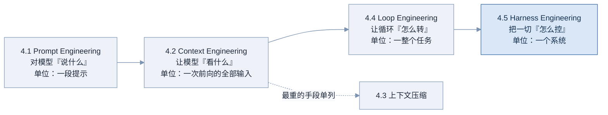
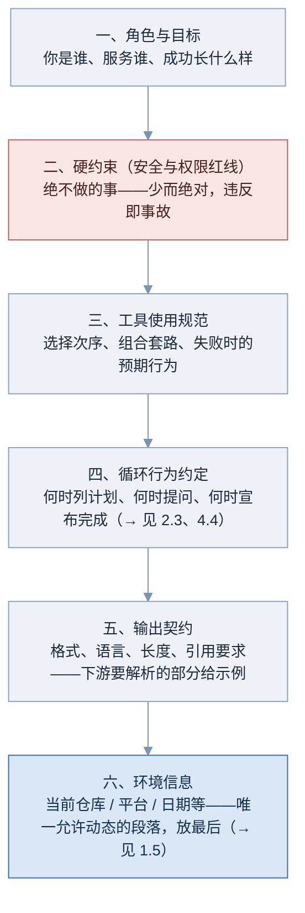
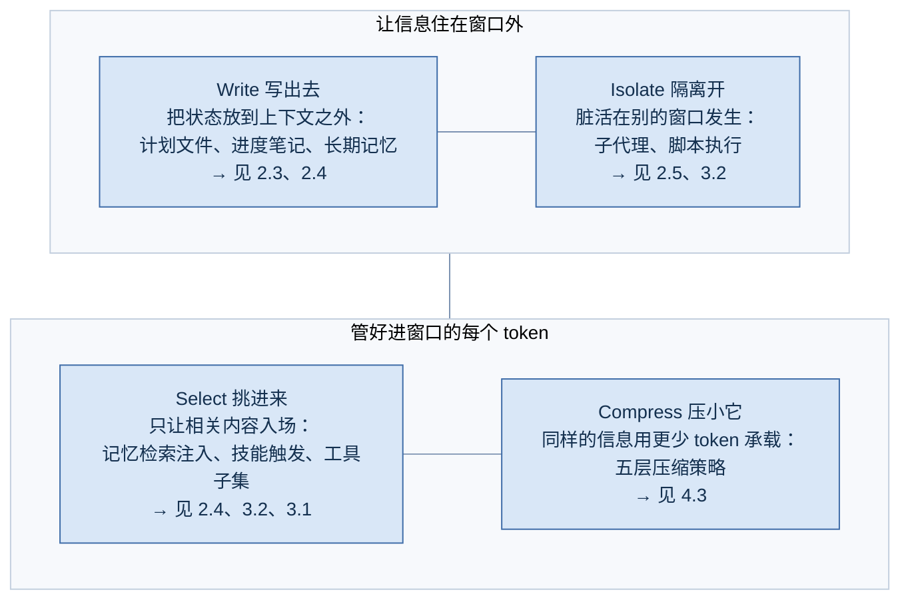
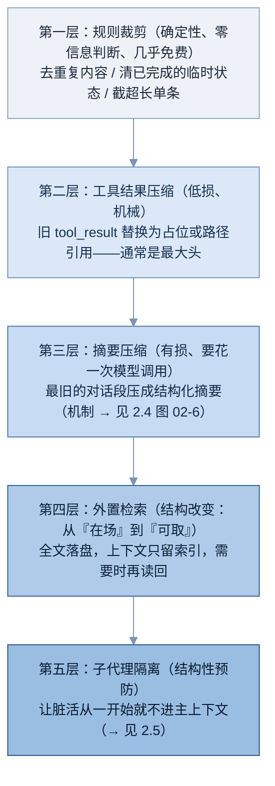
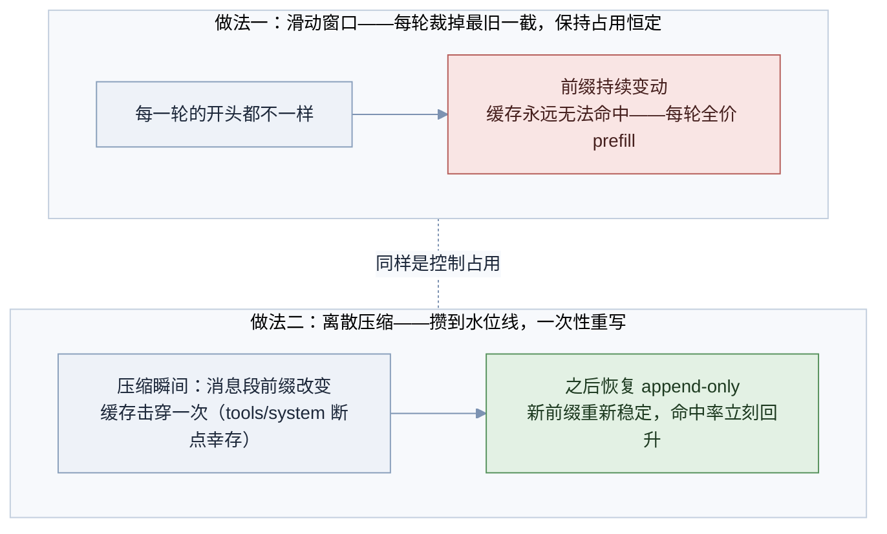
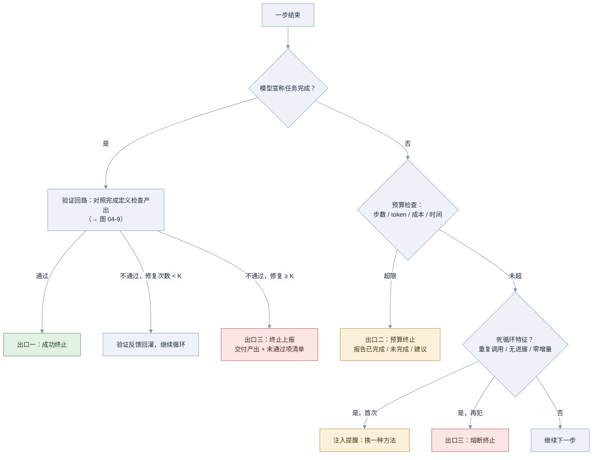
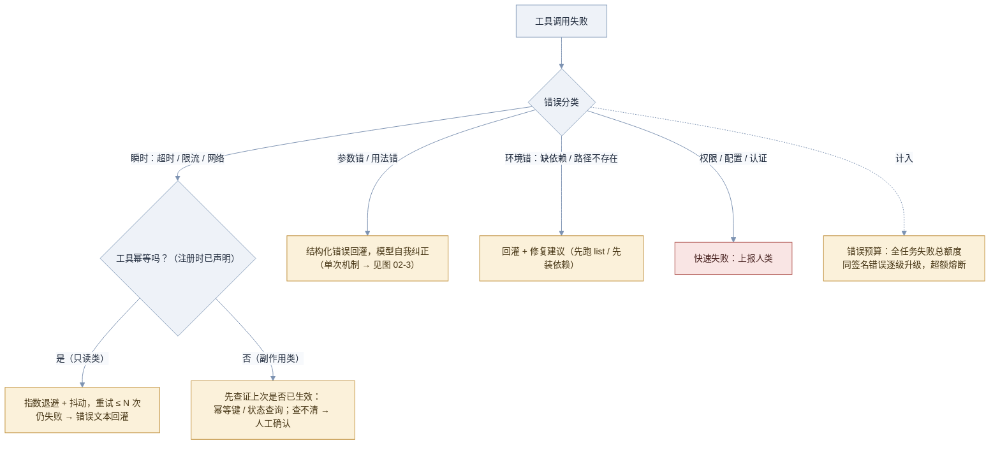
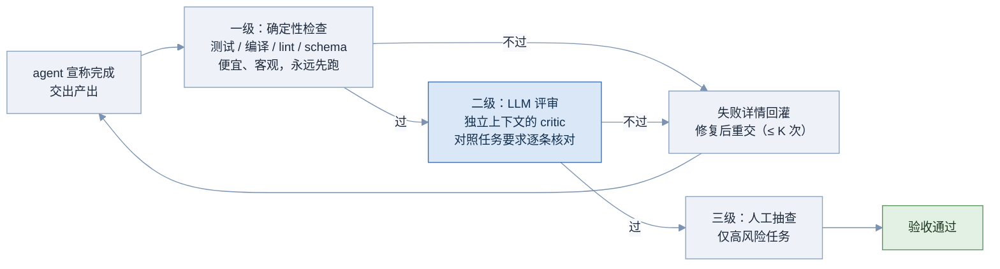
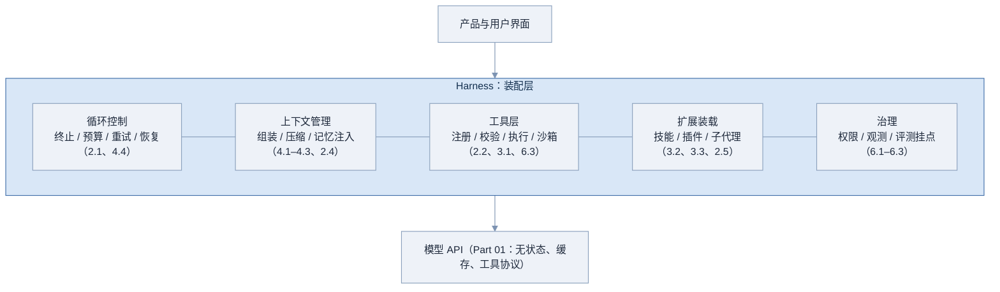
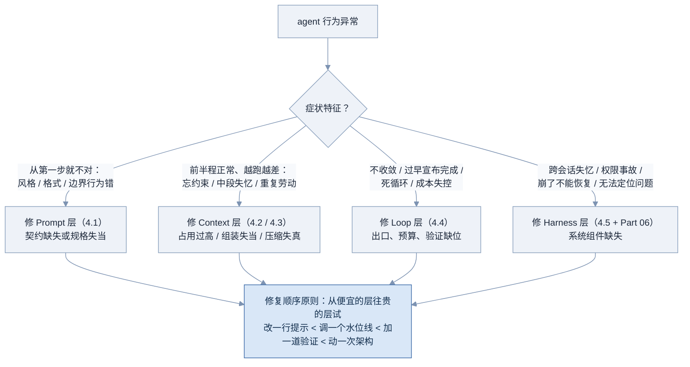

# 04 四大工程课题

零件在 Part 01–03 已经讲完。本部分是**四门手艺**：对模型「说什么」（Prompt Engineering）、让模型「看什么」（Context Engineering）、让循环「怎么转」（Loop Engineering）、把一切「怎么控住」（Harness Engineering）。其中上下文压缩是 Context Engineering 里最重的一把手术刀，单列一章（4.3）。JD 里那句「对四大课题有深入理解」，考的就是本部分。

**图 04-1 四大工程课题：层层包含的演进关系**



图中从左到右，**每一层都包含前一层**：prompt 是 context 的一部分，context 组装发生在循环的每一步里，循环又只是 harness 的一个组件。这也是这四个词先后出现的历史顺序——行业每前进一步，就发现上一层的优化不够用了。4.6 会回到这张图做总收束。

---

## 4.1 Prompt Engineering 🟢

> 一句话：Prompt engineering 是给模型写行为契约——用系统提示定义 agent 的身份、边界、工具用法和输出标准，让概率式的模型表现出工程上可依赖的行为。

### 为什么需要它

不写系统提示（或随手写一句「你是个有用的助手」）的 agent，行为是**漂**的：同样的任务今天一个风格明天一个风格；该拒绝的操作它热心去做；工具乱用一通；输出格式每次都不一样，下游解析代码天天崩。模型没有坏，它只是**没拿到契约**——你没告诉它「在这个系统里，什么算对」。

而契约写歪比不写更隐蔽。agent 系统提示的两种典型死法，恰好是一对反义词：

- **欠规格（Underspecification）**：契约太空。行为边界、工具规范、输出格式全靠模型即兴发挥，结果就是上面那些漂移症状。
- **过度规格（Overspecification）**：契约太满。上线后每出一个 bad case 就往提示里打一条「不要 X」的补丁，两个月后系统提示膨胀到三千行——规则互相冲突、模型顾此失彼、每条新规则的边际收益递减，还吃掉大块上下文预算（→ 见 4.2）。补丁墙是 agent 团队最常见的技术债。

正解是找到**恰当高度（right altitude）**：给原则和判断标准，而不是穷举每种情况的 if-else；规则墙里那些「领域性、低频」的部分，外置成按需加载的技能（→ 见 3.2）。

### 核心原理

一份 agent 系统提示的标准剖面——它同时是「写作模板」和「审查清单」：

**图 04-2 Agent 系统提示的结构剖面**



图中顺序有讲究：**越稳定、越重要的越靠前**。红色的硬约束段紧跟角色——它是整份契约里唯一「宁多勿失」的部分，但注意「多」的是绝对性不是条数：红线要少而铁（「绝不在未确认时执行删除」），一旦红线长到几十条，说明你在把普通规范错当红线写。深色的环境信息段是唯一允许每次会话不同的部分，所以必须放在最后——前五段保持字节稳定，缓存与行为的双重稳定都靠它（→ 见 1.5 前缀稳定三原则）。

几条实操原则，每条都对着一种常见翻车：

- **具体压倒抽象。**「回答要专业」没有信息量；「引用文件时必须带 路径:行号」才是可执行的契约。抽象形容词是欠规格的藏身处。
- **正例强于禁令。** 十条「不要」不如一个「要这样」的示例。少量精准的 few-shot 示例是定格式的最强手段——尤其输出契约段。
- **规则要给理由。**「优先用 edit 而不是重写整个文件（重写会丢失他人并行修改）」——带理由的规则，模型在边界情况下能正确外推；光秃秃的禁令只能覆盖被禁的那一种情况。
- **提示是代码。** 进版本库、走 review、改动跑回归评测（→ 见 6.1）。「谁顺手改了一句系统提示导致线上行为变化」是真实事故的常客。
- **每条规则定期付租金。** 定期审计：删掉试试，评测不掉就永久删。补丁墙就是这么防住的。

把这些原则落成一个完整对照。同一个诉求——「防止 agent 乱改配置文件」——两种写法：

```text
补丁墙写法（真实系统提示里的常见片段）：
- 不要修改 config.yaml
- 不要修改 settings.json
- 不要动 .env 文件
- 不要修改 deploy/ 目录下的任何文件
- 上次你改了 nginx.conf 出了事故，以后不要再改 nginx.conf
- ……（每出一次事故 +1 条，永无止境）

恰当高度写法：
配置与部署类文件（配置文件、环境变量、部署脚本等影响运行环境的文件）
属于高风险改动：默认只读。确需修改时，先向用户说明改动内容与影响面，
得到确认后再执行。判断标准：这个文件的改动影响的是运行环境，还是业务逻辑。
```

后者三行顶前者无限条：类别定义、默认行为、例外流程、判断标准四要素齐备，明天新出现的 `k8s.yaml` 自动被覆盖——这就是「原则加判断标准」对「穷举 if-else」的杠杆。反过来看，补丁墙的每一条都在暗示：作者从没想清楚这些文件的共同点是什么。面试里能把一条烂规则现场改写到恰当高度，比背十条原则都有说服力。

最后划清与 4.2 的边界：prompt engineering 管**你主动写下的那几段话**；而模型实际看到的还有工具定义、检索注入、几十轮历史——管理那整个视野的学问是 context engineering（→ 见 4.2）。系统提示写得再好，被一百轮工具结果稀释后照样失效——这就是为什么这四门手艺是递进关系。

### 工程实现

一份可直接套用的 coding agent 系统提示骨架（占位符按项目填充）：

```text
# 角色与目标
你是 {产品名} 的编码 agent，为 {用户群} 服务。
一次任务的成功标准：改动通过测试、符合仓库规范、改动面最小。

# 硬约束
- 绝不执行不可逆操作（删除分支、强制推送、删库）除非用户在本次会话中明确确认
- 绝不将密钥、令牌写入代码或日志
- 超出 {权限范围} 的操作，停下来向用户说明并请求授权

# 工具使用
- 定位代码优先用 search_code；不确定路径时先 list_files，再 read_file
- 修改已有文件用 edit_file（重写整文件会丢失并行修改）；write_file 仅用于新建
- 工具连续失败 2 次后，换方法或向用户说明，不要原地重试

# 循环行为
- 预计超过 3 步的任务，先用 update_plan 列计划（→ 计划规范）
- 关键假设不确定时提问，而不是猜
- 宣布完成前：跑测试、过一遍自查清单

# 输出契约
- 引用代码位置一律「路径:行号」；改动说明用列表，每项一句话
- 最终回复不超过 200 字，技术细节放在代码注释里

# 环境（本段每会话可变，置于末尾）
仓库：{repo}    分支：{branch}    今天：{date}
```

### 常见坑

- 补丁式增生——每个 bad case 加一条禁令，三个月后三千行互相打架
- 抽象形容词当规范——「专业」「简洁」「合理」全是欠规格
- 红线写太多——几十条「绝不」让真正的红线失去权重
- 动态内容混进稳定段——时间戳写在第一行，缓存每轮击穿（→ 见 1.5）
- 领域知识长驻系统提示——该外置成技能按需加载（→ 见 3.2）
- 提示不进版本库、改动不跑评测——行为变化无法归因
- 用禁令堆砌代替一个好示例——格式契约尤其如此

### 面试怎么答

**高频问题**：

- 「一份 agent 的系统提示应该包含哪些部分？」
- 「系统提示是不是越详细越好？」
- 「prompt engineering 和 context engineering 什么区别？」
- 「线上出了 bad case，你会直接往提示里加规则吗？」

**好答案要点**：

- 剖面六段报出来，并说明排序逻辑（稳定优先 + 环境段殿后的缓存理由）
- 「不是越多越好」答出两种失败模式的对称性，落到 right altitude 与外置（技能）方案
- 边界句：prompt 是你写的那几段，context 是模型看到的一切——前者是后者的子集
- bad case 题答流程：先归因（是提示问题还是上下文/循环问题，→ 4.6 诊断）→ 改动进版本库 → 回归评测 → 定期审计删规则

**减分点**：

- 认为 prompt engineering 就是「话术技巧」
- 说不出任何一种失败模式，或只知道「写详细点」
- 提示不需要版本管理和评测的态度
- 分不清与 context engineering 的层次

### 练习题

**1. 改写题。** 把这条规则改到「恰当高度」：「用户问天气就调 get_weather，问股票就调 get_stock，问新闻就调 get_news，问汇率就调 get_fx……（后面还有 12 条同款）」

<details>
<summary>参考答案</summary>

这是用穷举做路由，工具一多必然漏。上提一层写原则：「需要外部实时信息时，从工具列表中选择 description 最匹配的工具获取，不要凭记忆回答时效性问题；没有合适工具时，明确告知用户无法获取。」然后把匹配质量的责任还给工具描述本身（→ 见 2.2）——路由知识本来就该住在每个工具的 description 里，而不是系统提示里再抄一遍。两处各司其职，加工具时系统提示零改动。

</details>

**2. 诊断题。** 你的 agent 前五轮完全遵守「引用必须带行号」的规范，第三十轮开始大量裸引用。是提示写错了吗？该怎么修？

<details>
<summary>参考答案</summary>

大概率不是提示问题，而是上下文问题：三十轮后系统提示已被海量工具结果推到注意力远端，规范被稀释（→ 见 4.2 Context Rot）。修法在 context 层：压缩时把关键规范摘进近端摘要（→ 见 4.3 必须保住的内容）、或在计划复述时重申关键约束（→ 见 2.3 近端锚点）。如果第一轮就不遵守，才是提示层问题（示例不够、规则太抽象）。这道题考的就是 4.6 的分层诊断意识：**先定位哪一层，再动手**。

</details>

**3. 审计题。** 给你一份 2,800 行的生产系统提示做瘦身，写出你的操作步骤。

<details>
<summary>参考答案</summary>

一，分类：逐段标注六剖面归属，先揪出「不属于任何剖面」的游离内容。二，外置：领域流程、低频规范搬进技能（→ 3.2），预计能砍最大头。三，合并：同主题的补丁禁令合并成一条带理由的原则加一个正例。四，降级：红线段里只留「违反即事故」的条目，其余降为普通规范。五，验证：建立回归评测集，每删一批跑一轮，行为不掉才提交（→ 6.1）。六，立规矩：今后加规则须附「为什么现有原则覆盖不了」的说明，防止补丁墙复发。

</details>

### 延伸阅读

- [Anthropic：Prompt Engineering 总览](https://platform.claude.com/docs/en/build-with-claude/prompt-engineering/overview) —— 官方技法清单，本章剖面的原料层
- [Anthropic：Effective Context Engineering for AI Agents](https://www.anthropic.com/engineering/effective-context-engineering-for-ai-agents) —— right altitude 概念与 agent 提示的官方论述
- [12-Factor Agents：Own Your Prompts](https://github.com/humanlayer/12-factor-agents) —— 「提示是代码」的工程化主张

---

## 4.2 Context Engineering 🟢

> 一句话：Context engineering 是管理「模型每次前向计算时看到的一切」——把上下文当成稀缺的注意力预算来经营：什么进来、放在哪、占多大、何时出去。

### 为什么需要它

先破除一个直觉：「上下文窗口 100 万 token，塞就完了。」错在两笔账上。

第一笔是**物理账**（→ 见 1.4）：每个 token 都要付 prefill 计算、KV 显存、decode 逐步搬运三份钱，长上下文让每一步都更慢更贵。第二笔更隐蔽，是**认知账**：注意力机制里每个新 token 要和历史所有 token 计算关联，塞得越多，单位信息分到的注意力越薄。窗口是「装得下」，模型是「顾不过来」。

顾不过来的表现有专名：**Context Rot（上下文腐蚀）**——随着占用升高，模型对上下文的有效利用非线性劣化。实测研究（如 Chroma 的 context rot 报告、「Lost in the Middle」论文）反复确认它的三个典型症状：**中段失忆**（开头结尾记得牢，埋在中部的约束被忽略——1.1 说过注意力对首尾敏感）、**指令漂移**（早期定下的规范逐渐失守，4.1 练习 2 就是实例）、**重复劳动**（忘了自己查过什么，同样的搜索再来一遍）。

### 核心原理

先把上一节的劣化现象画出来：

**图 04-3 Context Rot：性能随占用劣化（示意）**

```text
任务成功率 / 指令遵循度
100% ┤━━━━━━━━━━╮
     │           ╰────╮                 基本可靠区
 80% ┤                ╰─────╮
     │                       ╰────╮     中段失忆抬头：
 60% ┤                             ╰──╮ 埋在中部的约束开始被忽略
     │                                 ╰───╮
 40% ┤   （示意曲线，非实测数据）            ╰────╮ 指令漂移、重复劳动、
     │                                          ╰── 幻觉式引用
     └──────┬─────────┬─────────┬─────────┬────────
           25%       50%       75%       90%
                     上下文占用率 →
```

曲线要读出两点：劣化是**渐进且提前**的——远在撞到窗口上限之前就已开始；不同任务的拐点不同，所以生产系统要靠评测实测自己的拐点（→ 见 6.1），而不是背一个通用数字。

既然上下文是稀缺预算，管理手段就可以系统化。业界通行的分类是**四象限**（Write / Select / Compress / Isolate，由 LangChain 团队归纳，已成通用语言）：

**图 04-4 Context Engineering 四象限**



四个象限就是四个动词，而且你已经全部学过——本章的真正价值是给 Part 02–03 的散装技术一个**统一的账本视角**：TodoWrite 是 Write（把方向感外置），记忆注入与技能触发是 Select（按需入场），压缩是 Compress，子代理是 Isolate。面试被问到任何一个机制，都可以「归象限」来展示体系感。

账本视角还带来两条纪律：

- **位置即权重。** 同一条信息，放在系统提示（前端、稳定、缓存）、近端锚点（末端、新鲜、高注意力）、还是埋在中段（危险区），效果天差地别。关键约束要么在前端契约里，要么被复述到近端（→ 见 2.3），绝不能只活在中段。
- **每一段都要付租金。** 定期审计上下文的组成：工具定义占多少、历史占多少、注入占多少？usage 字段配合分段统计就能看清（→ 见 6.2）。「不知道自己的上下文花在哪」的团队，等于不看账单过日子。

### 工程实现

上下文组装器的预算化骨架（伪代码）——把「拼 prompt」升级为「按预算分配」：

```text
budget = context_window * 0.8          # 留出输出与压缩操作的余量（→ 见 4.3）

sections = [
    (system_prompt,   固定额度,  必须全量),            # 4.1 的剖面
    (tools_schema,    固定额度,  必须全量、严禁变动),   # 1.5 缓存地基
    (memory_inject,   上限 2k,   Select：按混合打分取 top-K，→ 见 2.4),
    (skill_L2,        上限 4k,   Select：仅当前触发的技能),
    (history,         剩余额度,  超限则触发 Compress，→ 见 4.3),
    (near_anchor,     上限 1k,   计划清单 + 最新摘要，永远贴末端),
]

每轮组装后记录各段实际 token 数 → 上报观测（→ 见 6.2）
若 history 连续多轮逼近其额度 → 提前调度压缩，而不是等撞线
```

### 常见坑

- 「窗口大就多塞」——忽略认知账，Rot 症状全套上身
- 关键约束只存在于中段的某条历史消息里——必被遗忘
- 检索与记忆注入不设配额——Select 变成「全都要」，自己污染自己
- 从不测自己任务的 Rot 拐点——拿别人的经验数字当自己的水位线
- 只优化单段（拼命压 system）却不看整体账本——工具 schema 三万 token 没人管
- 把四象限当理论背诵——面试要的是「哪个机制属于哪个象限、为什么」的映射能力
- 上下文组成不做观测——出了问题连「当时窗口里有什么」都答不出（→ 见 6.2）

### 面试怎么答

**高频问题**：

- 「context engineering 和 prompt engineering 的区别？」
- 「上下文越长越好吗？Context Rot 是什么？」
- 「四象限分别是什么？各举一个例子。」
- 「怎么诊断一个 agent 的上下文问题？」

**好答案要点**：

- 两笔账开场：物理账（1.4 的三重成本）+ 认知账（注意力稀释）——立刻区别于只会背名词的候选人
- Rot 三症状（中段失忆 / 指令漂移 / 重复劳动）+ 「劣化早于撞线」+「拐点要实测」
- 四象限每个配一个 Part 02–03 的真实机制，展示体系化视角
- 诊断题给方法：分段账本 + 症状定位（→ 4.6）+ 复现实验（同任务不同占用对比成功率）

**减分点**：

- 认为长上下文技术会让 context engineering 过时（物理账和认知账都还在）
- Rot 只会说「变笨了」，说不出任何具体症状
- 四象限背得出名词、给不出机制映射
- 没有配额与观测意识

### 练习题

**1. 归象限题。** 把下列手段归入四象限：a）todo 清单复述；b）工具结果超 8k 截断；c）大仓库探索交给子代理；d）只注入与任务相关的 3 条记忆；e）把 50 万行日志落盘、上下文只留路径。

<details>
<summary>参考答案</summary>

a）Write（把方向感写到上下文外的结构里，再以小体积复述回来）；b）Compress（也可视为 Select 的入场管制，答出权衡即可）；c）Isolate；d）Select；e）Write + Select 组合（先写出去，再按需挑回来）。加分点：指出多数真实手段是象限组合，四象限是分析工具不是分类洁癖。

</details>

**2. 实验设计题。** 怎么用实验确认你的 agent 在多大占用时开始「中段失忆」？

<details>
<summary>参考答案</summary>

构造受控任务：在上下文的**固定相对位置**（如 25% / 50% / 75% 深度）埋入一条必须遵守的约束（「输出必须包含暗号 X」），用填充内容把总占用分别推到 30% / 50% / 70% / 90%，每档跑 N 次测约束遵守率。产出「遵守率 × 占用 × 埋入位置」矩阵——中段埋入的曲线最先塌，塌的位置就是你的 Rot 拐点，水位线取拐点之前留安全边际（→ 见 4.3）。这正是 needle-in-a-haystack 类评测的工程化用法（→ 见 6.1）。

</details>

**3. 账本题。** 你的 agent 每轮请求 60k token：系统提示 3k、工具 schema 12k、记忆注入 6k、历史 38k、锚点 1k。用户抱怨又贵又容易忘约束。给出三个最优先的优化动作。

<details>
<summary>参考答案</summary>

一，工具 schema 12k 是异常大头：审计工具集，砍掉低频工具、合并相似工具（→ 2.2），或转按需披露路线（→ 3.1、3.2），目标砍半。二，记忆注入 6k 太宽：加打分配额收到 2k 以内（→ 2.4 注入配额）。三，历史 38k 说明压缩缺位或水位线太高：启用五层压缩，把已消化过程压掉（→ 4.3）；同时把关键约束纳入近端锚点复述，直接治「忘约束」。优化后再看账本验证——预算化管理的闭环。

</details>

### 延伸阅读

- [LangChain：Context Engineering for Agents](https://blog.langchain.com/context-engineering-for-agents/) —— Write / Select / Compress / Isolate 四象限的出处
- [Anthropic：Effective Context Engineering for AI Agents](https://www.anthropic.com/engineering/effective-context-engineering-for-ai-agents) —— 注意力预算与「上下文是稀缺资源」的官方论述
- [Chroma Research：Context Rot](https://research.trychroma.com/context-rot) —— 长上下文劣化的系统性实测

---

## 4.3 上下文压缩 🟢

> 一句话：上下文压缩（Context Compaction）是一套分层的省 token 策略——从零损的规则裁剪到结构性的子代理隔离，按代价递增逐层升级，目标是在窗口内装下一个装不下的任务。

### 为什么需要它

压缩**是什么**、发生在记忆体系的哪个位置、一次压缩前后长什么样，2.4 已经讲透（→ 见 2.4 图 02-6）。本章解决剩下的全部**工程决策**：手段有哪些、什么顺序用、何时触发、怎么不把缓存和信息一起压碎。

先看不做好压缩的三种死法：**不压**——几十步任务撞死在窗口上限，或者在 Rot 区里带病狂奔（→ 见 4.2）；**乱压**——把用户约束和错误教训压没了，agent 下半场重犯全部错误、违反全部约定；**勤压**——每轮裁一点历史，前缀每轮都变，缓存命中率归零，成本反而暴涨（→ 见 1.5）。压缩是三难权衡：**窗口空间、信息保真、缓存命中**，三者不可兼得，工程的任务是找到当前任务的最优折中。

### 核心原理

手段不是一招，是一部**按代价递增的五层阶梯**——便宜的、无损的先用，贵的、有损的后上：

**图 04-5 上下文压缩的五层阶梯**



颜色越深代价越高。逐层看关键判断：

- **第一层规则裁剪**随时可做：重复的报错、已勾选完成的 todo 旧状态、同一文件的多次全文读取（只留最新一次）——纯规则就能识别，零信息损失。
- **第二层工具结果压缩**通常收益最大：agent 上下文的大头几乎总是旧的 tool_result，而其中多数「用完即弃」（那个网页三十轮前读过、结论早已消化）。替换成一行占位（「[结果已清理，原文 12k token，需要时可重新调用]」）或文件路径。厂商已开始把这层做成 API 原语（如 Anthropic 的 context editing 可自动清理旧工具结果；数据截至 2026 年 8 月，面试前建议复核）。
- **第三层摘要压缩**是唯一动「对话正文」的层，也因此最危险——摘要必须保住的清单（目标与约束、关键决策、**错误教训**、进度锚点）在 2.4 讲过，这里补一条工程纪律：**约束类内容要原文保留（verbatim），不许转述**——「改写自约束」是违反约束的第一步。
- **第四层外置检索**改变的是信息的存在方式：从「常驻在场」变成「按需可取」。它与第二层的区别是系统性——整类内容（日志、文档、数据集）默认落盘，上下文只留索引与读取工具，这也是 coding agent 用文件系统当「无限上下文」的标准姿势。
- **第五层子代理隔离**严格说是「预防」而非「压缩」：预计会产生海量中间内容的子任务，从一开始就派分身去做（→ 见 2.5）。放进阶梯是因为决策时点相同——「这段内容要不要进主上下文」。

**触发水位线（watermark）**：用双阈值而不是单点。**软水位**（如 70%）：开始调度压缩——挑一个不打断任务的自然边界（一个计划项完成时）执行；**硬水位**（如 85%）：强制立即压缩。必须留出余量的原因常被忽略：**压缩这个动作本身要花 token**——摘要生成需要一次带完整输入的模型调用，等到 95% 才动手，连「读一遍要压的内容」都装不下了。水位数值不是背的，是用 4.2 练习 2 的方法实测 Rot 拐点后定的。

**缓存友好压缩**：1.5 说过缓存按前缀组织，而压缩必然改写历史——两者天然打架。打架的输赢在于**改写的频率与位置**：

**图 04-6 缓存视角：滑动窗口 vs 离散压缩**



把差异算成账。设缓存未命中轮的输入成本为 C_miss、命中轮为 C_hit（≈ 0.1 × C_miss，→ 见 1.5），两次压缩间隔 T 轮，则平均每轮成本：

$$
\bar{C} = \frac{C_{\text{miss}} + (T-1)\cdot C_{\text{hit}}}{T}
$$

代入 C_miss = 10 C_hit、T = 25：平均约 1.36 × C_hit——只比全命中贵三成六。而滑动窗口相当于 T = 1，每轮都付 10 × C_hit。**结论：压缩要攒着做、一次做透，绝不逐轮碎剪**；同时把改写范围压在消息段内（tools 与 system 的断点保住），并让压缩点落在自然边界上。此外有些实现会保留消息骨架、只把大块内容替换成短占位标记，把字节改动局部化——原理相同：**让「变」的部分尽可能少、尽可能靠后**。

最后一个专门的坑：**递归摘要衰减**。长任务压缩多轮后，如果每次都「对上一份摘要再摘要」，信息会像多次复印一样层层失真，更危险的是**摘要幻觉被固化成事实**（第三代摘要里那条「用户要求用 MySQL」可能是第二代摘要编的）。对策：摘要永远从**一手材料**生成——原始消息还在窗口里的部分直接用，已外置的从 raw log / 文件取（→ 见 2.4 raw event log）；关键事实用结构化字段逐代原样携带，不参与重写。

### 工程实现

分层压缩器的可运行骨架（第一、二、三层；第四、五层是架构决策，见 2.5 与上文）：

```python
def estimate_tokens(messages) -> int:
    return sum(len(str(m)) for m in messages) // 3    # 粗估即可，精确值用 API 的 usage

def compact(messages: list, soft_limit: int, model_call) -> list:
    """输入完整历史，返回压缩后的历史。只在水位线之上被调用（离散压缩）。"""
    system_and_recent = 6      # 末尾保留原样的消息条数（近期对话）

    # --- 第一层：规则裁剪（零损）---
    seen_reads = {}
    for m in reversed(messages):                      # 同一文件多次读取只留最新
        if is_file_read_result(m):
            path = read_path_of(m)
            if path in seen_reads:
                replace_content(m, f"[重复读取已清理，最新内容见后文 {path}]")
            seen_reads[path] = True

    # --- 第二层：工具结果压缩（低损）---
    cutoff = len(messages) - system_and_recent
    for m in messages[:cutoff]:
        if is_tool_result(m) and token_len(m) > 500:
            replace_content(m, f"[旧工具结果已清理：{summary_line(m)}，"
                               f"原文 {token_len(m)} token，需要时可重新调用]")

    # --- 第三层：摘要压缩（有损，最后动用）---
    if estimate_tokens(messages) > soft_limit:
        old_span = messages[:cutoff]
        summary = model_call(
            "把以下对话压成结构化摘要，必须逐项保留："
            "1) 任务目标与用户约束（约束原文保留，不许转述）"
            "2) 已做出的关键决策及理由 3) 踩过的错误与教训 "
            "4) 当前进度与下一步。其余过程性内容可丢弃。\n\n"
            + render(old_span))
        messages = ([{"role": "user",
                      "content": f"[前情摘要（自动压缩生成）]\n{summary}"}]
                    + messages[cutoff:])
    return messages
    # 注意：调用方要保证「攒到水位线才调用」，并在压缩后立即发一次请求重建缓存
```

### 常见坑

- 逐轮滑动裁剪——缓存命中率归零，为省窗口把成本翻了几倍（本章头号坑）
- 水位线设太高——没给「压缩动作本身」和最终回答留余量，想压时已经压不动
- 摘要不保错误教训——下半场重犯上半场的错（→ 见 2.4）
- 约束被转述——「必须兼容 Java 8」被摘成「注意兼容性」，等于没保
- 对摘要做摘要——递归衰减，摘要幻觉固化成「事实」
- 压掉了还没勾选的计划项与未回填的工具调用——断片，恢复不了
- 压缩时机随机——落在任务中间打断思路，应选计划项边界等自然停顿点
- 只会第三层——不知道规则裁剪和工具结果清理这两层更便宜的先手

### 面试怎么答

**高频问题**：

- 「上下文快满了，完整说说你的处理方案。」
- 「压缩会丢信息吗？怎么兜底？」
- 「为什么不能每轮裁一点旧历史？」
- 「长任务压缩了五六轮之后，会出什么新问题？」

**好答案要点**：

- 报五层阶梯 + 「按代价递增逐层升级」的总原则，第二层是通常的最大头
- 双水位线 + 「压缩本身要花 token 所以必须留余量」——这句是有实操的标志
- 「为什么不逐轮裁」直接给平摊公式或口算（T=1 vs T=25 的成本比），把缓存账算给面试官看
- 递归衰减答「永远从一手材料摘要 + 关键事实结构化保真」，并关联 raw log（→ 2.4）

**减分点**：

- 只知道「让模型总结一下」——五层里只会最贵的那层
- 完全没有缓存意识（本主题与 1.5 的联动是必考连线）
- 说不出摘要必须保住什么
- 不知道压缩动作本身的 token 成本

### 练习题

**1. 方案题。** 一个 200k 窗口的 coding agent 跑到 150k：其中工具 schema 10k、系统提示 4k、历史 136k（内含 90k 的旧工具结果、20k 重复文件读取）。按五层阶梯给出处理顺序与预期效果。

<details>
<summary>参考答案</summary>

先算账再动手：第一层规则裁剪清理 20k 重复读取（零损，只留每个文件最新一次）；第二层清理 90k 旧工具结果中「已消化」的部分（替换为占位加路径，估计能清 70k 以上）；两层过后历史约降到 40k 上下，大概率已回到安全区，**第三层摘要根本不用动**——这正是阶梯的意义：多数时候便宜的层就够了。若仍超软水位，再对最旧对话段做一次结构化摘要。tools 与 system 一字不动（缓存地基）。压缩后立即发请求重建缓存。

</details>

**2. 事故复盘题。** 压缩后，agent 把用户明确说过的「不要改动 v1 接口」忘了，直接重构了 v1。从压缩流程里找出所有可能的失败点与对应修复。

<details>
<summary>参考答案</summary>

可能失败点：一，该约束所在消息被划进压缩段，而摘要提示词没有「约束必须保留」的硬要求——修复：摘要模板里约束项列为必保、且要求原文保留；二，约束被转述弱化（「注意接口兼容」）——修复：verbatim 纪律 + 压缩后自检（对照约束清单逐条确认仍在）；三，多轮递归摘要把它稀释丢失——修复：关键约束提为结构化字段逐代原样携带，或纳入近端锚点每轮复述（→ 见 2.3）；四，约束根本没被识别为约束（用户随口一句）——修复：写入门控把用户约束显式抽取成清单（→ 见 2.4）。共同主题：**约束的保真等级必须高于普通内容**。

</details>

**3. 权衡题。** 有人提议「干脆别压缩，上下文一满就开新会话，让 agent 从头再来」。什么时候这个方案反而是对的？它缺了什么补什么？

<details>
<summary>参考答案</summary>

当任务状态可以**完全外置**时它就是对的——代码在仓库里、进度在 todo 文件里、教训在笔记文件里，新会话读文件即可接续，这正是 Ralph Loop 模式（→ 见 4.4）。它相比压缩的优势：每轮都是干净上下文，彻底免疫 Rot 与递归衰减；劣势是丢掉全部「未落盘的软状态」。所以它缺的正是纪律：**一切重要状态必须写成文件**（Write 象限，→ 见 4.2），并配验证回路防止新会话方向漂移。压缩与重启不是对立而是光谱：会话内压缩续命，跨会话重启重生，长任务两者都要。

</details>

### 延伸阅读

- [Anthropic：Context Editing 文档](https://platform.claude.com/docs/en/build-with-claude/context-editing) —— 工具结果自动清理等 API 级压缩原语
- [Manus：Context Engineering for AI Agents](https://manus.im/blog/Context-Engineering-for-AI-Agents-Lessons-from-Building-Manus) —— 缓存友好与外置文件的一线经验
- [Drew Breunig：How to Fix Your Context](https://www.dbreunig.com/2025/06/26/how-to-fix-your-context.html) —— 压缩与上下文失效模式的清晰梳理

---

## 4.4 Loop Engineering 🟡

> 一句话：Loop engineering 是把 2.1 那个「能跑」的循环变成「敢上生产」的循环——终止、预算、重试、验证、恢复，每一项都是模型不会替你做的工程决策。

### 为什么需要它

2.1 的最小循环在 demo 里工作得很好，上了生产会以各种方式死给你看：模型信心满满地宣布「任务完成」但测试根本没跑过（**过早收尾**）；或者永远觉得还差一步，直到烧穿预算（**无限运行**）；一个瞬时的网络抖动让整个 40 步任务前功尽弃；重试一个「发邮件」工具，客户收到三封同样的邮件；上下文耗尽，任务卡死在 92%。

这些全都不是模型的 bug——模型本来就是**概率引擎，不保证停机、不保证正确、不知道钱是你的**。循环工程的本质：**把「什么时候停、错了怎么办、产出算不算数」这些判断，从模型的自由裁量收归 harness 的确定性控制**。本章按九个子题展开，前六个围绕一条主线：控制循环的三种出口。

### 核心原理

**主线：终止条件设计。** 一个生产循环有且只有三种出口——成功、预算尽、异常熔断，每种出口都要显式设计：

**图 04-7 循环终止条件决策树**



这棵树治两种对称的病。治**过早收尾**：模型的「我做完了」只是一个宣称，绿色出口前必须过验证（右上分支）——完成的定义（definition of done）要在任务开始就写死（测试通过、清单勾满、schema 校验通过），而不是事后临时想。治**无限运行**：预算与死循环检测是模型意志之外的两道闸；注意所有非成功出口都要**报告而不是静默死亡**——「做了什么、卡在哪、建议什么」是预算终止的基本尊严，也是用户还愿意再用的前提。

**步数预算与成本上限。** 预算是多维的：步数、token、金额、墙钟时间——任何一维超限都触发出口二。工程要点：预算分层（整任务一个总额度，单个子代理/子任务再各有小额度，→ 见 2.5 的委派预算）；预算应是**产品参数**（用户可选「快速模式 / 深挖模式」）而不是藏在代码里的常数；耗尽时降级要优雅——收尾产出比硬切进程有价值得多。

**错误处理策略：回灌自愈还是快速失败。** 单次工具调用层面的分类，2.2 的图 02-3 已经画过；循环层面再加两条策略性规则：一，**错误预算**——单个错误可以回灌，但全任务的失败总数有额度，防止「每个错误都值得再试一次」的温水煮青蛙；二，**同错升级**——同一签名的错误第一次回灌、第二次带强提示回灌（「此路已两次失败，换方法」）、第三次熔断。哪些错误直接快速失败不进循环：权限拒绝、配置缺失、认证过期——模型对它们无能为力，撞墙只是烧钱。

**重试机制：退避、幂等、副作用。** 对外部服务的瞬时错误（超时、限流），重试要带**指数退避（Exponential Backoff）加抖动（jitter）**：

$$
\text{delay}_k = \min\left(\text{cap},\ \text{base} \times 2^{k}\right) + \text{random}(0,\ \text{jitter})
$$

抖动是为了防止多个并发重试同时醒来再次打挂对方。但重试的前提是**幂等（Idempotent）**——重复执行结果不变。只读工具（搜索、读文件）随便重试；**有副作用的工具（发邮件、下订单、写库、转账）是重试的雷区**：超时不代表没执行成功，盲目重试就是重复下单。三种安全姿势按代价递增：带幂等键（同一键服务端只执行一次）、先查询再重试（确认上次未生效）、禁止自动重试改走人工确认。**副作用工具的重试策略必须在工具注册时声明**，而不是循环里临场判断。

**图 04-8 循环层的错误处理与重试分支**



**死循环检测与打断。** 检测信号从便宜到贵：完全重复（工具名 + 参数哈希与近期调用相同）；语义重复（连续 N 步在同两个方案间横跳）；无进展（连续 K 步计划零勾选，→ 见 2.3 的跑偏检测）；零增量（消耗预算但产出物没有变化）。打断分级：首犯注入提醒（「你已重复此操作，请换方法或说明障碍」）；再犯熔断上报。检测逻辑必须是 harness 代码——指望模型「自己意识到在绕圈」，就是指望病人给自己做手术。

**验证回路（Verification Loop）。** 出口一的守门员，单独画开：

**图 04-9 验证回路的三级结构**



三级按「便宜客观的先跑」排序，与 6.1 的判分梯度同构。深色的二级有个关键设计：critic 必须用**独立上下文**（干净的子代理，→ 见 2.5）——让 agent 在自己的上下文里自查，它会**自我辩护**：那些导致它犯错的误解原封不动地在场，检查等于走过场。修复循环带上限 K，防止「验证-修复」自己变成死循环。

**上下文耗尽时的续跑：Ralph Loop 模式。** 压缩（→ 见 4.3）是会话内续命；当任务长到压缩也兜不住，终极手段是**跨会话重生**：状态完全外置（代码在仓库、进度在 todo 文件、教训在笔记文件），上下文耗尽就抛弃整个会话，开一个全新会话，靠「读外置状态」接续工作。社区把这个模式叫 **Ralph Loop**（源自 Geoffrey Huntley 的实践：极端形态就是一个 while 循环反复用同一个 prompt 重启 agent，让它每轮从仓库与进度文件里自己发现「接下来该干嘛」）。它可靠的三个前提：**状态外置纪律**（一切重要信息落盘，Write 象限的极致，→ 见 4.2）、**步骤幂等**（重复执行不坏事）、**每轮验证**（防止新会话方向漂移）。压缩与重生不是二选一：中长任务靠压缩，超长任务「压缩为常态、重生为兜底」。

**并行 vs 串行工具调用。** 1.2 讲了协议支持并行，这里给决策规则：**只读且相互独立 → 并行**（延迟收益显著，几路搜索一次发出）；**有依赖或有副作用 → 串行**（顺序就是语义）；部分失败的处理：全部结果（含失败项）一次性回灌，让模型统筹，而不是 harness 替它隐藏失败。并行的隐藏成本：结果同时返回会瞬间放大上下文占用——并行度要和压缩水位联动（→ 见 4.3）。

**中断与恢复：human-in-the-loop 与 durable execution。** 人介入循环的三种形态，对应三种触发方：**审批门**（harness 触发：高危操作暂停等批准，钩子实现，→ 见 3.3）、**澄清请求**（模型触发：关键假设不确定时主动问，需要在系统提示里授权它「可以问」，→ 见 4.1）、**用户打断**（用户触发：随时叫停且状态不丢）。三种形态共享同一个技术底座——**持久化执行（Durable Execution）**：每步落盘检查点（messages + 待回填的工具调用 + 计划状态，→ 见 2.1 练习 3），进程死了从检查点原地复活。恢复时的语义陷阱又回到副作用：崩溃前发出的「下订单」执行了吗？——幂等键在恢复场景同样是答案。

### 工程实现

循环护栏的可运行实现（方案要求给真代码的核心机制之一）——插进 2.1 循环的第六步：

```python
import hashlib, time

class LoopGuards:
    def __init__(self, max_steps=40, max_cost_usd=5.0, max_seconds=1800,
                 max_errors=8, repeat_window=6):
        self.max_steps, self.max_cost = max_steps, max_cost_usd
        self.deadline = time.time() + max_seconds
        self.max_errors, self.repeat_window = max_errors, repeat_window
        self.steps = 0; self.cost = 0.0; self.errors = 0
        self.recent_calls = []; self.nudged = False

    def _sig(self, name, args) -> str:
        return hashlib.md5(f"{name}:{sorted(args.items())}".encode()).hexdigest()

    def check(self, usage, tool_calls, had_error) -> tuple[str, str]:
        """每步调用一次。返回 (动作, 说明)；动作 ∈ continue / nudge / stop"""
        self.steps += 1
        self.cost += usage.input_tokens * IN_PRICE + usage.output_tokens * OUT_PRICE
        self.errors += int(had_error)

        if self.steps >= self.max_steps:
            return "stop", f"步数预算耗尽（{self.max_steps}）"
        if self.cost >= self.max_cost:
            return "stop", f"成本预算耗尽（${self.cost:.2f}）"
        if time.time() >= self.deadline:
            return "stop", "时间预算耗尽"
        if self.errors >= self.max_errors:
            return "stop", f"错误预算耗尽（{self.errors} 次失败）"

        sigs = [self._sig(c.name, c.input) for c in tool_calls]
        dup = any(s in self.recent_calls for s in sigs)
        self.recent_calls = (self.recent_calls + sigs)[-self.repeat_window:]
        if dup and self.nudged:
            return "stop", "重复调用未改善：熔断"
        if dup:
            self.nudged = True
            return "nudge", "检测到与近期完全相同的调用，请换一种方法，或说明遇到的障碍"
        return "continue", ""
```

循环侧的接线（伪代码）：`stop` 时走对应出口并**生成收尾报告**（已完成 / 未完成 / 建议）；`nudge` 时把说明作为 user 消息注入。副作用工具的注册声明：

```text
register_tool(send_email,  side_effect=True,  retry="manual_confirm")
register_tool(search_code, side_effect=False, retry="backoff(n=3)")
register_tool(place_order, side_effect=True,  retry="idempotency_key")
```

### 常见坑

- 相信模型的「任务完成」不做验证——过早收尾照单全收（本章头号坑）
- 验证让 agent 在自己的上下文里自查——自我辩护，等于没验
- 只有步数一维预算——token 猛涨、成本翻倍都感知不到
- 预算耗尽静默退出——不报告已做与未做，用户体验与可恢复性双输
- 副作用工具无脑退避重试——重复下单、重复发信，事故直通车
- 死循环检测指望模型自觉——检测必须是 harness 代码
- 验证-修复循环自身不设上限 K——换了个地方死循环
- 并行调用不设并行度上限——结果齐刷刷返回，上下文瞬间过水位（→ 见 4.3）
- 检查点只存 messages 不存未回填的工具调用——恢复后凭空丢一步

### 面试怎么答

**高频问题**：

- 「设计一个能跑 8 小时的长任务 agent，讲讲终止和预算。」
- 「模型说『做完了』但其实没做完，怎么办？」
- 「工具超时了要不要重试？什么情况下绝不能自动重试？」
- 「上下文耗尽但任务没完，你有哪些手段？」

**好答案要点**：

- 三出口框架开场（成功 / 预算 / 熔断），每个出口配显式设计，非成功出口必带报告
- 过早收尾答验证回路三级 + 独立上下文 critic + 完成定义前置——层层都是信号
- 重试题先问幂等：只读退避重试，副作用给三种安全姿势（幂等键 / 查证 / 人工），并说「策略在注册时声明」
- 耗尽题给光谱：五层压缩（4.3）→ 状态外置 + Ralph 式重生，说清各自前提

**减分点**：

- 循环设计里没有任何模型意志之外的终止手段
- 不知道副作用与幂等的概念，或所有工具一律重试
- 验证只会「让模型再检查一遍」
- 没听说过状态外置续跑的思路，把压缩当唯一手段

### 练习题

**1. 设计题。** 为「自动修复 CI 上的失败测试」agent 写出完整的终止条件集合（三类出口各至少两条）。

<details>
<summary>参考答案</summary>

成功出口：目标测试全绿**且**全量测试套件无新增失败（防止修好一个弄坏三个）；改动通过 lint 与评审子代理核对「修复没有绕过断言」（防止把测试改成 skip 糊弄过关——这是本场景的经典作弊）。预算出口：步数 ≤ 40；成本 ≤ $3；墙钟 ≤ 30 分钟——任一触发即收尾报告（已定位的原因、已尝试的方案、建议）。熔断出口：同一测试连续 3 次修复失败；检测到「改测试文件让其通过」的作弊签名；触碰 CI 配置等越权文件。加分点：把「不许改测试断言」写进硬约束（→ 4.1）并用钩子兜底（→ 3.3）。

</details>

**2. 事故题。** agent 调用「创建工单」工具超时，自动重试后客户系统里出现两张相同工单。指出设计错误，给出修复的三个层次。

<details>
<summary>参考答案</summary>

错误：把有副作用的工具按只读工具的策略退避重试——超时只说明「没收到响应」，不说明「没执行」。修复三层：一，注册层：create_ticket 声明 side_effect=True，禁止自动退避重试；二，协议层：调用带幂等键（如 任务 id + 步骤号），服务端同键去重——这是根治；三，流程层：无幂等键可用时，重试前先查询（按标题 / 时间窗搜一下刚才的工单），查不清则转人工确认。收尾：已产生的重复工单让 agent 走补偿操作（关闭一张并注明原因）——错误处理不只防将来，还要清理现场。

</details>

**3. 对比题。** 「会话内压缩续命」与「Ralph 式跨会话重生」各自的适用条件、失效方式是什么？一个 12 小时的代码迁移任务你怎么组合两者？

<details>
<summary>参考答案</summary>

压缩适用：状态难以完全外置、任务连续性强；失效于递归摘要衰减与「越压越糊」（→ 4.3）。重生适用：状态可全部落盘（代码 / 进度 / 教训皆文件）；失效于外置纪律不严——没写下的一切都会丢，以及新会话冷启动的方向漂移。12 小时迁移的组合：把任务拆成里程碑（→ 2.3），里程碑内用压缩维持连续性；每个里程碑结束做「落盘仪式」（进度、决策、教训写文件）后**主动重生**——不等上下文耗尽，用干净窗口开下一段；每次重生后先跑验证（测试套件）确认接续点状态，再继续。要点：重生点选在自然边界而不是被动等撞墙，与 4.3 压缩时机的原则同源。

</details>

### 延伸阅读

- [Anthropic：Building Effective Agents](https://www.anthropic.com/engineering/building-effective-agents) —— 循环、护栏与「简单优先」的官方基调
- [Geoffrey Huntley：Ralph](https://ghuntley.com/ralph/) —— 状态外置 + 暴力重启模式的出处
- [LangGraph：Persistence 概念文档](https://langchain-ai.github.io/langgraph/concepts/persistence/) —— 检查点与恢复语义的具体实现参考

---

## 4.5 Harness Engineering 🟡

> 一句话：Harness engineering 是把前面所有零件——循环、上下文、工具、记忆、权限、评测——装配成一个可靠系统的总装工艺；行业公式「Agent = Model + Harness」里，它就是加号右边的全部。

### 为什么需要它

到这里你已经握着一堆学会的零件：循环（2.1）、工具层（2.2 / 3.1）、计划（2.3）、记忆（2.4）、隔离（2.5）、装载（3.2 / 3.3）、提示（4.1）、上下文（4.2 / 4.3）、护栏（4.4）。但零件堆在桌上不是车。**谁决定这些组件怎么拼、边界在哪、哪些做厚哪些做薄、模型升级时哪些该扔**——这就是 harness engineering 的问题域。

它值得单独成为课题的最硬理由是一条行业共识：**harness 的好坏，对最终表现的影响可以超过换一代模型。** 同一个基座模型，装在设计精良的 harness 里和装在草台循环里，在真实任务上的成功率常常差出档次；agent 类评测榜上，同分模型因 harness 不同而表现悬殊也是常态（这也带来「榜单分数受 harness 污染」的问题，→ 见 6.1）。模型能力是你租来的，harness 是你真正拥有和竞争的东西。

### 核心原理

**先定义边界。** harness（原意「马具」——套在马身上让它能拉车的整套装备）在行业里有广狭两义，面试要能主动区分：

- **广义**：模型之外的一切。凡不是权重和推理服务的，都算 harness——循环、工具、提示、记忆、UI 全在内。「Agent = Model + Harness」用的是这个意思。
- **狭义**：三层栈里的最上层。**Runtime**（推理与执行基础设施：模型服务、沙箱）→ **Framework**（通用积木库：提供循环、状态、工具抽象）→ **Harness**（面向具体任务形态的装配成品：一个真的能用的 coding agent / research agent）。狭义 harness 强调「装配层」：它消费 framework 的积木，做出产品级的取舍（→ 三层栈的生态展开见 5.1）。

**核心组件总装图**——这张图同时是全文档的收纳箱，每个格子都标着它在本文档的出处：

**图 04-10 Harness 的核心组件（总装视角）**



五个格子的划分不是唯一正解，但覆盖面是共识：**循环控制**决定「转不转、停不停」；**上下文管理**决定「模型看什么」；**工具层**决定「能做什么、做得多安全」；**扩展装载**决定「能力怎么进来」；**治理**决定「出了事看得见、管得住」。面试被要求「设计一个 agent 系统」，按这五格逐格给方案，就是结构化满分答法。

**厚薄之争**——harness 设计的中心辩论，也是 5.4 深度案例的理论铺垫：

| 路线 | 主张 | 代价 |
|---|---|---|
| 厚 harness | 内置一切：计划、记忆、多代理、权限 UI、二十种工具开箱即用 | 复杂度高；模型每变强一轮，内置的「补偿性逻辑」就变一分累赘 |
| 薄 harness | 最小内核，把判断还给模型：相信强模型自己会计划、会组织 | 对模型能力敏感；弱模型装薄鞍会摔 |

薄路线的深层论据是 Bitter Lesson 的应用版：**你为弥补模型短板写的每一行聪明代码，都会在模型下一次升级时变成技术债。** 行业趋势也确实是「harness 变薄」——但注意「薄」有两种实现哲学：**减法**（干脆不做：不内置计划、不内置多代理，靠外部工具与文档按需给能力）和**可组合**（都做，但做成可拆的插件，默认不装）。两者共同反对的是「大而全的固定内置」，分歧在于能力应该「不存在」还是「可选存在」——这对哲学的代表产品对比是 5.4 的正餐（→ 见 5.4）。而「变薄不会变没」的原因，本章已经给全了：无状态、缓存、预算、副作用、权限——这些**物理与责任问题不随模型变聪明而消失**（→ 见 5.7）。

厚薄也不是玄学站队——落到每个能力上，是一项项具体取舍。同一能力在两条路线下的形态对照：

| 能力 | 厚 harness 的做法 | 薄 harness 的做法 |
|---|---|---|
| 计划 | 内置计划引擎、强制走规划流程 | 一个 todo 工具加提示约定，信任模型自主使用（→ 见 2.3） |
| 记忆 | 内置向量库与自动读写管道 | 文件级记忆，模型自己读写（→ 见 2.4 文件级方案） |
| 多代理 | 内置编排器、角色系统、通信协议 | 一个 delegate 工具，组织方式交给模型（→ 见 2.5） |
| 权限 | 细粒度权限体系与审批 UI 内置 | 最小钩子加外部策略（→ 见 3.3） |
| 能力扩展 | 大而全的内置工具箱 | MCP 与 Skills 按需接入（→ 见 Part 03） |

读这张表的正确姿势：右列不是「什么都没有」，而是「机制缩到最小、判断还给模型」。选边的变量也很具体——**模型越强、用户越专业，右列的简洁越占优；产品越面向大众、错误代价越高，越需要左列的兜底**。这也是为什么同一时期两条路线并存且各有生产级代表；两种「薄法」（减法与可组合）的产品级对比，是 5.4 的深度案例（→ 见 5.4）。

**Harness 工程师的日常决策清单**，把抽象定义落到具体：模型升级后砍哪些补偿代码（每次大版本后审计一遍护栏与提示）；哪些行为交给模型判断、哪些必须代码硬约束（→ 3.3 hooks 的分界线）；上下文预算怎么在组件间分配（→ 4.2 账本）；评测集怎么跟着 harness 改动走（→ 6.1 回归）。

### 工程实现

把 2.1 的裸循环升级为组件化 harness 的顶层结构（伪代码）——每一行都对应前面某章：

```text
class Harness:
    组件：
        assembler   # 上下文组装器：预算化分段（→ 4.2 工程实现）
        compactor   # 压缩器：五层阶梯 + 双水位（→ 4.3 工程实现）
        toollayer   # 工具层：注册（含副作用声明）/ 校验 / safe_execute（→ 2.2、4.4）
        guards      # 护栏：LoopGuards（→ 4.4 工程实现）
        memory      # 记忆：门控写入 + 混合检索（→ 2.4 工程实现）
        loader      # 装载：技能三层披露 / 插件 / 子代理（→ 3.2、3.3、2.5）
        governor    # 治理：权限检查（钩子）+ trace 上报（→ 3.3、6.2）

    run(task):
        state = restore_checkpoint() or new_state(task)
        loop:
            ctx    = assembler.build(state, memory.retrieve(task))
            if compactor.over_watermark(ctx): ctx = compactor.compact(ctx)
            resp   = model.call(ctx)
            governor.trace(resp)
            action = 按 stop_reason 分支（→ 2.1 六步）
            工具调用 → governor.authorize → toollayer.execute
            memory.gate(本步产出)          # 高价值内容写入长期记忆
            checkpoint(state)              # durable execution（→ 4.4）
            verdict = guards.check(...)    # continue / nudge / stop
            stop 时 → 验证回路 → 对应出口 + 收尾报告（→ 4.4 三出口）
```

这段伪代码的价值在面试：**被问「从零设计一个 agent 系统」时，它就是你的答题提纲**——先画 04-10 的五格，再按这个 run() 流程走一遍，每个组件报出设计要点。

### 常见坑

- 从框架选型开始设计——先抄一个「全家桶」，从此被别人的抽象绑架（选型方法 → 见 5.8）
- 把 harness 理解成「胶水代码」——没有预算、没有观测、没有恢复，demo 与生产的差距全在这
- 为当前模型的每个短板写补偿逻辑，从不回头删——模型升级后 harness 里全是化石
- 厚薄立场先行——不看任务与模型能力就站队（弱模型配极简鞍、强模型套八层护甲，两个方向的错）
- 组件间无边界——压缩逻辑散落在循环里、权限检查写在工具函数里，改一处动全身
- 没有评测就重构 harness——改完不知道变好变坏（→ 见 6.1）
- 把「模型能力」与「harness 能力」混着归因——成功率掉了先怪模型，其实是自己压缩把约束压没了（→ 4.6 诊断）

### 面试怎么答

**高频问题**：

- 「你怎么定义 harness？和 framework 什么区别？」
- 「为什么说 harness 优化的收益可能超过模型升级？」
- 「厚 harness 和薄 harness 怎么选？」
- 「模型越来越强，harness 会消失吗？」

**好答案要点**：

- 广狭两义都给，再画三层栈（Runtime / Framework / Harness）定位狭义
- 「收益超模型升级」给机制解释：模型是概率引擎，成功率取决于上下文质量 × 工具质量 × 护栏质量——这三样全在 harness 手里；再补一句榜单的 harness 污染现象（→ 6.1）
- 厚薄之争两边论据都讲，落点在「随模型能力动态调整、定期删补偿代码」的动态观，并预告减法 vs 可组合两种薄法（→ 5.4）
- 「会消失吗」答变薄不变没：列举不随模型变强而消失的问题（无状态重发、预算、副作用、权限、评测）

**减分点**：

- harness 说成「调 API 的封装」
- 讲不出任何一个核心组件的具体设计问题
- 厚薄之争只有立场没有论据
- 认为模型无限强之后一切工程问题自动消失

### 练习题

**1. 定位题。** 以下各属于 Runtime / Framework / Harness 哪层：a）vLLM 推理服务；b）LangGraph 的状态图抽象；c）Claude Code 这个产品；d）E2B 代码沙箱；e）你司自研的「客服 agent 装配层」。

<details>
<summary>参考答案</summary>

a）Runtime（推理基础设施）；b）Framework（通用积木）；c）Harness（面向 coding 任务的装配成品——同时它也是读 harness 源码的好材料，→ 见 5.3）；d）Runtime（执行基础设施）；e）Harness（狭义定义的典型：消费框架积木，做面向任务的取舍）。加分点：指出边界会流动——框架长出成品形态（如带默认装配的 SDK），成品也会反向沉淀出框架（→ 见 5.1 的歧义讨论）。

</details>

**2. 决策题。** 新一代模型发布，官方说「规划与自我纠错大幅增强」。你的 harness 里有：a）强制先列计划的硬约束；b）死循环熔断；c）成本预算；d）为旧模型写的「每步复述任务目标」注入。逐项判断：删、留、观察？

<details>
<summary>参考答案</summary>

a）观察→放宽：规划能力增强后「强制列计划」可能从帮助变成束缚，改为建议式并跑 A/B 评测；b）留：死循环是概率系统的固有风险，熔断是安全网不是补偿——模型再强也不删安全网；c）留：预算管的是钱和责任，与模型智力无关；d）删候选第一名：典型的补偿性代码，新模型大概率不需要，评测确认后删（省 token 又减噪音）。方法论：**按「补偿短板」还是「兜底风险」分类——补偿的随模型升级删，兜底的永远留**；一切增删过评测闸门（→ 6.1）。

</details>

### 延伸阅读

- [Anthropic：Building Agents with the Claude Agent SDK](https://www.anthropic.com/engineering/building-agents-with-the-claude-agent-sdk) —— 一个生产 harness 的组件化拆解
- [Rich Sutton：The Bitter Lesson](http://www.incompleteideas.net/IncIdeas/BitterLesson.html) —— 「薄 harness」路线的思想源头
- [12-Factor Agents](https://github.com/humanlayer/12-factor-agents) —— 自建 harness 的工程原则清单

---

## 4.6 四层关系总览 🟢

> 一句话：四大课题是一套递进的包含关系——说什么（prompt）⊂ 看什么（context）⊂ 怎么转（loop）⊂ 怎么控（harness）；修问题时从便宜的层开始，定位问题时按症状找层。

### 为什么需要它

学完 4.1–4.5，知识是四块，用起来必须是一套：线上出了问题，第一个决策不是「怎么修」而是**「修哪层」**——把上下文问题当提示问题修（往 system 里加规则治中段失忆），是最常见的无效努力：规则本身也会被稀释，加得越多稀释越快。本章就做一件事：给四层一个统一的定位图和一棵诊断树，把「分层归因」变成肌肉记忆。

### 核心原理

回看图 04-1 的包含链，四层各自的「单位」和「一句话职责」：**Prompt** 管一段提示——行为契约写没写清；**Context** 管一次前向的全部输入——注意力预算花得对不对；**Loop** 管一整个任务——出口、预算、验证在不在位；**Harness** 管一个系统——组件、边界、治理齐不齐。右者包含左者，所以**右层的病会伪装成左层的症状**（上下文腐蚀看起来像「提示不管用了」），这正是需要诊断树的原因：

**图 04-11 分层诊断：按症状定位该修哪层**



用法两步：先按症状的**时间形态**分诊——「一开始就错」指向契约（prompt），「越跑越差」指向预算（context），「停不下来 / 停太早」指向出口（loop），「系统性缺能力」指向组件（harness）；再按深色节点的顺序原则动手——**便宜的修复先试，且每次修复都要能被评测证实**（→ 见 6.1）。注意「便宜优先」不等于「头痛医头」：如果同一症状反复出现在提示层修不好，那就是下一层的病，该升级就升级。

四层与全文档的对应，最后收一张总表（这也是面试自我总结的理想结构）：

| 层 | 一句话职责 | 本文档的弹药 |
|---|---|---|
| Prompt：说什么 | 行为契约清晰且恰当高度 | 4.1 剖面与失败模式 |
| Context：看什么 | 注意力预算花在刀刃上 | 4.2 四象限、4.3 压缩、2.4 记忆、3.2 披露 |
| Loop：怎么转 | 三出口显式、错误可自愈 | 4.4 九子题、2.1 机制、2.3 计划 |
| Harness：怎么控 | 组件齐整、可测可管可恢复 | 4.5 总装、Part 03 装载、Part 06 治理 |

### 工程实现

值班手册式的分层排查清单（text，可直接抄进团队 wiki）：

```text
症状出现 →
一查轨迹：第一步就错吗？
    是 → Prompt：契约里有这条吗？写清了吗？有正例吗？（→ 4.1）
二查占用：出错时上下文占了多少？关键约束在什么位置？
    占用高 / 约束在中段 → Context：压缩策略、锚点复述、注入配额（→ 4.2/4.3）
三查出口：任务是怎么结束的？（成功 / 预算 / 熔断 / 静默死）
    过早收尾 → 验证回路；不收敛 → 死循环检测与预算（→ 4.4）
四查组件：这个失败模式是不是缺一个系统件？
    重复发生的同类事故 → Harness：权限 / 检查点 / 观测补件（→ 4.5、Part 06）
每次修复 → 挂评测：复现集跑通过，回归集不下降（→ 6.1）
```

### 常见坑

- 万病归 prompt——所有问题都往系统提示里打补丁，4.1 的补丁墙就是这么砌成的
- 万病归模型——「换个更强的模型就好了」，不做分层归因（换完经常照旧）
- 跳层修复——中段失忆去改 harness 架构，杀鸡用了牛刀还没杀对
- 修复不挂评测——「感觉好了」两周后同样症状复发，没人知道上次改了什么
- 只记结论不记症状特征——诊断树的输入是症状形态（何时错、怎么错），不采集就无从分诊

### 面试怎么答

**高频问题**：

- 「prompt / context / loop / harness engineering 四个词怎么区分？」
- 「agent 忽然不遵守某条规范了，你的排查思路？」
- 「你平时怎么决定一个问题该在哪层修？」

**好答案要点**：

- 包含链一句话（说什么 ⊂ 看什么 ⊂ 怎么转 ⊂ 怎么控）+ 每层的「单位」
- 排查题直接走诊断树：先问「第一步就错还是越跑越差」——这个反问本身就是满分信号
- 给「便宜优先 + 评测闸门 + 反复不愈则升层」的三原则
- 能举一个「右层的病伪装成左层症状」的例子（Rot 伪装成提示失效）

**减分点**：

- 四个词背定义但给不出区分性（说不出各自的「单位」）
- 排查无顺序，想到哪查哪
- 修复不提评测验证

### 练习题

**1. 分诊题。** 三个线上症状各定位到哪层：a）agent 第一轮就用英文回复中文用户；b）任务前 20 轮引用规范，40 轮后开始瞎编文件路径；c）每次都在 90% 进度时宣布完成，实际漏了收尾步骤。

<details>
<summary>参考答案</summary>

a）Prompt 层——首步即错，输出契约没写语言规则（或写了但太弱、无示例）。b）Context 层——时间形态是「越跑越差」，典型 Rot：占用检查 + 压缩策略 + 关键信息锚点复述；若压缩后才出现，重点查摘要是否把文件清单压丢（→ 4.3）。c）Loop 层——过早收尾模式：完成定义没有覆盖收尾步骤，验证回路缺一条确定性检查（如「清单全部勾选」）；顺手把收尾步骤写进计划模板（→ 2.3）。

</details>

**2. 综合题。** 用四层框架，给「把一个每周手工做的数据周报自动化」的 agent 方案列一个提纲（每层两三句）。

<details>
<summary>参考答案</summary>

Prompt：角色（数据周报 agent）+ 硬约束（数据口径不得自创、缺数必须标注而非估算）+ 输出契约（模板章节与格式给示例）。Context：数据口径表按需注入（Select）；取数结果落盘、上下文只留摘要（Write + 外置）；历史周报只注入最近一期作格式参照。Loop：完成定义 = 模板全节填充 + 校验脚本通过（数字勾稽关系）；预算 30 步；取数失败重试带退避，数据源权限错快速失败上报。Harness：数仓连接走 MCP；周报知识做成技能；发送前审批门（人批准后才发群）；每周运行 trace 落盘供追查（→ 6.2）。这个答法可直接迁移到任何「自动化一个人工流程」的系统设计题。

</details>

### 延伸阅读

- [Anthropic：Effective Context Engineering for AI Agents](https://www.anthropic.com/engineering/effective-context-engineering-for-ai-agents) —— 官方视角下 prompt 与 context 的层次关系
- [Anthropic：Building Effective Agents](https://www.anthropic.com/engineering/building-effective-agents) —— loop 与 harness 层的设计基调，与本章总表互为印证
