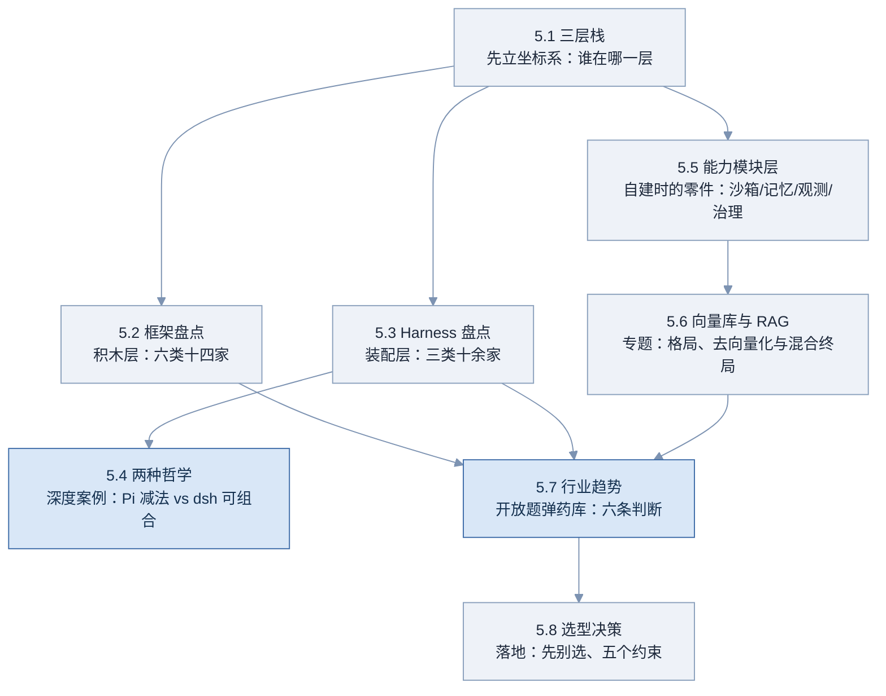
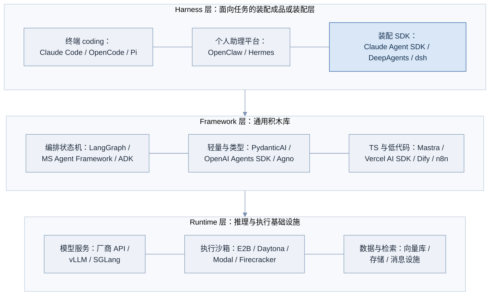
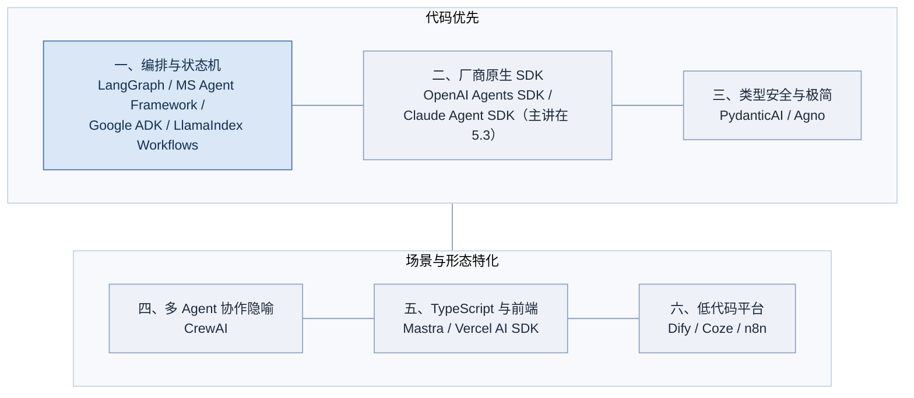
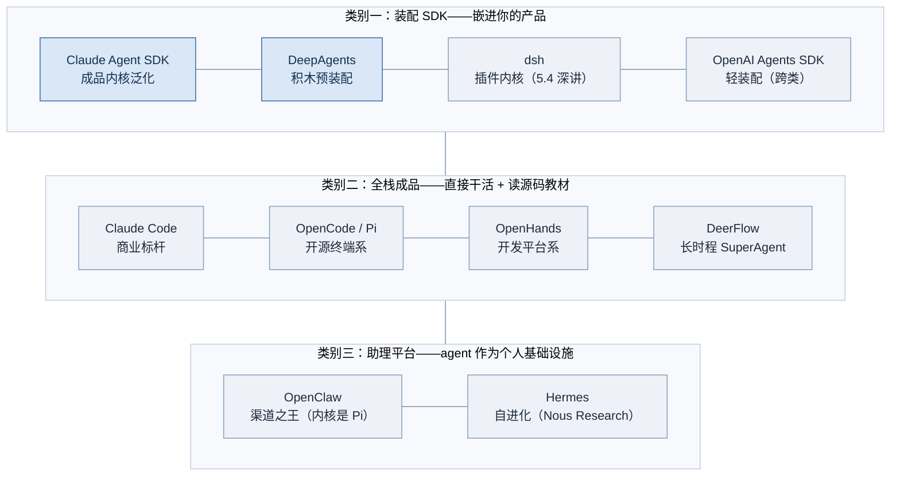
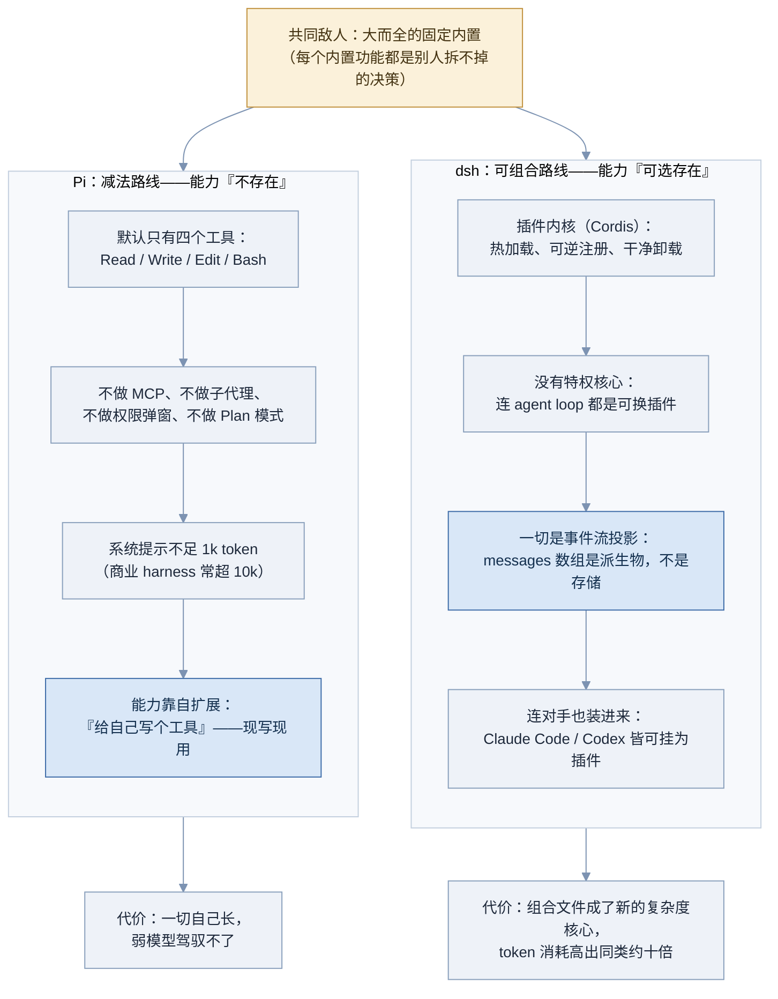
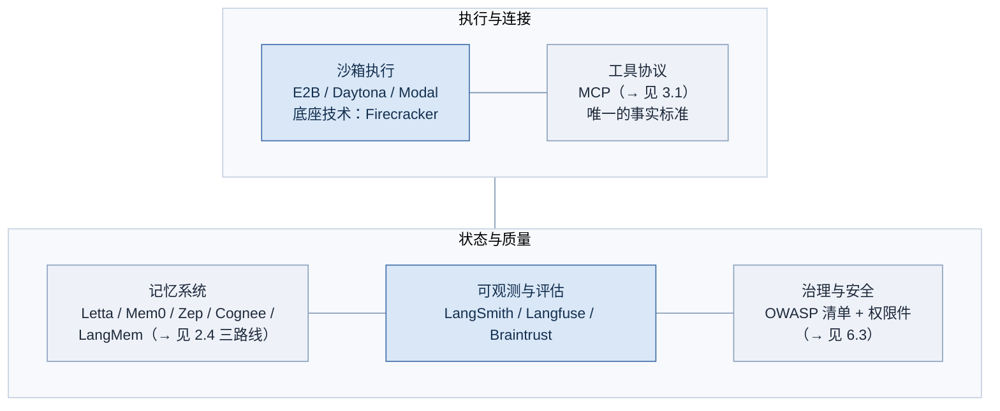
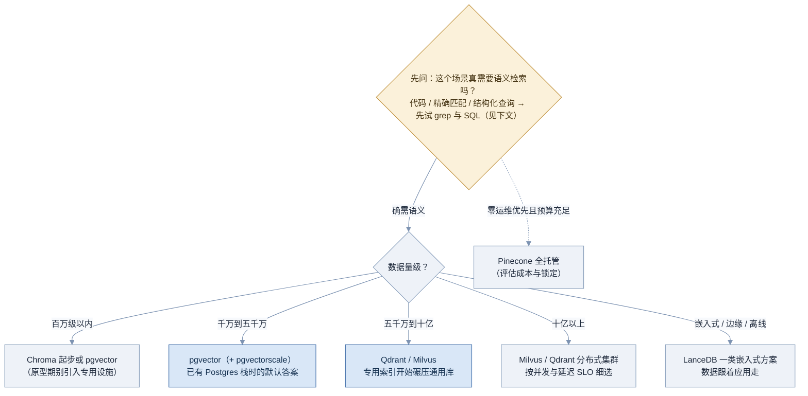
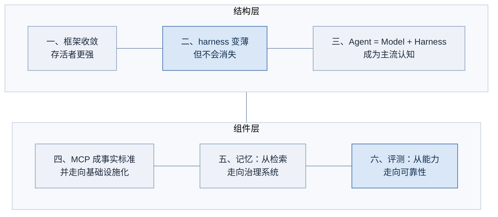
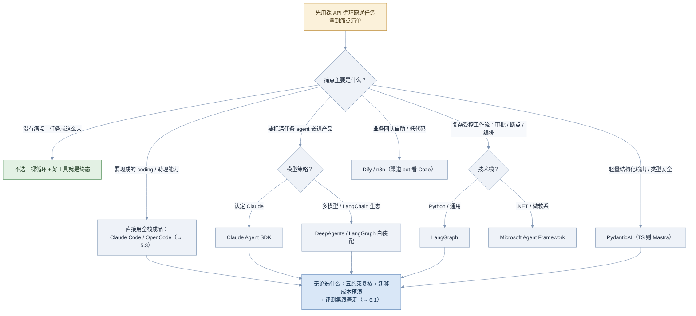

# 05 生态版图与选型

> 关键：本部分是全文档**时效性最强**的一部分，也是面试中「你有没有跟上行业」的直接考点。全部产品信息已于 **2026 年 8 月 28 日联网逐项复核**；star 数、版本号、融资与归属仍会持续变化，面试前建议再扫一遍速查表（→ 见附录）复核。每个产品都按「定位、强在哪、弱在哪、什么时候选它」四件套来写——只会报菜名对面试没有帮助。

**图 05-1 Part 05 知识脉络**



---

## 5.1 framework / runtime / harness 三层 🟢

> 一句话：把生态里的任何一个名字放进「运行时 → 框架 → Harness」三层坐标系，是聊版图的第一步——层没对齐，一切对比都是鸡同鸭讲。

### 为什么需要它

生态名词爆炸的年代，最常见的无效争论就是**跨层对比**：「LangGraph 和 Claude Code 哪个好？」——这个问题就像「乐高和宜家书桌哪个好」：一个是积木，一个是成品，根本不构成选择关系。面试官抛出这类问题，考的往往不是答案，而是**你会不会先把层次立起来**。

坐标系还有第二个用途：4.5 讲过 harness 的广狭两义，生态里大量产品的自我介绍恰恰故意骑在层间的模糊地带（「framework」「SDK」「kernel」「platform」混着叫）。有了三层图，你能一眼看穿每家的真实位置和它想占的位置。

### 核心原理

**图 05-2 三层技术栈与代表产品（数据截至 2026 年 8 月，面试前建议复核）**



三层从下往上读：**Runtime** 提供算力与执行的物理现实——模型推理（自建用 vLLM / SGLang 这类推理引擎，1.4 讲的 KV Cache 就活在这里）、代码执行沙箱、存储检索；**Framework** 提供搭 agent 的通用积木——循环抽象、状态管理、工具接口、编排原语，特点是**不预设你要造什么**；**Harness** 是面向具体任务形态的装配结果——要么是直接可用的成品（Claude Code），要么是「预装配好、开箱即得一个能干活的 agent」的装配层 SDK（深色格，本层最值得盯的位置）。

> 注意：边界是流动的，而且流动本身是重要考点。三个典型的跨层故事——**Claude Agent SDK 是从成品向下沉淀的框架**（Claude Code 的内核被抽出来开放，成品反哺积木）；**DeepAgents 是框架向上长出的成品形态**（LangChain 在 LangGraph 积木上预装了计划、文件系统、子代理，自称「电池全含的 agent harness」）；**dsh 干脆自称 kernel**，卡位在比 harness 更低、比 runtime 更高的位置，宣称连 agent loop 都是可换插件（→ 见 5.4）。面试里能讲出「层间双向流动」这个动态，比背静态分层图高一档。

与 4.5 的分工提醒：那里讲 harness 的**定义与组件**（工程视角），这里讲**谁在哪一层**（版图视角），互为表里。

### 工程实现

给任何一个新产品定层的三问判定法（伪代码）——面试现场遇到没见过的名字也能用：

```text
问一：它离开「具体任务形态」还成立吗？
    成立（通用积木，不预设用途）→ Framework
    不成立（生来就是 coding agent / 助理 / 研究员）→ Harness 候选

问二：它交付的是「能力」还是「算力与执行」？
    推理、沙箱、存储、网络 → Runtime

问三：拿到手之后，到「一个能干活的 agent」还差多少？
    差全部装配（要自己写循环、接工具）→ Framework
    差配置与扩展（开箱有循环、有工具、有权限）→ Harness（装配层 SDK）
    什么都不差（直接可用）→ Harness（成品）

骑墙者按「主要收入/主要用法」归层，并说明它骑在哪两层之间
```

### 常见坑

- 跨层对比——「LangGraph vs Claude Code」这种问题不先纠层次就直接答
- 把 Claude Agent SDK 当普通框架——漏掉「成品内核泛化」的出身，就讲不出它为什么开箱即有完整 harness 能力
- 把推理引擎（vLLM）和框架（LangGraph）混为一谈——一个管算力一个管积木
- 认为分层是静态的——讲不出双向流动的案例
- 被产品自我宣传的层次话术带跑——「kernel」「platform」都要用三问法重新定位
- 忽略沙箱在 Runtime 层的位置——安全设计（→ 见 6.3）从这层长出来

### 面试怎么答

**高频问题**：

- 「framework、runtime、harness 怎么区分？各举两个例子。」
- 「LangGraph 和 Claude Code 是竞争关系吗？」
- 「Claude Agent SDK 算框架还是 harness？」

**好答案要点**：

- 三层各给一句职责定义 + 两个例子，白板画出图 05-2 的骨架
- 「积木 vs 成品」类比拆掉跨层对比题，再补一句「真正的对比应该发生在同层之间」
- Agent SDK 类问题用「从成品沉淀的装配层」作答，顺势讲层间双向流动的三个案例
- 主动提歧义：广义 harness（模型之外的一切）与狭义（framework 之上的装配层）并存（→ 4.5）

**减分点**：

- 三层说不出判定标准，只会背例子
- 不知道 Agent SDK 与 Claude Code 的关系
- 把「它是什么层」当成固定属性，讲不出演化

### 练习题

**1. 归层题。** 把下列产品放进三层（允许骑墙，但要说明骑在哪）：vLLM、LangGraph、Claude Code、E2B、DeepAgents、dsh、Dify、pgvector。

<details>
<summary>参考答案</summary>

vLLM：Runtime（推理引擎）。LangGraph：Framework（编排积木）。Claude Code：Harness 成品。E2B：Runtime（执行沙箱）。DeepAgents：Harness 装配层 SDK（骑在 Framework 之上——它就是 LangGraph 积木的预装配）。dsh：自称 kernel，按三问法是「装配层 SDK，但把装配本身也做成了可换件」，骑在 Framework 与 Harness 之间（→ 见 5.4）。Dify：Framework 层的低代码平台形态（也可辩为「面向业务应用的装配平台」——答出理由即可）。pgvector：Runtime（数据与检索）。本题要点不是唯一答案，而是每个判断都给出三问法的依据。

</details>

**2. 拆题题。** 面试官问：「你们为什么不用 LangGraph 而是用 Claude Agent SDK？」这个问题有什么陷阱？怎么答出层次感？

<details>
<summary>参考答案</summary>

陷阱：两者不完全同层——LangGraph 是通用编排积木，Agent SDK 是预装配的 harness 层 SDK，直接比功能清单会驴唇不对马嘴。层次感答法：先摆坐标（「一个给我零件，一个给我装好的底盘」），再把问题翻译成真正的决策：我们是想**自己控制装配**（需要精细编排、多模型、已有 LangChain 资产 → LangGraph），还是想**买下装配直接扩展**（接受其默认循环与上下文管理、要 Claude 深度优化 → Agent SDK）。最后补条件反转：「如果我们的场景是复杂审批工作流，我会反过来选。」——选型题的满分模板永远是「结论 + 条件 + 反转条件」（→ 见 5.8）。

</details>

### 延伸阅读

- [Anthropic: Building Agents with the Claude Agent SDK](https://www.anthropic.com/engineering/building-agents-with-the-claude-agent-sdk) —— 「成品内核泛化」路线的一手说明
- [LangChain: Deep Agents](https://www.langchain.com/deep-agents) —— 「框架长出成品形态」路线的一手说明
- [DeepSeek Harness 官网](https://deepseekharness.io/) —— 「kernel」卡位的自我表述（→ 见 5.4）

---

## 5.2 主流 Agent 框架盘点 🟡

> 一句话：框架层已从百家争鸣进入收敛期——按六类划分记住十四个名字的「定位与取舍」，比记住一百个名字有用得多。

### 为什么需要它

这是面试「广度题」的主战场：「你了解哪些 agent 框架？各有什么取舍？」答得好与答得平庸的分界线非常清楚——平庸的候选人报菜名，好的候选人**每个名字都带着定位、强弱和适用场景**，并且能讲出正在发生的收敛。本章全部信息复核于 2026 年 8 月 28 日（面试前建议再核对版本与状态）。

### 核心原理

先立地图。十四个框架按定位分成六类：

**图 05-3 Agent 框架生态：六类版图（数据截至 2026 年 8 月，面试前建议复核）**



**第一类：编排与状态机层**——把 agent 建模为显式的图 / 工作流，卖点是控制与可靠。

- **LangGraph**（LangChain 家；Python / JS；2025 年 10 月随 LangChain 1.0 进入 1.x 稳定线；开源 MIT，另有商业托管 LangGraph Platform）。**架构原语**：`StateGraph`（类型化共享状态）+ 节点（普通函数）+ 条件边（把 2.1 的 stop_reason 分支显式画成图）+ `Send` API（动态扇出做 map-reduce 并行——2.6 的领队-工人可直接用它实现）+ `checkpointer`（每步状态落库，SQLite / Postgres 皆可）+ `interrupt()`（「暂停等人批」是图的一等公民，4.4 审批门的原生化）+ 子图（图里套图，对应 2.5 子代理）。**强的机制根源**：checkpointer 让断点续跑、时间旅行调试、状态回放不需要外挂架构——别家要靠接 Temporal 才补得上的能力它是地基自带；公开生产案例最多（Uber、LinkedIn、Elastic 等都发过采用文章；数据截至 2026 年 8 月，面试前建议复核）。**弱的机制根源**：显式图是双刃剑——简单任务也得定义状态 schema、画节点连边，仪式感重；从旧版 LangChain 一路继承的抽象体系（Runnable 等）学习曲线仍被诟病。选它：多分支、要人审、要断点续跑的企业级工作流；不选它：一个 while 循环能解决的事（→ 见 5.8）。
- **Microsoft Agent Framework**（微软；.NET + Python；2025 年 10 月公开预览、2026 年 4 月 3 日正式 GA）。**出身**：AutoGen（微软研究院的多 agent 实验框架，star 曾达四万级）与 Semantic Kernel（面向 .NET 企业的编排库）合并——前者贡献 agent 抽象与群聊式协作，后者贡献企业件。**架构原语**：ChatAgent（单体 agent）+ Workflow（图式类型化编排）+ 线程化会话状态 + **中间件管道**（认证、内容过滤、审计的标准插入点——企业最认这个）+ 原生 OpenTelemetry 遥测 + 原生 MCP；A2A 互操作在路线图上。两栈 API 刻意对齐（.NET 与 Python 同构），方便混栈企业。**强**：合规与企业件最全（遥测 / 审批 / 中间件开箱），Azure 与 M365 集成零阻力。**弱**：GA 尚不足半年，教程与第三方集成的量级远小于 LangGraph；非微软栈团队缺乏引入动机。**必考背景**：独立的 AutoGen 与 Semantic Kernel 已进入维护模式、官方给出迁移路径——这次合并被普遍解读为「框架实验期结束、收敛期开始」的标志事件（→ 见 5.7 趋势一）。选它：微软 / .NET 栈企业，或 AutoGen / SK 存量团队。
- **Google ADK**（Agent Development Kit；Python / Java；2025 年 4 月 Cloud NEXT 发布、Python 版 v1.0 于 2025 年 5 月）。**架构原语**：`LlmAgent`（模型驱动决策）与三种**确定性 workflow agent**——`SequentialAgent` / `ParallelAgent` / `LoopAgent`（把 2.6 的编排模式直接做成类，教学上极清晰）+ 层级多 agent（agent 树、父子委派）+ Runner 执行环境 + 工具生态（内置 Google 搜索、代码执行，兼容 LangChain 工具）。与 **A2A 协议**（agent 间互操作，后捐入 Linux Foundation 治理）同族发布——Google 的野心是做「agent 之间的 MCP」（数据截至 2026 年 8 月，面试前建议复核）。**强**：Gemini 深度优化但保持模型无关；Vertex AI Agent Engine 提供托管部署；「LLM 决策 + 确定性编排」两类 agent 的概念切分干净。**弱**：社区与第三方生态厚度小于 LangGraph；绑 GCP 越深迁移越难。选它：GCP / Gemini 栈，或提前布局 A2A 互操作的团队。
- **LlamaIndex Workflows**（LlamaIndex 家；Python / TS；1.x 于 2025 年年中稳定）。**架构原语**：事件驱动——用 `@step` 装饰的步骤函数**订阅并发射类型化事件**，控制流不是画出来的图而是事件长出来的链；`Context` 承载跨步状态与流式输出；上层有 AgentWorkflow 提供现成的多 agent 编排。**强的机制根源**：血统——LlamaIndex 是数据 / RAG 框架的头部（解析、索引、检索件最全，LlamaParse 解析复杂版式文档是招牌，配 LlamaCloud 托管），Workflows 让「重检索管道」与「agent 决策」在同一生态闭环；事件驱动对异步、可扩展的管道形态天然合身。**弱**：作为纯 agent 编排的社区心智弱——多数人仍把它当「RAG 框架的编排配件」，通用 agent 场景案例薄。选它：合同分析、知识库问答这类文档密集应用；不选它：与文档无关的通用 agent。

**第二类：厂商原生 SDK**——模型厂自己出的官方装备。

- **OpenAI Agents SDK**（OpenAI；Python 先行、后补 TypeScript 版；2025 年 3 月发布，实验项目 Swarm 的生产化后继）。**架构原语**：`Agent`（instructions + tools + 结构化输出类型）+ `Runner.run()`（内置循环，2.1 被封装在这一行里）+ **handoffs**（把控制权移交给另一个 agent——移交本质是一种特殊工具调用，2.6 流水线模式的原语化）+ **guardrails**（输入 / 输出的并行校验器，违规即断路——4.4 护栏思想的框架内建版）+ sessions（会话状态持久化，SQLite 等后端）+ 平台侧 tracing UI 开箱即用；后续补上与 Temporal 的集成做持久化执行（数据截至 2026 年 8 月，面试前建议复核）。**强**：概念极少（官方自称「刚好够用的原语集」）、十分钟上手；与 OpenAI 平台（Responses API、内置 web search / file search 工具）咬合最顺。**弱**：编排表达力有限，复杂 DAG 要自己绕；「假定你用 OpenAI」的重力场真实存在——兼容第三方模型但体验降档。选它：OpenAI 深度用户要轻量多 agent；不选它：复杂受控工作流（回第一类）。
- **Claude Agent SDK**（Anthropic）。定位特殊：它同时是「厂商 SDK」和「通用 harness SDK」——从 Claude Code 内核泛化而来，开箱自带完整 harness 能力。本章记住定位即可，正面展开与对比表在 5.3。

**第三类：类型安全与极简派**——把工程手感当第一卖点。

- **PydanticAI**（Pydantic 团队；Python；V1 于 2025 年 9 月发布并承诺稳定 API）。**架构原语**：`Agent[Deps, Output]`——泛型签名把「注入什么依赖、输出什么类型」写进类型系统；`output_type` 结构化输出（底层走 1.1 的 schema 约束 / 工具兜底，且**校验失败自动带错误重试**——1.2「错误回灌自愈」的框架内建版）；`deps` 依赖注入（数据库连接、用户上下文以类型安全方式进入工具函数）；与 Logfire（同团队的 OTel 系观测产品）一键联动；后补 Temporal / DBOS 集成做持久化执行（数据截至 2026 年 8 月，面试前建议复核）。**强**：类型即文档、IDE 补全全程在线——「FastAPI 手感」不是比喻，是同一批人的设计品味；模型无关。**弱**：编排原语薄（复杂控制流要自己搭或叠 LangGraph）；无隐喻的空白画布对新手不友好。选它：Python 工程团队、出参必须结构化、重维护性的生产服务。
- **Agno**（前身 Phidata，2025 年初更名；Python）。**架构原语**：Agent / Team（多 agent 协作）/ Workflow 三层递进 + 内建记忆、知识（RAG）与大工具箱 + **AgentOS**——自带 FastAPI 运行时与控制面板（会话管理、监控、人审 UI），等于把 5.5 的一部分货架预装进框架。**卖点是性能**：设计上 agent 是超轻对象，官方宣称实例化微秒级、内存占用比图式框架低数量级（**厂商自测数字，引用必须带限定**）——适配「每个请求起一个新 agent」的高并发服务形态。**弱**：生态位夹在极简派与平台派之间，两头不靠；文档的营销浓度高于工程浓度，深度生产案例可见度低。选它：同时服务大量并发 agent 实例、在意冷启动与内存的多租户服务；不选它：单实例长任务（性能优势用不上）。

**第四类：多 Agent 协作隐喻**。

- **CrewAI**（独立公司，2023 年底开源、后独立融资发展；Python；自研栈、不依赖 LangChain；star 数万级，数据截至 2026 年 8 月）。**架构原语**：`Agent`（role / goal / backstory 三件套定义人设）+ `Task`（描述与期望产出）+ `Crew`（把 agents 与 tasks 编队）+ `Process`（sequential 顺序执行 / hierarchical——自动生成一个 manager agent 来派活，2.6 领队-工人的「傻瓜版」）+ 后补的 **Flows**（事件驱动确定性编排：`@start` / `@listen` / `@router` 装饰器——官方用行动承认了纯 crew 隐喻控制力不足）；企业版 AMP 平台做部署与观测。**强**：隐喻直观带来的上手速度断层领先，教程生态巨大——非工程背景一天能跑通多 agent demo。**弱的机制根源**：角色隐喻在需要精确控制流时漏水——hierarchical 模式下「manager 怎么分的活」不可控，调试要穿透框架自动生成的隐藏提示层；更隐蔽的坑：隐喻会**诱导你在不该多体的场景多体**（2.6 的判定清单形同虚设）。选它：快速原型与概念验证；上生产前用 2.6 重审，需要控制时迁 Flows 或第一类框架。

**第五类：TypeScript 与前端生态**。

- **Mastra**（Gatsby 创始团队的创业作，YC 系；TypeScript；1.0 于 2025 年末发布）。**架构原语**：`createWorkflow`（`createStep` / `.then()` / `.branch()` / `.parallel()` 链式确定性编排，带 **suspend / resume** 做人工审批——4.4 HITL 的 TS 落地）+ `Agent`（工具 + 记忆 + 多模态钩子）+ **内建 evals**（把 6.1 的评测做成框架件，TS 系独一份）+ RAG 件 + `mastra dev` 本地可视化调试台（agent / 工作流 / 评测一屏调试——DX 是它的核心竞争力）；底层模型路由复用 Vercel AI SDK 的 provider 生态（两者是叠层关系不是竞争）。**强**：TS 世界里「从原型到评测」链路最完整的正经框架。**弱**：TS 系 agent 的生产案例厚度整体弱于 Python 系；框架年轻，API 仍在快速演化（写代码前先对版本）。选它：TS / Node 团队要一套完整装备。
- **Vercel AI SDK**（Vercel；TypeScript；v5 于 2025 年 8 月、v6 随后进入 beta——版本节奏快，数据截至 2026 年 8 月，面试前建议复核）。**先摆正定位**：它首先是 **LLM 应用工具包**——`generateText` / `streamText` 统一各家 provider、`tool()` 类型安全工具定义、`useChat` 等 React hooks 把流式 UI 变成一行代码；v5 把消息拆成 **UIMessage / ModelMessage 两层**（前端展示态与模型输入态解耦——1.1 messages 工程化的一个精细决策）；v6 补上 `Agent` 抽象与工具审批门，才算正式踏进 agent 框架半步。npm 周下载量长期在同类断层第一（数据截至 2026 年 8 月）。**强**：前端接入的事实标准、provider 生态最全。**弱**：编排、持久状态、评测都不是它的领地——把它当完整 agent 框架用，长任务必撞墙。选它：Next.js 产品的 LLM 接入层与轻 agent；重编排时它当底层、上面叠 Mastra 或自建循环。

**第六类：低代码平台**——拖拽编排，面向更广人群。

- **Dify**（开源公司，自托管友好；star 十万级、同类开源断层第一，数据截至 2026 年 8 月）。**形态**：可视化画布编排（Chatflow 对话流 / Workflow 任务流两种）+ 知识库 RAG 管道（解析、分段、混合检索、重排全可视化配置）+ Agent 节点（在工作流中嵌入一个会自主用工具的 agent——「管道为主、agent 为客」的形态）+ 插件市场（v1.0 起插件化架构）+ 应用运营面板（日志、标注、反馈回流——运营闭环是被低估的亮点）。**强**：BaaS 式交付，搭完直接发布成 API 或网页应用；自托管满足合规；业务团队可自助。**弱**：画布表达复杂 agent 逻辑会失控（几十个节点的图没人维护得动）；深度定制要下钻源码，平台边界感强。选它：企业内快速交付 + 数据不出域 + 业务自助；不选它：以长循环自主 agent 为核心的产品。
- **Coze（扣子）**（字节跳动；2025 年 7 月开源 Coze Studio 与 Coze Loop，开源后数周内 star 冲至数万级、当年最快纪录之一，数据截至 2026 年 8 月）。**形态**：Bot 开发平台——可视化编排 + 插件商店 + 知识库 + 记忆变量 + **多渠道一键发布**（微信公众号 / 飞书 / 抖音系及海外渠道——渠道就是它的护城河）；Coze Loop 单独承担观测与评测（prompt 调试、trace、评测集——字节版的 6.1 / 6.2 货架）。**强**：C 端 bot 的分发链路无对手，中文模板与插件生态最厚。**弱**：深度工程场景不是主场——复杂工具链、代码级定制、非字节系渠道的出海都受限。选它：面向中文用户的对话 bot 快速上线与运营；不选它：工程主导的深任务 agent。
- **n8n**（德国公司；fair-code 许可；star 十万级、2025 年完成大额融资跻身独角兽行列，数据截至 2026 年 8 月）。**形态**：工作流自动化平台——几百个 SaaS 集成节点（十年积累的真家底）+ AI 能力以节点形式嵌入：AI Agent 节点（可挂工具与记忆）、LLM 调用节点、向量库节点。**强**：把 LLM 步骤织进现有企业自动化（审批流、数据同步、告警）零摩擦；自托管；「AI 前时代」的集成生态没人追得上。**弱**：世界观是「触发器驱动的管道」而非「自主长循环」——agent 是它的客人不是主人，4.4 的长任务工程（预算、验证、续跑）不在它的字典里。选它：企业自动化里加 AI 步骤；不选它：以 agent 为主体的产品。

> 注意：六类的边界同样在流动——收敛期的典型动作就是互相长出对方的能力（编排框架补极简入口、极简框架补编排、低代码补代码逃生舱）。判断一个框架的真实类别，看它的**默认路径**把你往哪带。

### 工程实现

两个最小示例对比「手感」——面试聊框架，能现场写出骨架比背特性列表可信十倍。LangGraph 的显式图（它卖的就是「控制流看得见」+ 检查点）：

```python
from langgraph.graph import StateGraph, MessagesState, START, END

def agent(state):                      # 节点一：调模型
    return {"messages": [llm.invoke(state["messages"])]}

def tools(state):                      # 节点二：执行工具
    return {"messages": run_tools(state["messages"][-1])}

def route(state):                      # 条件边：2.1 的 stop_reason 分支，显式化为图
    return "tools" if has_tool_calls(state["messages"][-1]) else END

g = StateGraph(MessagesState)
g.add_node("agent", agent)
g.add_node("tools", tools)
g.add_edge(START, "agent")
g.add_conditional_edges("agent", route, {"tools": "tools", END: END})
g.add_edge("tools", "agent")
app = g.compile(checkpointer=sqlite_checkpointer)   # 检查点 = durable execution（→ 见 4.4）
```

PydanticAI 的类型安全手感（它卖的是「出参是类型」）：

```python
from pydantic import BaseModel
from pydantic_ai import Agent

class Verdict(BaseModel):
    risk_level: str          # 输出契约用类型系统表达，而不是提示词乞求
    reasons: list[str]

reviewer = Agent("anthropic:claude-sonnet-5", output_type=Verdict,
                 system_prompt="你是代码安全评审员……")
result = reviewer.run_sync("评审这段 SQL 拼接代码…")
print(result.output.risk_level)       # 直接是 Verdict 实例，下游代码放心消费
```

再补两段，把厂商 SDK 与 TS 系的手感也收进来（两段均为骨架示意，API 形态随版本演进，写码前以官方文档为准）。OpenAI Agents SDK 的移交与护栏——多 agent 在它这里是「移交」不是「编排」：

```python
from agents import Agent, Runner

zh = Agent(name="中文客服", instructions="只用中文回答")
en = Agent(name="英文客服", instructions="Answer in English only")
triage = Agent(name="分诊", instructions="判断用户语言，移交给对应客服",
               handoffs=[zh, en])          # 移交 = 一种特殊的工具调用（2.6 流水线原语化）
result = Runner.run_sync(triage, "Where is my order?")
print(result.final_output)                  # 循环、移交、追踪全部内置
```

Mastra 的确定性工作流与人工审批——4.4 的 HITL 在 TS 里的样子：

```typescript
import { createWorkflow, createStep } from "@mastra/core/workflows";

const draft   = createStep({ id: "draft",   execute: async ({ inputData }) => writeDraft(inputData) });
const approve = createStep({ id: "approve", suspend: true });   // 挂起等人批（HITL）
const publish = createStep({ id: "publish", execute: async ({ inputData }) => doPublish(inputData) });

export const reportFlow = createWorkflow({ id: "weekly-report" })
  .then(draft).then(approve).then(publish)
  .commit();                                 // 确定性链 + 可挂起：与图式框架殊途同归
```

四段代码，四种世界观：**显式图买控制（LangGraph）、类型系统买确定（PydanticAI）、移交原语买简洁（OpenAI SDK）、链式工作流买 DX（Mastra）**。盘点里每一家的强与弱，根子都在它第一天选定的世界观里——面试聊框架，聊到这一层就赢了。

### 常见坑

- 报菜名不带取舍——「我知道 LangGraph、CrewAI、AutoGen」然后没了，等于没答
- 不知道 AutoGen 与 Semantic Kernel 已合并进 Microsoft Agent Framework、独立线进入维护模式——2026 年面试的时效性硬伤
- 把 Vercel AI SDK 当完整 agent 框架、把 n8n 当自主 agent 平台——定位错配
- 用 CrewAI 的 demo 体验推断生产表现——隐喻的甜头和 2.6 的多体成本要一起讲
- 只知 Python 系，TS 生态一片空白（前端团队面试官很在意）
- 分不清「框架能力」与「平台能力」——LangGraph（开源框架）与 LangGraph Platform（商业托管）是两码事，谈锁定风险时要分开
- 背 star 数当论据——数字会过期，趋势和定位才保值

### 面试怎么答

**高频问题**：

- 「你了解哪些 agent 框架？帮我分个类。」
- 「LangGraph 和 CrewAI 怎么选？」
- 「AutoGen 现在还能用吗？」
- 「TypeScript 团队搭 agent 用什么？」

**好答案要点**：

- 先给六类地图再点名，每个名字带四件套（定位 / 强 / 弱 / 何时选）
- LangGraph vs CrewAI 落在「显式控制 vs 隐喻上手」，再补「CrewAI 原型、LangGraph 生产」的常见迁移路径与 2.6 的多体判定
- AutoGen 题答合并时间线（独立线维护模式 → MS Agent Framework 2026-04 GA + 迁移路径），并升华到收敛趋势（→ 5.7）
- 主动声明信息时效（「截至我最近复核」）——这本身就是成熟度信号

**减分点**：

- 版图停留在 2024（还在把 AutoGen 当活跃独立框架讲）
- 说不出任何一个框架的弱点——只会安利的人没用过
- 六类里有整类空白（尤其低代码与 TS 生态）
- 分类混乱：把 harness（Claude Code）混进框架清单（→ 5.1 的层次功课）

### 练习题

**1. 场景配型题。** 三个团队各推荐框架并给理由：a）银行内部流程自动化，.NET 栈，强合规审批；b）五人 TS 创业团队做 AI 产品，要快也要能长大；c）Python 数据团队做合同解析问答，文档处理繁重。

<details>
<summary>参考答案</summary>

a）Microsoft Agent Framework：.NET 原生、企业件齐（遥测/中间件/状态）、合规审批用图式工作流表达；备选 LangGraph（若团队多语言）。b）Mastra：TS 全栈框架有完整成长路径（workflows/evals/playground）；若产品重前端流式体验，Vercel AI SDK 打底、Mastra 承编排的组合也常见。c）LlamaIndex Workflows：文档解析与检索是其祖传强项，事件驱动编排接管道自然；若检索简单而流程复杂，换 LangGraph。共同加分：每个推荐都补一句反转条件（什么情况下换掉它）。

</details>

**2. 时事题。** 「AutoGen 和 Semantic Kernel 的合并说明了什么？」——按「事实 → 直接原因 → 行业含义」三层作答。

<details>
<summary>参考答案</summary>

事实：微软将两条线合并为 Microsoft Agent Framework，1.0 于 2026 年 4 月 GA，独立的 AutoGen / SK 进入维护模式并提供迁移路径。直接原因：两者定位重叠（研究向多 agent vs 企业向编排），维持两套 SDK 的成本对微软没有意义，合并取长（AutoGen 的抽象 + SK 的企业件）。行业含义：框架层的实验期结束、收敛期开始——大厂用合并宣告「探索性框架」阶段落幕；对从业者的操作含义：选型时把「框架还会不会存在三年」列入约束（→ 见 5.8），学习时把精力从「多认名字」转向「吃透存活者」（→ 见 5.7 趋势一）。

</details>

**3. 反向题。** 什么情况下你会建议团队**不用任何框架**？

<details>
<summary>参考答案</summary>

三种情况：一，任务在 2.1 的最小循环 + 2.2 的好工具就能覆盖的复杂度内——四十行裸循环的可控性与可调试性胜过任何框架（4.5 与 5.8 的「先别选」立场）；二，团队要深度定制上下文管理与缓存策略（→ 1.5、4.3），框架的抽象层反而挡手；三，学习目的——先手写一遍循环再用框架，才知道框架在替你做什么。反转条件：一旦需要 durable execution、多人协作的工作流资产、托管运维，框架的边际价值开始为正。这题考的是「知道工具何时不该用」——与 2.6 的多体判定同一种成熟度。

</details>

### 延伸阅读

- [LangGraph 文档](https://langchain-ai.github.io/langgraph/) —— 显式图编排与检查点机制的权威参考
- [Microsoft Agent Framework 文档](https://learn.microsoft.com/en-us/agent-framework/) —— 合并后的统一 SDK 与迁移指南
- [PydanticAI 文档](https://ai.pydantic.dev/) —— 类型安全路线的代表作

---

## 5.3 主流 Harness 盘点 🟡

> 一句话：Harness 层看三类——拿来嵌进自己产品的「装配 SDK」、拿来直接干活也值得读源码的「全栈成品」、以及把 agent 做成个人基础设施的「助理平台」；这一层是当下生态里星光最密、变化最快的地方。

### 为什么需要它

如果说框架层已经进入收敛期，harness 层正处在**寒武纪大爆发**：过去十二个月里，这一层出现了整个 AI 生态最疯狂的增长数字（本章会看到几个六位数 star 的项目，全部诞生不到一年）。对这个岗位，harness 盘点比框架盘点更贴身——**你面的就是造这层东西的职位**。而且全栈 harness 的源码是最好的教材：本文档 Part 02–04 讲的每个机制，都能在它们的代码里找到对应实现。本章信息复核于 2026 年 8 月 28 日（面试前建议复核，这一层的数字以周为单位在变）。

### 核心原理

**图 05-4 Harness 生态：三类版图（数据截至 2026 年 8 月，面试前建议复核）**



**类别一：装配 SDK**——给你一个装好的底盘，往上盖你的产品。

- **Claude Agent SDK**（Anthropic，Python / TypeScript）。定位：把 Claude Code 的内核开放成 SDK——循环、上下文管理（含自动压缩）、工具执行、权限模式、子代理、skills / MCP / hooks 装载，全部开箱即有。强：**生产验证最充分的装配层**（它就是 Claude Code 每天在亿万次会话里跑的那套），与 Claude 系模型的缓存、thinking、工具协议深度咬合。弱：Claude 优先的重力场——换模型不是它的设计目标；默认形态是「单会话进程」，服务化多租户要自己包一层。选它：认定 Claude、要最短路径拿到生产级 agent 能力、愿意接受其默认装配。
- **DeepAgents**（LangChain；Python 与 JS 双仓；2025 年年中发布后快速迭代）。定位：官方口号「batteries-included agent harness（电池全含）」——公开承认灵感来自 Claude Code / Deep Research 一类「深任务 agent」的共性套路，把它们泛化到 LangGraph 之上。**预装了什么**（每件都对应本文档一章）：`write_todos` 计划工具（2.3 TodoWrite 的开放实现）+ **虚拟文件系统**（ls / read / write / edit 四工具，后端可选内存态、真实磁盘或远端 Store——4.2 Write 象限的框架化，且沙箱化后端天然更安全）+ `task()` 子代理机制（2.5，含上下文隔离与工具收窄）+ 长期记忆钩子（跨线程 Store，2.4）+ 可插 middleware（自定义压缩、审批等，4.3 / 4.4 的插入点）；配套 deepagents-cli 可直接当终端 agent 用。**强**：模型无关；继承 LangGraph 全套检查点 / durable execution / interrupt 人审；与 LangSmith、LangGraph Platform 无缝。**弱**：后发路线，装配打磨深度与生产里程数仍在追 Claude Code 系；抽象叠在 LangGraph 上，调试要多穿一层。选它：多模型策略、已有 LangChain 资产、要把深任务 agent 嵌进自家产品。
- **OpenAI Agents SDK**：5.2 已盘，在本层的身份是「轻装配」——有循环有移交有护栏，但计划 / 文件系统 / 压缩这些深任务件不在默认装配里，深度上介于框架与 harness 之间。

方案里点名要的正面对比，放在一起看（数据截至 2026 年 8 月，面试前建议复核）：

| 维度 | Claude Agent SDK | LangChain DeepAgents |
|---|---|---|
| 模型绑定 | Claude 优先，深度咬合缓存 / thinking / 工具协议 | 模型无关，任何 LangChain 支持的模型 |
| 装配来源 | 成品下沉：Claude Code 内核直接开放 | 积木上浮：LangGraph 之上预装计划 / 文件系统 / 子代理 |
| 沙箱与权限 | 内建权限模式（审批 / 白名单 / hooks），执行环境自带 bash 工具链 | 依赖部署侧与 LangGraph 运行时；权限靠自建或平台能力 |
| 多租户 / 服务化 | 单会话进程模型，服务化自己包（或用其托管形态） | LangGraph Platform 提供托管多租户与持久化 |
| 状态与恢复 | 会话内自动压缩续命；持久化靠外层 | 检查点 / durable execution 是 LangGraph 原生强项 |
| 生产案例 | Claude Code 本身即最大案例；大量产品直接内嵌 | LangChain 生态部署面广；「深任务」形态较新 |
| 一句话选型 | 认 Claude、要开箱生产级、接受默认装配 | 要换模型自由、要工作流级可控、已在 LangChain 生态 |

**类别二：全栈成品**——可直接干活，更是读源码的教材（每个都值得对照 Part 02–04 读）。

- **Claude Code**（Anthropic；2025 年 2 月研究预览、5 月 GA，同年下半年 subagents、hooks、skills、plugins 密集落地，2.x 引入检查点与回滚（/rewind）；形态从终端扩展到 IDE 插件、Web / 移动端与 SDK；商业上是 Anthropic 增长最快的产品线之一，外媒报道其年化收入 2025 年内即达数亿美元量级——数字引用务必带时效，数据截至 2026 年 8 月）。**机制存货清单**（本文档一路引用的一手来源）：TodoWrite 计划（2.3）、auto-compact 自动压缩（4.3）、subagents（2.5）、skills 渐进披露（3.2）、hooks 确定性拦截（3.3）、plugins 打包分发（3.3）、CLAUDE.md 项目记忆（2.4 文件级路线）、权限模式与审批门（4.4）、MCP 全形态支持（3.1）。**取舍**：机制最完整、与 Claude 模型的缓存 / thinking 协同最深、插件生态最厚；闭源读不到实现（但官方工程博客与文档的披露密度业内最高，逆向分析文章也成体系）、深绑 Claude。**对本岗位**：它是机制的活字典——面试官问任何机制，拿它举例最安全；把它的机制逐个讲清，本身就是最强弹药。
- **OpenCode**（SST 团队；TypeScript；MIT；star 数万级，数据截至 2026 年 8 月）。**架构**：client / server 分离——agent 逻辑跑在 server 进程，终端 TUI 只是客户端之一，因此可远程连接、可多端接同一会话（官方演示过手机遥控家里跑的任务）；provider 无关（各家 API 与本地模型皆可）；**LSP 集成**给代码理解加确定性信号（语言服务器的跳转 / 诊断喂给 agent——比裸 grep 高一档的代码感知）；会话可分享成网页链接。**生态注脚**：早期与 Charm 团队因理念分歧分家，后者另起 Crush——开源 coding agent 赛道竞争密度的缩影。**取舍**：开源里体验最接近商业品的一档；记忆与技能这类深机制比 Claude Code 浅一档。选它：要开源、要换模型自由的终端 agent。读它：看 client/server 边界怎么切、多 provider 抽象怎么做。
- **Pi**（earendil-works / Mario Zechner，即知名开源人 badlogic；TypeScript 单仓五个发布包：pi-ai 多厂商模型层 / pi-agent-core 运行时 / pi-coding-agent CLI / pi-tui 终端 UI / pi-telemetry 遥测契约——包结构本身就是 harness 分层的教学示范；2025 年 8 月首次提交，star 近十万级；工程洁癖出名：依赖全部钉死版本、CI 跑签名审计、发布带 shrinkwrap——供应链安全（6.3）在 harness 层的示范生，数据截至 2026 年 8 月）。定位：**极简主义的旗帜**——四个工具、千 token 级系统提示的终端 coding agent 兼可嵌入 SDK；被 OpenClaw 选为执行内核后成为「极简内核 + 厚生态皮」分工的中心件。5.4 深讲设计哲学，这里记住它在本类的身份：全栈成品里「最小可读」的教材——读完 Pi 再读别家，你会自动开始问「这个功能真的需要吗」。
- **OpenHands**（All Hands AI；前身 OpenDevin，2024 年 10 月改名；Python；star 数万级、SWE-bench 系榜单常驻选手，数据截至 2026 年 8 月）。**架构的教学价值极高**，两个核心设计都值得单独记：一，**事件流架构**——agent 的每个动作（action）与环境的每个反馈（observation）都是流上的事件，会话状态由事件流重建；与 dsh 的 append-only 事件流、2.4 的 raw event log 三者同构，面试可连成一条线讲「状态即事件流」的谱系。二，**CodeAct 范式**——模型的「行动」直接是一段可执行代码（Python / bash），而不是从离散工具菜单里点菜；等于把 2.2 的工具粒度问题推到另一极端（一个万能工具 vs 一堆专用工具），换来组合表达力、付出安全面扩大的代价（→ 6.3）。此外：每会话独立 Docker 沙箱运行时（6.3 隔离原则内建）、带浏览器操作、配套评测 harness 覆盖数十个 benchmark（6.1 流水线在研究侧的对应物）。**取舍**：能力面与研究生态最宽；平台形态重，个人日用不如终端系轻快。读它：看事件流与 CodeAct 的真实实现。
- **DeerFlow**（字节跳动开源；2025 年 5 月发布，MIT）。**架构**：基于 **LangGraph** 的多 agent 图——coordinator（接需求）→ planner（产出计划，人可中途修改——4.4 HITL）→ research team（researcher 查证 + coder 执行代码）→ reporter（成稿），是 2.6 领队-工人模式一比一的开源落地，读图即可对号入座。**演化**：从最初的「深度研究框架」扩展为**长时程 SuperAgent harness**——官方定位已是「research、code、create 皆可，凭沙箱、记忆、工具、技能、子代理与消息网关处理分钟级到小时级任务」（数据截至 2026 年 8 月）。**取舍**：长时程任务的工程件最集中的中文系开源（4.3 压缩、4.4 验证与续跑的集成现场）、中文社区影响力大；形态庞大、二次开发学习成本高。选它：要一个「什么都能干一点」的长任务底座；读它：看长时程工程课题在真实系统里的集成方式。

**类别三：助理平台**——把 agent 做成「个人的持续存在的基础设施」，接管消息、日程、生活流。

- **OpenClaw**（社区组织维护；TypeScript；起源于 2025 年 8 月的个人项目、经数次更名后定名 OpenClaw；至 2026 年中 star 约 37 万——GitHub 历史级增长速度，数据截至 2026 年 8 月）。定位：现象级个人 AI 助理平台。**架构**：单进程消息网关接入 25+ 渠道（WhatsApp / Telegram / Slack / Discord / iMessage / Teams / Matrix 等）+ 语音（桌面与移动端）+ 实时 canvas 渲染 + 技能系统（社区技能市场生态活跃）；**执行内核不自研**——直接调用 Pi 的 `pi-agent-core` 会话原语（`createAgentSession()`），把全部力气花在渠道、体验与技能生态这层「皮」上。「皮厚核薄」的分工是整个生态最有讲头的架构故事（5.4 展开）。**安全注脚**：个人助理形态把 6.3 的攻击面放到最大——每个消息渠道都是不可信输入入口，其安全实践在社区争议不断，面试聊它时这是一手的批判性谈资。**弱**：全平台形态、不可嵌入你自己的产品；能力边界随社区技能质量波动。
- **Hermes**（Nous Research——以开源模型闻名的团队跨界做 harness，注意与其同名模型系列区分；2026 年 3 月首次提交，两个月内 star 从 8 万级冲到 17 万级，数据截至 2026 年 8 月）。定位：**自进化**助理 harness。**核心机制「闭环学习」**：任务结束 → agent 复盘经验、自主生成或修订技能文件 → 下次任务自动装载——等于把 3.2 的技能机制从「人写给 agent」升级成「agent 写给自己」的自动生产线（与 5.4 Pi 的自扩展同属一个思想族：能力从模型产出中涌现）。**工程亮点**：**七种可切换执行后端**（本地 / Docker / SSH / Singularity / Modal / Daytona / Vercel Sandbox——把 5.5 的沙箱货架做成了运行时选项，科研场景的 Singularity 都照顾到了）；经 OpenRouter 接 200+ 模型；网关进程同时挂多渠道并保持会话连续；兼容 agentskills.io 技能标准。**弱**：自进化 = 更高 token 消耗 + 行为漂移风险，「自动生成的技能谁来审」是它给行业出的新治理考题（→ 6.1 评测、6.3 供应链）。选它：想要「越用越懂你」的个人 agent；读它：自进化技能循环的一手实现。

> 注意：类别三的爆发是 2026 年生态最重要的新变量——它说明 harness 的战场正从「开发者工具」扩展到「个人基础设施」。面试聊到「行业往哪走」，这是一手好牌（→ 见 5.7）。

### 工程实现

装配 SDK 的手感对比。Claude Agent SDK 的 TypeScript 形态（方案要求本章补 TS）——注意你写的不是循环，而是**对既有 harness 的配置**：

```typescript
import { query } from "@anthropic-ai/claude-agent-sdk";

// 循环、上下文管理、压缩、权限全部内置——你只声明任务与边界
for await (const message of query({
  prompt: "找出 src/ 里所有对废弃 API 的调用，生成迁移清单",
  options: {
    allowedTools: ["Read", "Grep", "Glob"],   // 权限收窄（→ 见 2.5）
    permissionMode: "default",                 // 敏感操作走审批门（→ 见 4.4）
    maxTurns: 30,                              // 步数预算（→ 见 4.4）
  },
})) {
  if (message.type === "result") console.log(message.result);
}
```

DeepAgents 的 Python 形态——同样是声明式，但底座是 LangGraph 图：

```python
from deepagents import create_deep_agent

agent = create_deep_agent(
    tools=[internet_search],                  # 你的领域工具
    system_prompt="你是尽职调查研究员……",       # 4.1 的功课
)
# 「电池全含」：计划 todo 工具、虚拟文件系统、子代理已预装（对应 2.3 / 2.5）
result = agent.invoke({"messages": [{"role": "user", "content": "调研公司 X 的供应链风险"}]})
```

两段代码的共同点是本层的本质：**装配 SDK 把 Part 02–04 的工程课题变成了默认值**。读它们的源码（DeepAgents 开源、Agent SDK 有详尽文档）时的正确问题是：「它替我做了哪些决策？默认值是什么？我能改哪些？」

### 常见坑

- 把 harness 盘点讲成框架盘点——三类划分（装配 SDK / 全栈成品 / 助理平台）都说不出
- 不知道 OpenClaw 的内核是 Pi——错过整个生态最有讲头的架构故事
- 把 Hermes 当模型讲（Nous Research 也出 Hermes 系模型）——2026 年语境下先按 harness 理解，注意歧义
- 对比 Agent SDK 与 DeepAgents 只会说「一个 Anthropic 一个 LangChain」——上面表格的七个维度才是内容
- 读源码不挑对象——上来啃最大的，正确路线是从最小的读起（见练习 2）
- star 数当质量指标——它度量的是传播，不是工程成熟度；两者都要看但别混用
- 忽略助理平台类的崛起——版图认知停在「harness = coding agent」

### 面试怎么答

**高频问题**：

- 「主流的 harness 都有哪些？怎么分类？」
- 「Claude Agent SDK 和 DeepAgents 怎么选？」
- 「想深入理解 harness，你会从哪个项目读起？为什么？」
- 「最近 harness 生态有什么让你印象深刻的事？」

**好答案要点**：

- 三类划分开场，每类两三个代表带四件套；数字加「截至复核时」的时效声明
- SDK 对比按表格的维度走：模型绑定、装配来源、沙箱权限、多租户、状态恢复、生产案例——七个维度比一句站队专业得多
- 读源码路线给出「由小到大」：Pi（最小可读）→ OpenCode（产品级架构）→ DeerFlow（长时程工程）→ dsh（架构极端案例），并说明每一步看什么
- 「印象深刻」题的好答案：OpenClaw 嵌 Pi 的皮核分工、Hermes 的自进化技能、或 dsh 的发布（两周前）——一手时事 + 自己的判断

**减分点**：

- harness 只知道 Claude Code 一个
- 讲不出任何一个开源项目的架构特点
- 对 2026 年的助理平台爆发一无所知
- 数字张嘴就来不带时效限定

### 练习题

**1. 选型题。** 三个需求各选什么：a）SaaS 公司要在自家产品里嵌一个「数据分析 agent」，模型策略是多家混用；b）个人开发者想要一个终端 coding agent，坚持开源且要接本地模型；c）团队认定 Claude，要六周内上线一个客服工单处理 agent。

<details>
<summary>参考答案</summary>

a）DeepAgents（或裸 LangGraph 自装配）：嵌入产品 + 多模型是它的主场；若「分析」重工作流审批，直接 LangGraph。b）OpenCode：开源、provider 无关、终端形态成熟；极简偏好者选 Pi（并接受自己动手扩展）。c）Claude Agent SDK：认定 Claude 前提下的最短生产路径，权限模式与审批门开箱即用，客服场景的敏感操作（退款、改单）正好用上（→ 4.4 审批门）。每题的反转条件都值得口头补上——b 若日后要接消息渠道，OpenClaw 的平台形态反而合适。

</details>

**2. 学习路线题。** 「读 harness 源码」的四步路线（Pi → OpenCode → DeerFlow → dsh），说出每一步分别该看什么。

<details>
<summary>参考答案</summary>

Pi：看**最小完备**——四工具循环怎么写、千 token 系统提示怎么省、没有那些「标配功能」时任务怎么完成；建立「什么是必要复杂度」的基线。OpenCode：看**产品级架构**——client/server 分离、多 provider 抽象、TUI 状态管理；对照 2.1 / 2.2 找循环与工具层。DeerFlow：看**长时程工程**——沙箱、记忆、子代理、消息网关如何集成，4.3 / 4.4 的课题在真实系统里的形状。dsh：看**架构极端**——「一切皆插件」推到头长什么样、事件流投影出消息数组的设计（对照 2.4 raw log）。顺序的逻辑：先知道多小能活，再看多大算好，最后看极端设计的代价（→ 5.4）。

</details>

**3. 判断题。** 「OpenClaw 37 万 star，是不是说明它的 harness 技术最强？」——怎么答？

<details>
<summary>参考答案</summary>

不能这么推。第一层：star 度量传播与需求共鸣，不度量工程质量——OpenClaw 的爆发说明「个人 AI 助理」需求被点燃，这是产品洞察的胜利。第二层（关键）：OpenClaw 的执行内核恰恰**不是自研**，而是嵌入 Pi——它把力气花在渠道、语音、技能生态这些「皮」上，把「核」外包给了专业的极简 harness。所以这个案例真正说明的是：**harness 生态开始出现专业化分工**（内核与体验分层），这比「谁最强」有价值得多。收尾可引 5.7：分工出现是生态成熟的标志。

</details>

### 延伸阅读

- [langchain-ai/deepagents 仓库](https://github.com/langchain-ai/deepagents) —— 「电池全含」装配层的完整源码
- [earendil-works/pi 仓库](https://github.com/earendil-works/pi) —— Pi 的单仓源码（pi-mono），五个发布包（pi-ai / pi-agent-core / pi-coding-agent / pi-tui / pi-telemetry）
- [bytedance/deer-flow 仓库](https://github.com/bytedance/deer-flow) —— 长时程 SuperAgent harness 的一手材料

---

## 5.4 两种 Harness 哲学：减法 vs 可组合 🟡

> 一句话：Pi 用「不做」实现薄，dsh 用「做成可拆的」实现薄——两条路线共同反对「大而全的固定内置」，分歧只在能力应该「不存在」还是「可选存在」。这是 4.5 厚薄之争在 2026 年的两个极端标本。

### 为什么需要它

「harness 应该做多厚」是这个岗位最有含金量的开放题（→ 见 4.5）。空谈立场没有说服力，**用两个真实产品的设计决策对打**才是高分答法。2026 年的生态恰好提供了一对完美标本：一个把减法做到极致（Pi），一个把可组合做到极致（dsh，两周前刚发布就引爆生态）。把这对案例吃透，厚薄之争、Bitter Lesson、生态分工三个话题一次全通。本章事实复核于 2026 年 8 月 28 日（面试前建议复核）。

> 本章只讲哲学对打的骨架。两个产品的完整架构解剖——Pi 的包分层、会话树与自扩展闭环，dsh 的 Cordis 内核、事件流投影与组合系统，以及逐维对比大表——单独成篇，→ 见 专题《Pi 与 dsh 架构深潜》。

### 核心原理

**图 05-5 两种「薄」的实现：减法路线 vs 可组合路线（数据截至 2026 年 8 月，面试前建议复核）**



**Pi 的减法**（Mario Zechner，earendil-works）。每一条「不做」都有明确的账：

- **不做 MCP**：理由直接是 3.1 的功课——MCP 全量挂载的工具定义可吃掉上万 token 的常驻上下文（作者博客引用的数字是最高 1.37 万 token）。替代路线有两条：能力做成**外部 CLI 工具**配文档，agent 需要时才读；或走官方技能系统——Pi 实现了 agentskills.io 技能标准，常驻上下文的只有技能名与一行描述（与 3.2 Skills 同一机制）。两条路都指向按需披露。
- **不做子代理、权限弹窗、Plan 模式**：YAGNI（You Aren't Gonna Need It）——这些是「某些任务需要」的功能，不该是「所有任务都背着」的默认。
- **深色格是它的绝招——自扩展（self-extension）**：需要新能力时，指令是「给自己写一个控制 Chrome 的工具」，agent 现场分析、编码、保存、立即使用。**能力不是预装的集成，而是模型代码生成的涌现**——这是对「模型越强、harness 越薄」的最激进押注（→ 见 4.5 Bitter Lesson）。
- 结果：系统提示加工具定义合计千 token 级（商业 harness 常超万级），换来极低的固定成本与极高的可审计性；被 OpenClaw 选为执行内核，验证了「极简内核 + 厚生态皮」的分工可行。

**dsh 的可组合**（DeepSeek，2026-08-13 发布，十天 18 万 star、至 8 月末约 20 万）。它不做减法——它把「拆得掉」做成了架构：

- **插件内核**：整个系统跑在 Cordis 插件框架上，插件注册服务、类型化事件与**可逆效果**，卸载时干净回退（不留监听器、不留半注册的工具）——热加载与跨进程组合由此可行。
- **没有特权核心**：最激进的一条——**agent loop 本身也是插件**，可以整个换掉。对照 2.1：别家把循环当地基，dsh 把循环当可选件。
- **事件流架构**（深色格）：「凡是模型可见的都被记录」——一切进入模型请求的内容都可从一条 append-only 事件流重建；**messages 数组是投影出来的派生物，不是存储本身**。fork、重放、审计、遥测全部变成对同一条流的不同投影。这与 2.4 的 raw event log 原则、6.2 的可观测诉求同构，是把「原始层不可再生」推到架构地基的做法。
- **连对手也装进来**：Claude Code 与 Codex 由官方适配插件（subagent-claude-code / subagent-codex）挂为 dsh 的子代理；官方模型适配器之一 `llm-pi-ai` 直接依赖 **Pi 的 pi-ai 库**（与自家 llm-deepseek 并列）——两条哲学路线在底层共享零件，生态互嵌的绝佳注脚。
- 代价同样真实（发布两周已可见）：约 25 万行源码、270+ 个包的复杂度（2026-08-28 仓库实测）；组合描述文件成了「新的核心复杂度」；社区实测 token 消耗高出同类约十倍；第三方插件兼容性开始出现破裂——**可组合不是免费的，它把复杂度从「内置功能」搬进了「组合关系」**。

两条路线的合影，就是 4.5 那句判词的实证：**厚薄之争的答案不是站队，而是「你把复杂度放在哪、由谁买单」**——Pi 把复杂度推给模型（相信代码生成），dsh 把复杂度推给组合层（相信插件工程），传统厚 harness 把复杂度留给自己（相信产品打磨）。三种押注对应三种模型能力与用户画像的假设。

### 工程实现

两种哲学落到伪代码，差异一目了然：

```text
Pi 式（减法）：
    tools = [read, write, edit, bash]            # 到此为止
    loop(system_prompt_1k, tools)
    # 需要查数据库？→ 模型：bash("psql ...")
    # 需要控制浏览器？→ 模型：先写 scripts/chrome.py，再调用它
    # harness 不长任何新功能，功能长在模型的产出里

dsh 式（可组合）：
    kernel = cordis()                            # 内核只有插件运行时
    kernel.load(plugin_loop_default)             # 循环也是装进来的
    kernel.load(plugin_tools_fs)
    kernel.load(plugin_memory_graph)             # 要什么装什么
    kernel.load(plugin_claude_code_adapter)      # 对手也能装
    kernel.swap(plugin_loop_default, my_loop)    # 热替换，运行中换循环
    # harness 不内置任何功能，功能全在可插拔件里；复杂度在组合文件里
```

### 常见坑

- 把两条路线讲成对立——它们的共同敌人是「大而全固定内置」，分歧只在实现哲学
- 只讲优点不讲代价——Pi 的代价（一切靠模型现长、对模型能力敏感）与 dsh 的代价（组合复杂度、十倍 token）都是必答项
- 不知道 Pi 与 OpenClaw 的内核关系、不知道 dsh 复用 pi-ai——错过「路线互嵌」的高光细节
- 把 dsh 的「没有特权核心」当噱头——它与事件流架构一起构成完整的可审计性设计，要能讲出与 2.4 / 6.2 的同构
- 把自扩展当魔法——它的前提是强模型 + bash 级权限，安全面显著变大（→ 见 6.3）
- 忘记时效声明——dsh 仍是开发者预览版，破坏性变更预期中

### 面试怎么答

**高频问题**：

- 「减法和可组合两种 harness 哲学，你怎么看？」
- 「Pi 为什么连 MCP 都不做？合理吗？」
- 「dsh 的『一切皆插件』有什么代价？」
- 「这两条路线谁会赢？」

**好答案要点**：

- 先立共同敌人（固定内置），再分两条实现路线，各配两个具体设计决策与数字（四工具 / 千 token；循环即插件 / 事件流投影）
- Pi 的 MCP 决策讲成「上下文经济学的极端解」，并对照 3.2 渐进式披露——同一问题的三档答案（全量挂载 / 分层披露 / 干脆不做）
- 代价对称地讲：把「复杂度守恒——只是搬家」作为分析框架
- 「谁会赢」不站队：按模型能力与场景分化作答（模型越强越利好减法；企业治理与生态复用利好可组合；两者已在底层互嵌），落点在「思想都会被主流吸收」

**减分点**：

- 只知其一不知其二，或两条路线的具体设计一条都说不出
- 讲成「简陋 vs 臃肿」的道德判断
- 数字与状态不带时效（dsh 是预览版这类关键限定丢失）

### 练习题

**1. 场景裁决题。** 两个场景各适合哪条路线：a)资深工程师个人的日常 coding 与自动化；b）三百人企业要统一 agent 基础设施，要审计、要权限分级、要多团队共建能力。

<details>
<summary>参考答案</summary>

a）减法（Pi 系）：单人高技能用户能驾驭自扩展，极低固定成本与全透明行为正中痛点；权限弹窗这类保护层对本人是摩擦。b）可组合（dsh 系）或传统厚 harness：企业要的恰恰是 Pi 拒绝做的——权限分级（策略插件）、审计（事件流天然支持）、多团队共建（插件即协作单元）；「不存在的能力」无法满足治理要求，「可选存在」才行。升华一句：路线选择本质是「谁为复杂度买单」的组织决策，不是技术美学。

</details>

**2. 同构题。** dsh 的「append-only 事件流，messages 是投影」与本文档前面哪两个原则同构？展开说。

<details>
<summary>参考答案</summary>

其一，2.4 的 raw event log 原则：抽取层可再生、原始层不可再生——dsh 把它从记忆子系统提升为整个 harness 的存储地基（对话、工具结果、遥测全走一条流）。其二，6.2 的可观测诉求：失败定位需要「当时模型看到了什么」的完整重放——事件流让重放、fork、审计变成同一机制的三种投影，trace 不再是旁挂的日志而是系统本体。加分延伸：2.1 说「agent 状态 = messages」，dsh 把它改写成「agent 状态 = 事件流，messages 只是其中一种视图」——这是对状态定义的一次架构级升级。

</details>

**3. 预测题。** 「一年后，减法与可组合两条路线会怎样演化？」给出你的判断与论据。

<details>
<summary>参考答案</summary>

无标准答案，参考框架：一，互相吸收——dsh 已复用 pi-ai，OpenClaw 已证明「极简内核 + 厚皮」分工；预计出现「减法内核 + 可组合外环」的混合形态成为主流。二，减法路线随模型变强持续受益（自扩展的成功率与模型代码能力正相关），但会补上最小治理件（审计钩子）以进企业。三，可组合路线的胜负手在「组合复杂度管理」——若 cordis.patch.yml 式的组合文件不能变简单，会重演被自己复杂度拖垮的框架老路。四，判词：两条路线作为产品可能都不是终局，但「上下文极简」与「一切可拆」两个思想都会被下一代主流 harness 吸收（→ 见 5.7 趋势二）。答题要点：给出机制性论据而非表态。

</details>

### 延伸阅读

- [earendil-works/pi 仓库](https://github.com/earendil-works/pi) —— 减法路线的全部源码与设计讨论
- [DeepSeek Harness 官网](https://deepseekharness.io/) —— 可组合路线的自我表述与插件文档
- [Rich Sutton: The Bitter Lesson](http://www.incompleteideas.net/IncIdeas/BitterLesson.html) —— 减法路线的思想底座（对照 4.5）

---

## 5.5 能力模块层生态 🟡

> 一句话：自建 harness 时，五类零件基本决定成败——沙箱（跑得安全）、工具协议（接得标准）、记忆（记得住）、可观测（看得见）、治理（管得住）；每类都有成熟货架，别全自研。

### 为什么需要它

4.5 的总装图告诉你 harness 由哪些组件构成；这一章回答**每个组件去哪买零件**。自建团队最常见的两个极端错误：全自研（把沙箱、观测这些有成熟货架的东西重造一遍，烧半年）与全拼装（不理解零件边界，攒出一台谁也调不动的机器）。零件盘点的意义就是让你知道：哪些该买、哪些该配、哪些必须自己做（→ 见 5.8「框架不解决的事」）。本章信息复核于 2026 年 8 月 28 日（面试前建议复核）。

### 核心原理

**图 05-6 自建 harness 的零件地图（对照 4.5 图 04-10 的组件总装）**



**沙箱执行**——agent 要跑不可信代码（自己写的也算不可信，→ 见 6.3），隔离执行环境是硬需求：

- **Firecracker**（AWS 开源；Rust 编写）：microVM 技术底座——每实例内存开销小于 5 MiB、冷启动约 125 毫秒、单机可承载数千 microVM；KVM 级硬件隔离（独立内核，不与宿主共享），外加 jailer 进程再包一层纵深。它是 AWS Lambda / Fargate 的底座技术，也是 E2B 等托管沙箱的地基——**不是拿来即用的产品，是自建沙箱服务时的那块地**。面试价值：讲清「容器共享内核不够隔离、传统 VM 太重太慢、microVM 取两者之间」这条光谱，再报出 5 MiB / 125ms 这组数字，深度立现。
- **E2B**：托管沙箱 SaaS 的头牌——SDK 一行起一个 Firecracker 隔离的执行环境（常见百余毫秒级就绪），文件、进程、网络控制齐全；产品线从 code interpreter 扩展到 **desktop 沙箱**（带 GUI 的隔离桌面，配计算机使用型 agent——OSWorld 那类场景的运行时）；支持 BYOC（部署到你自己的云）缓解数据出域顾虑；2025 年完成两千万美元级 A 轮（数据截至 2026 年 8 月）。强：接入最快、框架生态集成最广（多数框架的默认沙箱选项就是它）。弱：托管形态的成本与合规评估躲不掉。选它：要最快给 agent 一个安全的代码解释器。
- **Daytona**：agent 原生沙箱的挑战者——原是云开发环境公司，2025 年转身全押 agent 沙箱。主打三件：**极速创建**（官方宣称低至百毫秒内——厂商数字，引用带限定）、声明式镜像（环境即代码）、**快照与 fork**（把一个沙箱状态克隆成 N 份——正配 2.6 的并行探索与 6.1 评测的「每次实验同一起点」，这是它相对 E2B 的差异化能力）；按秒计费。弱：转型晚，生态集成量在追赶。选它：需要沙箱状态管理（快照、复位、并行分叉）的进阶场景。
- **Modal**：定位更宽——Python 无服务器计算平台（函数即服务、GPU 调度、批处理、卷存储），Sandbox API 只是其能力之一；隔离走 **gVisor 路线**（用户态内核拦截系统调用），与 Firecracker 的 microVM 是 6.3 光谱上相邻的两档——面试能点出「E2B 是 microVM、Modal 是 gVisor」这层差异就是内行。选它：agent 工作负载本身重计算（跑训练、批清洗数据、要 GPU），一站式顺带解决隔离；纯沙箱场景它偏重。

**工具协议**：MCP 一家，已成事实标准（3.1 讲透，此处不重复）——零件意义上记一句：**选任何组件都先问「它说不说 MCP」**，协议统一省掉的是整个适配层。

**记忆系统**：Letta / Mem0 / Zep（Graphiti）/ Cognee / LangMem 的三路线盘点在 2.4 已完成（memory-as-runtime / as-layer / as-primitive），此处补零件视角的两条：一，先文件级起步、上量再上系统（2.4 的结论在采购语境依然成立）；二，选型时把「时间维度处理」（supersede、时效）当一票否决项——没有它的记忆件会放大 2.4 讲的过期信息风险。

**可观测与评估**——6.2 讲怎么设计 trace，这里讲货架：

- **Langfuse**：开源 LLM 可观测的事实标准（核心 MIT，star 数万级；v3 起底层换 ClickHouse 支撑大流量，数据截至 2026 年 8 月）。**对象模型**：trace / observation（嵌套的调用与工具步骤）/ score（人工或 LLM 打分回写）+ sessions（多 trace 归组看会话）+ datasets（评测集管理——6.1 的任务集有地方放了）+ prompt 管理与 playground；OTel 兼容、自托管全功能免费。弱：评测「编排」能力（实验对比、CI 集成的深度）浅于专业评测平台。选它：默认起点，尤其要自托管。
- **LangSmith**（LangChain）：托管一体化——trace、数据集、评测、prompt hub、告警一条龙；与 LangChain / LangGraph **零配置咬合**（环境变量一设全链路自动埋点）；**online evaluators** 把 6.1 的「线上采样评测」做成开箱功能（配采样率与 rubric 即可跑）。弱：生态外使用动机弱，自托管是企业版能力。选它：已在 LangChain / LangGraph 栈——此时不选它反而是给自己找事。
- **Braintrust**：评测优先的平台——核心是 `Eval()` 三件套（数据集 / 任务函数 / 评分器）加**实验对比视图**（两个版本逐条 diff 得分）与 CI 集成（PR 上直接挂评测结果——6.1 的「CI 门」做成了产品）；另带 LLM proxy 顺路收 trace。公开客户包括 Notion、Stripe 等一线产品团队（数据截至 2026 年 8 月）。弱：纯观测的深度不如上面两家专职者。选它：团队痛点是「改动前后到底变好没」的系统化证据链。

**治理与安全**：这一类的「零件」一半是清单一半是机制——OWASP 的 LLM Top 10 与 Agentic AI 威胁清单（安全设计的对照表）、权限与审批件（hooks，→ 见 3.3）、注入防线（→ 见 6.3 全部展开）。零件视角记一条：**治理件必须在架构期埋进去**——沙箱与权限是地基件，出事后再补的成本是数量级差异。

### 工程实现

E2B 的最小接入——给 2.1 的循环加一个安全的代码执行工具，就这么几行：

```python
from e2b_code_interpreter import Sandbox

def run_code_sandboxed(code: str) -> str:
    """在隔离 microVM 中执行代码——agent 的『代码解释器』工具。
    描述给模型：执行 Python 代码并返回输出；文件系统与网络与宿主隔离。"""
    with Sandbox.create() as sandbox:            # 百毫秒级拿到隔离环境
        execution = sandbox.run_code(code, timeout=30)
        if execution.error:
            return f"执行错误: {execution.error.name}: {execution.error.value}"  # 回灌自愈（→ 2.2）
        return execution.text or "（无输出）"
```

零件采购的决策清单（text）：

```text
每类零件三问：
    协议：说 MCP 吗？不说，适配成本自负
    部署：能自托管吗？合规与数据出域是否可接受
    退出：数据能导出吗？被锁定的代价多大（→ 见 5.8 约束五）
必须自己做的（货架上没有的）：
    工具的领域设计（2.2）、提示与上下文策略（4.1–4.3）、
    评测任务集（6.1）、业务权限模型（6.3）
```

### 常见坑

- 沙箱裸奔——让 agent 在宿主机直接跑生成代码，等一次事故重构架构
- 分不清 Firecracker（技术底座）与 E2B（托管产品）的层次——又是 5.1 的归层功课
- 全自研可观测——自己造 trace 系统，三个月后功能不及 Langfuse 开箱的一半
- 评测与观测混为一谈——观测告诉你发生了什么，评测告诉你好不好；平台侧重不同（Langfuse vs Braintrust）
- 记忆件选型只看演示效果，不问时间维度处理——2.4 的过期信息风险直接进货
- 治理件后补——沙箱与权限不进初版架构，等于给未来埋雷
- 忽略零件的锁定成本——托管沙箱与观测平台的数据导出能力，签约前不验证

### 面试怎么答

**高频问题**：

- 「自建一个 harness，哪些组件你会买、哪些自己做？」
- 「agent 执行代码的安全方案有哪些层次？」
- 「可观测平台怎么选？」

**好答案要点**：

- 五类零件地图开场，给「买 / 配 / 自研」三分法：沙箱与观测买、记忆与协议配、工具设计与评测集必须自研
- 沙箱题讲技术光谱（容器 → gVisor → microVM → 托管服务）+ 一句 Firecracker 与 Lambda 同源的背景
- 观测题按「已在什么生态 + 自托管要求 + 评测深度」三变量作答，落到三家的不同侧重
- 收尾抬一层：零件成熟本身是行业信号——「能力模块层的货架化」正在把自建 harness 的门槛从「造零件」降到「做装配」（→ 5.7）

**减分点**：

- 安全方案只有「用 Docker」一层
- 三家观测平台说不出差异
- 认为一切都要自研，或反过来认为拼装零件就是全部工作
- 零件与 4.5 的组件总装图对应不上——学了两章接不起来

### 练习题

**1. 采购题。** 一个 20 人团队自建客服 agent，预算有限、数据敏感（不能出域）。给出五类零件的具体选择。

<details>
<summary>参考答案</summary>

沙箱：客服场景通常不执行任意代码，可降级为「无代码执行 + 工具白名单」；若要执行（查询脚本），自托管 Firecracker 成本高，折中是网络隔离的容器池加严格 egress 白名单（→ 6.3），并明确说这是妥协。工具协议：MCP，内部系统包成 server（→ 3.1）。记忆：文件级起步（2.4 结论），数据不出域天然满足。可观测：Langfuse 自托管——本题的关键匹配（开源 + 自托管 + 够用）。治理：hooks 审批门（退款类操作人工确认）+ OWASP 清单对照自查。总结句：数据不出域这一个约束就把「托管 SaaS」整列划掉了——约束先行，正是 5.8 的方法。

</details>

**2. 光谱题。** 从「容器」到「托管沙箱服务」，代码执行隔离有哪几档？各自的隔离强度与代价？

<details>
<summary>参考答案</summary>

四档：一，容器（Docker/runc）——共享宿主内核，隔离最弱，逃逸面在内核漏洞；胜在生态与零成本。二，用户态内核（gVisor 类）——拦截系统调用，强于容器，性能损耗与兼容性是代价。三，microVM（Firecracker）——独立内核、毫秒级启动，隔离与速度的最佳折中，代价是自建服务的工程量（这正是 E2B / Daytona 卖的东西）。四，托管沙箱（E2B / Daytona / Modal）——把第三档做成 API，代价换成钱与数据出域。答题加分：点出「agent 自己写的代码也是不可信输入」（→ 6.3），所以这条光谱对 agent 系统不是可选项而是必选项。

</details>

### 延伸阅读

- [E2B 文档](https://e2b.dev/docs) —— 托管沙箱的能力面与接入方式
- [firecracker-microvm/firecracker 仓库](https://github.com/firecracker-microvm/firecracker) —— microVM 底座技术的一手材料
- [Langfuse 文档](https://langfuse.com/docs) —— 开源 LLM 可观测的事实标准

---

## 5.6 向量库与 RAG 现状 🟡

> 一句话：向量库没有死，但位置变了——市场按数据量级分层（五千万向量以下 pgvector 通吃，以上专用引擎接管），而 coding agent 集体转投 grep 的「去向量化」事件，把行业推向了「词法 + 语义混合」的终局共识。

### 为什么需要它

这是近两年生态里**叙事反转最剧烈**的一块，也因此成了面试判断力题的富矿：2023 年「每个应用都要向量库」的狂热，撞上 2025 年起「coding agent 集体删掉向量检索」的现实，冒出「向量库已死」的极端论调——而事实比两边的口号都有意思。能把这条叙事线讲完整、并给出平衡结论的候选人，直接在开放题上立住。本章数据复核于 2026 年 8 月 28 日（面试前建议复核）。

### 核心原理

**先看格局**（截至 2026 年中的复核数据）：市场没有收缩——第三方预测 2026 年约 37 亿美元、2032 年破百亿；但结构在剧烈分层。社区热度上 Milvus（4.4 万 star）、Qdrant（3.2 万，2025 年完成 5000 万美元 B 轮）、Chroma（2.8 万）、Weaviate（1.6 万）、LanceDB（1 万，增速最快的嵌入式新贵）；商业面上则出现明显分化的信号：Weaviate 云价上调（月费 25 → 45 美元），Pinecone 收入从 2024 年的 2700 万美元跌到 2025 年的 1400 万后推出 20 美元低档位并转向 agent 平台叙事（其新品 Nexus 的宣传数字均为自测、无独立验证——引用时务必带此限定）。

六家一句话定位：**pgvector**——Postgres 扩展，五千万向量以下的默认答案（复用现有栈，TCO 可降四到六成）；**Qdrant**——Rust 高性能专用引擎，五千万到十亿级的主力（TripAdvisor、HubSpot 等十亿级案例），过滤检索强；**Milvus**——分布式架构最全的专用引擎，十亿级与企业集群场景（Reddit、NVIDIA 案例）；**Weaviate**——混合检索与模块化生态起家，中等规模好用，商业压力显性化；**Chroma**——开发者体验最好的轻量库，原型与中小应用的起点；**Pinecone**——全托管先驱，零运维体验最佳，代价是成本与锁定，商业叙事转型中。

**图 05-7 按数据量级的向量方案决策树（数据截至 2026 年 8 月，面试前建议复核）**



注意树根那个黄色问题——它就是本章的第二条主线。

**去向量化事件线**（本岗位必背的叙事）：2025 年 5 月，Claude Code 明确走「不建索引、纯 grep + 多轮 agentic search」的路线；随后 Cursor、Windsurf、Cline、Devin、Sourcegraph Amp 等主流 coding agent 相继弱化或移除向量检索。还有一个流传很广的注脚：Weaviate 自家把记忆产品经 MCP 接给 Claude 时，模型宁可用一直在上下文里的 MEMORY.md 文件也不调它——「零延迟、保证在场」。

为什么代码场景抛弃向量？三条硬理由：一，**代码要的是确定性与精确匹配**——找 `run_agent` 的所有调用点，grep 给出可验证的全集，向量给出「语义相近」的模糊子集，后者在依赖图跳转上是降级；二，**agent 循环改变了检索的成本结构**——模型可以发起多轮「搜索 → 读取 → 再搜索」（2.1 的循环 + 2.2 的工具），用几轮便宜的精确检索替代一次昂贵且需维护的索引——**用循环换索引**；三，**索引本身是负债**——嵌入要更新、要同步、要付存储，而 grep 的「索引」就是文件系统本身，永远新鲜。

**但把这条线外推成「向量已死」就错了**——平衡结论有实证支撑：复核到的一项代表性结果是 Hindsight 的多路混合检索在 LongMemEval 上拿到 94.6% 准确率，而纯向量为主的系统只有 49%——差距不来自「换掉向量」，而来自**四路并行**（语义 + 实体 + 时间过滤 + 图遍历，全部跑在 PostgreSQL 上）。这正是 2.4 混合检索公式的实证版。所以终局判断是：**词法（grep / BM25）与语义（向量）是互补信号，谁也替代不了谁**——代码与精确场景词法主导，模糊语义与跨语言表述场景向量主导，严肃系统两路（或更多路）混合。RAG 同理没有死，只是**从「架构中心」降格为「agent 的一个工具」**：从前是「先检索后生成」的固定管道，现在是循环里模型自主决定「要不要查、查什么、用哪路查」（→ 见 2.1、4.2 Select 象限）。

### 工程实现

pgvector 上手（五千万以下场景的默认答案，SQL 就是全部 API）：

```sql
CREATE EXTENSION vector;
CREATE TABLE memories (
    id bigserial PRIMARY KEY,
    content text,
    ts timestamptz DEFAULT now(),
    embedding vector(1024)
);
CREATE INDEX ON memories USING hnsw (embedding vector_cosine_ops);

-- 混合检索的骨架：语义 + 词法 + 时间，一条 SQL 内完成（对应 2.4 的混合公式）
SELECT id, content,
       1 - (embedding <=> $1) AS semantic_score,
       ts_rank(to_tsvector('simple', content), plainto_tsquery($2)) AS keyword_score,
       EXTRACT(EPOCH FROM now() - ts) AS age_seconds
FROM memories
WHERE ts > now() - interval '90 days'
ORDER BY 0.6 * (1 - (embedding <=> $1))
       + 0.3 * ts_rank(to_tsvector('simple', content), plainto_tsquery($2))
       + 0.1 * exp(-EXTRACT(EPOCH FROM now() - ts) / 86400.0 / 30)
       DESC
LIMIT 5;
```

这段 SQL 值得面试现场写：它同时回答了「向量库一定要专用产品吗」（不一定）和「混合检索长什么样」（权重可调的多路打分）两道题。

### 常见坑

- 「所有检索都上向量」——2023 年的惯性，代码与精确场景里是降级方案
- 「向量已死」——把 coding agent 的场景结论外推到全部场景，忽略混合检索的实证优势
- 原型期就上分布式专用引擎——百万级数据用 Milvus 集群，运维成本白付（量级决策树的第一格）
- 无视「已有 Postgres」这个最大变量——pgvector 复用现有栈的价值常常碾压专用引擎的性能余量
- 拿厂商自测 benchmark 做决策——各家都只发对自己有利的测试（有厂商原话承认），可信做法是用开源基准工具在自己的负载上跑
- 只做单路检索——纯向量或纯词法，2.4 的混合原则在选型层再犯一遍
- 忽略嵌入索引的维护成本——把「建索引」当一次性动作，不算同步与更新的持续账

### 面试怎么答

**高频问题**：

- 「现在还需要向量数据库吗？」
- 「为什么 coding agent 都改用 grep 了？」
- 「让你为一个记忆系统选检索方案，怎么选？」
- 「pgvector 和专用向量库怎么取舍？」

**好答案要点**：

- 「还需要吗」按三段答：格局（分层不是消亡，带市场与量级数据）→ 事件线（coding agent 转 grep 的三条硬理由）→ 终局（混合互补，带 94.6% vs 49% 的实证）
- grep 题的高光是「用循环换索引」——把 2.1 的机制与检索选型连起来，展示跨章理解
- 记忆检索题直接引 2.4 的混合公式加本章的 SQL 落地，五路信号按记忆类型配权
- pgvector 题用量级决策树作答，并把「已有栈复用」列为第一变量

**减分点**：

- 立场先行（无脑吹或无脑贬向量库），没有量级与场景的分层
- 不知道去向量化事件线，或知道事件但讲不出三条机制性理由
- 把 RAG 与 agent memory 再次混为一谈（→ 2.4 的边界表白学了）
- 引用厂商 benchmark 不带利益相关的限定

### 练习题

**1. 选型题。** 三个场景各给方案：a）法务团队 20 万份合同的语义问答；b）coding agent 在千万行私有仓库里定位代码；c）客服 agent 的跨会话记忆检索（约百万条记忆条目）。

<details>
<summary>参考答案</summary>

a）语义为主的正统 RAG 场景：量级小（20 万文档、千万级向量以内），已有 Postgres 就 pgvector，否则 Chroma / Qdrant 单机；配 BM25 混合应对法条编号这类精确查询。b）不上向量：grep / 结构化索引（符号表、依赖图）+ agentic search 多轮循环——代码要确定性全集；若要自然语言问代码再补语义路。c）混合检索的主场：pgvector 一张表跑「语义 + 关键词 + 时间衰减」（本章 SQL 骨架），按 2.4 给情景记忆加重时间权重。三题合起来就是本章论点：**场景决定信号配比，不是产品信仰**。

</details>

**2. 叙事题。** 用三分钟把「去向量化」这条事件线讲给非技术的面试官听（考的是把技术叙事讲清楚的能力）。

<details>
<summary>参考答案</summary>

参考骨架：「2023 年大家给 AI 装『语义搜索』，就像给图书馆做一套按含义分类的卡片——建卡片贵，还要不断更新。2025 年起，写代码的 AI 们发现一件事：它们现在可以自己反复翻书了——快速全文查找（grep）一次不到一秒，找不到就换个词再找，几轮下来比查卡片更准，还永远不过时。于是 Claude Code 带头把卡片系统扔了，Cursor、Devin 们跟进。但这不代表卡片没用：问『合同里哪些条款有类似含义』这种模糊问题，还是卡片（语义检索）擅长。所以行业现在的共识是两样都用——精确的交给全文查找，模糊的交给语义卡片。」要点：类比准确、事件线有名有姓、结论平衡。

</details>

**3. 批判题。** 某厂商 benchmark 显示其向量库 QPS 是 pgvector 方案的 10 倍，你怎么评估这份材料？

<details>
<summary>参考答案</summary>

四步：一，利益相关声明——厂商自测天然选对自己有利的负载（业内有厂商公开承认这一点），先降权。二，看测试设置——数据集规模与分布、过滤条件、并发模型、召回率约束（不锁 recall 的 QPS 对比无意义）、对方方案是否调优（pgvector 配没配 pgvectorscale 与合适索引参数）。三，看指标口径——均值 QPS 与 p95/p99 延迟可能给出相反结论（复核中就有 QPS 高但尾延迟差的实例）。四，行动——用中立基准工具（如 VDBBench 类）在**自己的数据与硬件**上复测，让 SLO 说话。这套评估框架对任何厂商 benchmark 通用，包括模型榜单（→ 见 6.1 的榜单陷阱）。

</details>

### 延伸阅读

- [pgvector 仓库](https://github.com/pgvector/pgvector) —— 五千万以下场景默认答案的一手文档
- [Qdrant 文档](https://qdrant.tech/documentation/) —— 专用引擎路线的代表
- [Anthropic: Effective Context Engineering for AI Agents](https://www.anthropic.com/engineering/effective-context-engineering-for-ai-agents) —— 官方视角下 agentic search 与检索的关系

---

## 5.7 行业趋势判断 🔴

> 一句话：六条可辩护的趋势判断——每条都配论据与反方，供开放题现场组装；开放题考的从来不是预测对错，而是论证质量。

### 为什么需要它

终面与高阶轮次几乎必有开放题：「你觉得这个领域一年后什么样？」「harness 会被模型吃掉吗？」这类题没有标准答案，但有标准的**失败方式**：复述新闻（没有自己的判断）、表态没有论据（判断没有支撑）、只有一边（不知道反方存在）。本章把六条趋势各配「判断 + 论据 + 反方 + 对岗位的含义」四件套——面试时按需取用，论据全部来自本文档前文与本次复核（截至 2026 年 8 月，面试前建议补最新事件）。

### 核心原理

**图 05-8 六条趋势总览**



**趋势一：框架数量收敛，存活者更强。** 论据：微软合并 AutoGen 与 Semantic Kernel 成统一框架（2026-04 GA）并给独立线判了维护模式——大厂用脚投票宣告实验期结束；LangChain 1.0（2025-10）标志头部从「快速试错」转向「稳定承诺」；社区讨论的框架清单从 2024 年的几十个收敛到「四五个阵营」的叙事。反方：收敛是主流场景的收敛，新形态（助理平台、自进化）仍在爆发新物种——收敛与爆发在不同层同时发生。对岗位的含义：吃透存活者（LangGraph / MS AF / 厂商 SDK）比广撒网划算；同时保持对新层（5.3 类别三）的敏感。

**趋势二：harness 正在变薄，但不会消失。** 论据：模型每代变强都在收编 harness 的补偿性代码（4.5 的删代码清单）；Pi 用四个工具跑通日常任务证明「薄的下限」远比想象低；dsh 把一切做成可拆件是从另一侧承认「固定的厚是错的」。反方（必须会讲）：变薄≠消失——无状态重发、缓存经济、预算与责任、副作用与权限、评测与审计，这些**物理与组织问题不随模型智力增长而消失**（Part 01 与 4.4 的全部内容就是证明）；而且助理平台的爆发说明「皮」在变厚（渠道、语音、个性化），薄的是「核」。精确表述：**核变薄、皮变厚、总量在长**。对岗位的含义：岗位价值向「装配判断力」与「治理件」迁移，而不是消失——面试里这句自我定位很值钱。

**趋势三：Agent = Model + Harness 成为主流认知。** 论据：厂商行为背书——Anthropic 把 Claude Code 内核开放成 Agent SDK（承认 harness 是独立价值物）；DeepSeek 发布 dsh 卡位 kernel；评测社区开始区分「模型分」与「系统分」（→ 6.1 的 harness 污染讨论）。反方：也有力量想把等式重新合并——模型厂把更多 harness 能力吸进 API（服务端工具、自动压缩原语），等式右边可能被逐步内化。对岗位的含义：等式成立期正是这个岗位的红利期；同时要盯 API 每次吸收了什么（1.5 / 4.3 的 API 原语化就是进行时）。

**趋势四：MCP 成为工具接入事实标准，并走向基础设施化。** 论据：跨厂采纳（OpenAI / Google / 微软）已成既成事实；2026-07 无状态化修订（→ 3.1）是「从实验协议到基础设施」的标志——负载均衡、网关、缓存字段全是「为企业规模部署改造」的动作，AWS / Cloudflare / Google Cloud 等基础设施厂 day-one 支持。反方：标准化的赢家收编一切，也会带来「协议税」——简单场景被迫背上鉴权与版本协商的复杂度；按需披露路线（3.2）在上下文层对全量挂载模式构成持续压力。对岗位的含义：MCP 能力是硬技能；同时要会讲 3.1 的代价面，标准的信徒与批评者都不如「会算账的使用者」。

**趋势五：记忆从向量检索走向治理系统。** 论据：2.4 的三条工程路线全部把重心从「存取」移向「门控、时效、冲突」；Zep 把时间维度（事实生效窗口）做成主卖点；混合检索对纯向量的实证碾压（5.6 的 94.6% vs 49%）；记忆专用 benchmark 在 2026 年密集涌现（LongMemEval-V2、EvoMemBench 等，→ 6.1）——有专用评测是子领域成熟的标志。反方：超长上下文与缓存的进步在持续蚕食「会话间记忆」的必要性下限——部分场景「全都塞进上下文」重新可行。对岗位的含义：记忆题按治理答（门控 / supersede / 混合检索），别按存储答。

**趋势六：评测从能力走向可靠性。** 论据：pass@k 与 pass^k 的分野成为共识（一次能对 vs 次次都对，→ 6.1 公式）；τ²-bench 类把 pass^k 写进榜单；企业采购问的第一个问题从「最高分多少」变成「方差多大、最差情况多差」；长时程指标（任务时长维度）兴起。反方：可靠性评测贵（多次重复 + 环境隔离），社区榜单出于成本仍偏能力型——转变在企业侧快、在公开榜慢。对岗位的含义：6.1 的判分梯度与生产流水线是面试的兑现点——「你们怎么知道 agent 变好了」这道题，答评测体系的人赢过答榜单分数的人。

### 工程实现

开放题的答题框架（text，任何趋势题通用）：

```text
四步结构（约 90 秒一题）：
    立场：一句话判断（允许有保留，但必须有判断）
    论据：两到三个具体事实（带主体、带时间，不说「大家都在……」）
    反方：一个最强反例或反向力量（展示你知道另一边）
    落点：对「怎么做系统 / 怎么做这个岗位」的操作性含义

示例骨架（趋势二）：
    「核会持续变薄，但 harness 不会消失——精确说是核薄皮厚。
      论据：模型代际收编补偿代码；Pi 证明四工具可用；dsh 把厚做成可拆。
      反方：预算、副作用、权限这些责任问题与智力无关，永远要有人管。
      落点：所以我认为这个岗位的重心正从『写循环』移向『装配判断与治理』。」
```

### 常见坑

- 复述新闻当判断——「MCP 很火」不是趋势判断，「MCP 正在从协议变成基础设施、代价是协议税」才是
- 只有立场没有论据，或论据全是「听说」「大家都」
- 不知道反方——被面试官一句追问就塌
- 六条孤立地背——讲不出条与条的联动（收敛与爆发并存、等式与内化拉扯）
- 数据不带时效——趋势题的论据最容易过期，「截至我最近复核」是护身符
- 把趋势题答成站队题——「谁会赢」类问题的高分答案永远是条件化的

### 面试怎么答

**高频问题**：

- 「harness 会不会被越来越强的模型吃掉？」
- 「这个领域一年后会是什么格局？」
- 「你最近关注到什么让你改变了某个判断？」

**好答案要点**：

- 全部套四步框架：立场 → 论据 → 反方 → 落点
- 「吃掉」题用趋势二的「核薄皮厚」表述 + 物理与责任问题清单——这是本文档给你的最强答案
- 「改变判断」题的好素材：去向量化事件线让你修正了「检索必上向量」（5.6）；dsh 发布让你看到「可组合」也能做薄（5.4）——真实、具体、带机制
- 落点永远收回岗位：判断力最终要兑现成「所以我会这样设计 / 这样投入」

**减分点**：

- 六条一条都讲不完整
- 论据与本岗位无法连接——判断悬在空中
- 被追问反方时语塞
- 表现出「预测未来」的过度自信——开放题要的是论证质量，不是占卜

### 练习题

**1. 全真演练。** 用四步框架完整回答：「向量数据库这个品类五年后还存在吗？」

<details>
<summary>参考答案</summary>

示例：立场——存在，但作为独立品类会显著萎缩，能力被吸收进通用数据库与混合检索层。论据：pgvector 证明「向量是数据库的一个索引类型」技术上成立且在五千万量级下经济占优；头部专用厂商的商业分化（有厂商收入下滑转型平台叙事）说明纯向量卖不动；混合检索的实证优势（5.6）把「纯向量库」的定位掏空。反方：十亿级以上的专用引擎需求真实存在且在增长（分布式索引不是通用库能顺手做好的），边缘与嵌入式是新增量。落点：选型上「默认通用库 + 量级触发专用」，职业上把精力投在检索策略（混合、门控）而非特定产品 API。

</details>

**2. 联动题。** 趋势二（harness 变薄）与趋势三（Agent = Model + Harness）表面有张力——等式强调 harness 的独立价值，变薄又说它在缩小。怎么调和？

<details>
<summary>参考答案</summary>

张力是假的，分层就解开：等式里的 harness 是**角色**（模型之外的一切责任），变薄的是其中的**补偿性实现**（替弱模型代劳的代码）。角色的价值随 agent 承担的真实责任上升而上升（钱、权限、副作用都在增加），实现的体积随模型变强而下降——「责任变重、代码变薄」同时为真。类比：航空自动化几十年——驾驶舱代码越来越多接管操作，但适航审定、程序与责任体系（harness 的角色）反而越来越重。落点：岗位的护城河在责任侧（治理、评测、装配判断），不在代码量侧。

</details>

### 延伸阅读

- [Rich Sutton: The Bitter Lesson](http://www.incompleteideas.net/IncIdeas/BitterLesson.html) —— 趋势二的思想原点
- [Anthropic: Building Effective Agents](https://www.anthropic.com/engineering/building-effective-agents) —— 「简单优先」立场如何推出收敛判断
- [MCP 规范 2026-07-28 修订发布说明](https://blog.modelcontextprotocol.io/posts/2026-07-28/) —— 趋势四「基础设施化」的一手证据

---

## 5.8 选型决策 🟢

> 一句话：选型的第一动作是「先别选」——用裸 API 循环跑通任务、摸清痛点，再让五个约束替你把货架筛到只剩一两家；并且永远记住：框架不解决你系统里最值钱的那些问题。

### 为什么需要它

选型题是系统设计轮的常客，而多数候选人答成了「产品推荐」。真实工程里的选型失败极少因为「选了性能第二的库」，几乎全因为：太早选（没摸清需求就被框架的世界观绑架）、按热度选（star 数当决策依据）、忽略约束选（demo 很美，合规一票否决）。本章给一套可复用的决策流程，把 5.1–5.7 的版图知识兑现成行动。

### 核心原理

**第一原则：先别选。** 依据是 4.5 与 12-factor 的共同立场：先用裸 API + 2.1 的四十行循环 + 两三个好工具把任务跑通。这一步的产出不是玩具，而是**需求情报**：你会具体地痛——痛在断点续跑？痛在多步编排失控？痛在上下文管理？——痛点清单就是选型需求清单。跳过这步直接选框架的团队，会把框架的默认答案误当成自己的需求。

**五个约束**依次过筛（每条都可能直接划掉一整列候选）：

| 约束 | 筛掉什么 |
|---|---|
| 一、模型策略 | 认定单一厂商 → 厂商 SDK 直通车；多模型混用 → 划掉深绑定选项 |
| 二、语言栈 | 团队是 TS → Python 系全降权（反之亦然）；.NET → 基本只剩 MS AF |
| 三、部署与合规 | 数据不出域 → 划掉纯托管；要多租户服务化 → 平台能力（托管或自建）提前规划 |
| 四、团队与期限 | 两周上线 → 装配 SDK / 低代码；有平台团队长期投入 → 积木自装配 |
| 五、生态与锁定 | 迁移成本预演：换掉它要改多少代码？数据与 trace 能导出吗？项目还会活三年吗（→ 5.7 趋势一） |

**图 05-9 框架与 harness 选型决策树**



**框架不解决的事**（决策树底部那格深色节点的注脚，也是本章最重要的一段）：无论选了谁，以下工作一件都躲不掉，而且恰恰是系统质量的大头——**工具的领域设计**（2.2：描述、参数、结果处理）、**提示与上下文策略**（4.1–4.3：契约、预算、压缩）、**评测任务集**（6.1：没有它，选型对错都无从验证）、**业务权限模型**（6.3：哪些操作要人批，框架给机制不给答案）、**领域知识的组织**（3.2：进技能还是进检索）。面试收尾句：「框架决定我写多少胶水代码，不决定我的 agent 好不好用——好不好用取决于框架不管的那些事。」

### 工程实现

选型评审的操作模板（text，可直接抄进技术评审文档）：

```text
一页选型评审：
    任务画像：  典型任务 / 步数量级 / 交互形态（同步问答 or 长任务）
    痛点清单：  裸循环试跑两周的具体痛点（带实例）
    五约束结论：模型（　）语言（　）部署（　）期限（　）锁定（　）
    候选短名单：不超过 3 个，每个一句「为什么是它」+ 一句「什么情况换掉它」
    验证计划：  用 6.1 的任务集对短名单做 A/B（同任务、同预算、比成功率与成本）
    迁移预演：  假设一年后换掉首选，要动的代码面与数据面清单
    决议：      选（　），复审时间（　）——选型是可逆决策，写明回头路
```

### 常见坑

- 需求不明就选型——被框架的世界观反向定义需求（最贵的坑）
- star 数与热度当决策依据——它度量传播不度量适配（→ 5.3 练习 3）
- demo 复杂度评估——用五分钟教程的体感推断六个月生产的体验
- 忽略「不选」选项——裸循环够用的场景强行上框架，复杂度白背
- 锁定成本不预演——「以后再说」的迁移成本，后来都变成「迁不动」
- 选型不配评测——A/B 没有任务集支撑，争论全靠嗓门（→ 6.1）
- 一次性决策心态——不设复审点，生态半年一变的领域里用三年前的结论

### 面试怎么答

**高频问题**：

- 「新项目怎么选 agent 框架？」
- 「你会怎么说服团队不用框架 / 换框架？」
- 「选型时最看重什么？」

**好答案要点**：

- 「先别选」开场 + 痛点情报论——立刻区别于背产品清单的候选人
- 五约束当筛子逐条过，每条给一个「直接划掉一列」的例子
- 必收尾于「框架不解决的事」清单——把话题引回 Part 02–04 与 6.1 的真功夫，这正是岗位价值所在
- 说服题答「用评测说话」：搭任务集跑 A/B，成本与成功率摆桌面（→ 6.1）

**减分点**：

- 直接报品牌名当答案
- 五约束说不全，或全程没提锁定与迁移
- 不知道「不选」是合法选项
- 选型与评测脱钩——「感觉好用」当论据

### 练习题

**1. 综合演练。** 场景：金融公司，Python 栈，做「投研报告自动化 agent」（长任务、要审批、数据不出域、六个月上线、模型策略未定）。走完整个决策流程给出结论。

<details>
<summary>参考答案</summary>

痛点预判（先裸跑两周验证）：长任务断点续跑、审批门、多数据源工具。五约束：模型未定 → 划掉深绑定厂商 SDK（保留兼容形态）；Python 栈匹配；不出域 → 划掉纯托管平台，观测用 Langfuse 自托管（→ 5.5）；六个月 → 可承受积木自装配；锁定 → 金融合规要求可审计与可迁移。结论：LangGraph 为主（断点 / 审批 / durable execution 全中），DeepAgents 作加速起点视绑定深度取舍；沙箱按 5.5 练习 1 的自托管折中；评测集第一周就建（→ 6.1）。复审点：模型策略确定时重估厂商 SDK。本答案的得分点在流程完整，不在结论唯一。

</details>

**2. 反向题。** 「我们已经用了框架 X 一年，现在要不要换到更火的 Y？」——给出你的分析框架。

<details>
<summary>参考答案</summary>

三步：一，痛点审计——列出 X 的具体痛（带事故与工时数据），区分「X 的问题」与「我们用法的问题」（后者换 Y 照样痛，参照 5.8 框架不解决的事清单自查）；二，增益验证——挑两个最痛的场景，用 Y 复现跑 A/B（同任务集同预算，→ 6.1），拿数据不拿感觉；三，全成本核算——迁移工时 + 团队再学习 + 双栈过渡期风险 vs 年化增益，再叠加 Y 的存活性评估（→ 5.7 趋势一）。默认结论偏保守：框架层收益通常小于把同等工时投进工具与上下文优化（Part 02–04）的收益——除非痛点恰好是 X 的架构性缺陷。

</details>

### 延伸阅读

- [12-Factor Agents](https://github.com/humanlayer/12-factor-agents) —— 「先自建再选型」立场的完整论证
- [Anthropic: Building Effective Agents](https://www.anthropic.com/engineering/building-effective-agents) —— 「从简单起步、按需加复杂度」的官方版
- [LangGraph 文档](https://langchain-ai.github.io/langgraph/) —— 决策树里出现频率最高的候选，值得按五约束亲自过一遍
