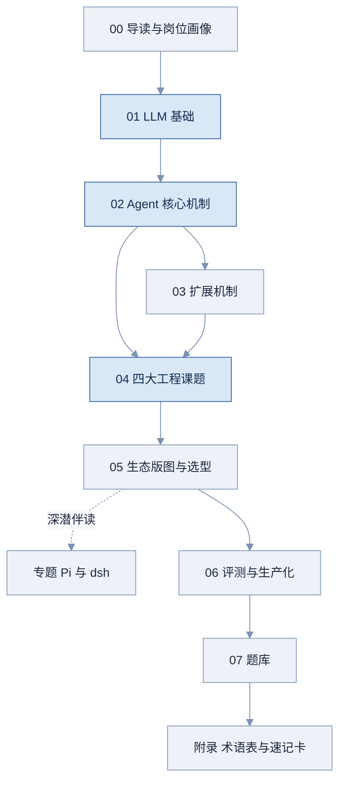

# Agent Harness 学习指南

> 从零基础到系统理解 Agent Harness 工程的完整中文文档——概念、机制、工程课题、生态版图与实战题库。

> 内容与生态数据快照于 **2026 年 8 月 28 日**（Pi 与 DeepSeek Harness 两个仓库已做过源码级复核）；凡带「数据截至」标注处会随时间过期，更新入口见附录的资料索引。

## 这份文档是什么

面向**完全不懂 agent、但有基础编程能力**的读者，系统覆盖 Agent Harness 工程的关键主题：LLM API、KV Cache、Agent Loop、Tool Use、Reasoning、Planning、Skills、MCP、Memory、Subagent、Multi-Agent，以及 Prompt Engineering、Context Engineering、Loop Engineering、Harness Engineering 四大工程课题。

写法上的三个承诺：

1. **动机优先**：每个概念先讲「没有它会出什么问题」，再讲它是什么。零基础读者需要先看到痛点，才能理解设计。
2. **图优先**：能用图讲清楚的一律用图，文字只负责讲解图，不复述图。
3. **结构固定**：每个技术章节都是同样的六段结构（见下方「文档约定」），学到哪一段、还差哪一段，一目了然。

## 文件清单与状态

| 文件 | 内容 | 状态 |
|---|---|---|
| README.md | 总目录、阅读路径、能力自测清单 | 已交付（第一批） |
| 00-导读与岗位画像.md | 怎么用这份文档、岗位画像、面试考察的四个层次 | 已交付（第一批） |
| 01-LLM基础.md | LLM API、Tool Calling、Reasoning、KV Cache、Prompt Cache | 已交付（第一批） |
| 02-Agent核心机制.md | Agent Loop、Tool Use 设计、Planning、Memory、Subagent、Multi-Agent | 已交付（第二批） |
| 03-扩展机制.md | MCP、Skills、Plugin、四者对比与组合 | 已交付（第三批） |
| 04-四大工程课题.md | Prompt / Context / 上下文压缩 / Loop / Harness Engineering | 已交付（第三批） |
| 05-生态版图与选型.md | 框架与 Harness 盘点、两种哲学、向量库与 RAG、选型决策 | 已交付（第四批） |
| 专题-Pi与dsh架构深潜.md | Pi 与 dsh 从包结构到事件模型的解剖与逐维对比（5.4 的深潜伴读） | 已交付（专题加更） |
| 06-评测与生产化.md | Agent 评测、可观测性、沙箱与安全 | 已交付（第四批） |
| 07-题库.md | 四轮题库（37 题，含金融场景组；每题口述版参考答案，设计题配白板参考图）、答题框架、反问准备 | 已交付（第五批） |
| 附录-术语表与速记卡.md | 术语表、产品速查表、数字速记卡、资料索引 | 已交付（第五批） |

## 阅读路径

**图 R-1 各部分依赖关系**

图中箭头表示「读懂后者需要前者」。三条路径：

- **完整线（零基础推荐）**：按箭头顺序读完。01 → 02 → 04 是主干（图中深色节点），不要跳读；03 相对独立，可穿插在 02 之后任意位置。专题篇（Pi 与 dsh 架构深潜）挂在 05 之后作为深潜伴读，读完 5.4 再进最合适。
- **有 LLM 使用经验**：1.1、1.2 快速过一遍确认无盲区，从 1.3 KV Cache 相关内容起精读，其余照完整线。
- **冲刺线（面试前 1–3 天）**：只读每章「面试怎么答」+ 07 题库 + 附录速记卡。前提是完整线至少走过一遍，冲刺线只负责唤醒记忆，不负责建立理解。

## 文档约定

**难度标记**（标在章节标题后）：

| 标记 | 含义 |
|---|---|
| 🟢 | 必会：面试大概率直接考，答不上会被质疑基本功 |
| 🟡 | 进阶：区分「用过」和「懂原理」的分水岭 |
| 🔴 | 加分项：答好了显著加分，答不上不致命 |

**章节结构**：每个技术章节固定为「一句话定义 → 为什么需要它 → 核心原理（配图）→ 工程实现 → 常见坑 → 面试怎么答 → 练习题 → 延伸阅读」。速记类内容不在正文里，统一放在附录的速记卡。

**图表**：图为主、文字为辅。所有流程图、时序图用 Mermaid 绘制，GitHub、Obsidian、Typora 原生渲染，VS Code 装 Markdown Preview Mermaid Support 插件即可；如果你的阅读器不支持，把代码块内容贴到 mermaid.live 查看。建议对每张图做一件事：**合上文档，自己在白板上重画一遍**——面试中的白板环节考的就是这个。

**公式**：关键推导用 LaTeX 数学块（`$$ … $$`）书写，GitHub、Obsidian、Typora、VS Code 预览均可直接渲染；个别阅读器不渲染时按纯文本读也不影响理解，重点公式旁配有中文口述版。

**交叉引用**：写作「→ 见 4.3 上下文压缩」的形式，直接翻到对应文件的对应小节即可，全文离线可读，无锚点链接。

**时效标注**：凡是版本号、价格、生态格局等可能过期的信息，都标注「数据截至 2026 年 8 月，面试前建议复核」。没有此标注的内容为原理性知识，不随时间变化。

**练习题**：答案默认折叠。先自己写出答案（真的动笔），再展开对照——只看题不作答，练习题就白设了。

## 能力自测清单

用法：每完成一部分，回来把对应条目读一遍，能**脱口而出、不需要翻书**的才打勾；勾不动的条目，按括号里的章节号回去补。面试前一天全量过一遍，未勾满的部分就是你的风险清单。

**Part 01 LLM 基础**

- [ ] 我能解释 LLM API 为什么是无状态的，以及「每轮重发全部历史」如何引出缓存和上下文工程两大课题（→ 1.1）
- [ ] 我能画出 tool calling 的完整往返时序，并讲清「模型只决策、不执行」（→ 1.2）
- [ ] 我能说出该不该开 thinking 的判断标准，以及 thinking token 怎么计费、怎么影响缓存（→ 1.3）
- [ ] 我能现场推导 KV Cache 显存公式，并解释为什么只缓存 K/V 不缓存 Q（→ 1.4）
- [ ] 我能说出 prefill 与 decode 的瓶颈差异，并用它解释「为什么输出比输入贵」（→ 1.4）
- [ ] 我能列出前缀稳定三原则，并举一个「不小心击穿缓存」的真实例子（→ 1.5）

**Part 02 Agent 核心机制**

- [ ] 我能在白板上写出最小 agent loop 的伪代码，并标出终止条件（→ 2.1）
- [ ] 我能说出一份好的工具描述长什么样，以及描述质量如何影响调用质量（→ 2.2）
- [ ] 我能对比 ReAct 与 Plan-and-Execute，并说明什么时候需要重规划（→ 2.3）
- [ ] 我能讲清 Agent Memory 与 RAG、长上下文的边界，以及为什么「写入门控」比选存储更重要（→ 2.4）
- [ ] 我能解释 subagent 的上下文隔离价值与委派协议的要素（→ 2.5）
- [ ] 我能说出什么场景**不该**上 multi-agent（→ 2.6）

**Part 03 扩展机制**

- [ ] 我能画出 MCP 的 client / server / transport 架构，说出四类原语（→ 3.1）
- [ ] 我能解释 Skill 的三层渐进式披露如何节省上下文（→ 3.2）
- [ ] 我能讲清 MCP / Skill / Plugin / Subagent 各解决什么问题、如何组合而非互相替代（→ 3.4）

**Part 04 四大工程课题**

- [ ] 我能说出系统提示的结构化写法，以及过度规格与欠规格两种失败模式（→ 4.1）
- [ ] 我能用 Write / Select / Compress / Isolate 四象限组织上下文工程的全部手段（→ 4.2）
- [ ] 我能讲出上下文压缩的五层策略，以及摘要必须保住的三样东西（→ 4.3）
- [ ] 我能设计循环的终止条件、错误回灌与重试策略，并解释验证回路（→ 4.4）
- [ ] 我能给 harness 下定义，并讲清「厚 vs 薄」之争两边的论据（→ 4.5）

**Part 05 生态版图与选型**

- [ ] 我能画出 framework / runtime / harness 三层栈并各举两个例子（→ 5.1）
- [ ] 对主流 Agent 框架和 Harness，我能各说出至少五个的定位与取舍（→ 5.2 / 5.3）
- [ ] 我能讲清减法路线与可组合路线的对比，以及两者共同反对什么（→ 5.4）
- [ ] 我能给出按数据量级选向量库的路径，并讲清「去向量化」争论的两边（→ 5.6）
- [ ] 面对「行业往哪走」的开放题，我有至少三条带论据的判断（→ 5.7）

**专题 Pi 与 dsh 架构深潜**

- [ ] 我能画出 Pi 的包分层与循环伪代码，并说出它每条「不做」背后的账（→ 专题 P1）
- [ ] 我能讲清 dsh 的 Cordis 三要素与「messages 是投影」的事件流设计（→ 专题 P2）
- [ ] 对比题上，我能给出两处收敛（会话层同构、共享 pi-ai）与复杂度去向三角（→ 专题 P3）

**Part 06 评测与生产化**

- [ ] 我能说出评测三层级与判分梯度，讲清 pass@k 与 pass^k 的区别（→ 6.1）
- [ ] 我能设计 agent 的 trace / span 结构用于线上失败定位（→ 6.2）
- [ ] 我能列举 prompt injection 的主要形态与对应防线（→ 6.3）

**Part 07 与附录**

- [ ] 题库里每道系统设计题，我都能按答题框架给出结构化回答（→ 07）
- [ ] 速查表里任何一个产品名，我都能一句话说出它是什么、和谁竞争（→ 附录）

---

## 许可与转载

本文档以 [CC BY 4.0](https://creativecommons.org/licenses/by/4.0/) 许可发布：**任何人可自由转载、翻译、改编，包括商业用途，唯一的要求是署名。**

转载请注明出处并链接回本仓库：

> 本文出自《Agent Harness 学习指南》 — https://github.com/KimGLee/agent-harness-interview

正文中的代码片段（伪代码与示意实现）另按 MIT 许可提供，可自由取用，无需署名。

## 参与纠错

生态数据、版本号、价格、star 数**快照于 2026 年 8 月 28 日**，会随时间过期；原理性内容不受影响。发现问题欢迎提 [issue](../../issues) 或直接开 PR，尤其欢迎这三类：

- **事实纠错**——数字、版本、产品定位写错了
- **时效更新**——某个产品或项目的现状已经变了
- **论证补强**——某个判断缺一手来源，而你知道出处

正文引用第三方内容处均已标注来源；如有遗漏或标注不当，请提 issue 指出，我会尽快补正。
