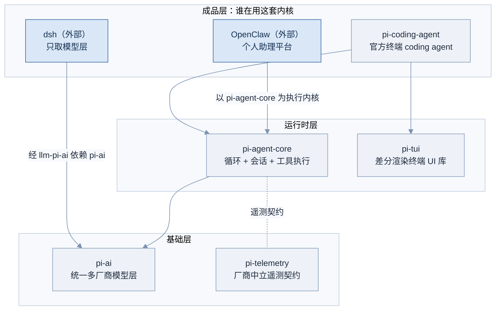
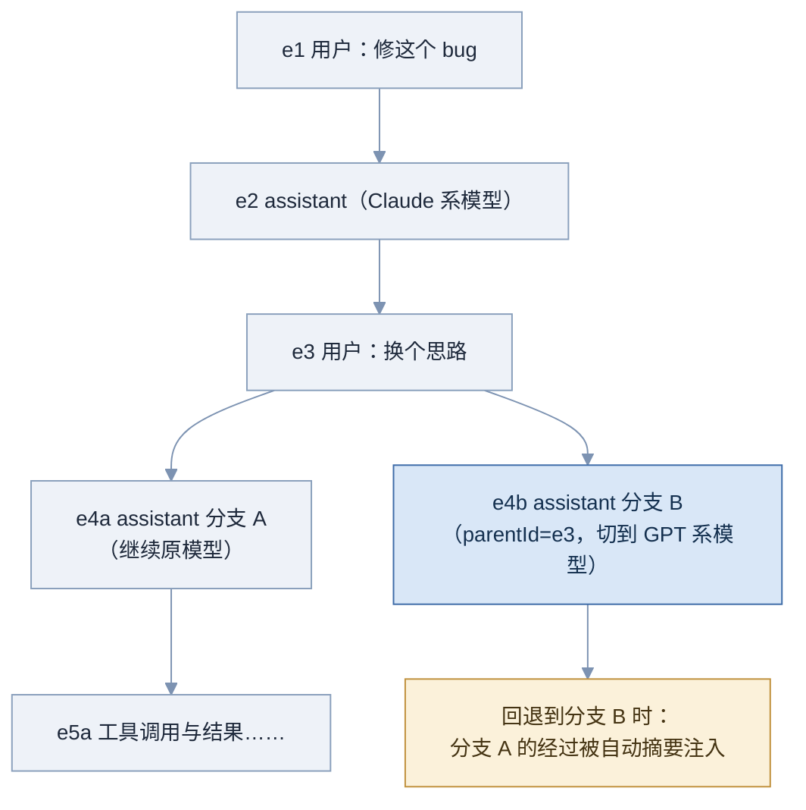
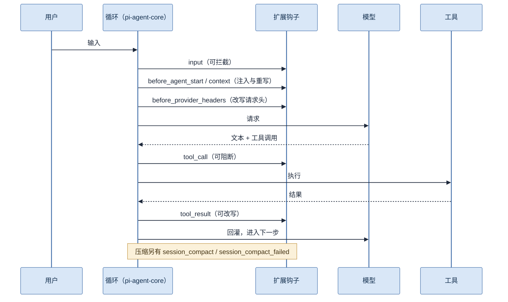
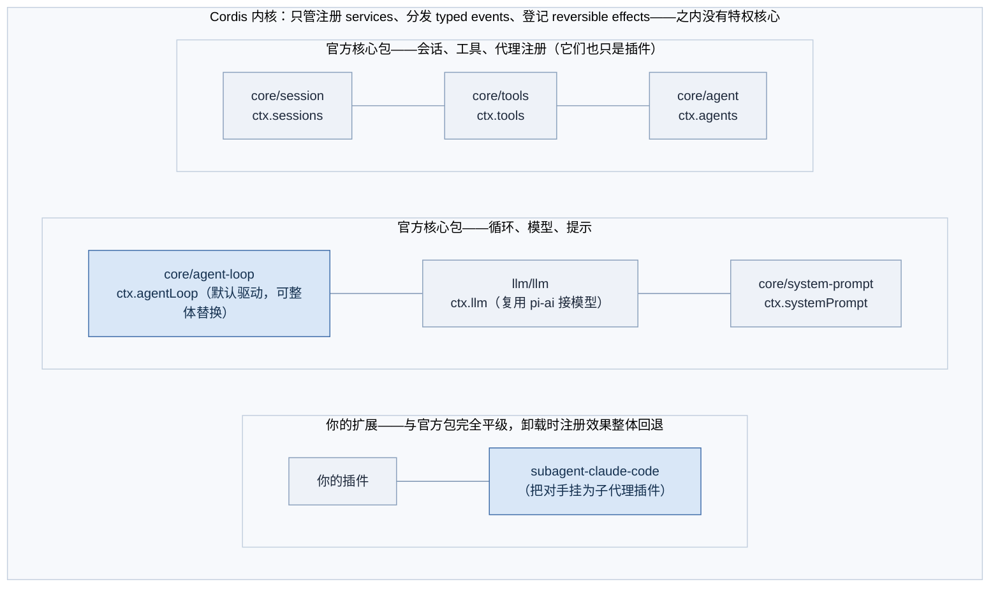
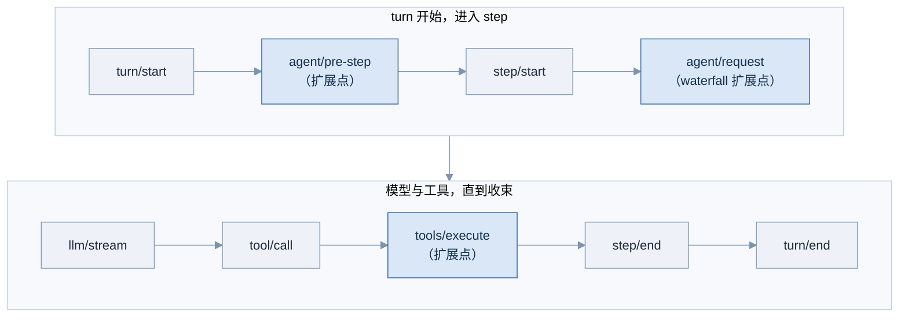
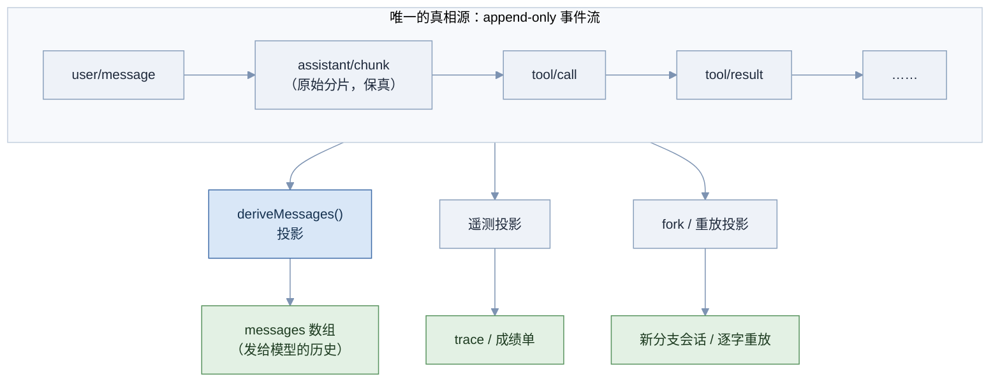
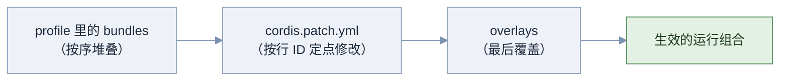
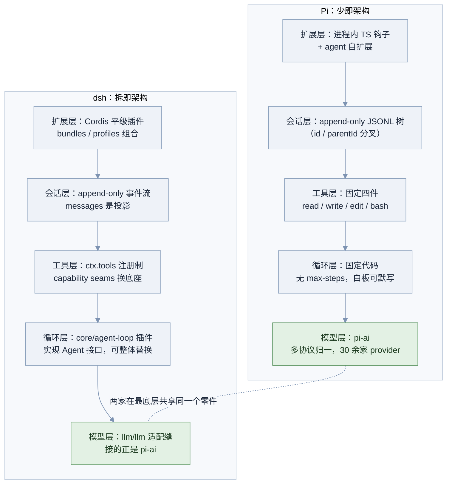
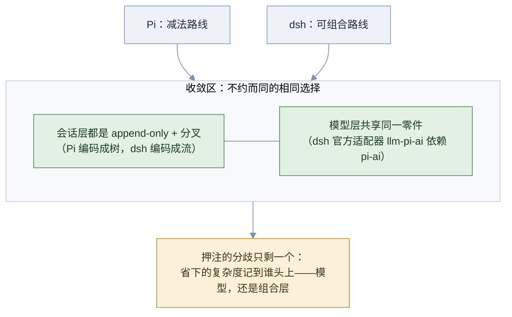

# 专题：Pi 与 dsh 架构深潜

> 一句话：Pi 与 dsh（DeepSeek Harness）是「harness 该做多厚」这道开放题在 2026 年的两个极端实物答案——本篇把两者从包结构拆到事件模型，再逐维对比，让你面试时能用具体机制说话，而不是复述口号。

> 本篇全部产品事实**复核于 2026 年 8 月 28 日**；两个项目都在高速演化（dsh 尚处开发者预览版），star 数、包结构、API 形状都可能变化，面试前建议再核对一遍两个仓库的 README。

## 本篇导读

**本篇与 5.4 的关系。**「→ 见 5.4 两种 Harness 哲学」给出了减法路线与可组合路线的哲学骨架：Pi 用「不做」实现薄，dsh 用「做成可拆的」实现薄。骨架足够应对一轮概念题，但面试官往下追一层——「Pi 的会话具体怎么存？」「dsh 的『没有特权核心』在代码层面是什么意思？」——就需要本篇的血肉。分工：5.4 管立场与论据，本篇管架构与细节，两边互不复述。

**先修**：2.1 Agent Loop、2.2 工具设计、2.4 Memory（会话与事件日志）、3.1 MCP、3.2 Skills、3.3 Plugin 与 hooks、4.3 上下文压缩、4.5 Harness Engineering、5.4 两种哲学。没读过先修也能读本篇，但交叉引用处会频繁需要回翻。

**结构**：P1 解剖 Pi，P2 解剖 dsh，P3 逐维对比。图表编号 PD-1 起。三章各自独立成篇，冲刺阶段可只读 P3 的对比大表与「面试怎么答」。

---

## P1 Pi：把「少」做成架构 🟡

> 一句话：Pi 是 Mario Zechner（badlogic）的 TypeScript 极简 coding agent 兼嵌入式 SDK——五个包、四个工具、千 token 级系统提示，其余能力全部押注一件事：让 agent 给自己写扩展。

### 为什么值得深读

三个理由，层层递进：

**第一，它是唯一「一次能读完」的全功能 harness。**商业 harness 的源码动辄数十万行，读它们是考古；Pi 的核心循环你能在白板上默写，四个工具的实现一个下午能过完。零基础建立「harness 到底由什么构成」的直觉，没有比它更短的路径（→ 见 5.3 读源码路线：Pi 是第一站）。

**第二，它是两个现象级项目的地基。**OpenClaw（star 约 37 万，数据截至 2026 年 8 月）的执行内核就是 `pi-agent-core`；dsh 官方的模型适配器 `llm-pi-ai` 直接依赖 `pi-ai`。读懂 Pi，等于同时拿到了理解这两个大项目的钥匙——这是「极简内核被厚生态复用」的一手案例（→ 见 5.3 OpenClaw 皮核分工）。

**第三，它的每条「不做」都是面试题的现成答案。**为什么不做 MCP、不做子代理、不做 plan 模式——Pi 官方对每条省略都算过账。你不必同意它的结论，但把账目讲清楚，就是「懂原理」和「用过工具」的分水岭。

### 核心原理

先看全景：五个包怎么分层，谁在消费谁。

**图 PD-1 Pi 的包分层与外部消费者（数据截至 2026 年 8 月，面试前建议复核）**



图中读三件事。**其一，分层严格**：成品依赖运行时，运行时依赖基础层，反向依赖不存在——包结构本身就是 harness 分层（→ 见 5.1）的教学示范。**其二，深色的两个外部消费者各取所需**：OpenClaw 拿走整个运行时（循环、会话、工具执行都用 Pi 的），dsh 只拿最底下的模型层——同一套包，按层被不同项目消费，这是「层清晰」的直接红利。**其三，遥测单独成包**：`pi-telemetry` 只定义厂商中立的遥测契约与一致性测试，不绑任何观测后端（→ 见 6.2 OTel 思路的同款克制）。

仓库为 `earendil-works/pi`（单仓 pi-mono，原挂在作者 badlogic 名下，官方站 pi.dev），MIT 许可，star 近十万级（2026 年 8 月 28 日约 9.9 万，面试前建议复核）。补一个 README 之外的仓库事实：五个发布包之外，仓内另有 client / server / protocol 等内部包——官方在交互 CLI 外还提供 print/JSON、RPC、SDK 三种运行形态，「终端玩具」的印象是错的。

**基础层 pi-ai：不做「每厂商一个适配器」，做「按线协议归一」。**市面模型虽多，HTTP 线上的请求格式高度收敛：主干是 OpenAI Completions、OpenAI Responses、Anthropic Messages、Google Generative AI 四族，外加 Bedrock、Vertex、Mistral、Azure 等适配（源码 `packages/ai/src/api/` 逐一可数）。pi-ai 按协议而非按厂商写适配，再配一份构建时自动生成的模型目录（`models.generated.ts`，覆盖 Anthropic / OpenAI / Google / Bedrock / OpenRouter 等 30 余家 provider，含上下文窗、价格、能力位）。厂商怪癖被吸收在这一层之下——参数名差异（如 `max_tokens` 与 `max_completion_tokens` 之别）、个别厂商不支持工具调用流式、thinking 内容的返回字段各家不同（→ 见 1.3），上层代码一概不感知。dsh 的官方模型适配器 `llm-pi-ai` 直接依赖这层（`@earendil-works/pi-ai`）而不重写，反过来证明了它的完成度。

**运行时层的循环：能默写的那种。**下面是据公开源码整理的简化版（结构忠实、细节有删减）：

```typescript
async function* agentLoop(model: Model, context: Context, tools: Tool[]) {
  while (true) {
    const response = await streamCompletion(model, { ...context, tools });
    yield { type: "assistant_message", content: response.content };

    if (!response.toolCalls?.length) break;   // 唯一的终止条件：模型不再要工具

    const results: ToolResult[] = [];
    for (const call of response.toolCalls) {   // 顺序执行，不并发
      results.push(await executeToolCall(call, context));
    }
    context.messages.push(assistantMsg(response), toolResultsMsg(results));
  }
}
```

与 2.1 的最小循环逐行对得上，值得注意的是三条**刻意的「不做」**：没有 max-steps 上限（循环跑到模型自己收束为止）；没有 plan 模式（官方立场：计划就写进文件，「全程可观测」，不需要一个特殊状态）；没有内置 to-do 工具。这三条不是散落的取舍，官方 usage 文档里有一句总纲式的原话：**「刻意不内置 MCP、子代理、权限弹窗、plan 模式、to-do 与后台 bash——这些工作流可以用扩展或包装回来，或交给容器、tmux 这类外部工具」**。其中 to-do 这条与 2.3 讲的 TodoWrite/背诵机制**正面冲突**——两家对模型能力的判断不同，这不是谁对谁错，而是一道现成的面试辩论题（本章练习题 3）。

**工具校验与双通道结果。**工具参数用 TypeBox schema 声明并校验；校验失败不抛异常，而是把错误文本作为 tool result 回灌给模型，让它自己改参数重试——1.2 讲的「错误回灌自愈」在这里是默认行为。工具结果则是双通道结构：

```typescript
interface ToolResult {
  toolCallId: string;
  output: string;        // 给模型看的纯文本
  details?: {            // 给 TUI 渲染的结构化数据
    type: "file" | "diff" | "terminal" | "error";
    data: unknown;
  };
}
```

模型消费 `output`，终端渲染 `details`——diff 高亮、文件卡片这些视觉信息不占模型一个 token。「给模型的」与「给人的」分离，是个值得抄进任何 harness 的小设计（→ 见 4.2 上下文预算意识）。

**四个工具，每个都有取舍账**：

| 工具 | 设计决策 | 面试点 |
|---|---|---|
| read | 一个工具吃下「看」的全部形态：文本带行号、图像转 base64 供视觉、目录出树、支持 glob 与行区间 | 工具数量少不等于能力少，聚合设计降低选择负担（→ 见 2.2 工具粒度） |
| write | 覆盖写 + 自动创建父目录，返回写入字节数确认 | 幂等、无交互确认——把安全交给外层（沙箱/权限），工具本身保持纯粹 |
| edit | 精确字符串替换：无正则、无模糊匹配，搜索串不唯一命中就显式失败，产出 unified diff | 「宁可失败也不猜」——失败是可回灌的信号，猜错是不可见的损坏 |
| bash | 同步执行、timeout 参数可选且**无默认超时**（schema 原话「no default timeout」）、不做后台进程（官方建议交给 tmux 或容器）、报告退出码 | 不做专用搜索工具的理由：「前沿模型都被 RL 训练得懂 coding agent」，搜索交给 `bash` + `rg`，GitHub 交给 `gh` |

基础系统提示不足 1000 token（Armin Ronacher 的评价：「我所知系统提示最短的 agent」）。项目上下文在**启动时装载**：全局 `~/.pi/agent/AGENTS.md`、父目录与当前目录的 `AGENTS.md`（也认 `CLAUDE.md`），整体拼进系统提示的 project_context 段——不是模型按需去读。技能机制则是官方在版的：Pi 实现了 agentskills.io 技能标准，提示里常驻的只有技能名与一行描述、正文按需装载——正是 3.2 的渐进式披露，甚至可以在设置里直接挂 Claude Code / Codex 的技能目录混用。默认工具之外，仓库还内置 grep / find / ls / powershell 四个**可选**工具——默认集保持四件（源码里写死 `["read", "bash", "edit", "write"]`），要不要加是使用者的决定，这个「默认极简、可选丰富」的分寸本身就是设计观点。

**会话：append-only JSONL 长成一棵树。**每条会话条目带 `id` 与可选 `parentId`，天然构成树；「切换分支」只是换一片叶子继续追加，全部历史永久保留。

**图 PD-2 Pi 的会话树：追加、分叉、回退摘要**



这棵树带来三个能力，图上各对应一处。**跨厂商会话**（深色节点）：同一棵树里不同条目可以来自不同模型——thinking 痕迹在跨厂商时被标准化为文本，于是「聊到一半换模型」是原生操作，不是黑科技（底座正是 pi-ai 的协议归一）。**分叉即树枝**：探索性任务开两条分支各试一种方案，成本只是两片叶子。**回退摘要**（琥珀节点）：回退到早先节点时，Pi 把被放弃分支上「发生过什么」压缩成摘要注入——4.3 的压缩思想用在了分支管理上，弃线的教训不丢失。此外扩展可以把自定义状态条目写进同一份会话文件，随会话同生命周期持久化——这一条是下文自扩展机制的暗线。

对照 2.4 的 raw event log 原则：Pi 的会话文件就是它的「原始层」，append-only、不可变、一切派生视图（终端渲染、分支视图）从它重建。记住这个特征，P3 对比时它会与 dsh 的事件流形成一次意味深长的会合。

**扩展系统：进程内钩子，七个关键事件。**扩展是 TypeScript 模块，默认导出一个接收 `ExtensionAPI` 的工厂函数；免预构建、支持热重载；发现渠道有四条：全局 `~/.pi/agent/extensions/`、项目 `.pi/extensions/`、npm 包在 `package.json` 的 `pi.extensions` 字段里自我声明，以及 `pi install npm:…` / `pi install git:…` 安装分发。官方事件表有 30 余个（`turn_start`、`session_start`、`model_select` 等俱全），下面挑最常用的七个：

| 事件 | 触发时机 | 典型用法 |
|---|---|---|
| input | 用户文本进入循环前 | 权限门、命令宏展开 |
| before_agent_start | 每轮开始、组装上下文前 | 注入 git 分支与状态，省一次工具调用 |
| context | 消息发给模型前的最后一站 | 脱敏、裁剪、重写历史 |
| before_provider_headers | HTTP 请求发出前 | 改写请求头：鉴权、路由标记 |
| tool_call | 工具将要执行时，可拦截 | 阻断危险命令（如 rm -rf） |
| tool_result | 工具执行完、回灌前 | 截断超长输出、富化结果 |
| session_compact | 压缩完成时（失败走 session_compact_failed） | 压缩结果的介入点：记录、补注提醒（→ 见 4.3） |

除了挂钩子，扩展还能注册新工具（`registerTool`）、斜杠命令（`registerCommand`）、模型提供方（`registerProvider`），甚至渲染自定义 TUI 组件（进度条、文件选择器、数据表、预览面板）。把这些事件标到循环时序上：

**图 PD-3 扩展钩子在循环上的挂载点**



对照 3.3 的 hooks：Claude Code 的 hooks 是**进程外**脚本（stdin 进 JSON、退出码定放行），Pi 扩展是**进程内**函数调用。进程内意味着全能——能碰内存里的消息数组、能渲染 UI、能换 provider——也意味着没有隔离：扩展代码就是主进程代码，信任要求完全不同（→ 见 6.3 最小权限）。这对取舍在 P3 对比表里会再次出现。

**自扩展：Pi 的绝招，机制上是「扩展系统 + 热重载 + 会话内状态」的组合拳。**官方哲学（Armin Ronacher 的转述）：「如果你想让 agent 做一件它还不会的事，你不是去下载一个扩展或技能——你让 agent 自己延长自己。」流程落地成图：

**图 PD-4 自扩展闭环：能力从模型产出中现场长出**


图中关键是那条**失败回边**：热重载（深色节点）让「写扩展」本身进入了 agent 的调试循环——写、装、测、读报错、改，直到能用。能力不是预装的集成，而是模型代码生成的涌现；扩展写完是磁盘上的文件，天然沉淀复用。对照关系值得背下来：3.2 的 Skills 是「人写给 agent 的知识」，Pi 的自扩展是「agent 写给自己的能力」，5.3 的 Hermes 闭环学习（任务后复盘自动生成技能）与它同属一族。安全代价同样要背：自生成代码即刻在主进程内执行，信任边界收缩为「你对模型的信任」——这是 6.3 视角下自扩展的原罪，面试提它必须带上这句。

**「不做」清单：每条都有账。**

| 不做什么 | 官方的账 |
|---|---|
| MCP | 全量挂载的工具定义常驻上下文，作者博客举的例子是一个浏览器自动化 MCP server 一次性吃掉约 1.37 万 token（→ 见 3.1 上下文占用）；官方给的替代路线有两条——能力做成 CLI 工具配文档，或走官方技能系统（agentskills.io 标准），都指向按需披露。注意细节：社区另有 pi-mcp-adapter 扩展可选装——「不做」是默认姿态，不是能力封锁 |
| 子代理 | YAGNI：部分任务需要的东西，不该所有任务都背着（→ 见 2.5 对照） |
| max-steps 上限 | 循环跑到模型自己收束；上限是对模型的不信任投票，Pi 选择信任（→ 见 4.4 对立面：预算与断路器） |
| plan 模式 | 计划写进文件即可，全程可观测，不需要特殊状态位 |
| 内置 to-do 工具 | 刻意省略，官方明说可用扩展装回——与 2.3 TodoWrite 相反的一手立场 |
| 后台 bash | 同步执行保住可观测与可控；长驻进程官方建议交给 tmux 或容器 |

**供应链工程：个人项目做出了超过多数商业产品的纪律。**六件套（全部来自仓库 README，复核于 2026 年 8 月 28 日）：直接外部依赖全部钉死精确版本（`save-exact=true`）；**新发布的依赖要冷却满 2 天才允许进入**（`min-release-age=2`——投毒的包大多在发布后数小时内被发现，冷却期是廉价保险）；`package-lock.json` 是依赖真相源；定时跑 `npm audit signatures` 校验签名；shrinkwrap 配合依赖生命周期脚本的显式白名单（防 postinstall 脚本作恶）；发布前在仓库外的隔离 npm 与 Bun 环境做安装测试。对照 6.3 的供应链一节：这六条就是「harness 层供应链防线」的实操模板，面试被问到能直接报菜单。

### 工程实现

一个混合示例：权限门（拦 tool_call）+ 上下文注入（before_agent_start）+ 注册第五个工具。API 形状据官方文档与源码整理（`registerTool` / `registerCommand` / 事件名均与官方一致，个别辅助方法从简），动手前对当前版本：

```typescript
import type { ExtensionAPI } from "@earendil-works/pi-coding-agent";

export default function myExtension(pi: ExtensionAPI) {
  // 1. 危险命令门：进程内拦截，不用改系统提示
  pi.on("tool_call", async (ctx, call) => {
    if (call.name === "bash" && /rm\s+-rf\s+\//.test(call.input.command)) {
      return { block: true, reason: "blocked: destructive command" };
    }
  });

  // 2. 每轮免费注入 git 状态，省一次工具调用
  pi.on("before_agent_start", async (ctx) => {
    const branch = await ctx.exec("git branch --show-current");
    ctx.appendSystemNote(`git branch: ${branch}`);
  });

  // 3. 第五个工具：剪贴板
  pi.registerTool({
    name: "clipboard",
    description: "Read the user's clipboard content",
    parameters: {},                       // TypeBox schema，此处从简
    execute: async () => ({ output: await readClipboard() }),
  });
}
```

三段各演示一类能力：拦截、注入、注册。真实项目里第 1 段这类安全策略建议配测试用例固化（→ 见 6.1 单步评测）。

### 常见坑

- 把 Pi 当「功能少的玩具」——它是刻意省略且每条省略有账；答题时讲不出账，等于没读过
- 把自扩展当魔法——它的前提是强模型加进程内执行权限，安全面显著变大，提能力必须带代价
- 忽略 pi-ai 的独立价值——「连 dsh 都在用它接模型」是证明其完成度的最短论据
- 把「无 to-do 工具」当标准答案背——那是与 2.3 相反的一家之言，面试要能站在两边各说一分钟
- 混淆 Pi 扩展与 MCP：前者进程内函数、后者进程外协议，隔离性与能力面正好互补
- 引 star 数与包结构不带时效声明——本篇数字全部截至 2026 年 8 月 28 日

### 面试怎么答

**高频问题**：「一个最小可用的 coding agent 到底需要什么？」「Pi 为什么不做 MCP，你怎么评价？」「进程内扩展和进程外 hooks 怎么选？」

**好答案要点**：最小集合 = 循环 + 四工具 + 会话持久化 + 模型层归一，其余皆可选——用 Pi 实证而非空谈；MCP 之辩要给双方的账（MCP 买标准化互通、Pi 省常驻上下文），再补一句 pi-mcp-adapter 的存在说明这不是二选一；进程内外之辩落到「能力面 vs 信任边界」，并举 tool_call 拦截与 Claude Code hooks 各一例。

**减分点**：只会说「Pi 很小很快」给不出机制；不知道它是 OpenClaw 的内核；把自扩展说成「Pi 能自我进化」的玄学表述。

### 练习题

1. 🟢 合上文档，默写 Pi 式最小循环的伪代码，并标出 input、tool_call、session_compact 三个钩子各挂在哪一行之前或之后。

<details>
<summary>参考答案要点</summary>

循环见本章代码块。挂点：input 在用户文本进入 messages 之前；tool_call 在 executeToolCall 调用之前（可返回 block）；session_compact 不在主循环行内，挂在压缩子流程完成之后（失败对应 session_compact_failed）。能画出图 PD-3 的时序即满分。

</details>

2. 🟡 设计题：用自扩展机制给 Pi 加「查询 Postgres」能力，写出 agent 侧的操作序列，并指出两处安全检查应该加在哪。

<details>
<summary>参考答案要点</summary>

序列：bash 确认 psql 可用与连接串来源 → write 生成 .pi/extensions/pg.ts（registerTool 一个 query 工具，参数只留 SQL 字符串）→ 热重载 → 自测一条 SELECT 1 → 失败读报错修正 → 可用。安全检查：其一，连接串不进扩展源码（从环境变量读，防止会话文件泄密，→ 见 6.3）；其二，工具内白名单只放行只读语句或走只读账号（写操作要人审，→ 见 4.4 审批门）。

</details>

3. 🔴 辩论题：「内置 to-do 工具对 agent 是帮助还是干扰？」分别以 Claude Code（2.3 的背诵机制）与 Pi 的立场各陈述一分钟，再给你自己的裁决标准。

<details>
<summary>参考答案要点</summary>

正方（2.3）：长任务中先前目标滑出注意力窗口，把计划反复写回上下文末尾是对抗 Context Rot 的实证手段。反方（Pi）：维护 to-do 本身消耗步数与注意力，列表与真实进度脱节时反而误导；计划写进普通文件同样可持久可观测。裁决标准示例：任务步数与上下文长度——短任务 to-do 纯开销，跨会话长任务背诵收益大；模型越强，外置结构的边际价值越低（→ 见 4.5 Bitter Lesson）。答出「条件化裁决」即高分，站死一边是减分项。

</details>

### 延伸阅读

- earendil-works/pi（GitHub 单仓 pi-mono：README、docs 与源码——包结构、默认四工具、事件表、供应链六件套的一手来源；本篇已对源码逐项复核于 2026-08-28）
- Armin Ronacher, "Pi: The minimal agent within OpenClaw"（2026-01：会话树、自扩展哲学的最佳第三方解读）
- pi.dev 官方文档（扩展 API 与事件清单，动手前以此为准）

---

## P2 dsh：把「拆」做成架构 🔴

> 一句话：dsh（DeepSeek Harness）是 DeepSeek 于 2026 年 8 月 13 日开源的「一切皆插件」harness——Cordis 插件内核之上没有特权核心，连 agent loop 都是可替换插件，全部状态由一条 append-only 事件流投影而来；发布十天 star 破 18 万、至 8 月末约 20 万，同时以约 25 万行源码、270+ 个包（2026-08-28 浅克隆实测）与社区实测约十倍的 token 消耗为代价（面试前建议复核）。

### 为什么值得深读

**第一，时事即弹药。**它是面试当口最新鲜的大事件——两周前发布、star 曲线历史级。面试官问「最近生态里什么让你印象深刻」，dsh 是天然答案；但只报 star 数是新闻复述，能讲出 Cordis 三要素与投影式事件流才是工程师的回答。

**第二，它是「可组合」推到头的极端标本。**4.5 的厚薄之争里，多数产品在光谱中段摇摆；dsh 直接把「拆」推到理论极限——没有任何不可替换的部分。极端案例的价值在于把设计代价放大到肉眼可见：组合复杂度、token 开销、兼容性破裂，全部两周内在社区显形。研究极端，中段的取舍才有坐标。

**第三，它把本套文档的多个抽象课题做成了实物。**2.4 的 raw event log 原则、6.2 的 trace 诉求、3.3 的 hooks 思想、4.4 的审批拦截——在 dsh 里分别对应事件流、投影、typed events、waterfall。一个系统集齐四个课题的实现，是绝佳的复习索引。

### 核心原理

**Cordis 内核：三要素与「没有特权核心」。**dsh 跑在 Cordis 插件框架上，插件向共享上下文贡献三样东西：**services**（能力，挂在 `ctx.*` 键下）、**typed events**（类型化事件，插件间通信）、**reversible effects**（可逆效果——每次注册都记录如何撤销，插件卸载时效果整体回退，不留监听器、不留半注册的工具）。可逆性不是清洁癖：它是热插拔的前提条件，没有它，「运行中换插件」会让系统状态千疮百孔。

官方架构文档里最锋利的一句：**「没有特权核心可以打补丁」**（there is no privileged core to patch）——你扩展 dsh 的方式不是改核心，而是「在其他插件旁边再挂一个插件」。这不是修辞：连官方的六个核心包自己也是平级插件，与你写的插件走同一套注册机制。

**图 PD-5 Cordis 内核与平级插件拓扑**



图的画法本身就是论点：Cordis 内核是那个**外框**——它只管注册、分发、登记回退三件事，业务什么都不懂，这正是「微内核」的定义（操作系统课的老概念在 harness 层重生）；框内三行全部是平级插件，没有任何一行更「核心」。两处深色是最招面试官追问的：`core/agent-loop`——别家把循环当地基，dsh 把循环做成实现了可替换 `Agent` 接口的默认驱动，整个换掉是合法操作（对照 2.1：这意味着 ReAct、计划执行、甚至你自研的循环形态可以并存互换）；`subagent-claude-code`——官方仓库自带的适配插件，把 Claude Code 经其 SDK 挂为 dsh 的子代理，Codex 同款（`subagent-codex`），另有 `hooks-claude-code` / `hooks-codex` 兼容两家的 hooks 生态——「没有特权核心」的宣言在这里得到最戏剧化的演示（包名均为 2026-08-28 仓库实测）。

**turn / step 事件流水线。**dsh 把一次交互切成两级：**turn**（一次用户输入到收束）包含 0 到 n 个 **step**（一次模型请求加它引发的工具调用）。「0 个」不是笔误——被拒绝的输入也会记成一个零 step 的闭合 turn，审计上不留空洞。事件链与扩展点：

**图 PD-6 一个 turn 的事件链与扩展点**



事件分两类，图里深浅有别。**持久事件**（`turn/*`、`step/*`、`user/message`、`assistant/*`、`tool/*`）落进会话日志，构成下文的事件流。**现场扩展点**（深色：`agent/pre-step`、`agent/request`、`llm/stream`、`tools/*`）是插件挂载行为的地方。其中 `agent/request` 是 **waterfall**（瀑布）类型：监听者必须显式调用 `next()` 才放行下一环——不调就短路。这是可短路中间件链的语义（Web 框架老手会立刻认出 Koa 的洋葱模型），拿来做审批门天然合身：审批插件挂在 `agent/request` 上，policy 不过就不 `next()`，请求根本到不了模型（→ 见 4.4 审批门；对照 Pi 的 tool_call 拦截——一个拦在模型请求前，一个拦在工具执行前，拦截位置本身就是道面试题）。

**事件流与投影：dsh 最深的一个设计。**官方架构文档的两句纲领：「**会话日志是模型所见上下文的来源**」「**模型可见即已记录**」（model-visible means logged）——任何进入模型请求的内容，必须能从 append-only 的事件日志重建，无一例外。由此推出全篇最重要的一个倒转：

**图 PD-7 messages 数组不是存储，是投影**



习惯的架构是「messages 数组是状态，日志是旁挂的记录」；dsh 反过来：**流是唯一的真相源，messages 数组只是 `deriveMessages()` 从流上投影出的派生物**，与遥测、fork、重放、转写平级——五种产物，同一条流的五种读法。原始 `assistant/chunk` 分片原样保留，保证重放能逐字复现。这一手换来的能力清单值得逐条对照本套文档：原始层不可再生、派生层随时可重算（→ 见 2.4 raw event log，同一原则）；遥测不是旁挂探针而是又一个投影，天然与真实执行一致（→ 见 6.2）；fork 一个会话 = 从流的某一点另起投影（→ 见 6.1 评测的「同一起点反复实验」）；OpenHands 的事件流架构与此同构（→ 见 5.3），三者可连成「状态即事件流」的谱系一起记。

**组合系统：bundles、profiles 与分层覆盖。**能力拆成了插件，「装哪些、怎么配」就成了新问题，dsh 的回答是一套声明式组合机制：**bundle** 是「Cordis 配置行与其挂载代码的分发格式」，在 `package.json` 的 `dsh` 字段里自我声明；官方发行的 bundle 已有六个（2026-08-28 仓库实测）：`base`（模型适配器、工具、持久化）、`web-app`（网页 UI）、`headless`（CLI 运行器）、`acp-app`（ACP 协议接入）、`sdk-app` 与 `sdk-minimal`（程序内嵌入的全量与极简两档）。**profile** 是存放在 Harness home 的命名组合，按序堆叠若干 bundle。生效配置按层应用：

**图 PD-8 配置的分层生效顺序**



嗅到熟悉味道了吗——这是 Kubernetes 生态 kustomize/Helm 式的「基底 + 补丁 + 覆盖」配置工程，被搬进了 agent harness。5.4 那句「组合描述文件成了新的复杂度核心」说的就是这套：复杂度没有消失，从代码里的内置功能搬进了 YAML 里的组合关系。

**capability seams：不特权的前提下怎么换底座。**seam（缝合线）由三角构成：**服务定义**（接口）、**服务提供者**（实现）、**消费者**（面向模型的工具）。价值在批量置换：把文件系统或子进程的 provider 换掉（比如从本机换成沙箱），所有依赖它的工具——Bash、PTY、LSP、子代理——整体跟着迁移，一行不用 fork。对照 4.5 的「厚薄该按能力逐项谈」：seam 就是「逐项」的工程化——每条能力一条缝，缝上可以换厂。

**六个官方 bundle 各是一种预装形态**（2026-08-28 仓库实测），值得单独看三个：

| bundle | 组合内容 | 一句话定位 |
|---|---|---|
| base | 模型适配器（llm-deepseek / llm-pi-ai）、工具、持久化 | 一切组合的公共底座 |
| web-app / headless / acp-app | 网页 UI / CLI 运行器 / ACP 协议接入 | 同一底座的三种交互皮 |
| sdk-app / sdk-minimal | 程序内嵌入的全量与极简两档 | 有趣在 sdk-minimal：可组合派自己也发行「小组合」——「小」是一种合法形态，对比题好用 |

**代价清单，每条都要能报出来。**约 25 万行源码、270+ 个包（2026-08-28 浅克隆实测：272 份 package.json，TypeScript 主体约 10.7 万行，其余为 Python SDK、原生件与文档）；社区实测 token 消耗高出同类约十倍——钱花在组合运行时的封装、事件的结构化记录与默认组合偏厚上；版本 0.1.2-alpha.1 开发者预览，README 用大写明示「必有破坏性变更」；第三方插件兼容性破裂已在两周内出现。监督生态的注脚：仓库含 `apps`、`packages`、`python`、`native` 等多语言部件，供应链审计面与 Pi 的五个发布包形成数量级差距（→ 见 6.3 供应链；面试前建议复核）。

### 工程实现

一个「敏感命令审批」插件的骨架，演示三要素齐活：注册工具（service）、监听 waterfall（typed event）、注册即登记回退（reversible effect）。API 形状据官方架构文档整理，**预览版 API 未稳定，动手前以当日文档为准**：

```typescript
// 声明：package.json 的 "dsh" 字段里登记本 bundle
export function mount(ctx: CordisContext) {
  // 1. service：注册一个工具，返回值就是「可逆效果」的回执
  const disposeTool = ctx.tools.register({
    name: "deploy",
    description: "Deploy current build to staging",
    execute: runDeploy,
  });

  // 2. typed event：挂上 agent/request 这条 waterfall
  const disposeGuard = ctx.on("agent/request", async (req, next) => {
    if (await policyDenies(req)) {
      ctx.sessions.append({ type: "guard/denied", reason: "policy" });
      return;            // 不调 next() = 短路，请求到不了模型
    }
    await next();        // 放行，交给下一环
  });

  // 3. reversible effect：卸载时全部回退，不留半注册状态
  return () => { disposeTool(); disposeGuard(); };
}
```

注意第 2 段与 Pi 权限门的对位：Pi 拦在 `tool_call`（工具执行前），这里拦在 `agent/request`（模型请求前）——后者连「模型想不想调用危险工具」都无从发生，拦截更早、也更粗。把「拦截点位的早晚 = 粒度与代价的取舍」讲出来，是这段代码在面试里的正确用法。

### 常见坑

- 把「一切皆插件」当营销词复述——落不到 services / typed events / reversible effects 三要素，等于没读过
- 只讲事件流不讲「投影」——「messages 是 deriveMessages() 的派生物」才是设计的锋刃，漏掉它就只剩普通日志
- 把十倍 token 当黑点甩——要能拆出成本来源（组合运行时封装、事件结构化、默认组合厚），并对照 Pi 千 token 固定成本给出光谱感
- 忘记 v0.1 预览状态——所有 API 细节都要挂时效声明，把预览版当稳定产品推荐是工程判断失分
- 不知道 sdk-minimal 这个官方极简组合——「可组合派自己也发行小组合」的自证，对比题里非常好用
- 把 waterfall 与普通 pub/sub 混同——必须 `next()` 的短路语义才撑得起审批场景

### 面试怎么答

**高频问题**：「dsh 的『没有特权核心』是怎么实现的？」「事件流投影架构好在哪、代价是什么？」「你会在生产里用它吗？」

**好答案要点**：特权消解 = 核心包与用户插件走同一套 Cordis 注册机制 + 循环实现可替换的 Agent 接口 + reversible effects 保证换件干净；投影架构的收益按「重放 / 遥测 / fork / 审计」四路展开并回连 2.4 与 6.2，代价是每步的记录开销与十倍 token；生产问题的高分结构是「机制上欣赏、工程上观望」——预览版、破坏性变更、供应链面三个理由，外加一句「它的事件流与可逆注册思想现在就值得抄」。

**减分点**：报 star 数不报架构；把 Cordis 说成「dsh 的一个模块」（关系倒了——dsh 跑在 Cordis 上）；不知道它的官方适配器 llm-pi-ai 依赖 Pi 的 pi-ai。

### 练习题

1. 🟢 合上文档，画出一个 turn 的事件链（turn/start 到 turn/end），并标出哪三处是扩展点、哪一处是 waterfall。

<details>
<summary>参考答案要点</summary>

链见图 PD-6：turn/start → agent/pre-step → step/start → agent/request → llm/stream → tool/call → tools/execute → step/end → turn/end。扩展点：agent/pre-step、agent/request、tools/*（llm/stream 亦可观察）。waterfall 是 agent/request——监听者必须 next() 放行。加分：说出「被拒输入也记零 step 闭合 turn」。

</details>

2. 🟡 设计题：用 dsh 的机制实现「所有写文件操作需人工批准」，说明你选哪个事件、为什么不是另一个，以及审批记录怎么落盘。

<details>
<summary>参考答案要点</summary>

选 tools/execute 一侧拦截（工具粒度可判断「是不是写操作」），而非 agent/request（太早，无法知道模型将调什么工具，会把读操作一起拦住）。审批通过与否作为自定义事件类型（扩展 SessionEventMap）append 进事件流——审计记录自动获得重放与投影能力，不需要另建审批日志表。回连 4.4 审批门与 6.2 trace。

</details>

3. 🔴 分析题：为什么「模型可见即已记录」这一条纪律，能同时服务 fork、遥测与评测三件事？（→ 见 6.1 轨迹评测）

<details>
<summary>参考答案要点</summary>

三件事的公共前提都是「完整重建模型在任意时刻看到的世界」：fork 需要从某点重建后另走一条线；遥测需要报告与真实请求一致（旁挂探针会漂移）；轨迹评测需要复现每步决策时的输入才能判定「这步该不该这么走」。一条不可绕过的记录纪律让三者共用同一条流，成本记一次、能力买三份——这就是把 2.4「原始层不可再生」升格为架构地基的复利。

</details>

### 延伸阅读

- deepseek-ai/deepseek-harness 仓库与 docs/architecture.md（Cordis 三要素、turn/step 事件表、capability seams 的一手来源；复核于 2026-08-28）
- DeepSeek Harness 官方文档站（cordis-primer 与 extension cookbook：动手扩展的入口）
- InfoQ, "The Open-Sourcing of DeepSeek Harness Opens the Door to Modular, Unbundled AI Agent Infrastructure"（2026-08：第三方视角与社区反应）

---

## P3 逐维对比：同一个敌人，两种押注 🔴

> 一句话：Pi 与 dsh 反对同一个敌人——大而全的固定内置，但把省下来的复杂度记到了不同人头上：Pi 记给模型，dsh 记给组合层。逐维拆开，每一维都是一道现成的面试题。

### 为什么需要它

5.4 给了这场对打的哲学骨架，P1、P2 给了两边的架构血肉；本章做最后一步——**把两边同层对齐**。面试官不会满足于「一个做减法一个做组合」的口号，他会随手抽一维往下钻：「那它们的会话层分别怎么设计？」「扩展机制有什么本质区别？」对齐过的知识才经得起任意角度的抽查；更重要的是，对齐之后你会看到两处**教科书级的意外收敛**——那是比任何分歧都值钱的面试谈资。

### 核心原理

先把两套架构同层摆开：

**图 PD-9 同层对齐：五层逐层对照（数据截至 2026 年 8 月，面试前建议复核）**



图的读法：从上往下五层——扩展、会话、工具、循环、模型——左右各走一遍；每一层的左右差异都是下表的一行；绿色底边是第一处收敛（底层共享 pi-ai），虚线点破它。

**逐维对比大表。**十一维，每行都能独立展开成一段两分钟的面试回答：

| 维度 | Pi | dsh |
|---|---|---|
| 出身与时间 | 2025-08 起的个人项目（badlogic / earendil-works） | 2026-08-13 DeepSeek 官方开源 |
| 规模量级 | 5 个发布包；基础系统提示不足 1k token；star 近十万（截至 2026-08-28） | 约 25 万行、270+ 包（2026-08-28 实测）；star 约 20 万 |
| 核心哲学 | 能力「不存在」：要用时让 agent 现场长出来 | 能力「可选存在」：要用时装一个插件 |
| 循环归属 | 固定代码，是产品的一部分；无 max-steps | core/agent-loop 插件，实现 Agent 接口，可整体替换 |
| 工具箱 | 四件固定 + registerTool 扩展 | 注册制 + capability seams 批量换底座 |
| 会话与状态 | append-only JSONL 树：id/parentId 分叉、回退摘要、跨厂商 | append-only 事件流：deriveMessages() 投影、fork/重放/遥测同源 |
| 扩展模型 | 进程内 TS 钩子（七大事件）、热重载、agent 可自写 | Cordis 平级插件、reversible effects、waterfall 短路 |
| 上下文经济 | 固定成本千 token 级，极端克制 | 社区实测约十倍于同类（组合封装 + 事件记录的税） |
| 安全面 | 攻击面小（默认四工具 + 供应链六件套），但进程内扩展 = 全信任 | 隔离与可逆性好，但 270+ 包供应链面大 + 预览期不稳（→ 见 6.3) |
| 生态位 | 被嵌：OpenClaw 的内核、dsh 的模型层 | 嵌人：Claude Code / Codex 可挂为它的插件 |
| 成熟度 | 稳定日用，个人维护节奏 | v0.1 开发者预览，明示破坏性变更 |

表里最锋利的一行是**生态位**：Pi 被别人当零件，dsh 把别人当零件——一个向下扎根，一个向上吞纳，两种「薄」长出了完全相反的生态姿态。

**两处教科书级的收敛。**对立路线在两处做出了相同选择，这比全部分歧加起来更有信息量：

**图 PD-10 分歧之下的收敛：对立路线共同承认的东西**



**收敛一：会话层殊途同归。**Pi 的 JSONL 树与 dsh 的事件流，编码方式不同（树 vs 流），底层是同一个决定——原始记录 append-only 不可变、支持分叉、一切视图从它派生。两个立场相反的团队独立走到同一原则，等于给 2.4 的 raw event log 投了两票带分量的赞成票；面试引用格式：「连哲学对立的 Pi 和 dsh 都在会话层收敛到 append-only + 分叉，这条基本上是行业共识了」。**收敛二：零件物理共享。**dsh 的官方模型适配器 `llm-pi-ai` 在 package.json 里明写依赖 `@earendil-works/pi-ai`（与自家 `llm-deepseek` 并列为 ctx.llm 缝上的两个 provider）——嘴上对打，仓库里合作，这就是 5.7 说的生态专业化分工：模型接入层已经「基础设施化」，没人再想重写一遍厂商怪癖。

收敛之外，琥珀色节点点破剩下的真分歧——复杂度去向。接上 5.4 的三方判词形成完整光谱：**Pi 推给模型**（相信代码生成，Bitter Lesson 的激进应用，→ 见 4.5）；**dsh 推给组合层**（相信插件工程，软件工程传统智慧的搬运）；**厚 harness（Claude Code 系）留给自己**（相信产品打磨）。三种押注分别赌「模型会更强」「工程会更熟」「体验会赢家通吃」——面试终局题「harness 五年后长什么样」，用这三个赌注作答即可展开。

**选型边界**，一张表收口（判断截至 2026 年 8 月，面试前建议复核）：

| 你的处境 | 建议 |
|---|---|
| 个人开发者、强模型、终端工作流、在乎可审计 | Pi：成本最低的日用与学习标本 |
| 要给自家产品嵌一个受控执行内核 | Pi 的 pi-agent-core 路线（OpenClaw 已验证），或 → 见 5.3 装配层三家 |
| 平台化组装、多形态并存、团队愿付组合工程成本 | 实验性引入 dsh，盯紧版本；抄它的可逆注册与投影思想可以立刻开始 |
| 严肃生产、今天就要稳 | 两者都缓：Pi 是个人维护节奏，dsh 是预览版——回 5.2/5.3 的成熟货架，这个「都不选」的判断本身就是工程成熟度的信号 |

### 常见坑

- 对比只列分歧不讲收敛——两处收敛（会话层同构、共享 pi-ai）才是本篇独有的深度，漏了等于白读
- 用「更灵活」「更轻量」这类空词填表——每一格都必须落到机制名，空词是被追问一层就塌的答案
- 把复杂度去向三角讲成优劣排名——三个顶点是三种押注，对应不同的模型假设与用户画像，没有普适胜者
- 选型题给完「都不选」就停——不接回成熟货架（5.2/5.3）的否定是不负责任的否定
- 数字与版本状态不带时效声明——本章所有量级判断都钉在 2026 年 8 月 28 日这个时间点上

### 面试怎么答

**高频问题**：「减法和可组合你站哪边？」「dsh 会取代 Pi 吗？」「如果让你给公司设计内部 harness，从这两个项目各抄什么？」

**好答案要点**：站边题拒绝站边，给复杂度去向分析（模型 / 组合层 / 自己）再绑定场景与模型能力假设；取代题用两处收敛反杀——dsh 的官方模型适配器依赖 pi-ai，零件与整机不在一个赛道，生态位（被嵌 vs 嵌人）互补大于竞争；抄作业题各拿具体机制：从 Pi 抄 ToolResult 双通道、校验失败回灌、供应链六件套（尤其依赖冷却期），从 dsh 抄 reversible effects、投影式遥测、waterfall 审批——报出机制名并一句话说明抄它解决什么。

**减分点**：只会「小而美 vs 大而全」的空对空；两处收敛一处都讲不出（这是本篇独有的高分弹药）；给「都不选」结论时不给回退路径（成熟货架在哪要能接上）。

### 练习题

1. 🟢 合上文档，任选五个维度默写对比表的对应行——要求每行都落到具体机制名，不允许出现「更灵活」「更简单」这类空词。

<details>
<summary>参考答案要点</summary>

对照上表自查。合格线：循环（固定代码 vs 可替换 Agent 接口插件）、会话（JSONL 树 vs 事件流投影）、扩展（进程内钩子 vs Cordis 平级插件）、上下文经济（千 token vs 约十倍同类）、生态位（被嵌 vs 嵌人）。每行能再往下追一层机制细节（如 reversible effects 为什么是热插拔前提）即优秀。

</details>

2. 🟡 设计题：老板拍板「我们内部 harness 照抄 dsh」。写出三条反对理由与三条确实该抄的机制，各配一句论据。

<details>
<summary>参考答案要点</summary>

反对：v0.1 预览明示破坏性变更（内部系统会被上游拖着跑）；十倍 token 的组合税（内部场景多半用不满「一切可换」的自由度，白付）；270+ 包量级的供应链审计面（→ 见 6.3）。该抄：reversible effects（内部插件热更不留脏状态）；「模型可见即已记录」+ 投影（一条流同时喂审计、遥测、评测，→ 见 6.1/6.2）；waterfall 审批（敏感操作短路拦截，→ 见 4.4）。结构分：反对针对「整体照抄」，采纳针对「单条机制」——立场是「抄思想，不抄依赖」。

</details>

3. 🔴 白板题：画出「复杂度去向三角」——三个顶点分别是模型、组合层、harness 自身，把 Pi、dsh、Claude Code 放到对应顶点，并为每个顶点写一句「它赌的是什么」。

<details>
<summary>参考答案要点</summary>

Pi → 模型顶点：赌模型持续变强，能力可由代码生成现场涌现（Bitter Lesson 激进版）。dsh → 组合层顶点：赌插件工程会像包管理一样成熟，组合税会摊薄。Claude Code → harness 自身顶点：赌一体化打磨的体验壁垒（→ 见 4.5 厚薄之争、5.4）。加分：指出三角不是静态站位——模型每变强一档，重心整体向模型顶点漂移，这正是「harness 越来越薄」趋势判断的几何表达（→ 见 5.7）。

</details>

### 延伸阅读

- 本套文档 4.5（厚薄之争的论据库）与 5.4（哲学骨架）——本章的两块地基
- earendil-works/pi 与 deepseek-ai/deepseek-harness 两个仓库的 docs 目录与源码——所有一手细节的最终出处（本篇已对两仓源码逐项复核于 2026-08-28）
- Armin Ronacher, "Pi: The minimal agent within OpenClaw"（2026-01）与 InfoQ 的 dsh 报道（2026-08）——两篇质量最高的第三方评述
